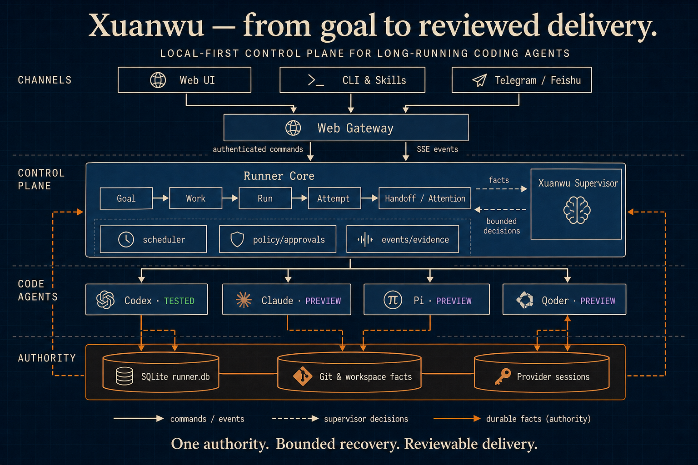

<div align="center">
  

# Xuanwu

**Run coding agents around the clock.**

Xuanwu is an always-on AI engineering control plane for running coding agents across projects,
providers, and sessions.

Give it an engineering goal and a permission boundary. Xuanwu turns the goal into tracked work,
keeps agents moving while you are away, recovers interrupted runs, inspects the actual results,
and brings you back only when human judgment is needed.

[简体中文](README.zh-CN.md) · [Roadmap](#roadmap) · [First delivery](docs/first-delivery.md) · [Architecture](docs/architecture/README.md) · [Latest release](https://github.com/williamnie/xuanwu/releases/latest)

[](https://github.com/williamnie/xuanwu/releases/latest)
[](https://github.com/williamnie/xuanwu/actions/workflows/release.yml)
[](LICENSE)
[](#install-a-release)
</div>

> [!IMPORTANT]
> Xuanwu is open-source software distributed under the Apache License 2.0. Commercial use,
> modification, and redistribution are permitted subject to the license terms.
> See [License](#license).

## What happens while you are away

Coding agents can produce code. Xuanwu keeps the engineering work moving after you leave the
terminal:

- **Keeps work moving** — runs queued and dependency-aware work across multiple repositories.
- **Supervises long-running agents** — tracks every Run and Attempt instead of depending on a
  terminal window staying open.
- **Recovers interruptions** — resumes or retries failed sessions within bounded recovery budgets.
- **Knows when to ask** — continues safe work autonomously and raises Attention when requirements,
  credentials, approvals, or business decisions are missing.
- **Returns reviewable results** — preserves changed files, revisions, checks, Evidence, and
  Handoffs instead of accepting an agent's “done” message.

The control loop stays explicit:

<p align="center">
  
</p>

## Trust without babysitting

An agent saying “done” is not the completion authority. The Supervisor inspects the actual Session
and workspace facts, keeps recoverable work moving, and records whether the Work is complete,
failed, or needs a person. Evidence and Handoffs make the result reviewable without forcing you to
watch every turn.

## What it does

- **Work and Run control** — turn goals into project-bound Work, track every Run and Attempt,
  and keep project, working directory, provider, permissions, and dependencies explicit.
- **Unattended orchestration** — schedule recurring work, standing orders, heartbeats, and
  dependency-aware queues so work can continue without an open terminal.
- **Supervision and recovery** — resume or retry within bounded budgets, avoid replaying known
  side effects, and escalate to Attention when human input is required.
- **Actual-result review** — preserve test, lint, build, Git, HTTP, browser, approval, and Handoff
  facts when the workflow produces them, without treating model text as proof.
- **Provider-neutral execution** — route Work through a common Run/Attempt lifecycle instead of
  coupling project state to one coding agent.
- **Auditable delivery** — changed files, revisions, evidence, approvals, notifications, and
  release/PR actions converge into a Handoff rather than a model-generated success message.
- **Controlled deployment** — the control plane and SQLite authority run on a machine you control.
  A Web Gateway, Runner Core, and Agentic Worker are isolated OS processes in release installs.

## Provider support

Current releases register four coding-agent providers. The provider catalog only makes an enabled,
ready provider available for new Work; support labels describe real acceptance status, not merely
the presence of adapter code.

| Provider | Status | Notes |
| --- | --- | --- |
| Codex | **Tested** | Default full-featured provider; real execution, session, recovery, interrupt, and delivery paths have been exercised. |
| Claude / Claude Code | **Preview — not live-tested** | Reuses local Claude Code login, settings, and sessions, with explicit SDK authentication also available. Automated coverage exists, but the real-account end-to-end path has not completed live acceptance. |
| Pi Coding Agent | **Preview** | RPC-based execution with session read/resume, interrupt, model discovery, and in-session model switching. The release includes the Xuanwu policy extension, but the provider remains preview while broader live use is evaluated. |
| Qoder | **Preview** | SDK 1.0.32 with its paired CLI 1.1.40, session create/list/read/resume, interrupt, approvals, and model discovery. Real-account acceptance exists, but the integration and redistribution boundary remain preview. |

Codex sessions without an explicit title can be named automatically with one LLM call using the
Supervisor's configured model. Titles follow `MMDD｜Type｜Topic`, with categories and topics in
the selected application language (Chinese or English), using the creation date in the backend's
dynamically detected system time zone, without depending on an open browser.
User titles are preserved and naming failures do not block execution.
See [Codex integration](docs/codex-integration.md) for the naming rules and API option.

## Roadmap

Xuanwu is evolving toward a provider-neutral, remotely operable control plane for always-on
engineering work.

| Stage | Focus | What it unlocks |
| --- | --- | --- |
| Available | Tested Codex execution plus persistent Work/Run supervision, recovery, Attention, Evidence, and Handoff | Run long-lived engineering work across projects from one control plane |
| Available | Telegram IM | The adapter, long polling, strict source allowlists, conversations, notifications, project selection, and inline actions passed real-bot acceptance and are deployed locally |
| Preview | Claude, Pi Coding Agent, and Qoder execution providers | Evaluate multiple coding agents through the same Work/Run lifecycle while their live acceptance continues |
| Planned | More coding-agent providers, including Kimi Code, zcode, and OpenCode | Choose from a broader agent ecosystem without changing the Work/Run lifecycle |
| Later | More IM channels and richer provider routing | Operate Xuanwu from more places and route work by capability, availability, and policy |

Roadmap items describe direction, not release commitments. A capability is marked available only
after its execution, recovery, and delivery paths pass the required real integration acceptance.

## Current status

Xuanwu is in active development. `v0.2.x` is intended for trusted individual developers and
small teams running it on machines they control. “Always-on” describes the daemon, scheduler, and
recovery model; it is not an availability SLA and still depends on the host and configured provider
being online. Xuanwu is not a hardened multi-tenant boundary, and the Web UI should not be exposed
directly to the public internet.

The GitHub repository, release assets, binary, CLI, Skill, environment variables, service names,
and default state directories all use **Xuanwu**: the command is `xuanwu`, and environment
variables use the `XUANWU_*` prefix.

## Let your agent install Xuanwu (recommended)

Xuanwu ships with an issue-management Skill. Once installed, Codex or Claude Code can register
projects, create and start issues, inspect their status, and handle retries or cancellation for
you. Xuanwu then dispatches each issue to the configured coding-agent provider.

Send this prompt directly to Codex or Claude Code:

```text
Please install Xuanwu for me: https://github.com/williamnie/xuanwu

Read the repository README and installation scripts first, then install the latest Release for
this system. Detect whether you are running in Codex or Claude Code and install the repository's
xuanwu Skill into the matching personal Skills directory. After installation, run
xuanwu-daemon doctor, confirm that Xuanwu is healthy, and tell me where the Skill was installed.
On a fresh interactive install, show me the one-time Remote access token and its file path so I can
connect the browser. Do not write the token anywhere else or change unrelated configuration.
```

If you have already cloned the repository, you can also install the Skill manually:

```bash
./scripts/install-agent-skill.sh codex   # Install for Codex
./scripts/install-agent-skill.sh claude  # Install for Claude Code
```

Installing the Xuanwu Skill in Claude Code is separate from selecting Claude as Xuanwu's execution
provider. The Skill integration does not change the Claude provider's **not live-tested** status above.

You can then tell the agent: `Use Xuanwu to create a triage issue for this repository: fix the login-page error message.`

## Install a release

### Prerequisites

- macOS or Linux on ARM64 or x86_64;
- `curl`, `tar`, and a user-level `launchd` or `systemd` session;
- the [Codex CLI](https://developers.openai.com/codex/cli/) installed and authenticated.

The installer downloads the matching release artifact, verifies its SHA-256 checksum, and
registers the Web Gateway, Runner Core, and Agentic Worker as user services. Public-repository
releases also publish GitHub provenance attestations, which the installer verifies when available:

```bash
export XUANWU_ADDR=127.0.0.1:3008
curl -fsSL https://raw.githubusercontent.com/williamnie/xuanwu/main/scripts/install-release.sh | bash
```

Then open <http://127.0.0.1:3008/> and follow the in-product first-delivery guide.

```bash
xuanwu-daemon status
xuanwu-daemon doctor
```

Default installation paths:

```text
binary   ~/.local/bin/xuanwu
state    ~/.local/state/xuanwu
database ~/.local/state/xuanwu/runner.db
token    ~/.local/state/xuanwu/auth_token (mode 0600)
```

On a fresh interactive installation, the installer prints the generated Remote access token once.
It is never printed again during restart or upgrade. To read it later on the server:

```bash
cat ~/.local/state/xuanwu/auth_token
```

For a macOS source deployment installed into launchd with `./deploy.sh`, use the separate default path:

```bash
cat "$HOME/Library/Application Support/xuanwu-bun-live/state/auth_token"
```

Custom deployments should follow `XUANWU_AUTH_TOKEN_FILE` or `XUANWU_STATE_DIR`.

The first browser visit opens a connection page where you save this token locally. After signing in,
use **Settings → Advanced → Runtime → Remote access token** to rotate it. Rotation invalidates the old
token immediately and reveals the replacement once. If `XUANWU_AUTH_TOKEN` manages the credential,
rotation remains a deployment-environment operation and is disabled in the UI.

To use another address, state directory, Codex executable, or Claude provider, review
[`scripts/install-release.sh --help`](scripts/install-release.sh) and the
[provider settings guide](docs/provider-settings.md). For LAN or remote access, keep bearer
authentication enabled and put TLS or an SSH tunnel in front of the service.

See [release, upgrade, and rollback](docs/runbooks/release-upgrade-rollback.md) and
[backup and restore](docs/backup-restore.md) before operating important state.

## Run from source

Prerequisites: [Bun](https://bun.sh/), Node.js/npm, Git, and an authenticated Codex CLI.

```bash
git clone https://github.com/williamnie/xuanwu.git
cd xuanwu
./dev.sh
```

`dev.sh` installs missing backend/frontend dependencies, starts the Bun API on
`127.0.0.1:3569`, and starts Vite on <http://127.0.0.1:3568/>. It is a foreground development
command; stopping the terminal stops both processes.

For a source-built macOS background service:

```bash
./deploy.sh
```

The canonical development and operational commands live in the
[architecture index](docs/architecture/README.md) and [runbooks](docs/runbooks/).

## Verify a checkout

```bash
cd backend-ts && bun test --timeout 60000
cd ../frontend && npm run lint && npm run build
cd .. && node scripts/repository-hygiene-audit.mjs --json
```

The six deterministic, isolated Golden Journey fixtures can be replayed with:

```bash
bun scripts/run-golden-journeys.ts
```

Fixtures do not prove that a real provider account, external connector, browser session, or
production deployment is healthy. Live acceptance must be performed separately with the
required credentials and environment.

## Security

Xuanwu can execute tools and modify repositories on the host machine. Treat every provider,
connector, skill, MCP server, and project instruction as part of your trusted computing base.
Use a dedicated OS account when appropriate, review permission and approval policies, keep
tokens out of issues/logs/screenshots, and never expose the service without authentication.

Please report vulnerabilities privately as described in [SECURITY.md](SECURITY.md).

## License

Xuanwu is open-source software distributed under the [Apache License 2.0](LICENSE). You may use,
modify, and distribute it, including for commercial purposes, subject to the license terms.
Redistributions must retain the required license and attribution notices, including
[LICENSE](LICENSE) and [NOTICE](NOTICE) where applicable.
