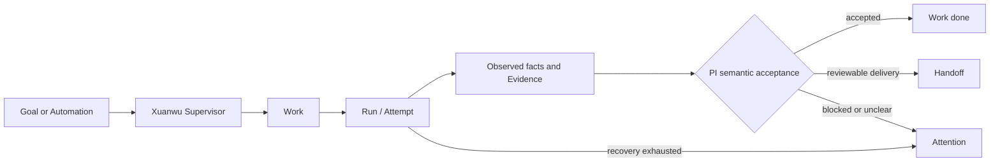

<div align="center">
  

# Xuanwu

**A local-first, verification-first AI Engineering Control Plane**

Turn engineering goals into tracked work, let coding agents execute for the long haul,
and close the loop with auditable recovery, evidence, and handoffs.

[简体中文](README.zh-CN.md) · [First delivery](docs/first-delivery.md) · [Architecture](docs/architecture/README.md) · [Latest release](https://github.com/williamnie/xuanwu/releases/latest)

[](https://github.com/williamnie/xuanwu/releases/latest)
[](https://github.com/williamnie/xuanwu/actions/workflows/release.yml)
[](LICENSE)
[](#install-a-release)
</div>

> [!IMPORTANT]
> Xuanwu is **source-available**, not OSI-approved open-source software. The public
> license permits noncommercial use; commercial use requires a separate license.
> See [License](#license).

## Why Xuanwu?

Coding agents are good at producing code. The harder problem is operating them responsibly:
keeping long-running work visible, recovering without duplicate side effects, deciding when
the result is actually done, and returning something a human can review.

Xuanwu provides that control plane:



An agent saying “done” is never the completion authority. The Supervisor keeps the Work
`in_progress` after a Provider Turn ends, inspects the actual Session and workspace facts, and
lets PI decide whether it is `done`, `failed`, or `needs_user`. Evidence and Handoffs remain
auditable delivery records, but are not manufactured as a universal completion gate.

## What it does

- **Work and Run control** — turn goals into project-bound Work, track every Run and Attempt,
  and keep project, working directory, provider, permissions, and dependencies explicit.
- **PI-owned semantic acceptance** — an ended Provider Turn stays `in_progress` until the
  Supervisor evaluates actual Session/workspace facts and records the next Issue decision.
- **Evidence and delivery records** — preserve test, lint, build, Git, HTTP, browser, approval,
  and Handoff facts when the workflow produces them, without treating model text as proof.
- **Supervision and recovery** — resume or retry within bounded budgets, avoid replaying known
  side effects, and escalate to Attention when human input is required.
- **Multi-project automation** — schedule recurring work, standing orders, heartbeats, and
  dependency-aware queues without sharing mutable project state.
- **Multiple coding-agent providers** — Codex is the default full-featured provider; Claude is
  available through the Anthropic Agent SDK or an explicit CLI fallback.
- **Auditable delivery** — changed files, revisions, evidence, approvals, notifications, and
  release/PR actions converge into a Handoff rather than a model-generated success message.
- **Local ownership** — the control plane and SQLite authority run on your machine. A Web
  Gateway, Runner Core, and Agentic Worker are isolated OS processes in release installs.

## Current status

Xuanwu is in active development. `v0.2.x` is intended for trusted individual developers and
small teams running it on machines they control. It is not a hardened multi-tenant boundary,
and the Web UI should not be exposed directly to the public internet.

The GitHub repository, release assets, binary, CLI, Skill, environment variables, service names,
and default state directories all use **Xuanwu**: the command is `xuanwu`, and environment
variables use the `XUANWU_*` prefix.

## Let your agent install Xuanwu (recommended)

Xuanwu ships with an issue-management Skill. Once installed, Codex or Claude Code can register
projects, create and start issues, inspect their status, and handle retries or cancellation for
you. Xuanwu then dispatches each issue to the configured coding-agent provider.

Send this prompt directly to Codex or Claude Code:

```text
Please install Xuanwu for me: https://github.com/williamnie/xuanwu

Read the repository README and installation scripts first, then install the latest Release for
this system. Detect whether you are running in Codex or Claude Code and install the repository's
xuanwu Skill into the matching personal Skills directory. After installation, run
xuanwu-daemon doctor, confirm that Xuanwu is healthy, and tell me where the Skill was installed. Do not
print or copy the auth token, and do not change unrelated configuration.
```

If you have already cloned the repository, you can also install the Skill manually:

```bash
./scripts/install-agent-skill.sh codex   # Install for Codex
./scripts/install-agent-skill.sh claude  # Install for Claude Code
```

You can then tell the agent: `Use Xuanwu to create a triage issue for this repository: fix the login-page error message.`

## Install a release

### Prerequisites

- macOS or Linux on ARM64 or x86_64;
- `curl`, `tar`, and a user-level `launchd` or `systemd` session;
- the [Codex CLI](https://developers.openai.com/codex/cli/) installed and authenticated.

The installer downloads the matching release artifact, verifies its SHA-256 checksum, and
registers the Web Gateway, Runner Core, and Agentic Worker as user services. Public-repository
releases also publish GitHub provenance attestations, which the installer verifies when available:

```bash
export XUANWU_ADDR=127.0.0.1:3008
curl -fsSL https://raw.githubusercontent.com/williamnie/xuanwu/main/scripts/install-release.sh | bash
```

Then open <http://127.0.0.1:3008/> and follow the in-product first-delivery guide.

```bash
xuanwu-daemon status
xuanwu-daemon doctor
```

Default installation paths:

```text
binary   ~/.local/bin/xuanwu
state    ~/.local/state/xuanwu
database ~/.local/state/xuanwu/runner.db
```

To use another address, state directory, Codex executable, or Claude provider, review
[`scripts/install-release.sh --help`](scripts/install-release.sh) and the
[provider settings guide](docs/provider-settings.md). For LAN or remote access, keep bearer
authentication enabled and put TLS or an SSH tunnel in front of the service.

See [release, upgrade, and rollback](docs/runbooks/release-upgrade-rollback.md) and
[backup and restore](docs/backup-restore.md) before operating important state.

## Run from source

Prerequisites: [Bun](https://bun.sh/), Node.js/npm, Git, and an authenticated Codex CLI.

```bash
git clone https://github.com/williamnie/xuanwu.git
cd xuanwu
./dev.sh
```

`dev.sh` installs missing backend/frontend dependencies, starts the Bun API on
`127.0.0.1:3569`, and starts Vite on <http://127.0.0.1:3568/>. It is a foreground development
command; stopping the terminal stops both processes.

For a source-built macOS background service:

```bash
./deploy.sh
```

The canonical development and operational commands live in the
[architecture index](docs/architecture/README.md) and [runbooks](docs/runbooks/).

## Verify a checkout

```bash
cd backend-ts && bun test --timeout 60000
cd ../frontend && npm run lint && npm run build
cd .. && node scripts/repository-hygiene-audit.mjs --json
```

The six deterministic, isolated Golden Journey fixtures can be replayed with:

```bash
bun scripts/run-golden-journeys.ts
```

Fixtures do not prove that a real provider account, external connector, browser session, or
production deployment is healthy. Live acceptance must be performed separately with the
required credentials and environment.

## Security

Xuanwu can execute tools and modify repositories on the host machine. Treat every provider,
connector, skill, MCP server, and project instruction as part of your trusted computing base.
Use a dedicated OS account when appropriate, review permission and approval policies, keep
tokens out of issues/logs/screenshots, and never expose the service without authentication.

Please report vulnerabilities privately as described in [SECURITY.md](SECURITY.md).

## License

Xuanwu is distributed under the [PolyForm Noncommercial License 1.0.0](LICENSE) for personal,
research, educational, and other noncommercial use. Commercial use, deployment, embedding,
resale, hosted access, or paid support requires separate written terms; see
[Commercial licensing](COMMERCIAL-LICENSE.md).

Because the public license restricts commercial use, please describe this project as
**source-available**, not open source. Redistributions must retain both [LICENSE](LICENSE) and
[NOTICE](NOTICE).
