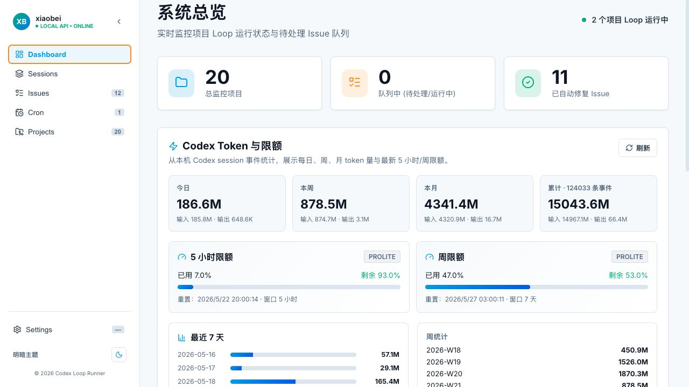

# Codex Issue Runner

本地 Codex App Server 驱动的 Issue Loop Runner，用于管理多个本地项目的 issue 队列，并自动调用 Codex 执行任务。

第一版目标见 [`docs/design.md`](docs/design.md)；Go 后端与 Codex app-server 的运行时对接见 [`docs/codex-integration.md`](docs/codex-integration.md)。当前已具备：

- Go API Server（默认 `127.0.0.1:3008`）
- SQLite 持久化（默认 `data/app.db`）
- Projects / Issues REST API
- 全局 SSE：`GET /api/events`
- 项目 auto-run / loop start-stop
- issue enqueue / retry / cancel
- Triage cron：到点批量将 Triage issue 切到 Todo 并启动运行
- 通过 `codex app-server --listen stdio://` 执行 todo issue
- 前端 Vite proxy 已指向后端 `/api -> http://127.0.0.1:3008`
- Dashboard Codex token 用量统计：今日/周/月 token、最近 7 天趋势、5 小时/周限额剩余量

## Dashboard 用量统计

Dashboard 会从本机 Codex session JSONL 里的 `token_count` 事件聚合用量，展示每日、周、月 token 统计，以及最新 5 小时限额和周限额的已用/剩余百分比。



## 本地启动

一键启动前后端：

```bash
./dev.sh
```

后端默认启动在 `http://127.0.0.1:3008`，前端默认启动在 `http://127.0.0.1:3568`。
`./dev.sh` 是前台开发模式：终端退出后服务会停止，不适合作为长期后台服务。

也可以分别启动。后端：

```bash
go run ./backend/cmd/codex-issue-runner
```

前端：

```bash
cd frontend
npm run dev
```

可选后端配置：

```bash
CODEX_RUNNER_ADDR=127.0.0.1:3008 \
CODEX_RUNNER_DB=data/app.db \
CODEX_RUNNER_CODEX_CMD=codex \
go run ./backend/cmd/codex-issue-runner
```

生产/部署模式下后端也可以直接托管前端构建产物：

```bash
cd frontend && npm run build
cd ..
go run ./backend/cmd/codex-issue-runner serve \
  --addr 127.0.0.1:3008 \
  --db data/app.db \
  --web-dir frontend/dist
```

## 后台部署模式（macOS launchd）

本仓库提供 macOS LaunchAgent 部署脚本，会构建前端与 Go 二进制，并把服务注册为后台长期运行：

```bash
./deploy.sh
```

部署后访问：

```txt
http://127.0.0.1:3008/
```

常用运维命令：

```bash
# 查看 launchd / 端口 / API 状态
./scripts/status-launchd.sh

# 停止并移除后台服务
./scripts/uninstall-launchd.sh
```

默认配置：

```txt
服务名: com.xiaobei.codex-issue-runner
监听:   127.0.0.1:3008
DB:     data/app.db
Web:    frontend/dist
二进制: dist/codex-issue-runner
日志:   data/logs/launchd.out.log / data/logs/launchd.err.log
```

可通过环境变量覆盖：

```bash
CODEX_RUNNER_ADDR=127.0.0.1:3018 \
CODEX_RUNNER_DEPLOY_DB=/absolute/path/app.db \
CODEX_RUNNER_CODEX_CMD=/absolute/path/to/codex \
./deploy.sh
```

## CLI 调用

同一个二进制同时支持后端服务和短命令 CLI：

```bash
# 后台服务；不写子命令时也保持兼容，默认等价于 serve
go run ./backend/cmd/codex-issue-runner serve --addr 127.0.0.1:3008 --db data/app.db

# 创建项目并开启 auto-run
codex-issue-runner project create \
  --id movo-web \
  --cwd /Users/xiaobei/Documents/rcrai/movo-web \
  --auto-run \
  --json

# 创建 issue，并立即 enqueue 进入自动化执行
codex-issue-runner issue create \
  --project movo-web \
  --title "修复 ChatInput Stop 按钮" \
  --body-file /tmp/issue.md \
  --run \
  --json

# 查询状态 / 日志 / 重试 / 取消
codex-issue-runner issue status --id 42
codex-issue-runner issue logs --id 42
codex-issue-runner issue update --id 42 --status done --json
codex-issue-runner issue retry --id 42 --json
codex-issue-runner issue cancel --id 42 --json
```

CLI 默认连接 `CODEX_RUNNER_ADDR`，未设置时使用 `127.0.0.1:3008`；也可以对任意命令传 `--addr http://127.0.0.1:3008`。

## Codex Skill（可选）

仓库内置了一个 Codex skill，方便 Codex 在会话里创建、查询、重试、取消和显式完成 runner issue：

```bash
./scripts/install-codex-skill.sh
```

安装后 skill 会写入 `${CODEX_HOME:-$HOME/.codex}/skills/codex-issue-runner/SKILL.md`。源码位于 `skills/codex-issue-runner/SKILL.md`，可随仓库一起开源和审查。

## Triage Cron

可以在 Issues 看板右上角点「定时运行 Triage」，或在 Settings 里统一管理 cron 任务。

- `once`：到指定时间运行一次，完成后状态变为 `done`
- `daily`：每天在指定 `HH:MM` 运行一次
- `project_id` 为空时处理所有项目；填写项目 id 时只处理该项目
- 触发后会把匹配范围内所有 `triage` issue 更新为 `todo`，记录状态事件，并启动受影响项目的 runner loop

API 示例：

```bash
curl -X POST http://127.0.0.1:3008/api/cron-tasks \
  -H 'Content-Type: application/json' \
  -d '{
    "name": "12点运行所有 Triage",
    "mode": "once",
    "next_run_at": "2026-05-21T04:00:00Z"
  }'
```

## 验证

```bash
go test ./backend/...
cd frontend && npm run build
```
