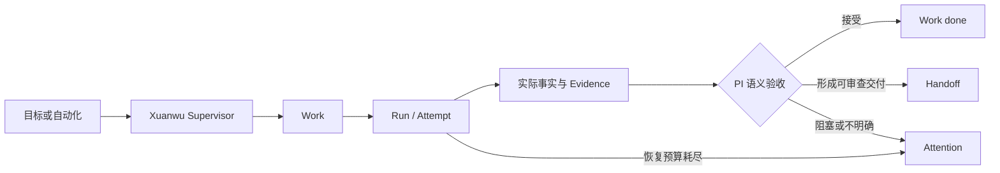

<div align="center">
  

# 玄武 Xuanwu

**本地优先、验证优先的 AI Engineering Control Plane**

把工程目标变成可追踪的工作，交给 Coding Agents 长时间执行，
并以可审计的监督、恢复、证据和交付闭环收口。

[English](README.md) · [首次交付](docs/first-delivery.md) · [架构文档](docs/architecture/README.md) · [最新版本](https://github.com/williamnie/xuanwu/releases/latest)

[](https://github.com/williamnie/xuanwu/releases/latest)
[](https://github.com/williamnie/xuanwu/actions/workflows/release.yml)
[](LICENSE)
[](#安装-release)
</div>

> [!IMPORTANT]
> 玄武是**源码可用（source-available）**软件，不是 OSI 认可的开源软件。公开许可证
> 允许非商业使用；商业使用需要单独授权，详见[许可证](#许可证)。

## 为什么需要玄武？

Coding Agents 已经很会写代码，真正困难的是可靠地“运营”它们：让长时间工作始终可见，
在不重复副作用的前提下恢复失败，判断结果是否真的完成，并把可复核的交付物交还给人。

玄武提供这一层控制面：



Agent 说“完成”不等于完成。Provider Turn 结束后，Supervisor 仍让 Work 保持 `in_progress`，
检查真实 Session 与 workspace 事实，再由 PI 判断进入 `done`、`failed` 或 `needs_user`。
Evidence 与 Handoff 继续作为可审计交付记录，但不会被伪造成所有任务通用的完成门禁。

## 核心能力

- **Work 与 Run 控制**：把目标变成绑定项目的 Work，跟踪每个 Run/Attempt，明确项目、
  工作目录、Provider、权限和依赖，不让模型猜测作用域。
- **PI 掌握语义验收权**：Provider Turn 结束后仍保持 `in_progress`，由 Supervisor 基于真实
  Session/workspace 事实记录下一步 Issue 决策。
- **Evidence 与交付记录**：保留测试、lint、build、Git、HTTP、浏览器、Approval 与 Handoff
  事实，但不把模型文案当成证明。
- **监督与恢复**：在有界预算内 resume/retry，避免重放已知副作用；需要人时进入 Attention。
- **多项目自动化**：支持周期任务、Standing Order、Heartbeat 和依赖感知队列，同时隔离各项目状态。
- **多 Coding Agent Provider**：Codex 是默认的完整 Provider；Claude 可通过 Anthropic Agent SDK
  或显式 CLI fallback 接入。
- **可审计交付**：changed files、revision、Evidence、Approval、通知和 release/PR 动作最终汇入
  Handoff，而不是停留在模型生成的成功文案。
- **本地掌控**：控制面和 SQLite authority 运行在本机；Release 安装将 Web Gateway、Runner Core
  与 Agentic Worker 隔离为三个系统进程。

## 当前状态

玄武仍在快速演进。`v0.2.x` 面向在自有可信机器上运行的个人开发者和小型团队；它不是经过
加固的多租户隔离边界，Web UI 不应直接暴露到公网。

GitHub 仓库、Release 资产、二进制、CLI、Skill、环境变量、服务标识和默认数据目录统一使用
**Xuanwu**：命令为 `xuanwu`，环境变量前缀为 `XUANWU_*`。

## 让你的 Agent 安装玄武（推荐）

玄武自带 Issue 管理 Skill。安装后，Codex 或 Claude Code 可以替你注册项目、创建与启动 Issue、
查看执行状态，以及处理重试和取消；真正执行 Issue 的 Coding Agent 由玄武统一调度。

把下面这段话直接发送给你的 Codex 或 Claude Code：

```text
请帮我安装 Xuanwu：https://github.com/williamnie/xuanwu

请先阅读仓库 README 和安装脚本，再安装适合当前系统的最新 Release；然后识别你当前是
Codex 还是 Claude Code，把仓库中的 xuanwu Skill 安装到对应的个人 Skills 目录。
安装后运行 xuanwu-daemon doctor，确认玄武服务健康，并告诉我 Skill 的安装路径。不要打印或复制
auth token，也不要修改与本次安装无关的配置。
```

如果已经克隆仓库，也可以手动安装 Skill：

```bash
./scripts/install-agent-skill.sh codex   # 安装到 Codex
./scripts/install-agent-skill.sh claude  # 安装到 Claude Code
```

安装后可以直接告诉 Agent：`请用 Xuanwu 为当前仓库创建一个 triage Issue：修复登录页错误提示。`

## 安装 Release

### 前置条件

- ARM64 或 x86_64 的 macOS / Linux；
- `curl`、`tar`，以及用户级 `launchd` 或 `systemd` 会话；
- 已安装并登录 [Codex CLI](https://developers.openai.com/codex/cli/)。

安装器会下载匹配平台的产物、校验 SHA-256 checksum，并注册 Web Gateway、Runner Core 和
Agentic Worker 用户服务。仓库公开后的 Release 还会发布 GitHub provenance attestations，
安装器在可用时会一并验证：

```bash
export XUANWU_ADDR=127.0.0.1:3008
curl -fsSL https://raw.githubusercontent.com/williamnie/xuanwu/main/scripts/install-release.sh | bash
```

然后打开 <http://127.0.0.1:3008/>，按产品内“首次交付”向导完成配置。

```bash
xuanwu-daemon status
xuanwu-daemon doctor
```

默认安装路径：

```text
二进制  ~/.local/bin/xuanwu
状态    ~/.local/state/xuanwu
数据库  ~/.local/state/xuanwu/runner.db
```

如需修改监听地址、状态目录、Codex 可执行文件或 Claude Provider，请查看
[`scripts/install-release.sh --help`](scripts/install-release.sh) 和
[Provider 设置说明](docs/provider-settings.md)。局域网或远程访问必须保留 bearer token，
并在服务前使用 TLS 反向代理或 SSH tunnel。

重要状态投入使用前，请先阅读[发布、升级与回滚](docs/runbooks/release-upgrade-rollback.md)和
[备份与恢复](docs/backup-restore.md)。

## 从源码运行

前置条件：[Bun](https://bun.sh/)、Node.js/npm、Git，以及已登录的 Codex CLI。

```bash
git clone https://github.com/williamnie/xuanwu.git
cd xuanwu
./dev.sh
```

`dev.sh` 会安装缺失的前后端依赖，在 `127.0.0.1:3569` 启动 Bun API，并在
<http://127.0.0.1:3568/> 启动 Vite。它是前台开发命令，终端退出后两个进程都会停止。

macOS 从源码安装后台服务：

```bash
./deploy.sh
```

完整开发和运维命令以[架构索引](docs/architecture/README.md)与
[runbooks](docs/runbooks/)为准。

## 验证代码

```bash
cd backend-ts && bun test --timeout 60000
cd ../frontend && npm run lint && npm run build
cd .. && node scripts/repository-hygiene-audit.mjs --json
```

六条确定性、隔离的 Golden Journey fixture 可统一重放：

```bash
bun scripts/run-golden-journeys.ts
```

Fixture 通过不代表真实 Provider 账号、外部 Connector、浏览器会话或生产部署健康；需要凭据
和外部环境的 live acceptance 必须单独执行并保留证据。

## 安全

玄武可以在宿主机执行工具并修改代码仓库。Provider、Connector、Skill、MCP Server 与项目指令
都应被视为可信计算边界的一部分。必要时使用独立系统账号，审查 Permission/Approval 策略，
不要把 token 写入 Issue、日志或截图，也不要在无鉴权条件下暴露服务。

安全漏洞请按 [SECURITY.md](SECURITY.md) 私下报告。

## 许可证

玄武采用 [PolyForm Noncommercial License 1.0.0](LICENSE)，允许个人、研究、教育及其他
非商业用途。商业使用、商业部署、嵌入、转售、托管访问或付费支持需要单独书面授权，详见
[商业许可说明](COMMERCIAL-LICENSE.md)。

由于公开许可证限制商业使用，请将本项目称为**源码可用（source-available）**，而不是开源软件。
分发本项目或衍生版本时必须保留 [LICENSE](LICENSE) 与 [NOTICE](NOTICE)。
