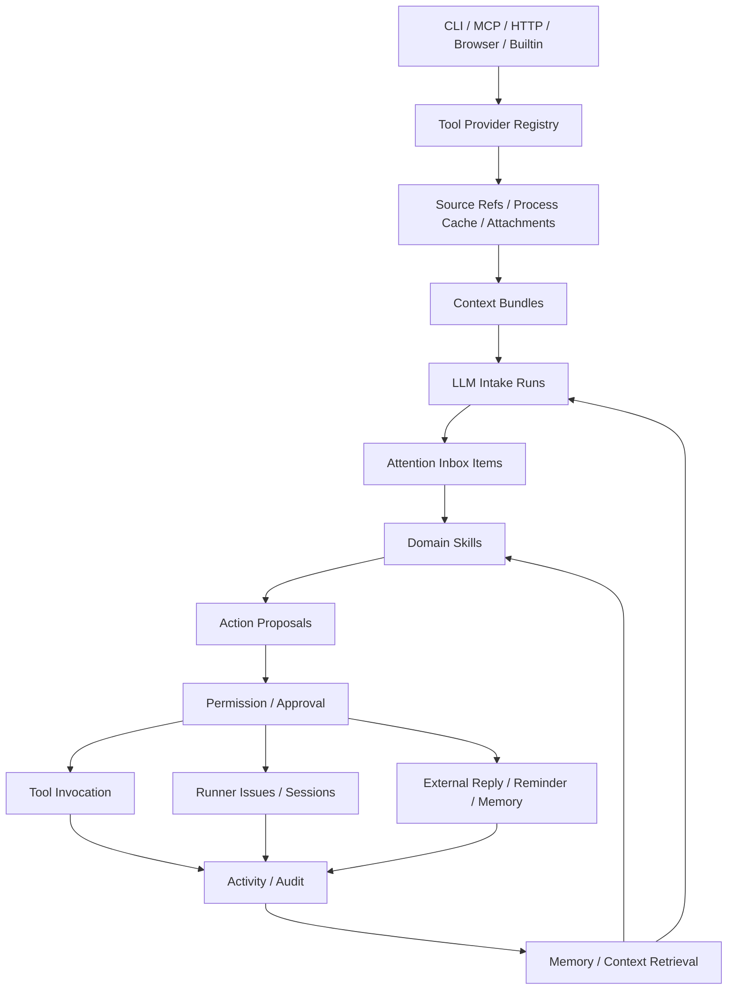

# PI Assistant Runtime Roadmap：多来源 Inbox / Skills / Tool Provider

> [!WARNING]
> **历史路线（2026-07-19 归档）**：本文的通用私人助理/OpenClaw 方向已被玄武产品合同 supersede。当前 source of truth 见 [canonical 架构文档索引](README.md)、[玄武产品定位](xuanwu/0001-product-positioning.md)、[Supervisor 角色合同](xuanwu/0044-supervisor-role-prompt-contract.md) 与 [产品导航合同](xuanwu/0050-product-navigation-compatibility.md)；不得恢复平行的 PI Assistant 产品心智。

> 状态：产品与工程路线规划。
> 日期：2026-07-06。
> 范围：`xuanwu` 内的 PI 从“项目 issue 总控 agent”升级为“个人助理 runtime”。
> 约束：保留单个 PI Assistant，不恢复多 PI agent 产品心智；CLI、MCP、HTTP、browser、builtin 都作为 Tool Provider 接入。

## 1. 目标

PI Assistant 的长期目标是向 OpenClaw / Helm 这类个人助理 runtime 靠近，但采用渐进路线：先构建 **多来源输入、LLM-first intake、attention inbox、skills、automation、approval、memory** 的通用底座。

钉钉、飞书、GitHub、邮件、浏览器、任意本地 CLI 都不应成为核心硬编码特例，而是统一进入：

```text
外部来源/CLI/MCP/API
  → Tool Provider / Connector
  → Source Refs / Process Cache / Attachments
  → Context Bundle Builder
  → LLM Intake Run
  → Attention Inbox Item
  → Domain Skill
  → Action Proposal
  → Permission / Approval
  → Runner Issue / Executor / 外部回复 / Reminder / Memory
  → Activity / Audit
```

工程助理、bug intake、群消息总结、PR 跟进、值班自动回复、每日工作摘要都应是这个底座上的 skill、automation 或 policy，而不是分别硬编码到 PI prompt 里。

## 2. 产品原则

- **单 Assistant，多能力**：只保留一个 PI Assistant；不要让用户创建/选择多个 PI agent。
- **Connector-neutral**：钉钉 CLI、飞书、GitHub CLI、MCP server 都只是 tool provider。
- **不做外部源全量镜像**：源头系统仍保存原文；PI 长期保存 source refs、metadata、摘要、处理状态、证据链和必要 issue evidence。
- **Raw-first，Inbox-after-intake**：外部事实先进入 source refs / process cache；经过 context bundle 与 LLM intake 后，才生成 Attention Inbox Items。
- **LLM-first intake**：不要依赖“打不开/500/报错”等关键词清单识别事项；规则主要用于取上下文、增量、限流、分组和保护预算，语义判断交给 LLM intake。
- **Continuous 必须增量**：`continuous_llm_triage` 是 cursor/watermark 驱动的 micro-batch，只处理新增消息 + 小窗口上下文，禁止重复全量扫历史。
- **Manual 与自动同一套链路**：用户主动说“看看刚刚群里的截图和消息”时，也走 context bundle → intake → inbox → proposal，而不是另写一条特例路径。
- **Inbox 不限 issue**：Inbox Item 是“需要注意的事项”，可能是 bug、状态追问、需要回复、需要提醒、需要继续观察或无需处理。
- **Intent 固定主类型 + other**：已知 `primary_intent` 走最短路径；`other` 和扩展 tags 交给 LLM 或 ask_user 判断。
- **Skill-driven**：Intake Skill 负责识别事项入箱；Domain Skill 负责决定如何处理事项并生成 proposal。
- **Proposal before write**：skill 默认生成 action proposal；是否执行由权限策略和用户确认决定。
- **创建 issue 默认确认**：`issue.create` 默认需要用户确认；后续可按 source/project 策略开放自动创建 triage issue；`issue.enqueue` 默认更严格。
- **External reply opt-in**：外部自动回复必须按 source/chat/person/action risk 显式开启，默认只生成草稿或 proposal。
- **Project 归属由 memory + LLM + ask_user 决定**：source 只提供默认候选；低置信或多项目模糊时必须询问用户。
- **附件是过程证据**：允许下载、OCR、vision summary 和多模态 issue attachment，但不默认长期 raw archive。
- **Memory 尽量自动化**：记忆分 ephemeral / working / long-term；高置信低敏感事实可自动进入 working memory，long-term 通过周期 digest 审核。
- **成本后置但预留模型路由**：先不为了 token 成本削弱能力；预留 intake/domain/vision/memory/fallback model policy。
- **Audit by default**：connector sync、context bundle、intake run、skill run、proposal、tool call、issue/session/reply 都可追踪。
- **Incremental compatibility**：优先复用当前 PI action gate、cron、skills registry、MCP registry、external events、Feishu inbox 等已有能力；不要平行造第二套。

## 3. 目标架构



## 4. 核心数据对象草案

### Tool Provider / Tool

```ts
type ToolProviderKind = 'builtin' | 'cli' | 'mcp' | 'http' | 'browser'

type AssistantTool = {
  name: string
  provider_id: string
  description: string
  input_schema: object
  output_schema?: object
  permission: 'read' | 'write' | 'dangerous'
  timeout_ms?: number
  audit: { redact: string[] }
}
```

### Source Ref / Process Cache / Attachment

```ts
type SourceRef = {
  id: string
  source_id: string
  external_id: string
  external_url?: string
  event_type: 'message' | 'notification' | 'email' | 'alert' | 'calendar' | 'custom'
  actor_ref?: string
  body_snippet?: string
  occurred_at: string
  received_at: string
  thread_key?: string
  reply_to_external_id?: string
  attachment_refs: string[]
  dedupe_key: string
  trust_level: 'untrusted'
}

type ProcessCache = {
  source_ref_id: string
  body_text?: string
  raw_json_ref?: string
  expires_at: string
}

type AttachmentRef = {
  id: string
  source_id: string
  external_id: string
  kind: 'image' | 'file' | 'video' | 'audio'
  mime_type?: string
  name?: string
  remote_ref?: string
  local_ref?: string
  ocr_text?: string
  vision_summary?: string
  evidence_ttl?: string
}
```

### Context Bundle / Intake Run

```ts
type ContextBundle = {
  id: string
  source_id: string
  trigger: 'manual' | 'mention' | 'schedule' | 'continuous' | 'webhook' | 'retry'
  reason: string
  source_refs: string[]
  attachment_refs: string[]
  source_query?: { since?: string; cursor?: string; thread_key?: string }
  processed_watermark?: string
  time_window?: { from: string; to: string }
  token_budget?: number
  created_by: 'user' | 'automation' | 'system'
}

type IntakeRun = {
  id: string
  bundle_id: string
  skill_id: string
  model_policy_id?: string
  status: 'running' | 'succeeded' | 'failed'
  output_json?: object
  ignored_groups?: object[]
  error?: string
}
```

### Attention Inbox

```ts
type InboxItem = {
  id: string
  source_id: string
  intake_run_id: string
  title: string
  summary: string
  kind: 'attention'
  primary_intent:
    | 'bug_report'
    | 'status_question'
    | 'reply_needed'
    | 'decision_needed'
    | 'summarize_request'
    | 'create_task'
    | 'monitor_thread'
    | 'customer_feedback'
    | 'support_request'
    | 'other'
  secondary_intents: string[]
  evidence_refs: string[]
  actor_refs: string[]
  project_hints?: Array<{ project_id: string; confidence: number; reason: string }>
  suggested_actions: string[]
  confidence: number
  urgency?: 'low' | 'medium' | 'high'
  status: 'new' | 'triaged' | 'proposal_created' | 'actioned' | 'ignored' | 'failed'
}
```

### Skill / Automation / Proposal

```ts
type SkillManifest = {
  id: string
  kind: 'intake' | 'domain'
  triggers: object
  required_tools: string[]
  input_schema: object
  output_schema: object
  permissions: object
}

type Automation = {
  trigger: { type: 'manual' | 'schedule' | 'continuous' | 'webhook' }
  stage: 'source_sync' | 'context_bundle' | 'intake' | 'domain_skill'
  filters: object[]
  skill_id?: string
  mode: 'dry_run' | 'draft' | 'propose' | 'auto'
  max_actions_per_run: number
}

type ActionProposal = {
  skill_run_id: string
  source_item_ids: string[]
  summary: string
  actions: Array<{
    type:
      | 'issue.create'
      | 'issue.enqueue'
      | 'issue.status_lookup'
      | 'message.reply_draft'
      | 'message.reply_send'
      | 'ask_user'
      | 'watch_thread'
      | 'memory.create'
      | 'reminder.create'
      | 'no_action'
    payload: object
    risk: 'low' | 'medium' | 'high'
    requires_approval: boolean
  }>
  confidence: number
}
```

## 5. Inbox / Intake 工作流

### 自动轮询或持续增量

```text
source sync by cursor/watermark
  → source refs / process cache / attachments
  → context bundle builder
  → LLM intake skill
  → attention inbox items
  → domain skill
  → action proposal
  → approval / execution
```

### 用户主动发起

```text
用户：看看刚刚群里的截图和消息，是个 bug，创建个 issue
  → 解析 source/time/attachment hints
  → connector 从源头拉取最近上下文
  → context bundle
  → LLM intake
  → inbox item: bug_report
  → domain skill
  → proposal: issue.create
  → policy 决定确认/自动创建 triage issue
```

### 值班自动回复

```text
老板在群里 @ 我问某 bug 什么时候修好
  → source ref + 前后文 context bundle
  → LLM intake: status_question + reply_needed
  → domain skill: issue.status_lookup + message.reply_draft
  → policy: 公司群默认草稿/确认；只有 opt-in 且低风险才允许 message.reply_send
```

### 图片/截图处理

```text
connector 读取附件 metadata
  → 按需下载短期缓存
  → OCR / vision summary / 直接多模态输入
  → issue evidence attachment 或 reply evidence
  → process cache 过期清理
```

## 6. Source Policy 草案

```ts
type SourceProfile = 'company_chat' | 'personal_chat' | 'ops_chat' | 'private_dm' | 'email' | 'github' | 'custom'

type InboxSourcePolicy = {
  profile: SourceProfile
  collect_source_refs: boolean
  cache_raw_ttl_days?: number
  evidence_ttl_days?: number
  intake_mode:
    | 'manual_only'
    | 'mention_only'
    | 'scheduled_llm_triage'
    | 'continuous_llm_triage'
  action_mode:
    | 'observe_only'
    | 'draft_only'
    | 'propose_actions'
    | 'auto_low_risk'
  issue_policy: {
    auto_create_triage_issue: boolean
    auto_enqueue: boolean
    require_project_confirmation: boolean
  }
  reply_policy: {
    auto_reply_enabled: boolean
    allowed_chats?: string[]
    allowed_people?: string[]
    require_approval_for_external_reply: boolean
  }
}
```

默认建议：

- 普通公司群：`mention_only` + `draft_only`；`auto_reply_enabled=false`；`issue.create` 需要确认。
- 值班公司群：`scheduled_llm_triage` + `propose_actions`；自动回复需单独开启。
- 个人聊天/私聊：可按联系人开启 `auto_low_risk`，但高风险承诺仍确认。
- GitHub/Issue 源：可更积极自动 triage，但自动 enqueue 仍受项目状态保护。

## 7. Memory 策略

```ts
type MemoryLayer = 'ephemeral' | 'working' | 'long_term'

type MemoryPolicy = {
  auto_capture_working_memory: boolean
  auto_promote_threshold: number
  sensitive_requires_review: boolean
  digest_interval: 'daily' | 'weekly'
}
```

默认建议：

- Ephemeral：短期上下文，自动过期。
- Working：高置信、重复出现、低敏感的工作事实可自动写入。
- Long-term：通过周期 digest 批量审核/固定/删除。
- 权限、自动回复、外部账号相关策略不能由 LLM 自动长期记忆生效，必须用户确认。

## 8. Model Policy 预留

```ts
type AssistantModelPolicy = {
  intake_model?: string
  domain_model?: string
  vision_model?: string
  memory_model?: string
  fallback_model?: string
}
```

当前默认可以都走主模型；后续如果 token 或成本增长，再把 intake、memory、vision summary 等切到便宜模型或本地模型。

## 9. 建设阶段

- **P00 单 Assistant 基线**
- **P01 Tool Provider Registry**
- **P02 CLI Connector Provider**
- **P03 Attention Inbox / Intake**
- **P04 Skills Runtime**
- **P05 Automation / Event Router**
- **P06 Action Proposal / Permission**
- **P07 MCP Provider**
- **P08 Memory / Context**
- **P09 Assistant UI / E2E**

## 10. Issue 拆分

- Tracker issue：#571
- 本批 issue 默认创建为 `triage`，不自动 enqueue。
- 建议按编号顺序每天拖动少量 issue 到 `todo`。
- 若发现既有已完成能力覆盖某个 issue，优先做“验收补齐/文档对齐/关闭重复”，不要重写。

### P00 单 Assistant 基线

01. #572 `PI Assistant V2 P00.01: 单例 Assistant 基线验收与补齐` — 确认并补齐当前 PI 从多 agent 配置收敛到单 PI Assistant 的产品和运行时基线。
02. #573 `PI Assistant V2 P00.02: 设置页改为 Assistant Settings 信息架构` — 把 PI 设置页从“Runner Agent Settings”调整为单 Assistant 的设置中心，为后续 Connectors/Skills/Automations 导航留位置。

### P01 Tool Provider Registry

03. #574 `PI Assistant V2 P01.01: 定义 Tool Provider Envelope 与核心类型` — 建立统一工具抽象，让 builtin、CLI、MCP、HTTP、browser 等 provider 后续都能挂到同一套 PI runtime。
04. #575 `PI Assistant V2 P01.02: Tool Registry 数据模型与只读 API` — 让系统能列出 PI Assistant 当前可用工具及来源，为 UI、skills、permissions 做基础。
05. #576 `PI Assistant V2 P01.03: PI Runtime 从 Registry 装配 Builtin Tools` — 把 PI runtime 当前硬编码工具逐步迁到 registry 装配路径，但保持行为兼容。
06. #577 `PI Assistant V2 P01.04: 标准化 Tool Call Audit Envelope` — 把所有 assistant tool 调用记录成统一审计事件，后续支持回放、debug、permission 与 activity timeline。

### P02 CLI Connector Provider

07. #578 `PI Assistant V2 P02.01: CLI Connector Manifest v0` — 定义任何合规 CLI 接入 PI Assistant 的 manifest 规范，不绑定钉钉或特定供应商。
08. #579 `PI Assistant V2 P02.02: 安全 CLI Runner 与 JSON stdout 解析` — 实现可审计、可超时、参数安全的 CLI tool 调用执行器。
09. #580 `PI Assistant V2 P02.03: CLI Tools 注册到 Tool Registry` — 把 manifest 中声明的 CLI commands 映射为 AssistantTool，并让 PI/skills 可按权限调用。
10. #581 `PI Assistant V2 P02.04: CLI Connector Health 与诊断 UI/API` — 让用户知道每个 CLI connector 是否可用、缺什么配置、最近一次调用是否失败。

### P03 Attention Inbox / Intake

11. #582 `PI Assistant V2 P03.01: Raw Events 与 Attachments 持久化模型` — 先保真保存外部事实：消息、通知、CLI 输出、附件 metadata/下载引用/OCR/vision 摘要，为后续 LLM intake 提供证据层。
12. #583 `PI Assistant V2 P03.02: Context Bundle Builder 与主动取上下文` — 把 raw events 按 thread、时间窗口、@、reply、附件、用户主动指令聚合成给 LLM 理解的一组上下文。
13. #584 `PI Assistant V2 P03.03: LLM Intake Runs 生成 Attention Inbox Items` — 通过 LLM-first intake 从 context bundle 中识别需要关注、回复、追踪或处理的事项，输出强 schema 的 inbox items 或 ignored reasons。
14. #585 `PI Assistant V2 P03.04: Attention Inbox API/UI 与生命周期` — 提供 raw events、context bundles、intake runs、attention inbox items 的最小可见性和生命周期操作。

### P04 Skills Runtime

15. #586 `PI Assistant V2 P04.01: Skill Manifest 区分 Intake 与 Domain Skill` — 把 skill 分为 intake skill 与 domain skill：前者识别事项入箱，后者决定如何处理事项。
16. #587 `PI Assistant V2 P04.02: Intake Skill Runtime：Context Bundle → Inbox Items` — 实现受控 LLM intake 执行路径，将 context bundle 转成 attention inbox items / ignored groups，并保留证据引用。
17. #588 `PI Assistant V2 P04.03: Domain Skill Fixture：Inbox Item → 多动作 Proposal` — 提供不绑定来源的 domain skill 样例，把 inbox item 转为 issue、回复草稿、状态查询、询问用户、继续观察等 proposal。
18. #589 `PI Assistant V2 P04.04: Skills API/UI 展示 Intake/Domain Run History` — 给用户查看 intake/domain skills 的启用状态、所需工具、运行历史、schema 输出和诊断。

### P05 Automation / Event Router

19. #590 `PI Assistant V2 P05.01: Automation 数据模型覆盖 Sync/Intake/Domain 阶段` — 定义 PI Assistant 主动工作的规则载体，支持 source sync、context bundle、intake run、domain skill run 的分阶段自动化。
20. #591 `PI Assistant V2 P05.02: Manual Trigger 支持用户主动会话取上下文` — 用户主动说“看刚刚群里的截图和消息”等场景时，手动触发 connector 取上下文、构建 bundle、运行 intake。
21. #592 `PI Assistant V2 P05.03: Cron Scheduler Lock/Retry/Backoff` — 让 automation 可以定时运行，并具备防重入与失败重试能力。
22. #593 `PI Assistant V2 P05.04: Event Router 路由 Raw/Context/Inbox 到对应 Skill` — 实现从 raw events/context bundles/inbox items 按策略路由到 intake skill 或 domain skill 的事件路由层。

### P06 Action Proposal / Permission

23. #594 `PI Assistant V2 P06.01: Action Proposal 支持开放动作类型` — 把 skill 输出的建议动作持久化，支持 issue、message reply draft/send、status lookup、ask user、watch thread、memory、reminder、no_action。
24. #595 `PI Assistant V2 P06.02: Approval UI 与 Reply/Issue 执行队列` — 让用户确认/拒绝 proposal，并让批准后的创建 issue、查询状态、回复草稿/发送等动作进入受控执行。
25. #596 `PI Assistant V2 P06.03: Source Policy 与自动回复权限引擎` — 建立 source/skill/tool/automation 级权限，特别是外部自动回复必须按群、联系人、风险和用户开关控制。

### P07 MCP Provider

26. #597 `PI Assistant V2 P07.01: MCP Provider Registry 与 Tool Discovery 对齐` — 把 MCP server 作为 Tool Provider 的一种接入形态，复用 registry/permission/audit。
27. #598 `PI Assistant V2 P07.02: MCP Tool Adapter 复用统一调用/权限/审计 Envelope` — 让 PI/skills 调 MCP tool 时使用和 CLI/builtin 一致的调用、权限、审计路径。

### P08 Memory / Context

28. #599 `PI Assistant V2 P08.01: Assistant Memory Store 与 pin/forget API/UI` — 建立 PI Assistant 的个人/项目/inbox 记忆入口，让它可以长期学习但可审计和可删除。
29. #600 `PI Assistant V2 P08.02: Context Retrieval 与带来源注入 PI/Skill Runtime` — 按任务检索相关 memory/context 注入 PI 或 skill，而不是把全部历史塞进 prompt。

### P09 Assistant UI / E2E

30. #601 `PI Assistant V2 P09.01: PI Assistant 导航壳与页面入口` — 把前端产品心智从 runner 管理器升级为 PI Assistant 工作台。
31. #602 `PI Assistant V2 P09.02: Activity Timeline 串联 Raw→Intake→Action` — 提供一条可追踪时间线，串联 raw event、context bundle、intake run、inbox item、domain skill、proposal、issue/session/reply。
32. #603 `PI Assistant V2 P09.03: Fixture CLI 到 Issue/Reply Proposal E2E` — 用 fake CLI connector 证明“任意 CLI → raw/context → LLM intake → inbox → proposal → approval → issue 或回复草稿”完整链路可跑通。

## 11. 最小可用里程碑

### M1：通用 CLI 到 Attention Inbox

完成 P00-P03 后，任意合规 CLI 可以作为 source 通过 source refs / process cache / context bundle + LLM intake 生成 attention inbox items，而不是把外部源全量镜像到本地。

### M2：Inbox 到多动作 Proposal

完成 P04-P06 后，attention inbox item 可以通过 domain skill 生成 issue、回复草稿、状态查询、ask_user、watch 等 proposal，经 permission/approval 受控执行。

### M3：主动助理

完成 P05 cron/continuous 与 P09 activity 后，PI Assistant 能按 source policy 定时、持续增量或手动检查外部上下文，主动提出建议，并让用户追踪完整链路。

### M4：生态化工具

完成 P07-P08 后，MCP 与 memory/context 接入统一 runtime，向 OpenClaw/Helm 式个人助理继续靠近。

## 12. 非目标

- 不恢复多 PI agent UI。
- 不做 agent marketplace。
- 不允许无审计的任意 shell 自动执行。
- 不默认自动发送外部 IM/邮件回复。
- 不把外部系统做成本地全量消息仓库。
- 不一次性做完整 desktop computer control。
- 不为钉钉、飞书、GitHub 等来源写进核心硬编码逻辑。
- 不把 Inbox 限定为工程 issue intake；创建 issue 只是 action proposal 的一种。
