# PI 可信自治与按需审查重构提案（Draft）

> 状态：Draft，待产品决策，不是当前实现规范
> 日期：2026-07-31
> 范围：重新审视 PI、Executor、Verifier、Reviewer、Evidence 与完成状态的产品职责
> 约束：本文不授权修改 runtime、状态机、Prompt、数据库、API 或现有 canonical ADR

## 1. 为什么重新审视

Xuanwu 最初解决的问题是：把本地工程 Issue 排队交给 Coding Agent 执行，保存过程和结果，失败可见、可恢复，用户不必持续盯守终端。

PI 随后被定位为项目主控 Agent：理解目标、拆分工作、选择执行路径、观察 Session、处理失败、向用户汇报，并在真正需要产品或风险决策时联系人类。PI 不是 Coding Agent，也不应只是状态机的自然语言外壳。

后续“验证优先”路线为了避免把 Agent 的自然语言完成声明直接当作事实，逐步引入 Evidence、Verification Policy、Completion Gate、Verifier、Reviewer、Handoff 和 `pending_verification`。其中“完成不能只靠模型声称”是正确约束，但当前设计容易进一步滑向另一个未经证明的假设：

> 每个 Issue 都需要一个独立审核阶段，甚至需要另一个 Agent 重新执行验证，才能可信完成。

这会让事实采集、语义验收、代码审查、独立测试和人工决策混成一个笼统的“verification”。结果可能是：系统增加了大量 Run、Prompt、状态和重试，却没有同比提高交付质量。

本文重新从产品目标和 PI 角色出发，不以现有 Completion Gate、Verifier Workflow 或任何单个故障为前提，判断默认审核是否仍应作为产品主链。

## 2. 产品目标重述

玄武的首要目标应是 **可信自治（trustworthy autonomy）**，而不是“每个任务都经过审核”。

可信自治意味着：

1. 用户可以把工程工作交出去，不必持续看守执行过程；
2. 系统知道 Agent 实际执行了什么，而不只保存一段完成声明；
3. PI 能结合目标、运行事实和风险判断下一步，而不是机械执行固定补偿流程；
4. 低风险且结果清晰的任务可以快速完成；
5. 真正不确定、高风险或需要主观判断时，系统会升级到独立审查或人类；
6. 相同失败不会无限重试、复制 Issue 或消耗资源；
7. 用户回来时能看到结果、风险、未完成事项和必要的后续动作。

“可信”来自事实可追溯、决策有依据和不确定性被正确升级；不等于所有任务都执行相同的审核仪式。

## 3. PI 的角色定位

PI 是工程工作的 **Engineering Chief of Staff / 项目主控 Agent**。它的主要职责是：

- 理解用户目标与上下文；
- 把目标拆成适当粒度、可执行的 Work；
- 明确范围、验收条件、依赖与风险；
- 选择 Executor、Workflow 和执行顺序；
- 观察 Run、Session、Git、命令和产物事实；
- 判断当前结果是否足以满足目标；
- 在缺失工作时继续原 Session，而不是默认创建新 Issue；
- 在需要真正独立判断时选择 Reviewer 或独立验收；
- 在产品选择、主观质量、风险接受或恢复预算耗尽时联系人类；
- 汇总交付结果和未解决风险。

PI 不应：

- 因某个通用状态出现而无条件启动 Verifier；
- 用固定 Prompt 代替对当前 Issue 的语义判断；
- 把同一条测试由另一个 Agent 重跑称为独立审查；
- 为了补内部账本或 Evidence 缺口创建新的顶层业务 Issue；
- 在相同基础设施失败上持续重试；
- 把确定性程序的字符串分类结果当作需求是否完成的最终语义。

## 4. 必须拆开的五个概念

### 4.1 运行事实采集（Observation）

系统自动记录：

- provider turn 是否开始、结束、失败或被取消；
- Agent 调用了哪些工具和命令；
- 命令真实退出码和关键输出；
- Git baseline、diff、changed files、commit/tree；
- 生成的文件、artifact、HTTP/browser/deployment 结果；
- 未解决错误、限制和明确保留项；
- 这些事实属于哪个 Work、Run、Attempt 和 Session。

这是确定性基础设施职责，不需要启动 LLM，也不等于验收。

### 4.2 完成对账（Outcome Reconciliation）

系统将 Executor 的完成声明与实际运行事实对账，例如：

- 声称修改代码但没有相关 diff；
- 声称测试通过但观察到非零退出码；
- 修改发生在错误项目或无法归属于当前 Run；
- Session 异常结束却声称完成；
- 任务允许无代码结果，且确实产生了对应调查、文档或决策产物。

完成对账回答的是“声明与事实是否一致”，不评价代码设计好坏。它应廉价、确定、自动执行，不生成独立 Verifier Run。

### 4.3 PI 语义验收（PI Acceptance）

PI 基于 Issue 目标、acceptance、Session 最终内容、diff 摘要、验证结果和未解决项，判断结果是否足够。

PI 的判断对象是“目标是否达成”，而不是“是否出现某个命令字符串”。它可以接受与任务相称的不同证据：代码与测试、文档产物、调查结论、浏览器结果、部署状态或无需修改的根因说明。

### 4.4 Code Review

Code Review 关注：

- 正确性和边界条件；
- 可维护性和架构一致性；
- 安全、并发、数据和兼容风险；
- 测试是否覆盖关键路径；
- 是否存在超出范围或隐藏副作用。

Reviewer 必须阅读真实 diff、相关代码和验收条件并给出 findings。重跑 Executor 已运行的命令不构成 Code Review。

### 4.5 独立验收与人工决策

独立验收关注真实行为，例如浏览器交互、API 契约、部署 smoke、外部集成、迁移演练或视觉结果。它必须提供不同于 Executor 自测的新信息。

人工决策只用于无法由技术事实替代的问题，例如产品范围、长期架构取舍、主观视觉、费用、生产发布或风险接受。

## 5. 核心产品决策提案

### 5.1 取消默认独立审核

普通 Issue 完成后不再默认启动 Verifier Agent，也不要求 Reviewer Agent 参与。Executor 已运行且被系统真实观察到的直接相关检查，可以成为 PI 判断的一部分，无需由第二个 Agent重复执行。

Verifier 不再是所有 Work 生命周期的固定角色，而是 PI 在确有独立验收价值时选择的按需能力。

### 5.2 保留可审计性，不保留审核仪式

Evidence 应主要表达可重读的工程事实和来源，而不是成为每个 Issue 必须收集固定类别记录的仪式。

系统应保留：

- 真实运行事件；
- Git 和 artifact provenance；
- 命令与退出状态；
- PI 的判断依据和选择；
- Reviewer findings；
- 人类决策；
- 状态变更和外部写操作审计。

系统不应要求所有任务都伪装成 `test | lint | build` 才能完成。

### 5.3 默认由 PI 自主验收

Executor 完成后，Runner 自动构造一个 bounded completion dossier，PI 必须选择一个明确结果：

```text
accept
continue_same_session
code_review
independent_acceptance
needs_user
```

- `accept`：结果与事实一致，风险和证据相称，Work 可完成；
- `continue_same_session`：漏做、失败或证据不足，把精确问题发回原 Session；
- `code_review`：实现风险需要独立代码审查；
- `independent_acceptance`：需要真实行为或不同验证路径；
- `needs_user`：存在不可替代的人类决策或恢复预算耗尽。

PI 不能只输出自由文本结论；它选择的动作仍需经过确定性 schema、权限、状态前置条件、幂等和审计门禁。

### 5.4 审查按风险和不确定性触发

建议默认策略：

| Work 类型/风险 | 默认处理 |
| --- | --- |
| 问答、调查、规划、无修改结论 | PI 检查产物后直接接受，不要求测试或 Handoff |
| 文档、小配置、局部低风险代码 | Executor 直接相关检查 + PI 验收 |
| 普通代码修改 | Executor 自测 + PI 读取 diff/结果；有异常才 Review |
| 公共 API/schema、DB migration、认证、安全、并发、CI/CD、发布 | 默认 Code Review，并按需独立验收 |
| UI/视觉、真实浏览器、外部集成 | 按 acceptance 执行浏览器/集成验收，必要时请求人类 |
| 用户明确要求 Review/验收 | 按用户指定方式执行 |

项目可以提高或降低默认风险等级，但不能用通用命令正则替代任务语义。

### 5.5 独立审查必须产生增量信息

只有满足至少一项时，才值得启动额外 Reviewer/Verifier：

- 从 acceptance 独立推导了新的检查；
- 检查负向、边界、回归或跨模块风险；
- 阅读 diff 并产生可行动 findings；
- 使用真实浏览器、API、部署或外部集成环境；
- 解决 Executor 声明与事实冲突；
- 满足用户明确要求或高风险策略。

仅重复相同命令、相同测试集或相同结论，不计为独立审查收益。

## 6. 建议的默认完成流程

```mermaid
flowchart TD
  E["Executor Run 结束"] --> D["Runner 构造 Completion Dossier"]
  D --> R{"声明与事实是否一致"}
  R -->|否| P["PI 判断原因"]
  R -->|是| A["PI 语义验收"]
  P -->|可由原执行器修复| C["Continue Same Session"]
  P -->|基础设施或预算耗尽| U["Needs User / Attention"]
  A -->|低风险且充分| Done["Done"]
  A -->|实现质量不确定| CR["Code Review"]
  A -->|需要真实行为证明| IA["Independent Acceptance"]
  A -->|缺少工作| C
  A -->|需要产品或风险决策| U
  CR -->|通过| Done
  CR -->|需修改| C
  IA -->|通过| Done
  IA -->|需修改| C
  IA -->|主观或高风险| U
```



这个流程的默认路径是：

```text
Executor → 自动对账 → PI accept → done
```

额外审查是分支，不是主链。

## 7. Completion Dossier 建议内容

Completion Dossier 是有界只读投影，不是新的状态 authority，建议至少包含：

```ts
type CompletionDossier = {
  work: {
    id: string;
    goal: string;
    acceptance: string[];
    risk: "low" | "medium" | "high";
  };
  execution: {
    run_id: string;
    provider_session_id?: string;
    terminal_status: string;
    final_message?: string;
    unresolved_items: string[];
  };
  changes: {
    baseline_revision?: string;
    final_revision?: string;
    changed_files: string[];
    diff_summary?: string;
    commit_refs: string[];
  };
  checks: Array<{
    command?: string;
    kind?: string;
    exit_code?: number;
    outcome: "passed" | "failed" | "unknown";
    source_ref: string;
  }>;
  artifacts: Array<{
    kind: string;
    ref: string;
  }>;
  conflicts: string[];
  gaps: string[];
};
```

`kind` 应来自结构化工具事件、Workflow 声明或 PI 解释，不能只靠 shell 字符串正则决定。原始命令和退出码仍保留为事实。

## 8. 状态语义建议

`pending_verification` 当前可能混合：机器对账、Evidence 缺失、独立审查、人类审批、工具故障和 PI 不确定。后续若实施本提案，应评估将这些含义拆开。

目标语义可以是：

```text
triage → todo → in_progress → done
                         ├→ needs_revision → in_progress
                         ├→ awaiting_review
                         ├→ needs_user
                         ├→ failed
                         └→ cancelled
```

是否新增或替换公开状态仍需独立设计。第一阶段也可以不迁移 schema，只通过 projection 明确区分 owner 和 phase，但内部“正在自动汇总”不应成为长期业务状态或自动重试来源。

## 9. 重试、熔断与 Issue 边界

### 9.1 优先继续原 Session

以下情况默认使用 `continue_same_session`：

- 实现漏项；
- 测试失败且原因明确；
- 需要补充一项直接相关验证；
- Reviewer 提出了可执行修改意见；
- Executor 最终消息与实际工作区存在可修复差异。

继续原 Session 应创建新的 Run/Turn 事实，但保留原 provider session 语境；不应默认创建新的顶层 Issue。

### 9.2 新 Issue 只承载新的业务工作

只有满足以下情况才建议新建 Issue：

- 发现了独立且超出原范围的缺陷；
- 修复需要不同 owner、优先级或依赖；
- 原 Work 已经完成，后续是新的产品改进；
- 用户明确要求拆分。

Evidence、Handoff、Session 恢复或审查基础设施缺口不应伪装成业务 Issue。

### 9.3 必须熔断

- 相同 diagnosis/fingerprint 连续出现两次，停止自动重复动作；
- PI 必须重新读取最新 Session、Run 和事实包；
- 能换策略时只允许一次有实质差异的替代路径；
- 仍无法推进则进入 `needs_user`，明确说明已尝试内容、阻塞点和建议动作；
- 禁止通过创建新 Issue 重置恢复预算。

## 10. 确定性边界仍然必要，但职责要收窄

本提案不主张让 LLM 直接写任意状态或伪造事实。确定性代码继续负责：

- authentication、project/cwd 和实体解析；
- tool schema、权限、approval、scope 和 destructive gate；
- Run/Session/Git/command/artifact 的真实来源和关联；
- state revision、precondition、idempotency 和 audit；
- 外部写操作的执行结果；
- 重试预算和熔断计数。

PI 负责：

- 理解需求和 acceptance；
- 判断事实是否足以满足当前目标；
- 选择 accept、继续、Review、独立验收或联系人类；
- 解释风险和不确定性。

原则是：

> 确定性系统保证事实真实性与动作合法性；PI 判断事实意义、证据充分性和下一步策略；人类处理不可约的产品和风险决策。

## 11. 对现有架构的潜在影响

如果本提案被接受，至少需要重新审视以下 canonical 设计，而不是只修单个分类器或 Prompt：

- `ADR-XW-0001` 中“验证优先”的准确含义；
- `ADR-XW-0003` 的统一 Golden Journey 完成条件；
- `ADR-XW-0032` Workflow Verification Policy；
- `ADR-XW-0033` Evidence Policy Completion Gate；
- `ADR-XW-0034` Structured Verifier Review；
- `ADR-XW-0042` Reviewer Loop；
- `ADR-XW-0055` Implement Workflow 中固定 focused/regression verifier stages；
- `ADR-XW-0056` Repair/Review Workflows；
- `ADR-XW-0087` PI 自主验收、人类审批与 Handoff 策略；
- `pending_verification`、Verifier coordinator、notification 和 recovery 的运行语义。

后续应通过新的 canonical ADR 明确 supersede 或重新解释这些合同，不能只修改实现而保留相互冲突的文档。

## 12. 非目标

本文不主张：

- 删除测试、lint、build、browser smoke 或 CI；
- 信任 Agent 的自然语言声明而不看运行事实；
- 让 PI 绕过权限、状态前置条件或 destructive approval；
- 所有任务都不做 Review；
- 让人类重新承担每个 Issue 的验收；
- 当前立即迁移 schema、删除历史 Evidence 或重写状态；
- 用一个新 Planner、关键词分类器或固定决策树替代 PI。

## 13. 衡量这次重构是否成功

不能只看“通过审核的 Issue 数”。建议观察：

- 每个完成 Work 的平均 Agent Run 数；
- Executor 完成后无需额外 Agent 即完成的比例；
- Verifier/Reviewer 产生新信息或有效 finding 的比例；
- 同一失败 fingerprint 的重复次数；
- 因内部 Evidence/Handoff 缺口创建的顶层 Issue 数；
- 用户需要介入的次数及其中真正需要人类决策的比例；
- 误完成率：完成后被用户退回或发现关键漏项；
- 漏报率：系统失败或卡住但未及时进入 Attention；
- 完成延迟、token 成本和无效命令重复执行量；
- 高风险任务独立 Review/验收的覆盖率。

成功目标不是把审核次数降到零，而是让每一次额外审查都具有可解释的增量价值。

## 14. 待产品确认的问题

1. 是否正式把产品口号从“验证优先”调整为“可信自治”，或将“验证优先”重新解释为“事实优先、按风险验证”？
2. 普通低风险代码任务是否允许 `Executor 自测 + PI 验收` 后直接 `done`？
3. 哪些风险类型必须强制 Code Review，是否允许项目级覆盖？
4. `pending_verification` 是保留为兼容状态、拆成 projection，还是最终退役？
5. Handoff 对哪些任务是 required、summary 或 none？
6. PI 的 `accept` 是否直接触发 completion，还是仍需一个仅校验事实一致性的 deterministic reconciliation gate？
7. 是否对普通任务做随机抽样 Review，以持续估计误完成率，而不是全量 Review？
8. 当前 Verifier 角色是保留为“独立验收执行器”，还是并入 Reviewer/Workflow capability？
9. 现有历史 Evidence、review 和 Handoff 如何保持可读，同时停止驱动新的默认流程？
10. 迁移期间如何确保 active Work 不被新旧流程同时接管？

在这些问题确认前，本文保持 Draft，不进入 canonical 索引，不作为实现或迁移依据。
