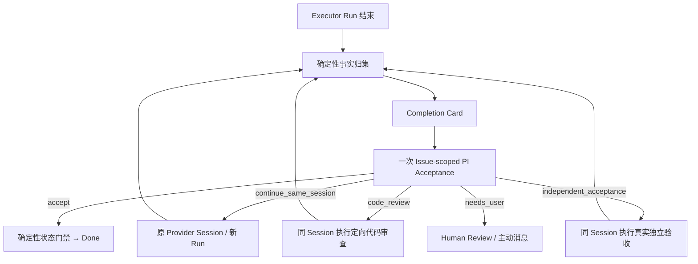

# 玄武按 Issue 自主验收重构设计

- 状态：Accepted，作为本轮实现与验收基线
- 日期：2026-08-01
- 范围：Executor 结束后的事实归集、PI 语义验收、续跑、审查、熔断与人类升级
- 关联：承接 `2026-07-31-pi-trustworthy-autonomy-review-redesign-draft.md` 的产品方向，并修正“多数任务零额外 LLM 调用”的落地偏差

## 1. 最终产品决策

每个正常结束并声称完成的 Work，都进行 **一次按 Issue 粒度的轻量 PI 语义验收**。

这次调用不是项目经理会议，不是 Verifier 子任务，也不是重跑一遍测试。它只读取一张有界、可信、可审计的“小结卡片”，判断：

```text
accept
continue_same_session
code_review
independent_acceptance
needs_user
```

核心分工：

> 确定性系统负责事实真实性、归属、状态合法性、幂等和熔断；PI 负责理解这些事实对当前 Issue 意味着什么；人类只处理不可约的产品、风险、权限或外部状态决策。

因此，本设计明确否定两种极端：

1. 不信任 Executor 的一句“完成了”，直接机械 `done`；
2. 用硬编码正则、统一 test 门槛或默认 Verifier 代替 LLM 的语义判断。

## 2. 为什么不是“多数任务零额外 LLM 调用”

PI 的价值不是只在确定性代码失败时兜底。如果绝大多数 Work 由状态机、正则和固定策略直接判定，PI 实际上仍只是异常处理器，系统也会继续把不断增长的业务语义写进硬代码。

真正要优化的是 **单次 PI 调用的输入和职责**，而不是取消这次调用：

- 不传整个项目快照；
- 不传无关 Issue、全量日志或完整 Session；
- 不启动新的项目 manager conversation；
- 不要求 PI 重建事实；
- 只传当前 Issue 的 bounded completion card；
- 信息不足时只允许有限的只读 drill-down；
- 输出严格枚举和结构化理由；
- 相同卡片不得无限重试。

这既保留 LLM 对任务语义、时间顺序、验证覆盖范围和例外情况的理解能力，也把 token、延迟和错误面控制在可预测范围内。

## 3. #818 暴露的真实问题

### 3.1 运行事实

#818 的同一个 Codex Session 中先出现失败，随后切换到项目要求的 Node 22 并成功完成：

- 早期 contract test、lint 等命令存在非零退出码；
- 后续 Node 22 环境下 contract generate/test 成功（9/9）；
- 后续完整 `lint + typecheck + test + build + git diff --check` 成功；
- 最终回归共 74 tests，通过并完成 build；
- 产生 commit `203bbd0`，从 baseline `7355b39` 到最终 revision 有 18 个 changed files；
- Executor 最终明确报告 `RUNNER_OUTCOME: completed`。

因此，#818 的正确语义不是“曾经出现 exit 1，所以任务失败”，也不是“Node 24 一定不兼容 Node 22”。正确问题是：**后来的成功是否覆盖了前面的失败，并且是否满足 Issue 的目标。** 这只能结合命令顺序、覆盖范围、Git 变化和最终说明判断。

### 3.2 原系统为什么丢失并循环

旧链路有两个叠加缺陷：

1. `completionGate.ts` 的 `classifyVerificationCommand` 用 shell 字符串正则决定命令是否能成为 Evidence。包装、复合命令和新执行协议很容易被排除；
2. Codex 当前异步 exec 协议会先返回 `SESSION_ID`，真正退出码出现在后续 `write_stdin`。旧 rollout recovery 没有关联这两段事件，导致终态命令恢复不完整。

结果是旧 Evidence 视图偏向早期失败，而后续成功没有成为同等可信的事实。随后 pending 状态又触发项目级 PI manager cycle 和 supervisor 恢复循环；它们没有拿到一张能解释时间顺序的卡片，也没有同 fingerprint 上限，于是重复观察同一问题。

这是 **事实层、语义层和调度层同时错位**，不是只改一个 Prompt 或把重试次数改成 3 就能解决。

### 3.3 #821 暴露的 Session/Run 脱节

#821 的 canonical Run 只绑定 Session `019fbb19-ff89-75c3-b4ec-b9562359cf16` 的旧 Turn
`019fbb1a-134b-7da1-ba36-9725d960c543`；同一 Session 随后又完成了 Turn
`019fbb3c-886f-74d0-a834-2d488e237a5d`，其中包含最终实现说明和完整验证结果。旧卡片只读
canonical Run，因此玄武看不到后续完成事实。

修复后的 coordinator 在每次 PI 判断前读取该 Session 的最新 Turn，并把旧 Run、最新 Turn 及
此时的 Git 观察同时放入卡片。它不伪造历史 Run，也不靠命令正则推断完成；PI 负责判断后续 Turn
是否确实属于当前 Issue、是否覆盖旧失败。

## 4. 目标架构



默认主链是：

```text
Executor → Completion Card → PI accept → deterministic apply → done
```

它包含一次轻量 PI 调用，但没有默认第二个 Agent、第二个 Issue 或重复测试。

## 5. Completion Card 合同

卡片是事实的有界只读投影，不是新的 truth source。至少包含：

```ts
type CompletionCard = {
  issue: {
    id: number;
    project_id: string;
    title: string;
    goal: string;
    status: string;
    updated_at: string;
  };
  acceptance: {
    criteria: Array<{ id: string; description: string; required: boolean }>;
    handoff_policy: string;
  };
  run: {
    id: string;
    attempt: number;
    provider: string;
    provider_session_id: string;
    provider_turn_id: string;
    started_at: string;
    ended_at: string;
    status: string;
  };
  commands: {
    total: number;
    omitted: number;
    items: Array<{
      id: string;
      sequence: number;
      command: string;
      cwd: string;
      exit_code: number;
      status: "completed" | "failed";
      duration_ms: number;
      output_excerpt: string;
      source: "issue_log" | "rollout_recovery";
    }>;
  };
  git: {
    baseline_revision: string;
    final_revision: string;
    has_diff: boolean;
    working_tree_dirty: boolean;
    observed_at: string;
    source: "terminal_observation" | "legacy_reconstruction" | "session_observation";
    changed_files: string[];
    commits: Array<{ revision: string; subject: string; timestamp: string }>;
  };
  session: {
    inspected: boolean;
    provider_session_id: string;
    run_turn_id: string;
    latest_turn_id: string;
    latest_turn_matches_run: boolean;
    latest_turn_status: string;
    turn_count: number;
    latest_turn_items: Array<{
      type: string;
      status: string;
      command: string;
      exit_code: number | null;
      output_excerpt: string;
      text: string;
    }>;
    current_git: CompletionCard["git"] | null;
    error: string;
  };
  evidence: Array<{ id: string; kind: string; status: string; summary: string }>;
  handoff: object | null;
  final_message: string;
  provider_outcome: { outcome: string; reason: string };
  warnings: string[];
  fingerprint: string;
};
```

约束：

- 原始 command、cwd、exit code 和关键输出必须保留；
- 命令按时间顺序呈现，不能只保留“最后一条”或“失败的那条”；
- 长输出取首尾摘要，命令数有硬上限，优先保留最早少量和最新多数；
- 默认 Git 使用 Run baseline 到 Run 结束时 revision；若同一 Provider Session 已出现比 canonical Run 更新的 Turn，则额外读取一次当前 Git 观察并明确标为 `session_observation`，不伪造或改写历史 Run；
- PI 每次判断前都对绑定的 Provider Session 做一次有超时、限条数和脱敏的最新 Turn 读取；最新 Turn 与 Run Turn 不同时，两者同时保留，交给 PI 判断后续事实是否覆盖旧 Run；
- Host 在 terminal reconciliation 时固化 Git/working-tree observation；新 Run 直接读取该快照，旧 Run 才做 legacy reconstruction；
- 卡片 fingerprint 不包含生成时间，相同事实产生相同 fingerprint；
- 卡片和 PI 决策都写入 Issue event，支持审计与幂等；
- 卡片只能引用当前最新已结束 Run，状态或 revision 变化后旧卡片不可应用。

## 6. 确定性代码的边界

确定性代码必须做：

- 捕获所有 terminal command observation，而不是先分类后决定是否保存；
- 关联 Run、Attempt、Session、Turn、Issue、cwd 和时间窗口；
- 关联异步 `exec → SESSION_ID → write_stdin → Process exited`；
- 读取 Git baseline、final revision、changed files 和 commit；
- 限制卡片大小、脱敏、校验 schema；
- 校验 Issue/Run/revision 仍是当前版本；
- 校验 Handoff 的硬性 contract（仅当 Work 明确要求 required）；
- 执行状态迁移、权限、scope、destructive gate 和审计；
- 对同 fingerprint 的调用失败和自动续跑实施硬上限；
- 确保相同决策只应用一次。

确定性代码不得做：

- 用命令关键字或正则判断“这个 Issue 已验证”；
- 用固定的 test/lint/build 组合判断所有任务是否完成；
- 因看到任何历史 exit 1 就永久判失败；
- 因看到最后一条 exit 0 就机械忽略前面的有效失败；
- 根据 changed-file 后缀推断业务是否满足；
- 用通用 risk keyword 自动取代 PI 决策；
- 为补内部 Evidence/Handoff 缺口创建业务 Issue。

`classifyVerificationCommand` 可以在 legacy 展示或兼容接口中存在，但不得继续控制新的正常完成主链。

## 7. PI 语义验收

### 7.1 输入

PI 默认只收到当前 Completion Card。若信息确实不足，可以使用有限只读工具：

- `issue_read`
- `session_read_summary`
- `repo_tree`
- `repo_search`
- `repo_read_excerpt`
- `grep` / `find` / `ls`

不开放 Issue 创建、状态修改、shell 写操作或项目级编排工具。

### 7.2 判断原则

PI 必须：

- 以 Issue goal 和 acceptance 为权威语义；
- 看时间顺序，并判断后续成功是否真正覆盖早期失败；
- 区分“Executor 声明”和“Host 观察到的事实”；
- 按任务类型接受相称证据，文档/调查任务不机械要求测试；
- 对代码任务理解命令实际覆盖范围，而不是匹配命令名称；
- 在证据足够时明确 `accept`，不能因为没有旧 Evidence kind 而推给 Verifier；
- 信息不足时给出具体的下一步，而不是“再验证一下”；
- 不创建新 Issue，不要求默认 Verifier，不重试相同未变化诊断。

### 7.3 输出

输出为严格 JSON schema：

```ts
type PiAcceptanceDecision = {
  decision:
    | "accept"
    | "continue_same_session"
    | "code_review"
    | "independent_acceptance"
    | "needs_user";
  confidence: "low" | "medium" | "high";
  rationale: string;
  evidence_refs: string[];
  unmet_requirements: string[];
  follow_up_prompt?: string;
};
```

自由文本或不符合 schema 的响应不能通过猜测、正则或“看起来像 accept”自动纠正。它被视为本次 PI 调用失败，进入有界重试/熔断。

## 8. 五种动作的语义

### `accept`

- PI 认为目标已满足；
- Host 再校验卡片新鲜度、required Handoff、状态转换与幂等；
- 持久化 PI acceptance evidence 和决策事件；
- Work 进入 `done`；
- 不启动 Verifier，不重跑 Executor 已完成的命令。

### `continue_same_session`

- 有明确漏项、失败或需要补充的证明；
- 使用原 `provider_session_id` 续跑，创建新的 canonical Run/Turn；
- 把 PI 的具体理由、未满足项和 follow-up prompt 发回；
- 禁止创建新的业务 Issue 或 Verifier carrier。

### `code_review`

- 只有需要阅读真实 diff、判断实现正确性或风险时使用；
- 当前第一阶段复用原 Session 执行定向 review/fix，后续可扩展为独立 Reviewer capability；
- 必须产生相对 Executor 自测的增量信息。

### `independent_acceptance`

- 用于浏览器、API、部署、硬件、外部集成等真实行为；
- 必须说明具体场景和成功条件；
- 当前第一阶段复用原 Session 执行，不能退化成重复同一条 test。

### `needs_user`

- 用于产品范围、主观结果、授权、破坏性动作、发布、费用或外部状态等系统无法负责决定的事项；
- 创建明确的人类验收请求并主动通知，不再自动重试。
- PI RPC、schema、Session 读取或卡片构建等系统故障不得伪装成 `needs_user`，也不得生成用户审批。

## 9. 重试与熔断

熔断是 Host contract，不依赖 PI “自觉”：

- 同一 Completion Card fingerprint 的 PI 决策最多尝试 2 次；
- schema 无效、RPC 失败或决策无法应用都记入该 fingerprint；
- 达到上限进入 `pi_blocked` 并记录 `issue.pi_acceptance_system_blocked.v1`，不再由 scheduler 周期性唤醒；这是运维故障，不创建 Human Review；
- 同一 Issue 的自动 continuation 最多 2 次；
- 新 Run 产生新卡片，但不能通过创建新 Issue 重置预算；
- human owner、heartbeat pause 或已有 open review 时不再自动验收；
- 决策已应用或 Issue 已进入 `done` 后重复事件为幂等 no-op。

这些上限防止系统错误时烧 token，但不能替代 PI 的语义判断。

## 10. Project Manager 与 Acceptance 分离

项目级 PI manager cycle 只负责：

- 理解项目目标；
- 拆分/排序 Work；
- 判断依赖 readiness；
- enqueue 已 ready 的 Work；
- 汇总跨 Issue 风险和进度。

它不再负责：

- 接受或修复单个 `pending_verification` Issue；
- 为缺 Evidence 创建 Verifier Issue；
- 每个调度周期重新读取同一个 Session；
- 与 issue supervisor 竞争恢复 ownership。

单个 Issue 的完成只由 completion-card coordinator 接管。这样一次 Work 完成对应一次明确的语义判断，而不是多个 LLM control loop 观察同一状态。

## 11. 默认 Verifier 的处理

删除默认完成主链中的 Verifier carrier：

- 不因缺少 `test|lint|build` Evidence 自动建 Issue；
- 不把“重新跑 Executor 已跑过的命令”称为审查；
- 不通过新 Issue 传回同一个 Work 的验证结果；
- 不允许 Verifier 子 Issue 被 cancelled 后继续触发父 Issue 循环。

保留的能力：

- 用户明确要求独立验证；
- PI 选择 `code_review` 或 `independent_acceptance`；
- 高风险项目未来通过显式 policy 配置独立 reviewer；
- 历史 Verifier event/report 仍可读，但不驱动新默认流程。

## 12. 状态兼容策略

第一阶段保留 `pending_verification` 字段，避免立即迁移 DB/schema/UI，但重新定义其运行含义：

> Executor Run 已结束，等待 PI 对当前 Completion Card 做一次语义验收。

它不再表示“等待系统猜出一条符合正则的验证命令”，也不再是项目经理循环的触发器。

owner projection 继续区分：

- `pi`：允许 issue-scoped acceptance coordinator 调度；
- `human`：已有明确的人类请求，所有自动验收停止。

后续可将 UI 名称调整为“PI 验收中 / 等待用户”，但这不是本轮正确性前置。

## 13. 实施切片

### P0：事实完整性

1. 正常模式持久化全部 terminal command observation；
2. 修复 Codex async exec/write_stdin 的终态关联；
3. 构建、限界、fingerprint 并记录 Completion Card；
4. 用 #818 回放证明早期失败和后续成功同时可见。

### P0：按 Issue PI 验收

1. 增加 Agentic issue-acceptance RPC；
2. 严格五选一 schema；
3. prompt 只传卡片，开放有限只读 drill-down；
4. `accept` 通过确定性 application gate 进入 done；
5. schema invalid 不做自然语言猜测。

### P0：移除循环

1. provider 的业务终态声明（`completed | failed | needs_user`）统一落到 `pending_verification` 并请求一次语义验收；只有 Provider/RPC/进程等基础设施异常直接走运行失败链；
2. coordinator 不再调用 project manager；
3. manager prompt 明确不接管 pending acceptance；
4. fingerprint attempt 和 continuation 上限；
5. PI 系统错误达到上限进入 `pi_blocked`，不创建 human review；只有 PI 返回有效 `needs_user` 决策时才通知用户。

### P1：续跑与按需审查

1. 三种非 accept 自动动作都复用原 Provider Session；
2. 新 Run 保留事实归属；
3. review/independent acceptance 必须包含明确增量检查；
4. 后续再按真实需求拆出独立 Reviewer runtime，而不是预先恢复默认 Verifier。

## 14. 验收标准

### #818 必须通过

从包含真实历史事件的 #818 构建卡片后，必须满足：

- 同时看到早期非零 exit 和后续 exit 0；
- 看到 Node 22 下完整验证成功；
- 看到 74 tests、build、`git diff --check` 等终态事实；
- 看到 baseline、changed files 和 commit `203bbd0`；
- 仅发起一次 issue-scoped PI acceptance；
- PI 能解释“后续覆盖前序失败”并返回 `accept`；
- Host 将原 #818 更新为 `done`；
- 不创建 #819/Verifier carrier 或任何替代业务 Issue；
- 不恢复 #858；
- 再跑 scheduler 不产生相同卡片的新 LLM 调用。

### 回归场景

- 文档任务无 test，但产物满足目标时 PI 可 accept；
- 有真实未覆盖失败时 PI 返回 continue，而非机械看最后 exit 0；
- required Handoff 缺失时即使 PI accept，Host 仍拒绝应用；
- stale card、stale Run 或 Issue revision 变化时拒绝应用；
- continuation 使用同一 provider session、不同 Run；
- 两次相同 fingerprint 的 PI 系统失败后只记录一个 `pi_blocked` 事件，不创建 human review；
- canonical Run 结束后同 Session 又有更新 Turn 时，卡片同时包含旧 Run 和最新 Turn，PI 可基于后续事实 accept；
- Executor 自报 `failed` 或 `needs_user` 时仍先由 PI 判断其语义，不直接要求用户审批；
- human-owned 或 paused Issue 不触发 PI；
- 默认链不创建 Verifier Issue。

## 15. 衡量指标

目标不是“零 LLM”，而是“一次有意义的 LLM 判断，零无效循环”：

- 正常完成 Work 的 PI acceptance 覆盖率：100%；
- 每个正常完成 Work 的 acceptance LLM 调用：目标 1 次；
- 同 fingerprint 的调用次数：最多 2 次，正常为 1；
- acceptance prompt/card 的 p50/p95 字节数和 token 数；
- Executor terminal 到 done 的延迟；
- 默认 Verifier carrier 创建数：0；
- 同 Session 自动 continuation 次数：最多 2；
- PI `needs_user` 中真正需要人类决策的比例；
- done 后被用户打回或发现关键漏项的比例；
- code review / independent acceptance 产生增量 finding 的比例。

## 16. 非目标与后续问题

本轮不要求：

- 立即删除历史 Evidence、Verifier、review 表或 event；
- 立即迁移 `pending_verification` DB enum；
- 立即实现通用风险评分器；
- 立即设计软依赖绕行或硬依赖预执行；
- 让 PI 绕过权限、destructive approval、required Handoff 或状态前置；
- 信任 Executor 的最终自然语言而不看 Host 事实。

依赖图绕行是独立的调度设计问题。未经明确 contract 前，不应为了“别卡住”自动越过硬依赖。本轮先保证卡住的 Work 能正确验收、续跑、熔断和联系人类，避免把一个验收 bug 扩大成依赖一致性 bug。

## 17. 一句话总结

> 每个 Work 都让 PI 看一张可信、轻量、按时间排序的小结卡片做一次语义验收；硬代码只保证事实和动作，不再扮演需求理解器；需要修复就回原 Session，需要人时立即通知，绝不再靠 Verifier Issue 和无限重试制造“审核感”。
