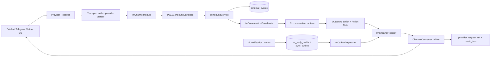
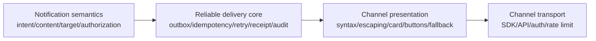
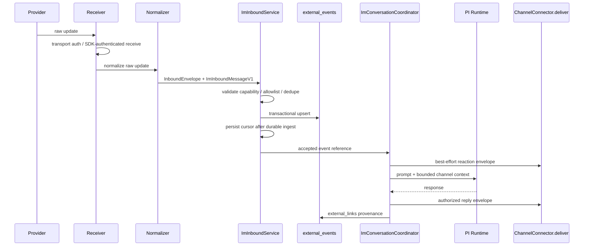
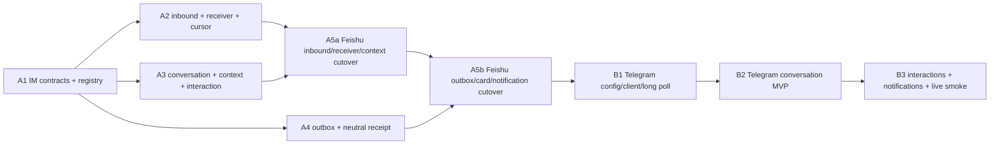

# 通用 IM Channel 底座与 Telegram 接入设计

> 状态：Accepted；Issue #864 已完成阶段 A 的离线实现，等待真实 Feishu 验收；Telegram 仍属于后续阶段 B
>
> 日期：2026-08-02
>
> 范围：先把现有 Feishu IM 运行链收敛为通用 IM 模块，再以 Telegram 作为第一个新增渠道验证抽象；为后续 QQ 等渠道保留明确扩展边界
>
> Review 对账：已吸收 [DeepSeek review](./2026-08-02-generic-im-channel-telegram-design-review.md) 中的 sender 单一路径、callback、receipt、迁移与 Telegram 协议建议。批量 cursor 采用 review 修正版的“按序连续前缀提交”，不要求整批单事务。
>
> 当前 canonical 依赖：
> [Channel / Connector 统一契约](./xuanwu/0064-channel-connector-contract.md)、
> [统一通知 Outbox](./xuanwu/0075-unified-notification-outbox.md)、
> [Connector Health / Secret / Diagnostics](./xuanwu/0076-connector-health-secrets-diagnostics.md)、
> [Feishu Connector 迁移](./xuanwu/0077-feishu-channel-connector-migration.md)

> 实施边界（2026-08-10）：生产发送入口已收敛到 registry 驱动的 `draft -> sync_outbox -> dispatchImOutbox -> ChannelConnector.deliver`；即时回复、reaction、Guardian 提醒也先落同一 durable outbox，Feishu adapter 只负责把 canonical interaction/Markdown 渲染为卡片。入站先归一化为 `ImInboundMessageV1`，再由通用 inbox writer 写 `external_events`。新卡片只携带 opaque token、action index 与 revision，actor/scope/action/expiry 在服务端 binding 中 fail closed；旧 Feishu approval、PI action、project selection callback 会先收编成兼容 binding，再进入同一 interaction service。迁移 070–074 均为 additive，073 为 resolver 增加可恢复 lease，074 只约束 canonical IM dedupe key；均未对 live DB 执行。真实 Feishu callback/发送和旧 binary rollback 仍是发布门禁。

## 1. 结论摘要

采用两阶段路线：

1. **阶段 A：通用 IM 底座。** 保持 Feishu 用户行为不变，把 receiver 生命周期、消息归一化、会话路由、PI bridge、上下文投影、通知发送、交互回调、配置和诊断收敛到 provider-neutral 模块。阶段 A 完成时仍只有 Feishu 一个真实 IM provider，但业务层不得再依赖 Feishu 类型或 ID 规则。
2. **阶段 B：Telegram 接入。** Telegram 只实现自己的 config、client、long-poll receiver、normalizer、target codec 和 presentation renderer；不得复制一套 conversation、notification、Guardian、Watch、approval 或 outbox 业务链。

这不是重新定义 `ChannelConnector`。现有 P09.01 contract 继续作为外部边界合同；本设计在其上增加一层只服务“面向人的 IM 对话”的运行时组合模块。

完整的 IM 通知能力明确由两部分共同组成：

1. **通用通知底座**：决定为什么通知、通知什么、目标 channel、授权、幂等、outbox、claim、retry、receipt 和审计；
2. **channel-specific adapter**：负责该 IM 自己的消息语法、长度限制、mention、thread/reply、reaction、卡片/按钮、callback、转义、SDK/API 和错误映射。

只有通用底座而没有 provider adapter，消息无法正确落到真实 IM；只有 provider adapter 而没有通用底座，则每个渠道都会复制通知状态机。两者组合后才构成完整通知能力。

设计成功的判定不是“Telegram 能收发一条消息”，而是：

- Feishu 和 Telegram 经过同一个 `ImConversationCoordinator`、同一个通知 outbox dispatcher 和同一套 Action Gate；
- 新增第三个 IM 渠道时，核心代码通常不需要修改，只需注册新 adapter；
- provider 特有名词、SDK 类型、ID 前缀、卡片 JSON 和密钥不进入 PI、通知、Watch、Guardian 或数据库业务模型；
- 不建立第二套 inbox、outbox、approval、conversation 或 connector health 状态机。

## 2. 背景与现状

### 2.1 已经通用的部分

当前代码已有以下可复用事实：

- `ChannelConnector` 已定义 manifest、capability、health、inbound/outbound envelope、cursor、rate limit、audit 与 delivery receipt。
- `external_events` 已支持 `source`、`provider`、`external_id`、`dedupe_key`、`normalized_message_json` 和不可信输入标记。
- `external_links` 已承担消息、会话、Issue、notification 等 provenance 关联。
- `pi_notification_intents` 决定是否通知以及目标 channel；`im_reply_drafts + sync_outbox(operation_kind='im_reply')` 是外部 IM 投递 authority。
- `notificationOutbox.ts` 已存在 `NotificationChannelSender` 和 channel-neutral fixture dispatcher，只是生产 Feishu 尚未完成正式 cutover。
- `sync_outbox` 已有 provider-neutral 的 `provider_request_ref`、`result_json`、`payload_json` 和 `correlation_id` 字段，可以承接中性 delivery receipt，不需要再建一张 IM outbox 表。
- Feishu transport 已被薄封装为 `feishuChannelConnector`，入站和出站均能经过 P09.01 envelope 校验。

### 2.2 仍然与 Feishu 耦合的部分

| 范围 | 当前耦合 | 影响 |
| --- | --- | --- |
| runtime 装配 | `core.ts` 直接创建 `FeishuAgentBridge`、`FeishuReceiverManager` 和 restart callback | 每加一个渠道都要修改 core 生命周期 |
| HTTP 装配 | `server.ts` 直接注册 Feishu event/settings/outbox routes 和 notification observers | route 与业务初始化无法按 registry 扩展 |
| 对话 bridge | 输入、runner、回复、ack、dedupe 和 external link 都以 `FeishuNormalizedMessageEvent` 为中心 | Telegram 若直接接入会复制 bridge |
| 会话路由 | repository/table/function 均以 `feishu_conversation_state` 命名，scope 生成依赖 Feishu chat/thread ID | 多渠道不能安全共享会话生命周期 |
| 上下文投影 | SQL 固定 `source='feishu'`，出站 message ID 固定读取 `feishu_message_id` | Telegram follow-up 无法得到同等上下文 |
| 项目选择 | pending selection、卡片 renderer 和 callback normalizer 混在 Feishu 模块 | Telegram inline keyboard 会复制业务状态 |
| 通知投递 | 通用 dispatcher 未接入生产；Feishu dispatcher 同时负责 claim、card build、send 和 receipt | 新 channel 容易再建 dispatcher |
| delivery receipt | `feishu_message_id` 仍被 claim、context、watchdog 和 action target 消费 | 中性 connector 仍需伪装成 Feishu receipt |
| 配置和 secret | `RunnerConfig.integrations`、local settings normalizer、secret ref resolver 均显式列举 Feishu | 新渠道要修改多处分支 |
| UI | Connections 页面固定渲染 `FeishuSettingsPanel` | 无法按渠道展示设置和健康状态 |
| 交互展示 | capability 使用 `card.send`，具体卡片 payload 由 Feishu builder 生成 | “卡片”不是跨 IM 的公共概念 |

因此当前状态是“transport adapter 已有边界，IM application runtime 尚未通用化”。

## 3. 目标、非目标与约束

### 3.1 目标

阶段 A 必须实现：

1. 一个进程内、显式注册、类型安全的 IM channel registry。
2. provider-neutral 的 inbound message、target、conversation scope、interaction 和 delivery receipt。
3. 一个通用 receiver lifecycle manager，统一 start/stop/restart/status，但不把 provider SDK 连接状态写成第二事实表。
4. 一个通用 conversation coordinator，统一 allowlist/attention、dedupe、best-effort ack、`/new`、PI 调用、错误升级、回复和 provenance。
5. 一个通用上下文投影器，按 connector + conversation/thread scope 查询入站和出站消息。
6. 生产通知发送切到 channel-neutral dispatcher，继续使用唯一 `sync_outbox`。
7. 交互意图与 provider presentation 分离：core 描述“让用户选择/批准什么”，adapter 决定渲染成 Feishu card、Telegram inline keyboard 或纯文本。
8. Feishu 行为、幂等、权限、安全、重启和历史数据保持兼容。
9. Telegram adapter 不修改 PI、Guardian、Watch、notification producer 或 Action Gate 的业务逻辑。

### 3.2 非目标

- 不实现从磁盘动态加载任意第三方 JavaScript 的“connector marketplace”。内建 adapter 必须在编译期显式注册，避免任意代码执行与 secret 越权。
- 不统一 Git、Tracker、CLI、Webhook 与 IM 的业务流程；它们仍共享 P09.01 contract，但不强行使用 IM coordinator。
- 不新增第二套 `external_events`、notification intent、outbox、approval 或 PI conversation。
- 不在阶段 A 顺手改变 PI 的项目选择语义、回复文案、notification policy、quiet hours 或 Guardian 升级策略。
- Telegram MVP 不下载或理解图片/文件二进制；附件只记录受限 metadata。
- Telegram MVP 不使用 MTProto user client，只使用 Bot API。
- QQ 只作为扩展性验证对象，不在本次实现。QQ 官方机器人、频道机器人或 OneBot 等具体协议必须在后续 Issue 单独决策。

### 3.3 必须保持的不变量

- inbound 永远是不可信输入；provider 验签/鉴权不能被 LLM 文本替代。
- outbound 必须带稳定 action ID、correlation/event ref、idempotency key 和已允许的 Action Gate ref。
- `authorization.authority` 只允许 `deterministic_policy | human_approval`，LLM 不能成为外写 authority。
- 一个外部事件只写一次 `external_events`；一个通知只由一个 `sync_outbox` row claim/send/receipt。
- ack/reaction 永远是 best effort，失败不能阻塞正常 PI 回复。
- IM 会话没有持久化“当前项目”；项目只能来自本次请求中的明确项目、Issue ref、一次性映射或一次性选择结果。
- secret material 不能出现在 manifest、health、audit、diagnostics、错误、URL 日志、数据库普通 JSON 或前端 readback。
- 历史终态和 delivery 状态不能通过手工补字段伪造；迁移必须保留审计和可回滚 carrier。

## 4. 目标架构



### 4.1 模块责任

| 模块 | 负责 | 不负责 |
| --- | --- | --- |
| `ChannelConnector` | 通用 envelope 校验、capability、health、deliver contract | receiver 生命周期、会话、通知策略 |
| `ImChannelModule` | 把一个 IM provider 的 config、receiver、normalizer、target codec、presentation 与 connector 组合起来 | PI 决策、outbox 状态机、业务授权 |
| `ImChannelRegistry` | 显式注册/查找 channel module，拒绝重复 ID，统一 runtime status | 动态执行外部代码、保存 secret |
| `ImReceiverRuntime` | start/stop/restart 所有已启用 receiver，聚合 status | 自建持久化连接状态机 |
| `ImInboundService` | validate、dedupe、写 `external_events`、推进 cursor | 调用 provider SDK |
| `ImConversationCoordinator` | attention、会话 scope、ack、PI 调用、回复、provenance | provider payload 解析、card JSON |
| `ImContextProjector` | 按 channel/scope 有界投影历史消息 | 保存新的聊天副本 |
| `ImOutboxDispatcher` | claim、preflight、connector lookup、retry、receipt | 决定是否应该通知、直接调用 provider SDK |
| `ImInteractionService` | 保存/消费 opaque interaction binding，绑定 actor/scope/action | 直接信任 callback payload |
| provider presentation | 将 canonical interaction 渲染为卡片、inline keyboard 或文本 | 决定 approval 结果 |

### 4.2 通知语义、展示语法与 transport 分层



各层的输出边界：

| 层 | 输入 | 输出 | 示例 |
| --- | --- | --- | --- |
| notification semantics | Issue/Run/Approval/Guardian 等业务事实 | canonical content、interaction、target channel、Action Gate ref | “#123 需要用户批准” |
| reliable delivery core | canonical notification | 一条 durable outbox command 与最终 receipt | `sync_outbox:456` |
| channel presentation | canonical text/interaction + capability | provider-ready message model | Feishu card、Telegram inline keyboard、QQ markdown/button |
| channel transport | provider-ready model + secret/target | provider request 与脱敏 receipt/error | Lark SDK、Telegram Bot API、QQ Bot API |

公共层不得出现 `post`、`msg_type=interactive`、Telegram `parse_mode`、QQ markdown template 等 provider 语法。每个 adapter 必须负责：

- provider 文本/Markdown/富文本转义；
- 单条消息长度与确定性分段；
- mention、reply、thread/topic 的 provider 映射；
- reaction、card、inline keyboard、button 等 capability；
- 不支持 capability 时的文本 fallback；
- callback payload 的 opaque token 编码与解析；
- SDK/API 调用、认证、限流和错误分类。

通用层仍拥有通知内容的业务含义和可靠性，不允许 adapter 改变 decision、approval result、目标 Issue 或 Action Gate。adapter 可以改变展示形式，不能改变业务动作。

## 5. 合同设计

### 5.1 保留 P09.01 `ChannelConnector`

不破坏现有 `ChannelConnector`：

```ts
interface ChannelConnector {
  readonly manifest: ConnectorManifest;
  health(): Promise<ConnectorHealth> | ConnectorHealth;
  ingest?(envelope: InboundEnvelope): Promise<void> | void;
  deliver?(envelope: OutboundEnvelope): Promise<ConnectorDeliveryReceipt>;
}
```

新增 IM-specific contract 是组合关系，不继承出第二套 connector authority。

### 5.2 `ImChannelModule`

```ts
type ImChannelID = string;

interface ImChannelModule<TConfig> {
  readonly id: ImChannelID;
  readonly connector: ChannelConnector;
  readonly settings: ImChannelSettingsAdapter<TConfig>;
  readonly receiver: ImReceiverAdapter<TConfig>;
  readonly normalizer: ImInboundNormalizer;
  readonly targets: ImTargetCodec;
  readonly presentation: ImPresentationAdapter;
}
```

约束：

- `id` 必须与 `connector.manifest.id` 相等。
- registry 注册时执行 `assertConnectorConformance`。
- manifest 声明 inbound capability 时必须有 receiver + normalizer。
- manifest 声明 outbound capability 时，`connector.deliver` 必须存在并通过 outbound conformance test。
- module 只拿到自己的 typed config；不能读取其他 provider secret。

出站调用关系必须只有一条：

```text
ImOutboxDispatcher / ImConversationCoordinator
  -> ImChannelRegistry.get(connector_id).connector.deliver(OutboundEnvelope)
  -> provider connector 内部的 presentation + private transport client
  -> provider API
```

- `ChannelConnector.deliver(OutboundEnvelope)` 是 application runtime 唯一正式投递入口；dispatcher、Coordinator 和业务服务不得直接拿 sender/client。
- provider 内部可以有 `FeishuTransportSender`、`TelegramBotClient` 等私有 transport 原语，但它们不属于 registry/public contract，只能由对应 connector 持有和调用。
- 当前 `NotificationChannelSender` 只作为 A4 前的 fixture/legacy carrier；A4 cutover 后删除生产依赖并进入废弃期，不能形成第二条 dispatcher 路径。
- connector/client 的生命周期归 provider module 装配管理；registry 只持有已装配 module，不缓存第二份 sender。

### 5.3 Canonical inbound message

`InboundEnvelope.payload` 对 IM 固定承载 `ImInboundMessageV1`：

```ts
type ImConversationKind = "direct" | "group" | "channel" | "unknown";

type ImInboundMessageV1 = {
  schema_version: "xuanwu.im-message.v1";
  connector_id: string;
  update_id: string;
  message_id: string;
  conversation: {
    id: string;
    kind: ImConversationKind;
  };
  thread?: {
    id: string;
    root_message_id?: string;
  };
  sender: {
    id: string;
    display_name?: string;
    kind: "user" | "bot" | "chat" | "unknown";
  };
  text: string;
  mentions: Array<{
    id?: string;
    display_name?: string;
    is_self?: boolean;
  }>;
  attachments: Array<{
    id: string;
    kind: "image" | "file" | "audio" | "video" | "other";
    name?: string;
    mime_type?: string;
    size_bytes?: number;
  }>;
  occurred_at: string;
  raw_event_ref: string;
};
```

字段规则：

- 所有 provider ID 都是 opaque string。core 不解析 `oc_`、`ou_`、Telegram 数字 ID 或未来 QQ ID 前缀。
- `update_id` 表示 transport delivery/cursor 单元；`message_id` 表示用户可见消息。两者不得混用。
- 附件只保存 metadata；`raw_event_ref` 是 hash/audit ref，不是本地绝对路径。
- provider raw payload 经脱敏后可以进入 `external_events.raw_json`，但 core 只读取 canonical payload。
- normalizer 必须有 schema validation；未知 update type fail closed 并记录 bounded audit。
- `occurred_at` 一律为 ISO 8601 UTC：Telegram Unix seconds、Feishu 字符串/毫秒都必须在 adapter 中完成单位识别与转换，core 不猜时间单位。
- sender 身份不能用缺失值默认成普通用户：Telegram `from.is_bot` 映射为 `user|bot`，`sender_chat` 映射为 `chat`；Feishu 只在 provider 类型可判定时映射，否则使用 `unknown` 并按 attention/allowlist 策略 fail closed。

### 5.4 Target 与 scope

```ts
type ImTargetV1 = {
  connector_id: string;
  conversation_id: string;
  thread_id?: string;
  reply_to_message_id?: string;
  actor_id?: string;
};

type ImScopeRef = {
  connector_id: string;
  scope_key: string;
  conversation_id: string;
  thread_id: string;
};
```

- `conversation_id`、`thread_id`、`reply_to_message_id` 都是 provider opaque ID。
- `ImTargetCodec` 负责 `ImTargetV1 <-> connector target URI`，例如 `feishu://...`、`telegram://...`。
- 数据库和 core 不根据 ID 前缀猜 receive type。
- scope 规则统一为：有 thread/topic 时以 thread 为会话隔离；否则以 conversation 为隔离。
- PI conversation ID 使用稳定摘要，避免字符清洗造成碰撞：

```text
im-<connector-id>-<sha256(connector-id + NUL + conversation-id + NUL + thread-id)[0:32]>
```

- 用户 `/new` 只增加该 scope 的 epoch，生成 `...-n<epoch>`；不影响其他 channel/chat/thread。

### 5.5 Capability vocabulary

保留当前能力，同时增加 provider-neutral vocabulary：

| capability | 语义 | fallback |
| --- | --- | --- |
| `message.receive` | 接收用户消息 | 无；IM inbound 必需 |
| `message.reply` | 回复已有会话/消息 | 无；双向 IM 必需 |
| `reaction.add` | acknowledgment/reaction | 静默跳过，不阻塞回复 |
| `interaction.send` | 发送带选项/动作的交互提示 | 降级为显式 `/choose` 文本命令 |
| `interaction.receive` | 接收按钮/callback action | 若不支持则只允许文本命令 |
| `thread.reply` | 精确回复 thread/topic | 降级到 conversation 并标注引用 |

`card.send` 在 Feishu W1 中保留为 compatibility capability，但新的 core 不再生成 `card.send`。Feishu presentation adapter 把 `interaction.send` 渲染为 card；Telegram 渲染为 inline keyboard；QQ adapter 后续按实际协议渲染。

### 5.6 Canonical interaction

```ts
type ImInteractionV1 = {
  schema_version: "xuanwu.im-interaction.v1";
  interaction_id: string;
  kind: "choice" | "approval" | "confirmation";
  title: string;
  body: string;
  actions: Array<{
    action_id: string;
    label: string;
    style: "primary" | "default" | "danger";
  }>;
  expires_at: string;
};
```

安全规则：

- provider callback 中只携带 bounded opaque token 和短 action index/revision，不携带可信 project、Issue、approval decision 或任意 tool 参数。
- interaction transport token 使用至少 128 bit 随机值，例如 16 random bytes 的 base64url（22 chars）；Telegram `callback_data` 建议编码为 `i1.<token>.<action-index>.<revision-base36>`。adapter 必须按 UTF-8 编码后校验总长度为 1–64 bytes，超限时 fail closed，不能截断或退回携带业务参数的 payload。
- `ImInteractionService` 从本地 authoritative binding 解析真实 action，并验证 connector、conversation/thread、actor、status、expiration 和 revision。
- approval 最终仍由 `pi_approval_requests` / `pi_actions` resolver 决定；interaction binding 只是 transport provenance。
- 重复 callback 返回稳定的 `already_consumed`，不得重复执行 action。
- callback 在完成最小 shape、connector 和来源校验后必须快速发送 provider acknowledgment；合法请求提示“处理中”，非法/过期请求返回稳定错误提示。业务 action 在 acknowledgment 后异步 consume/执行，最终结果通过 edit/send 呈现。
- interaction consumed、expired 或 permanently rejected 后，adapter best effort 清理原消息按钮；清理失败只记脱敏 warning，不回滚 action，也不改变 consume 结果。
- 不支持交互的渠道使用显式命令 fallback：展示选项时同时给出 `/choose <short-token> <option>`。只有整行严格匹配该格式、token 命中同 connector/scope/actor 的 pending binding 时，才优先于普通 PI 文本解析；单独回复 `2`、`#2` 或“最近一条 pending”推断一律不得触发 action。
- fallback resolver 回显选中的 action label 与最终结果；涉及原本需要 approval 的动作仍走既有 approval authority，不因文本 fallback 降级门禁。

### 5.7 Receiver lifecycle

```ts
type ImReceiverStatus = {
  connector_id: string;
  state: "disabled" | "connecting" | "connected" | "reconnecting" | "failed";
  connected: boolean;
  reconnect_attempts: number;
  last_event_at: string;
  last_error: string;
};

interface ImReceiverAdapter<TConfig> {
  start(input: ImReceiverStartInput<TConfig>): Promise<void> | void;
  stop(): Promise<void> | void;
  restart(config: TConfig): Promise<void>;
  status(): ImReceiverStatus;
}
```

`ImReceiverRuntime` 的行为：

1. 启动时按 registry 顺序检查 config；disabled/misconfigured 不阻塞 core 启动。
2. 每个 module 最多一个 active receiver generation。
3. restart 先使旧 generation 失效，再关闭 client、清 timer、启动新 generation。
4. provider receiver 自己处理 SDK 生命周期；通用 runtime 只管理 generation、状态聚合和错误脱敏。
5. shutdown 必须等待 bounded stop，不遗留 long poll 或重连 timer。
6. health 是现有配置、receiver status、event/outbox/audit 的 projection，不新增 health table。

`ImReceiverStatus` 仅是当前进程内存态，是 diagnostics/connector health projection 的一个输入；不落库、不参与 event/outbox 终态判断，也不能成为第二套 receiver authority。

### 5.8 Outbound payload 与 receipt

```ts
type ImOutboundPayloadV1 = {
  schema_version: "xuanwu.im-outbound.v1";
  operation: "message.reply" | "reaction.add" | "interaction.send";
  target: ImTargetV1;
  text?: string;
  reaction?: string;
  interaction?: ImInteractionV1;
};

type ImDeliveryReceiptV1 = ConnectorDeliveryReceipt & {
  schema_version: "xuanwu.im-delivery-receipt.v1";
  connector_id: string;
  provider_message_refs: string[];
};
```

- `ImOutboundPayloadV1` 只能作为 P09.01 `OutboundEnvelope.payload`；authorization、audit、action/idempotency ref 继续由 envelope 承载和校验，不再定义平行的 `ImSendCommand` authority。
- application runtime 只构造 `OutboundEnvelope` 并调用 `connector.deliver`。presentation、分段、provider client 调用全部位于 connector 内部。
- `provider_request_ref` 是主 receipt；多段消息的全部 message ref 进入 `provider_message_refs`，持久化在 `result_json`。
- connector 不返回 provider 原始 response body。
- 文本分段由 presentation/transport 按 provider 限制确定性执行；同一 envelope idempotency key 的每段派生稳定 suffix，重试时保持相同段边界与段 ref。
- 默认发送 plain text。启用 provider markdown 时必须由 renderer 做 escaping，禁止把用户/LLM 文本直接声明为 provider markdown。

## 6. 入站运行链



### 6.1 处理顺序

1. HTTP webhook 必须先验签/验证 secret header；SDK/long-poll receiver 以 provider token 建立受认证连接。
2. normalizer 将 raw update 变成 canonical message，并生成稳定 `source_id/dedupe_key`。
3. manifest capability、schema、timestamp、payload size 和 connector ID 校验。
4. allowlist/attention 使用 canonical `conversation.id` 与 `sender.id`；群聊默认需要明确 mention 或 allowlist，私聊仍需用户/chat allowlist 策略。
5. 在同一数据库事务中 upsert `external_events` 并推进 durable connector cursor。
6. durable ingest 成功后才触发 PI；PI 或发送失败不得回滚 event/cursor，否则会重复执行用户请求。
7. 重复 event 返回 replay 结果，不再次调用 PI、不再次 reply。
8. malformed/unsupported 但已确定不可处理的 update 记录 redacted rejection audit 后推进 cursor，避免 poison update 永久阻塞。
9. 数据库不可用、事务失败或无法判断是否 durable 时不推进 cursor，允许 provider 重投。

普通消息进入 `external_events`；interaction callback 不伪装成普通聊天消息，也不重复写 `external_events`。callback 的 authoritative consume/audit 落在 `im_interaction_bindings` 与既有 `pi_action_events`/approval resolver，provider update ID 仍按下述 cursor 规则形成 durable accepted/rejected 结果。

### 6.2 Durable connector cursor

Telegram long polling 需要 durable `update_id`。新增小型通用表，不创建连接状态机：

```sql
create table connector_cursors (
  connector_id text not null,
  scope text not null,
  position text not null,
  updated_at text not null,
  primary key (connector_id, scope)
);
```

- Telegram scope 固定为 `bot-updates`。
- position 保存“从上一个 cursor 起已经形成 durable 结果的连续前缀”中最后一个 `update_id`，不是某批次中看到的最大 ID。
- 下一次 `getUpdates.offset = last_update_id + 1`。
- Feishu callback/websocket 不要求写 cursor；只有 transport 需要恢复 offset 时才使用。
- cursor 与 external event upsert 必须由一个 transaction service 写入；不能先确认 provider update 再写 event。

Telegram 每个 poll response 的提交算法固定为：

1. 按数值 `update_id` 升序处理；不得并发提交同一个 bot 的 update。
2. 每个普通 event，或 callback/permanent rejection 的 durable audit，与该 `update_id` 的 cursor 推进在同一数据库事务提交；不要求把整批包进一个大事务。
3. malformed/unsupported 且已确定永久不可处理的 update，在写入 bounded rejection audit 后视为 durable result，可以推进连续前缀。
4. transient/unknown/DB failure 不推进该 update 的 cursor，并立即停止本批后续处理；禁止继续处理更大 `update_id`。
5. 永远不得越过尚未形成 durable accepted/rejected 结果的 update，也不得预先把 cursor 写为本批最大 ID。
6. 若 cursor 从 100 开始，响应为 101/102/103，101 提交后进程崩溃，重启使用 `offset=102`：只确认 101，102/103 会重投，不会丢失。若出现极端的 event 已存在但 cursor 未提交，`dedupe_key` 仍应阻止 PI 重复执行。

上述规则依赖 Telegram 的累积 offset 确认语义：只有下一次以更高 offset 调用 `getUpdates` 才确认更小的 update；因此“逐条事务 + 连续前缀”是正确不变量，“必须整批单事务”不是要求。

## 7. 通用会话、上下文与项目语义

### 7.1 Conversation state

目标表只保存会话 epoch，不保存 current project：

```sql
create table im_conversation_state (
  connector_id text not null,
  scope_key text not null,
  base_conversation_id text not null,
  active_conversation_id text not null,
  epoch integer not null default 0,
  started_at text not null,
  updated_at text not null,
  primary key (connector_id, scope_key)
);
```

明确不迁移 `active_project_id` / `active_project_source`。项目解析顺序为：

1. 本次文本中的 Issue ref；
2. 本次文本中的明确项目；
3. 本次 interaction 选择结果；
4. connector config 的 chat/user 映射，仅作为本次 one-shot target；
5. 都没有则不绑定项目，必要时询问一次。

`pi_conversations.project_id` 与 `agent_sessions.project_id` 继续保持 IM 会话不持久绑定项目的现有修复语义。

若 provider event 只有 message ID、无法得到 conversation/thread，允许生成 message-level one-shot conversation 完成本次请求；该退化 scope 不写 `im_conversation_state`，不能被后续消息复用，也不能成为通知 target 的长期来源。

### 7.2 Feishu conversation migration

阶段 A 的迁移步骤：

1. 创建 `im_conversation_state`。
2. 将 `feishu_conversation_state` 的 scope、conversation、epoch、timestamps backfill 到 `connector_id='feishu'`，不复制 active project。
3. backfill 后执行 row-count、key uniqueness、epoch 和 active conversation 一致性审计。
4. 新 runtime 只读写 `im_conversation_state`。
5. W1 最多一个正式 release 使用受控 compatibility projection，使 Feishu legacy reader 仍能得到最新 epoch；不得让两个 application writer 并存。
6. W2 证明 legacy reader/writer=0 后停止 compatibility projection；历史表保留只读直到独立删除门禁完成。

如果实现评审认为 compatibility projection 带来的双写风险高于收益，可以选择“原表作为物理 carrier、repository 先逻辑通用化”的低风险替代方案；但该方案必须明确后续物理迁移期限，不能永久让 Telegram 写入名为 Feishu 的表。

### 7.3 Context projection

`ImContextProjector` 只依赖：

- `external_events.source = connector_id`；
- canonical `normalized_message_json.conversation.id/thread.id/message_id`；
- `sync_outbox.source = connector_id`；
- `provider_request_ref/result_json`；
- target chat/thread/message columns。

它不解析 Feishu/Telegram ID，也不读取 raw provider payload。输出继续有字符上限、事件数上限、secret/path redaction，并明确标注 inbound 用户文本是不可信数据。

## 8. 通知、Watch、Guardian 与 outbox

### 8.1 唯一 authority 不变

| 事实 | authority |
| --- | --- |
| 是否通知、channel child idempotency | `pi_notification_intents` |
| 外部 IM draft / approval / claim / retry / sent | `im_reply_drafts + sync_outbox` |
| provider receipt | `sync_outbox.provider_request_ref + result_json` |
| provenance / notification dedupe | `external_links` |
| provider 实际发送 | registry 中对应 `ChannelConnector.deliver(OutboundEnvelope)` |

不为 Telegram 新建 outbox、scheduler 或 notification intent 表。

### 8.2 Production dispatcher cutover

将现有 `dispatchNotificationOutbox` 提升为生产 `ImOutboxDispatcher`：

1. 按 `operation_kind='im_reply'` 领取候选 row。
2. 使用 `source` 作为 channel/connector ID，从 registry 查 module/connector；不得查找或注入 application-level sender。
3. 通用 preflight 校验 draft approved、risk low、target non-empty、receipt empty、action gate ref 有效。
4. 若有 approval/PI action，由 `ImInteractionService` 生成 canonical interaction；dispatcher 构造唯一 `OutboundEnvelope`，connector 内部的 presentation adapter 负责 provider 展示。
5. 只调用一次 `connector.deliver(envelope)`；发送成功写 `provider_request_ref`、bounded `result_json`、`sent_at`。
6. provider-specific error 统一映射为 retryable/permanent/auth/rate-limit，复用既有 attempt/backoff。
7. 未注册或 disabled channel 是可诊断的 permanent/config error，不能默默 fallback 到 Feishu。

A4 cutover 后，生产 `dispatchFeishuOutbox` 和 fixture `NotificationChannelSender.send` 不得继续作为独立投递入口；legacy route 可以委托 `ImOutboxDispatcher`，但不能自行 claim/send/mark sent。

### 8.3 `feishu_message_id` 兼容迁移

`sync_outbox` 已有 `provider_request_ref`，因此不新增另一 receipt 字段：

1. backfill：对 `operation_kind='im_reply' AND provider_request_ref='' AND feishu_message_id<>''` 的历史 row，写入相同 `provider_request_ref`。
2. 新 claim/preflight/context/watchdog/action-target 读取 `provider_request_ref`。
3. W1 Feishu 成功发送时同时更新 `provider_request_ref` 与 legacy `feishu_message_id`；Telegram 只写 provider-neutral 字段。
4. 每次 release 运行 consumer scan，证明 legacy 字段只剩兼容 reader。
5. 连续一个正式 release legacy reader=0、backup/restore 和旧 binary rollback artifact 验证后，才能停止 Feishu legacy 双写。
6. 物理删列必须是独立 destructive migration，不属于 Telegram MVP。

`sync_outbox` 的中性列由多个 `operation_kind` 共用，必须按 operation 分 schema，而不是对整列套一个含糊 JSON：

| `operation_kind` | `result_json` contract | `provider_request_ref` 语义 |
| --- | --- | --- |
| `im_reply` | 必须通过 `xuanwu.im-delivery-receipt.v1`；allowlist 仅含 schema version、connector ID、provider message refs、target ref 与 bounded rate-limit metadata | provider 主 message/request ref，是 claim、sent、context 的 authority |
| tracker operation | 继续通过既有 tracker result schema | 继续保持 tracker provider request ref 语义 |

任何 operation 都不保存 raw response、token、卡片全文或用户附件。repository 必须先按 `operation_kind` 选择 schema，防止 IM cutover 改坏 tracker row。

A4 的 consumer migration 以实施当日 fresh `rg '\bfeishu_message_id\b'` 结果为 source of truth，至少逐项覆盖当前已确认的生产消费点：

- `db/repositories/imReplyOutboxDispatch.ts`：dispatchable SQL、delivery preflight 与 mark-sent carrier；
- `db/repositories/imReplyOutbox.ts`、`imReplyOutboxTypes.ts`：row/read-write contract；
- `notifications/notificationOutbox.ts`：legacy fixture dispatcher 的 receipt 写入；
- `integrations/feishuConversationContext.ts`：出站上下文 message ref；
- `integrations/feishuActionTarget.ts`：action target；
- `pi/guardianWatchdog.ts`：sent/receipt 判断；
- `pi/imReplyOutboxDispatcher.ts`：生产投递与 receipt 适配；
- schema `024_im_reply_outbox_dispatch.ts`：legacy 列定义及兼容期注释。

测试文件也要随 contract 更新。`direct_feishu_message_id` 等 Guardian direct carrier 是另一套字段语义，必须单独评估，不能机械替换为 `provider_request_ref`；当前代码中没有直接消费 `feishu_message_id` 的文件也不能只因名称相近加入迁移清单。

### 8.4 Notification target resolution

把 `feishuTargetForIssue/Conversation/Project` 收敛为：

```ts
resolveImNotificationTarget(db, {
  connectorID,
  issueID?,
  conversationID?,
  projectID?
}): ImTargetV1 | null
```

优先从 `external_links + external_events.normalized_message_json` 恢复真实来源 target；只有显式配置时才使用 connector default/project mapping。历史 intent 的 target 不得反向推断为用户长期订阅。

Guardian、Watch 和 Daily Digest 只产生 channel-neutral intent，不直接 import Feishu client 或 connector。

draft/outbox 列到 canonical target 和 provider 参数的映射固定如下：

| draft/outbox carrier | `ImTargetV1` | Feishu 当前映射 | Telegram 映射 |
| --- | --- | --- | --- |
| `target_chat_id` | `conversation_id` | `feishu://chat_id/<id>`，作为当前主要发送 target | Bot API `chat_id` |
| `target_thread_id` | `thread_id` | 当前没有 Telegram topic 等价能力；仅在 manifest/fallback 明确允许时退到 conversation | `message_thread_id` |
| `target_message_id` | `reply_to_message_id` | 当前 `sendTextMessage` 仍是 chat-targeted，不保证精确 reply；不得伪报已实现 | `reply_parameters.message_id` |
| 无对应 transport 列 | `actor_id` | 只用于 interaction/authorization binding | 只用于 interaction/authorization binding |

codec 负责 canonical target 与 URI/provider 参数转换，但不能虚构 provider capability。精确 thread/reply 不可用时，必须按 manifest 声明选择 conversation fallback 或 permanent capability error，并在 receipt/audit 中保留实际 target 语义。

## 9. 配置、Secret、API 与 UI

### 9.1 Config definition

registry 中每个内建 channel 提供 typed settings definition：

```ts
interface ImChannelSettingsAdapter<TConfig> {
  parse(input: unknown): TConfig;
  status(config: TConfig): ImChannelConfigStatus;
  publicView(config: TConfig): Record<string, unknown>;
  persist(input: unknown, context: SecretPersistenceContext): Promise<void>;
  secretRefs(config: TConfig): ConnectorAuthRef[];
}
```

- `parse` 必须 fail closed，不允许未知 receive mode 或未验证 target ID。
- `publicView` 只能返回 configured flag、masked refs、allowlist count、mode、missing fields。
- `persist` 把 secret material 写入 `SecretService`，local settings 只保存 `secret://` ref。
- env compatibility 由各 adapter 明确声明，不能通过通用反射读取任意 env。

### 9.2 API

建议新增 registry-backed API：

- `GET /api/integrations/im-channels`：列出内建 IM channel 的 manifest、capability、config status、receiver health。
- `GET /api/integrations/im-channels/:id/settings`：返回 adapter public settings。
- `PUT /api/integrations/im-channels/:id/settings`：调用 adapter typed parser/persist，写审计并 restart 该 receiver。
- `POST /api/integrations/im-channels/:id/test-connection`：复用现有 connector test audit/backoff。

兼容期保留 `/api/integrations/feishu/settings`，内部委托 registry API，不继续作为第二 writer。Feishu callback route 由于 provider 协议固定，可以保留 provider-specific path；Telegram long polling MVP 不新增 public callback exception。

### 9.3 UI

Connections → Integrations 改为：

1. Connector diagnostics 继续展示所有 connector。
2. `ImChannelSettingsList` 按 server 返回的已知内建 channel 排列。
3. 每个 channel 使用显式注册的表单组件，未知 channel 只显示只读诊断，不动态执行 server 下发 UI schema。
4. Feishu 与 Telegram secret 均只显示“已配置/需轮换”，永不 readback。
5. 保存后只 restart 对应 receiver，页面显示 `connecting/connected/failed` 与脱敏错误。

前端可以有 component registry：

```js
const IM_CHANNEL_FORMS = {
  feishu: FeishuSettingsForm,
  telegram: TelegramSettingsForm,
};
```

这仍然是显式、可审查的内建扩展，不是任意远程表单执行。

## 10. Feishu 适配与回归边界

阶段 A 应把现有 Feishu 文件分成两类：

### 10.1 保留在 provider adapter 内

- Feishu config parser 与 secret refs；
- callback signature、verification token、encryption；
- Lark WebSocket SDK receiver；
- raw message/card callback normalizer；
- Feishu target URI codec；
- text、reaction、card transport client；
- Feishu card presentation renderer；
- provider error/rate-limit mapping。

### 10.2 迁出 Feishu 模块

- attention/allowlist 调用编排；
- `/new` conversation epoch；
- PI prompt 调用；
- best-effort ack 流程；
- reply dedupe 与 external link；
- bounded conversation context；
- project/Issue one-shot context resolution；
- pending interaction consume 规则；
- notification claim/retry/receipt；
- Guardian/Watch/approval notification dispatch。

### 10.3 Feishu parity gate

阶段 A 在引入 Telegram 代码前必须通过：

- callback challenge/signature/encryption/allowlist；
- WebSocket reconnect/restart/generation；
- direct/group/thread message；
- duplicate event 和 duplicate reply；
- best-effort OK reaction；
- `/new` conversation；
- 无 persistent current project；
- project selection interaction；
- approval/PI action callback replay 与 source binding；
- Notification/Watch/Guardian/Digest outbox；
- retry/restart/receipt/context projection；
- settings secret no-readback 与 diagnostics redaction。

阶段 A 不允许为了通过测试降低现有安全门禁或改变用户可见语义。

W1 cutover 后，已发送到聊天中的历史 Feishu card 仍可能被点击，因此旧 callback normalizer/resolver 必须保留一个完整正式 release：

- 旧 payload 只允许解析到仍处于 current pending 状态的 `pi_actions`、`pi_approval_requests` 或 project selection；source、actor、scope、revision、expiry 与 authorization gate 全部沿用现有校验，不因兼容而放宽。
- 已消费、已过期、找不到 authoritative action 或不满足门禁时，不执行任何业务动作，返回“操作已失效，请重新发起/发送消息”的稳定提示。
- `card.send` 只为识别/承接历史能力保留；新 core 在 W1 起只生成 `interaction.send`。
- parity gate 必须包含“cutover 前发出的 card 在 cutover 后可消费一次”和 replay/expired negative cases；兼容窗口结束前先以 fresh audit 证明没有仍可消费的历史 binding。

## 11. Telegram adapter 设计

### 11.1 接收模式

MVP 默认且仅支持 Bot API `getUpdates` long polling：

- 与本地 Runner 主动连接的部署方式一致，不要求公网域名；
- 使用 `update_id` 作为 durable cursor；
- `getUpdates` 与 webhook 互斥，启用 receiver 前先通过只读/显式操作确认当前 webhook 状态；
- 不自动调用 `deleteWebhook(drop_pending_updates=true)`，因为丢弃 pending update 是破坏性动作；需要切换时必须在设置 UI 明确提示并由用户触发；
- polling timeout、HTTP timeout、backoff 和 shutdown signal 分开设置，避免 stop 被长请求卡住。
- 每次明确传 `allowed_updates=["message","callback_query","edited_message"]`，不依赖 provider 上一次调用遗留的过滤状态。
- 同一个 bot token 在部署层只能有一个 active long-poll consumer。进程内 generation gate 之外，部署文档必须指定 owner；收到 409/conflict 时标记 receiver degraded/failed、执行有上限 backoff，并停止重连风暴，不能并行“抢回”消费权。

后续若需要 webhook，作为独立增量支持：HTTPS endpoint、`X-Telegram-Bot-Api-Secret-Token` 校验、重复投递和 callback health，不改变 canonical inbound contract。

Telegram 官方 Bot API 参考：

- <https://core.telegram.org/bots/api#getting-updates>
- <https://core.telegram.org/bots/api#getupdates>
- <https://core.telegram.org/bots/api#sendmessage>
- <https://core.telegram.org/bots/api#setmessagereaction>
- <https://core.telegram.org/bots/api#inlinekeyboardbutton>
- <https://core.telegram.org/bots/api#callbackquery>
- <https://core.telegram.org/bots/api#answercallbackquery>

### 11.2 Telegram config

```ts
type TelegramConnectorConfig = {
  enabled: boolean;
  botToken: string;       // runtime only
  botTokenRef: string;    // persisted ref
  receiveMode: "long_polling";
  allowedChatIds: string[];
  allowedUserIds: string[];
  defaultChatId: string;
  projectMappings: Array<{
    chatId?: string;
    userId?: string;
    projectId: string;
  }>;
  pollTimeoutSeconds: number;
  getMeCacheTtlSeconds: number;
};
```

配置来源：

- 新配置优先 `SecretService`：`secret://...`；
- 可选 env compatibility：`TELEGRAM_BOT_TOKEN`；
- local settings 不落 token 明文；
- allowlist 的 ID 作为 string 保存，避免 JavaScript number 精度或负 group ID 处理错误。
- Telegram 群聊 privacy mode 由 BotFather/provider 侧决定：allowlist 只能过滤 bot 已收到的 update，不能让 Telegram 投递被 privacy mode 隐藏的普通群消息。设置 UI/test connection 必须说明此限制及 mention/command/reply 的预期行为。
- receiver start/test connection 通过 `getMe` 校验 token 并得到 bot ID/username；缓存必须按 secret ref 的 resolved revision/fingerprint 隔离并设 TTL，credential 变化、显式 test connection 时强制刷新，不能跨 token 无限缓存。

### 11.3 Telegram manifest

MVP capabilities：

```ts
[
  { id: "message.receive", kind: "inbound", requires_authorization: true },
  { id: "message.reply", kind: "outbound", requires_authorization: true },
  { id: "reaction.add", kind: "outbound", requires_authorization: true },
  { id: "interaction.send", kind: "outbound", requires_authorization: true },
  { id: "interaction.receive", kind: "inbound", requires_authorization: true },
  { id: "thread.reply", kind: "outbound", requires_authorization: true }
]
```

reaction 仍需按 chat/message 实际能力 best effort；manifest 声明 adapter 支持尝试该操作，不代表每个 chat 都允许。

### 11.4 Update normalization

MVP 接受：

- `message`：text/caption、document/photo/video/audio metadata；
- `callback_query`：只进入 interaction resolver；
- 可选 `edited_message`：第一版记录 audit/inbox，但不重新触发 PI，避免编辑导致重复执行。

忽略或拒绝：

- bot 自己发送的消息；
- channel post、chat member、payment 等未声明 update；
- 无 message/callback ID 的畸形 payload；
- 不在 allowlist 且未满足 attention policy 的群聊消息。

映射：

| Telegram | Canonical |
| --- | --- |
| `update_id` | `update_id` / cursor position |
| `message.message_id` | `message_id` |
| `message.chat.id` | `conversation.id` |
| private/group/supergroup/channel | `conversation.kind` |
| `message_thread_id` | `thread.id` |
| `from.id` + `from.is_bot` | `sender.id` + `sender.kind=user|bot` |
| `sender_chat.id` | `sender.id` + `sender.kind=chat` |
| entities 中 bot mention/command | `mentions/is_self` 与 normalized command |
| file/photo metadata | attachments metadata |
| `message.date` / callback message date | ISO 8601 UTC `occurred_at`（Unix seconds 明确乘 1000 后转换） |

dedupe key：`telegram:update:<update_id>`；message provenance ref：`telegram:message:<chat_id>:<message_id>`。

- `from.is_bot=true`、bot 自身 ID 或已知 bot sender 按策略忽略/拒绝；不能把缺失 `from` 默认成真人。
- 匿名管理员等只有 `sender_chat` 的消息映射为 `kind=chat`，并使用 chat allowlist/attention policy；两者都缺失时使用 `unknown` 并 fail closed 记录 rejection audit。
- `callback_query` 在最小 shape/source 校验后立即调用 `answerCallbackQuery`：pending/valid 显示“处理中”，expired/invalid 使用稳定错误提示（需要时 `show_alert=true`）。ack 失败不改变 binding consume authority，但要分类记录。
- callback 的业务审计写 `im_interaction_bindings + pi_action_events`/approval resolver，不作为普通消息写 `external_events`；对应 `update_id` 的 durable audit 与 cursor 仍遵循连续前缀规则。

### 11.5 Telegram outbound

- 文本：`sendMessage`，默认 plain text，不设置 `parse_mode`。
- thread/topic：传 `message_thread_id`。
- reply：使用 provider 当前支持的 reply parameter 映射，但 core 仍只传 `reply_to_message_id`。
- acknowledgment：`setMessageReaction`；失败只记 redacted warning。
- interaction：inline keyboard；`callback_data` 使用 §5.6 的短 token 编码并强制校验 1–64 UTF-8 bytes。consume/expired 后 best effort 调用 `editMessageReplyMarkup` 清除按钮；处理结果用 edit/send 返回。
- 超长文本：按 provider 限制确定性分段，先按段落、再按 Unicode rune 切分；每段使用派生 idempotency ref，并进入 connector 内按 chat 与 bot 维度调度的队列。
- 节流阈值作为可配置/provider-aware 策略，不把近似频率写成长期 contract；必须串行保护同 chat 的分段发送，收到 429 时以 provider `retry_after` 为准暂停对应队列，重试保持相同段边界与段 ref。
- 429：解析 retry-after metadata，转换为通用 rate limit；不记录 response body。
- 401/403：分类为 auth/permanent，停止该次重试并让 health 显示 credential/provider error。
- 对过旧消息、无权限或 chat 不支持 reaction 的响应分类为 capability/permanent error，保持 acknowledgment non-blocking；不在 contract 中写未经官方保证的固定时间窗。

Telegram Bot API URL 包含 bot token。client 和错误处理必须保证：

- 不打印完整 request URL；
- token 注册进全局 redaction registry；
- fetch error、timeout、metrics label 和 diagnostics 中只出现固定 provider host/path label；
- 测试断言日志、错误和 receipt 不包含 token。

### 11.6 Telegram health 与 smoke

离线测试使用 fake HTTP，不宣称真实 Telegram 成功。真实 smoke 由显式环境门禁执行：

1. `getMe` 验证 token，只记录 bot ID/username、cache revision/age 等非敏感 metadata；credential 变化后验证缓存失效；
2. receiver 获取一条测试消息并写入 `external_events`；
3. PI 回复发送到 allowlisted chat；
4. reaction 成功或得到已分类的 capability/permanent error；
5. restart 后 cursor 不重复处理旧 update；
6. notification outbox 向 Telegram 发送一次并写 provider-neutral receipt；
7. diagnostics、DB audit 和日志 secret scan 通过；
8. 第二个 long-poll consumer 的 409/conflict 被分类且不会形成重连风暴。

任何 fake、fixture 或 Local HTTP 测试不得冒充真实 Bot smoke。

## 12. 为 QQ 等后续渠道保留的边界

后续 QQ adapter 只需回答：

1. 使用哪一个受支持的 provider 协议和认证方式；
2. receiver 是 webhook、WebSocket 还是 polling；
3. raw event 如何映射 `ImInboundMessageV1`；
4. target URI 如何编码 opaque conversation/thread/message；
5. 支持哪些 capability；
6. interaction 如何展示和回传 opaque token；
7. provider error/rate limit 如何归类；
8. config/secret/test connection 如何实现。

如果接 QQ 时需要修改 PI conversation、notification producer、Watch、Guardian、approval resolver 或 outbox schema，说明本设计的模块边界没有真正落地，应停止扩展并先修正抽象。

不同 QQ 协议不能共用一个含糊 `qq` ID。若未来同时支持官方 Bot 和兼容网关，应使用稳定 connector ID，例如 `qq-official`、`qq-onebot`，各自拥有 config、secret、health 与 allowlist。

## 13. 数据库迁移与兼容策略

### 13.1 Additive migration

阶段 A 仅新增：

- `connector_cursors`；
- `im_conversation_state`；
- `im_project_selections`，替代 provider-specific pending project choice；
- `im_interaction_bindings`，只保存 transport binding，不复制已有 PI Action/Approval 业务事实。

并 backfill：

- Feishu conversation epoch/state；
- Feishu project selections；
- `sync_outbox.provider_request_ref <- feishu_message_id`。

不新增 IM 专用 receipt 列；同一 `sync_outbox.result_json/provider_request_ref` 由 repository 按 `operation_kind` 选择并验证各自 schema，tracker contract 与 `im_reply` contract 互不复用 payload 类型。

不删除或改名现有表/列。

### 13.2 `im_project_selections` 草案

项目选择不是 provider card 的状态，而是“当前 IM 请求缺少项目，需要用户做一次性选择”的业务事实。将现有 Feishu 表迁为：

```sql
create table im_project_selections (
  selection_id text primary key,
  connector_id text not null,
  scope_key text not null,
  conversation_id text not null,
  target_json text not null,
  actor_ref text not null default '',
  source_message_id text not null default '',
  original_prompt text not null,
  candidates_json text not null,
  status text not null default 'pending',
  selected_project_id text not null default '',
  expires_at text not null,
  consumed_at text not null default '',
  created_at text not null,
  updated_at text not null
);
```

- `connector_id + target_json + actor_ref` 替代 Feishu `chat_id/user_id/user_open_id`；
- `target_json` 必须通过 `ImTargetV1` schema；
- candidates、expiration、source/actor binding 和 consume-once 规则保持现有语义；
- 选择结果只对 `original_prompt` 的这一次 continuation 生效，不写 conversation current project；
- 迁移所有历史 row 以保留审计，pending row 必须保持可消费；
- Feishu legacy table 在兼容期只读保留，不能与新表同时消费一个 selection。

### 13.3 `im_interaction_bindings` 草案

```sql
create table im_interaction_bindings (
  interaction_id text primary key,
  connector_id text not null,
  action_kind text not null,
  action_ref text not null,
  scope_key text not null,
  target_json text not null,
  actor_ref text not null default '',
  source_message_id text not null default '',
  status text not null default 'pending',
  revision integer not null default 1,
  expires_at text not null,
  consumed_at text not null default '',
  created_at text not null,
  updated_at text not null
);
```

`action_ref` 只引用 authoritative `pi_actions`、`pi_approval_requests` 或 `im_project_selections`；不把已有业务 action payload 复制进表。`target_json` 必须通过 `ImTargetV1` schema，禁止任意 provider raw JSON。callback 提交的 `action_id` 还必须在对应 action kind 的 allowlist 中；provider 不能通过 callback data 注入新的 decision 或参数。

`interaction_id` 是至少 128 bit entropy 的短 transport token（推荐 16 random bytes base64url），不是把 UUID、action ref 或业务参数拼进 callback。表内 `action_ref` 才指向 authoritative 业务事实；callback token、action index 与 revision 组合后仍须通过 provider byte-budget 校验。

### 13.4 W0/W1/W2

- **W0：** 只增加 contract、registry、generic services 和 fixture；生产仍走 Feishu legacy assembly。双读=0、双写=0。
- **W1：** Feishu runtime 分 A5a/A5b 切到 generic coordinator/dispatcher；legacy routes/field/repository 和历史 card callback resolver 作为一个正式 release 的 compatibility carrier。每个 inbound 与 outbox 仍只有一个 application writer。
- **W2：** Telegram 启用；Feishu 与 Telegram 都只走 generic application runtime。连续一个正式 release legacy direct Feishu business consumer=0 后，停止 compatibility 双写/reader。
- **删除：** 独立 Issue 执行 consumer scan、fresh backup、isolated restore、旧 binary rollback rehearsal 和非 LLM approval 后，才能删 legacy table/column/path。

### 13.5 回滚

- W0 回滚：注销 generic service，不影响数据。
- W1 回滚：停止 generic receiver/dispatcher，恢复 Feishu legacy assembly；compatibility carrier 必须保证已发生的 Feishu epoch/receipt 仍可读取。
- Telegram 回滚：disable Telegram receiver 与 connector outbound，保留 `external_events`、cursor、links、outbox receipt 和审计；不得删除 pending/retry row。
- migration 回滚不 drop table、不清历史 row；旧 binary 不认识的新表可以忽略。
- 若 cutover 后发现双发，第一动作是停止新 dispatcher/receiver generation，而不是修改 sent 状态或清 outbox。

## 14. 实施拆分与依赖 DAG

用户视角仍是“两步走”，工程实现拆成可独立 review 的 bounded Issues：



### A1：IM contracts 与 registry

- 新增 canonical message/target/interaction/outbound payload/receipt contracts；
- 明确 application outbound 唯一入口为 `ChannelConnector.deliver(OutboundEnvelope)`，provider transport client 保持 module-private；
- 新增 built-in registry conformance；
- 不改 DB、不切生产；
- fake Feishu/Telegram/unsupported connector conformance tests。

### A2：Inbound、receiver runtime 与 cursor

- generic receiver lifecycle；
- generic inbound transaction service；
- `connector_cursors` migration/repository；
- duplicate、poison update、DB failure、restart tests。

### A3：Conversation、context 与 interaction

- `im_conversation_state` 与 Feishu backfill；
- generic `/new`、scope、PI coordinator、ack 和 context projector；
- generic project resolver 与 interaction binding；
- 无 persistent project、source/actor binding、callback replay tests。

### A4：Outbox 与中性 receipt

- production generic dispatcher；
- `provider_request_ref` backfill/cutover；
- connector registry、`NotificationChannelSender` 生产退役、error mapping、retry/restart；
- Notification/Watch/Guardian/Approval fixture tests。

### A5a：Feishu inbound、receiver 与 context cutover

- Feishu receiver/normalizer 只保留 provider responsibilities；
- inbound、conversation、context、settings/diagnostics 通过 registry 装配；
- conversation legacy compatibility carrier；
- focused + broader inbound regression + live callback/WebSocket/message evidence。

### A5b：Feishu outbox、card 与 notification cutover

- production dispatcher 只走 `connector.deliver`；
- presentation renderer、历史 card callback compatibility、receipt 双写 carrier；
- Notification/Watch/Guardian/Approval/Digest parity；
- focused + broader outbound regression + live interaction/notification/retry evidence。

### B1：Telegram transport

- config/SecretService/settings/diagnostics；
- Bot API client；
- long-poll receiver + ordered-prefix cursor、single-consumer conflict handling；
- normalizer/target codec/error mapping。

### B2：Telegram conversation MVP

- 私聊、群聊 mention/allowlist、thread/topic；
- ack、PI conversation、reply、`/new`、context；
- dedupe/restart/secret-redaction tests。

### B3：Telegram interaction 与通知

- inline keyboard/callback binding；
- approval/project choice；
- Notification/Watch/Guardian/Digest；
- real Bot smoke、restart/retry 和 release evidence。

禁止并行修改共享 contract、schema、root config、core assembly 或 outbox dispatcher。可并行的工作只限于在 contract 冻结后的 provider client/normalizer fixture 与独立 UI 表单。

## 15. 测试与验收矩阵

### 15.1 Contract tests

- duplicate module ID、manifest ID mismatch、missing `connector.deliver`/receiver fail closed；
- dispatcher 只能取得 connector，无法取得 provider transport sender/client；
- unknown capability/operation fail closed；
- invalid canonical message/target/interaction rejected；
- secret redaction；
- unsupported capability deterministic fallback。

### 15.2 Inbound tests

- provider raw fixture → canonical envelope → one external event；
- duplicate update does not invoke PI twice；
- allowlist/mention/direct/group policy；
- DB failure does not advance cursor；
- permanent malformed update advances cursor with rejection audit；
- 同批 101/102/103 中 102 transient/unknown failure 时 cursor 只到 101，并停止处理 103；重启后 102/103 重投且不丢失；
- 101 durable 后进程崩溃时，重启 `offset=102`，101 不重复执行且后续 update 仍可处理；
- 任何试图跨过未 durable update 推进 cursor 的实现 fail closed；
- restart from cursor does not replay handled update；
- attachment metadata bounded/no binary download。

### 15.3 Conversation tests

- connector/chat/thread scope isolation；
- `/new` increments only current scope；
- Feishu old conversation backfill parity；
- no `project_id` persistence to PI conversation/session；
- one-shot Issue/project mapping；
- ack failure does not block reply；
- reply failure emits redacted operational evidence and no duplicate inbound execution；
- context only includes same connector/scope/thread and is bounded。

### 15.4 Interaction tests

- provider callback cannot override action payload；
- connector/scope/actor mismatch rejected；
- expired/consumed/revision mismatch rejected；
- concurrent duplicate callback executes once；
- callback_data 在 1、64、65 UTF-8 bytes 边界分别通过/通过/fail closed；
- callback 先获 provider acknowledgment，业务结果后置；consume/expired 后按钮清理失败不回滚 action；
- no-interaction capability 使用 `/choose <short-token> <option>`；裸数字、多 pending binding、普通聊天文本不得误触发；
- 历史 Feishu card 在 cutover 后仍可按原门禁消费一次；expired/replayed card 不执行；
- Feishu card and Telegram keyboard render the same canonical action set。

### 15.5 Outbox tests

- one notification intent → one draft → one outbox → one provider call；
- channel connector selected by `source`，最终只调用 `ChannelConnector.deliver`；
- missing/disabled channel fails diagnostically, never falls back；
- 429 retry-after、transient network、auth/permanent error；
- restart recovers sending/retry rows without duplicate receipt；
- 多段文本重试保持稳定段边界/派生 ref，已形成 durable receipt 的段不得重复发送；
- `im_reply` 与 tracker row 按 `operation_kind` 使用各自 `result_json` schema；
- `provider_request_ref` authoritative；Feishu legacy field compatibility only；
- Watch/Guardian/Approval/Digest route through same dispatcher。

### 15.6 Migration tests

- fresh DB；
- historical DB with Feishu conversation/outbox rows；
- idempotent migration rerun；
- backfill counts and values；
- fresh consumer scan 覆盖 §8.3 清单，生产 claim/context/watchdog/action-target 不再以 `feishu_message_id` 为 authority；
- old reader compatibility；
- backup/isolated restore；
- rollback binary can process pre-cutover pending Feishu rows；
- Telegram rows never populate `feishu_message_id`。

### 15.7 Live evidence

阶段 A5a：真实 Feishu callback 与 WebSocket 各至少一条；inbound、conversation、context、restart。

阶段 A5b：真实 Feishu text、reaction、interaction、历史 card callback、notification、retry/receipt。

阶段 B：真实 Telegram bot 的 getMe、inbound、reply、reaction/已分类不支持、interaction、notification、restart cursor。

所有 live evidence 只保存脱敏 metadata，不保存 token、完整 provider response 或附件内容。

## 16. 可观测性与运行指标

每个 channel 暴露：

- config state：disabled/misconfigured/configured；
- receiver state、reconnect attempts、last event at、redacted last error；
- cursor updated at/lag（能计算时）；
- inbound accepted/replayed/rejected counts；
- PI reply success/failure；
- ack attempted/success/failure；
- outbox pending/retry/failed/sent；
- rate limit retry-at；
- latest provider-neutral receipt time。

禁止以 connector health 反写 event/outbox 状态；health 只是 projection。指标 label 不包含 chat/user/message ID、token 或任意高基数字段。

建议稳定 audit event：

- `im.receiver.started|stopped|failed.v1`；
- `im.inbound.accepted|replayed|rejected.v1`；
- `im.conversation.replied|failed.v1`；
- `im.interaction.consumed|rejected.v1`；
- `im.delivery.sent|retry|failed.v1`。

audit payload 只放 connector ID、stable refs、分类错误和时间，不放 raw message text 或 secret。

## 17. 风险与缓解

| 风险 | 后果 | 缓解 |
| --- | --- | --- |
| 一次改动过大 | Feishu 回归和迁移难定位 | 按 A1–A5b/B1–B3 分 Issue，先 contract 后 cutover |
| 抽象仍带 Feishu 语义 | TG 可接但 QQ 再次改 core | opaque IDs、canonical target/interaction、禁止 core ID 前缀判断 |
| 过度设计动态插件 | secret 越权、任意代码执行 | 仅编译期 built-in registry |
| inbound cursor 提前确认 | 消息丢失 | event + cursor 同事务，durable 后推进 |
| cursor 跨过批内失败 update | 中间 update 被累积 offset 永久确认 | 按 update_id 升序，只推进 durable 连续前缀；transient 失败立即停止本批 |
| PI 失败导致 provider 重投 | 重复执行请求 | PI 在 durable ingest 后运行，失败不回滚 cursor |
| ack 失败阻塞回复 | 用户消息无响应 | reaction best effort/non-blocking |
| outbox 双 dispatcher | 重复发送 | generation/single owner、cutover 前 consumer audit |
| sender/connector 双入口 | envelope 门禁旁路、receipt 分叉 | application runtime 只调用 `ChannelConnector.deliver`，transport sender 私有化 |
| receipt 双字段漂移 | sent 判断冲突 | provider_request_ref authoritative，Feishu legacy 单向 compatibility 写 |
| callback payload 被篡改 | 越权审批/项目选择 | opaque token + local binding + actor/scope/revision 校验 |
| Telegram token 出现在 URL 错误 | secret 泄漏 | 不记录 request URL、全局 redaction、fixture secret scan |
| 同一 bot 多个 long-poll consumer | 409 冲突和重连风暴 | 单 owner 部署约束、冲突分类、bounded backoff |
| 交互能力不一致 | provider 行为分叉 | capability negotiation + deterministic text fallback |
| current project 再次持久化 | IM 跨请求污染执行范围 | generic state 不含 project 字段，one-shot resolver tests |

## 18. Review 决策项

实现前需要确认以下决策：

1. **范围**：是否同意阶段 A 必须覆盖现有 Feishu conversation、notification、Guardian/Watch、approval 和 project selection 全链，而不是只抽 text send/receive？建议：同意，否则 Telegram 会继续修改 core。
2. **registry**：是否同意先做编译期 built-in registry，不做动态第三方代码插件？建议：同意。
3. **会话表**：是否接受新建 `im_conversation_state` 并迁移 Feishu；还是先逻辑通用化、暂留原物理表？建议：新建中性表，但使用一个 release 的 bounded compatibility projection。
4. **项目语义**：是否确认 IM conversation 永远不保存 current project，所有项目范围都是 one-shot？建议：确认。
5. **receipt**：是否同意直接把现有 `provider_request_ref` 提升为 IM authoritative receipt，不新增 `provider_message_id` 列？建议：同意，改动更小且语义已经存在。
6. **交互**：是否接受 `interaction.send/receive` 取代 core 的 `card.send`，Feishu card 仅作为 renderer？建议：接受，`card.send` 仅保留兼容期。
7. **Telegram 接收**：是否确认 MVP 只做 long polling，不要求公网 webhook？建议：确认，最符合本地 Runner；webhook 后续独立增量。
8. **Telegram MVP 范围**：是否要求第一版就包含 inline keyboard、notification、Guardian/Watch，还是先 text conversation 后补？建议：代码拆 B2/B3，但同一个阶段 B 全部完成后才宣称 TG 与 Feishu 通道能力基本等价。
9. **UI**：是否接受服务端 registry + 前端显式 component registry，而不是 server-driven 动态表单？建议：接受，安全和可维护性更好。
10. **live gate**：是否要求阶段 A5a/A5b 的真实 Feishu parity smoke 都通过后，才允许合并/启动 Telegram Issue？建议：要求，避免在未稳定抽象上叠第二 provider。
11. **sender 唯一路径**：dispatcher/Coordinator 是否只允许调用 `ChannelConnector.deliver(OutboundEnvelope)`，provider sender/client 仅为 connector 私有原语，并在 A4 退役 `NotificationChannelSender` 生产路径？建议：确认；本文已按此唯一合同设计。
12. **批量 cursor**：是否确认 Telegram 按 `update_id` 升序逐条事务提交 durable 连续前缀，transient/unknown failure 不推进并停止本批，且不要求整批单事务？建议：确认；这是 Telegram offset 累积确认语义下的安全边界。
13. **callback 反馈**：是否确认先 `answerCallbackQuery`、后异步 consume/执行、最终 edit/send，consume/expiry 后 best effort 清按钮？建议：确认。
14. **文本 fallback**：是否确认只接受显式 `/choose <short-token> <option>`，不从裸数字或“最近 pending binding”推断动作？建议：确认，避免普通对话误执行。

## 19. 推荐评审结论

若以上决策获得确认，推荐批准的路线是：

- 先冻结 canonical IM message/target/interaction/outbound payload/receipt contract；
- 再做 receiver、conversation 和 outbox 三条通用链；
- 分 A5a/A5b 完成 Feishu inbound 与 outbound cutover 及各自真实 parity 验收；
- 最后接 Telegram long polling，并用 TG 证明业务 core 不再依赖 Feishu；
- QQ 等第三渠道只有在 Telegram 完成后再立项，以真实协议检验而不是继续预先抽象。

阶段 B（Telegram）必须另开 Issue，并以本次阶段 A 的 live Feishu 验收、迁移 rehearsal 与 W1 compatibility 指标为前置条件；不得在 #864 中顺带加入 Telegram transport。
