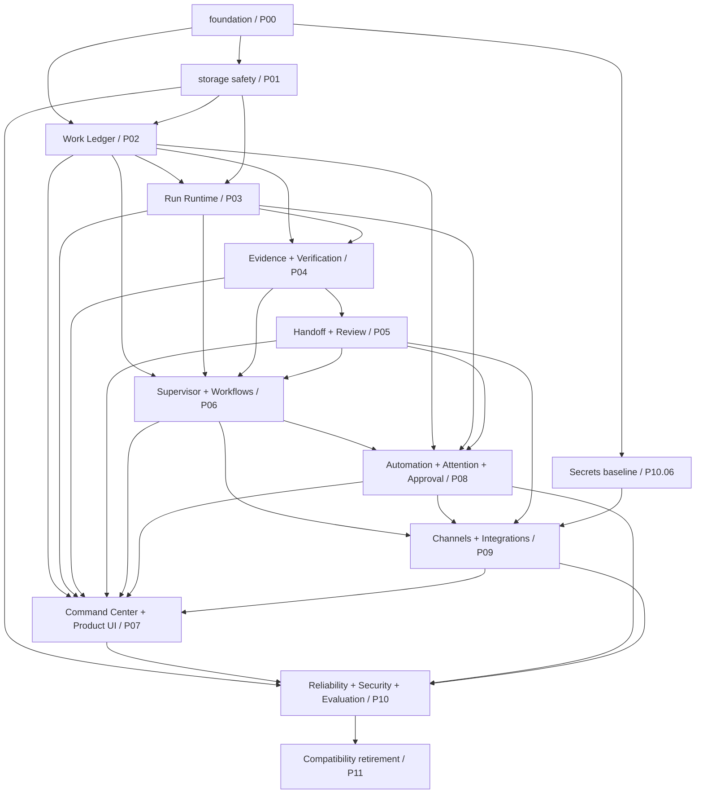
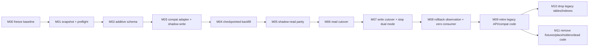

# ADR-XW-0006：目标架构依赖图与分阶段迁移门禁

- 状态：Accepted
- 日期：2026-07-16
- 依赖：[ADR-XW-0004](../xuanwu/0004-core-domain-objects.md)、[ADR-XW-0005](../xuanwu/0005-capability-disposition-inventory.md)
- 决策范围：XW P00–P11 依赖 DAG、迁移阶段门禁、兼容窗口、回滚点、数据迁移顺序与删除授权
- canonical 级别：本文件是玄武全局迁移顺序和门禁语义的 source of truth；[`plan.json`](plan.json) 是同一合同的机器可读清单

## 1. 当前证据与要解决的问题

现有合同已经固定领域对象和现状清单，但迁移规则仍散落在各 issue：

- ADR-XW-0004 已规定 Issue、`issue_runs`、分布式 Evidence、现有 Attention/Automation carrier 在各自迁移前继续 authoritative，并禁止无期限双写。
- ADR-XW-0005 已逐项清点 59 张 live 表、196 条用户 API route、页面、调度器和 PI 模块，只有 `nightly_batches`、`nightly_batch_items` 被列为未来 delete；当前不能删除。
- `backend-ts/src/db/migrations.ts` 只执行 forward migration 和已知 schema repair，没有通用 down migration。任何早期 schema 变更都必须先用数据库副本、备份和显式 rollback runbook 证明可恢复，不能等到 P10 再补证据。
- 115 个 XW issue 的描述各自声明了硬依赖，但此前没有一个可执行清单统一检查引用完整性和环路，也没有把双读/双写期限、切主点和 P11 删除门禁串成一条状态机。

因此，本 ADR 不新增表、路由或第二套状态机；它把既有 Issue/Session/Guardian/PI 能力迁入单一 Work → Run → Evidence → Handoff 事实链所需的顺序和 stop condition 固定下来。

## 2. 全局不变量

1. **禁止双主。** G4 写切换前，声明的 legacy path 是唯一状态 authority；target 只能是可重建 shadow/projection。G4 后 target 是唯一 authority，legacy API 只能翻译到同一个 domain command。
2. **双模式最多两个正式 release window。** W1 用于 backfill/shadow，W2 用于读切换和受审计的写切换；W2 结束时必须停止 dual-read/dual-write。延期必须新建 superseding ADR，给出证据、负责人和明确退出日期。
3. **失败回旧路径，不造第三条路径。** 任一 parity、重启、恢复或 Golden Journey 门禁失败，都保持或恢复 legacy authority，记录 blocker，停止后续 gate。
4. **写操作必须可审计。** 状态变更、外部写、cutover、rollback 和 destructive 操作必须记录 actor、reason、target、correlation ID、gate decision、outcome 和 timestamp。
5. **LLM 只可提议。** 模型输出不能批准迁移、选择冲突数据、绕过 Permission/Approval、执行 destructive command 或把 gate 标为 passed。
6. **P11 前不得提前删除。** legacy route/table/index/fixture/compat branch 必须同时满足 G7 和自己的 P11 硬依赖才能删除。

## 3. 目标架构依赖图

下面是 capability completion DAG。它表达“整个能力面完成”所需的上游，不替代 issue 级调度；P07/P08/P09/P10 有交叉依赖时，以 `plan.json.roadmap_nodes[*].depends_on` 为唯一精确边。



### 3.1 精确 issue DAG 合同

- `plan.json` 固定 P00.01–P11.10 共 **115** 个节点、Runner issue #631–#745 和每个 issue 描述中的显式硬依赖。
- 唯一无依赖根节点是 `P00.01`；每个其他节点必须可追溯到它。
- 只把 issue 描述 `## 依赖` 中的 `XW Pxx.yy` 视为 edge；priority、当前 status 或“同阶段看起来应该先做”都不能替代硬依赖。
- 新增、删除或改写路线 issue 时，必须在同一 scoped change 中更新 `plan.json` 并运行 DAG test。若需要跨过未完成依赖，应先修改依赖合同并评审，不能复制实现绕过。
- `architecture_lanes` 用于完成度沟通；enqueue、执行和 blocker 判断始终使用 issue 级 DAG。

## 4. 分阶段迁移门禁

迁移 gate 是严格单向 DAG `G0 → G1 → … → G7`。完成某个 backlog issue 不自动等于 gate passed；必须留下对应 Evidence。

| Gate | 阶段 | 允许动作 | 完成门禁 | 回滚点 |
| --- | --- | --- | --- | --- |
| G0 | 合同基线 | 文档、validator、inventory | DAG 无环；每个 stream 有 authority、窗口、rollback、delete gate | 仅回滚 scoped plan 文件，无运行数据变化 |
| G1 | 增量结构就绪 | additive table/column/index | 空库和升级副本通过；重复运行幂等；legacy 读写不变 | 停止 rollout，旧 binary 继续读取 legacy；新增结构保持 dormant |
| G2 | Backfill 与 shadow | dry-run、checkpoint backfill、shadow write/read | 中断恢复、数量/状态/关系/cursor parity、shadow failure isolation 通过 | 关 shadow flag，仅按 batch ID 清理 derived target，再从 legacy 重建 |
| G3 | 读切换 | target primary read、legacy comparison/fallback | W1 完整 release parity；W2 API/UI/Golden Journey parity 通过 | deterministic flag 恢复 legacy read |
| G4 | 写切换 | target sole write；legacy endpoint 翻译到 target command | 非 LLM 审批；所有 writer 收敛；重启/重试幂等；W2 结束前关闭全部 dual mode | 在产生不可逆 target-only 数据前停 target write，恢复 legacy，并按审计 delta 回放 |
| G5 | 领域完成 | target-only 正常运行 | 受影响 Golden Journey 成功/失败分支、restart/recovery、drift observability 通过 | 部署最后一个 compatibility build，按 stream runbook 回滚 |
| G6 | 兼容退出候选 | legacy adapter dormant；开始删除候选审计 | W3 无 dual mode；一个正式 release 零消费者；文档/fixture/test 已切换；保留前一 release artifact | 重部署 compatibility build；只用演练过的工具恢复归档 |
| G7 | Destructive 授权 | 删除 route/code/table/index | item-specific P11 依赖、fresh backup/archive checksum、隔离 restore、精确非 LLM 审批全部通过 | code/route 用 retained artifact；数据只从 fresh backup/archive 恢复 |

任何 gate 的 Evidence 不完整或失败时，必须停在当前 gate 并将下游 issue 标为 blocked/failed；不允许以“先做 UI”“先复制一张表”“先让模型决定”为旁路。

## 5. 兼容窗口

一个“正式 release window”是：同一 deployed binary/API/schema revision 在正常项目负载下运行的一段有起止时间的观察期，并保存 revision、parity report、consumer inventory 和 fallback 使用记录。仅跑 unit test 不算 release window。

| Window | authority | read | write | 目标 |
| --- | --- | --- | --- | --- |
| W0 | legacy | legacy only | legacy only | baseline、inventory、additive schema |
| W1 | legacy | legacy primary + target shadow comparison | legacy primary；target 只可 idempotent shadow | backfill、catch-up、parity；最多一个 release |
| W2 | G4 前 legacy，G4 后 target | target primary + deterministic legacy comparison/fallback | cutover flag 选择唯一 writer，禁止两个 writer 都 authoritative | 先切读再切写；W2 结束关闭全部 dual mode |
| W3 | target | target only | target only；legacy API 只翻译到 target command | 无双模式的 rollback observation 和 consumer-zero 证明 |

双读/双写兼容期是 W1+W2，最多两个连续正式 release。W3 可以保留 translation-only API adapter，但不得继续读取或写入 legacy storage，因此不属于 dual data path。

## 6. 各迁移流的 source of truth

| Stream | G4 前 source of truth | G4 后 authority | 双读/双写上限 | 最终删除门禁 |
| --- | --- | --- | --- | --- |
| Work | `issues`、`issue_events`、当前 Issue API/state service | P02 定义的 `works/work_relations/work_events` 与 Work domain service | 2 / 1 release | P11.05/P11.09 + Issue consumer zero + backup/restore + G7 |
| Run | `issue_runs`；`agent_sessions`/provider session 只作 observation | `issue_runs` + P03 统一 Run/Attempt relation/lifecycle | 1 / 0 | P11.05 只退役 Sessions 入口；无新 ADR 不删除 `issue_runs` |
| Evidence/Handoff | issue/provider/action events、Git、command output、当前 verification payload | P04/P05 structured records；Git/外部 provider 仍是 artifact authority | 2 / 1 | P11.03/P11.06 + provenance/audit consumer 全映射 + G7 |
| Attention/Approval | Attention Inbox、Guardian alert、Approval request、Project hold、通知 carrier 各自 authority | P08 unified Attention；Proposal/Approval 仍是确定性权限 authority | 2 / 1 | P11.02/P11.03 + unresolved item 和 permission audit 零漂移 + G7 |
| Automation | `pi_automations` 加 legacy cron/delegation/heartbeat/watch 各自 ID/cursor | P08 unified definition/claim/run，每个 trigger/cursor 只有一个 owner | 2 / 1 | P11.04/P11.09 + 无 active claim/watch + cursor/restart parity + G7 |
| API/UI compatibility | 当前 Issue/Session/PI route 与页面 | target domain API/projection；legacy route 仅 translation adapter | 2 / 0 | P11.05 + 一个 release 零消费者 + contract snapshot + retained artifact + G7 |

如果下游领域合同选择了不同 target storage，必须用 superseding migration ADR 更新该行和 `plan.json`，并重新证明 DAG、mapping 和 rollback；不能静默改变 source of truth。

## 7. 数据迁移顺序

`plan.json.data_migration_steps` 是可执行检查清单，步骤 DAG 为：



关键次序不可交换：

1. 先冻结 authority、ID/state mapping 和引用 inventory。
2. 对与实际 source revision 一致的 DB 做 online backup、schema/row fingerprint 和隔离 restore。
3. 只做 additive migration；旧 binary 不兼容时必须在写入前 fail closed，而不是边运行边猜版本。
4. compatibility adapter 先收敛 command，再允许 target shadow write；shadow 失败不得改变 legacy result。
5. backfill 必须 dry-run、batch、checkpoint、可中断恢复，所有写入带 stable mapping 和 idempotency key。
6. 完成 W1 shadow-read parity 后才可 G3 读切换。
7. 完成 W2 read parity、writer inventory 和精确审批后才可 G4 写切换；W2 结束必须停旧写和全部 dual mode。
8. W3 target-only 运行并完成 restart/Golden Journey/consumer-zero 观察；adapter 存在不等于允许旧 storage 继续读写。
9. 先退役 route/compat consumer，再 drop schema；table drop 后不能靠应用 fallback 回滚。
10. fixture/placeholder/dead code 只有在 live reference 为零且 previous artifact 可重部署时删除。

### 7.1 destructive step 的备份和回滚前置条件

| Step | 必须先有的 backup | 必须先演练的 rollback | 审计授权 |
| --- | --- | --- | --- |
| M09 删除 legacy API/compat code | previous release binary/install artifact；API contract/route inventory；source commit | previous release 能对 unchanged target authority 重部署；保留兼容 config snapshot | 非 LLM actor 精确列出 routes/modules 和 zero-consumer Evidence |
| M10 drop table/index | fresh SQLite online backup + SHA-256；schema/rows/checksum archive；parent-child mapping | 停 writer 后的完整 restore 命令和 target path；隔离 restore 已通过；说明新写后的 rollback limit | 非 LLM actor 精确列出 table/index、原因、backup/archive hash、maintenance window |
| M11 删除 fixture/placeholder/dead code | previous release artifact/source commit；production config snapshot | previous release 与 target authority 兼容；证明 live record 不依赖删除的 fixture data | 非 LLM actor 精确列出 modules/paths 和 live zero-reference Evidence |

缺少任一 backup、rollback rehearsal 或 audit approval 时，destructive command 必须 fail closed。模型生成的 SQL、文件列表或“可以删除”文本不构成授权。

## 8. DB migration policy

1. schema migration ID 必须单调唯一；同一 ID 的语义不能在部署后重写。
2. G1–G6 只允许 additive changes 或可重建 projection 清理；rename/drop/不可逆 rewrite 归 G7。
3. 每个 migration issue 至少验证：empty DB、当前 release upgrade DB、正式库副本、幂等 rerun、关键 query plan、previous/current binary compatibility 或明确 version gate。
4. 正式 cutover 前创建 fresh backup，不能复用 W1 初始快照；backup 必须绑定 source DB fingerprint、schema_migrations、revision 和时间。
5. backfill 不得混入 schema transaction；使用 stable order、batch checkpoint、idempotency key 和 audit row/event，允许安全中断。
6. parity 至少覆盖 count、ID mapping、status、owner/relation、attempt uniqueness、revision、cursor/watermark、unresolved approval/attention、restart recovery。
7. drop 只能在 P11 独立 migration 中执行；archive/restore 与 migration report 必须保留到用户明确的保留期结束。

## 9. API compatibility policy

- G0–G5 保持现有 `/api/issues`、`/api/sessions` 和适用 `/api/pi` route 的 status 与 required-field 语义；新增字段必须 optional，client 必须容忍未知字段。
- compatibility endpoint 和 target endpoint 必须调用同一个确定性 domain command；禁止“旧 route 写旧表、新 route 写新表”。
- 新旧 read response 的 mapping、排序、pagination/cursor、错误码和权限结果必须进入 shadow parity；LLM narrative 字段不参与决定性 parity。
- deprecation 最早从 G5 开始，必须提供替代 route、client migration、consumer telemetry 和明确 removal gate。
- removal 只能在 G7 和对应 P11 issue 中发生，并需要一个正式 release 的零生产 consumer、contract snapshot、previous binary 和 smoke/E2E Evidence。
- schema/status version 不兼容时必须返回可操作错误并 fail closed；不能 silently coerce 或让 LLM 选择映射。

## 10. 回滚模型

回滚分三层，必须在进入下一 gate 前演练当前层：

1. **Feature rollback（G1–G3）**：关闭 shadow/target read flag，继续 legacy authority；target 只作为可清理、可重建 projection。
2. **Authority rollback（G4–G6）**：仅在已定义 inverse mapping、cutover delta checkpoint 和重放顺序时允许。先停 target writer，再恢复 legacy flag并回放 delta，最后重建 target；严禁两个 writer 同时恢复。
3. **Artifact/data restore（G7）**：route/code 用 retained previous release 回滚；drop 后数据只能从 fresh backup/archive 恢复。恢复期间停止 writer，恢复后重新跑 integrity、parity 和受影响 Golden Journey。

任一回滚发生后，release window 计数清零，返回最近一个已通过 gate；必须记录触发原因和新 blocker，不能原地继续计时。

## 11. 下游 issue 的执行协议

每个改变 storage/API/state ownership 的 issue 在实现前必须从本计划复制并具体化以下字段：

- `stream`、current authority、target authority、字段/状态/ID/cursor mapping；
- 当前 `G*`/`W*`、本 issue 允许进入但不得越过的下一个 gate；
- dual-read/dual-write 的 feature flag、起止 release、parity oracle 和 mismatch 行为；
- backup path kind、source fingerprint、rollback command/runbook、cutover delta；
- deterministic actor/approval/audit event；
- final P11 owner 和 zero-consumer/delete Evidence。

硬依赖未完成、无法在副本上证明、需要改写公共 contract 但无 migration ADR，或同一失败重复出现时，停止并回写可复现 blocker。不要通过新增临时表、临时 route 或模型 prompt 扩大范围。

## 12. 验证

```bash
cd backend-ts
bun test src/xuanwu/migrationPlan.test.ts
bunx tsc --ignoreConfig --noEmit --target ES2022 --module ESNext \
  --moduleResolution Bundler --allowImportingTsExtensions --strict \
  --skipLibCheck --lib ES2022 --types bun \
  src/xuanwu/migrationPlan.test.ts
```

定向测试必须证明：

- 115 个 roadmap node、architecture lane、G0–G7 和 M00–M11 的引用都存在且 DAG 无环；
- P00.01 是唯一 roadmap root，所有节点可达；
- 每个 migration stream 明确 old/new authority、cutover、rollback、delete gate，双读/双写均不超过两个 release；
- 每个 destructive step 都有非空 backup、rollback rehearsal 和 non-LLM audit precondition；
- canonical 文档包含 source of truth、兼容窗口、数据顺序、API policy 和禁止提前删除规则。
