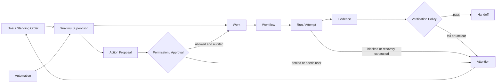

# ADR-XW-0001：玄武产品定位、用户承诺与非目标

- 状态：Accepted
- 日期：2026-07-15
- 决策范围：产品类别、目标用户、用户承诺、参照边界、非目标和迁移原则
- canonical 级别：本文件是玄武产品定位的 source of truth

## 1. 背景

当前仓库同时保留了三套历史心智：Runner 后台、PI 项目经理/私人助理，以及玄武品牌。如果继续分别扩展，Issue、Session、Guardian、PI 和后续 Work/Run 等对象会形成没有迁移路径的平行实现，用户也无法判断产品究竟承诺完成什么。

本 ADR 只冻结产品合同，不改公开 API、数据库 schema、状态机或 provider adapter。现有运行时继续工作，后续 issue 按本 ADR 逐步迁移。

## 2. 决策

### 2.1 产品类别

玄武是 **本地优先、验证优先的 AI Engineering Control Plane**。

- **本地优先**：项目代码、运行状态、权限策略和审计记录默认由用户控制的本地环境保存和执行；远程 channel 可以提交请求或接收回执，但不取代本地控制面。
- **验证优先**：LLM 的完成声明不等于完成。`done` 必须由确定性的 Verification Policy 检查与任务相称的 Evidence 后才能成立。
- **Engineering Control Plane**：玄武编排工程工作、Coding Agent、运行、恢复、验证和交付；它不替代代码仓库、IDE、CI、模型或 agent provider。

### 2.2 核心用户

主要用户是需要同时维护一个或多个代码仓库、把数十分钟到数小时的工程工作交给 Coding Agents，并且仍对范围、权限、验证和最终交付负责的个人工程师与小型工程团队。

这类用户需要的不是另一个聊天窗口，而是：离开终端后工作仍可追踪；失败后能够恢复或明确升级；回来时能看到证据、改动和可继续操作的交付物。

### 2.3 用户承诺

> 玄武把用户的工程目标变成可追踪 Work，交给受控 Coding Agents 执行，持续监督和恢复 Run，以 Evidence 决定是否完成，并交付可审查的 Handoff；无法安全完成时，明确进入 Attention，而不是静默失败或虚假报喜。

该承诺受以下不变量约束：

1. 每次状态变更、外部写操作和 destructive 操作都有 actor、原因、目标、结果和时间等可审计记录。
2. 项目、工作目录、provider、权限和 approval 由确定性配置与策略决定；LLM 只能提出意图或 proposal，不能绕过 gate。
3. 一个工程事实只允许有一条声明过的 authoritative path；迁移期间的兼容读写必须有期限、回滚和删除门禁。
4. 优先复用现有 Issue、Session、Guardian、PI、Runner 能力；除非迁移 ADR 明确说明，不建立第二套平行状态机。

### 2.4 六个核心工作

| 核心工作 | 用户起点 | 玄武必须完成的闭环 |
| --- | --- | --- |
| 一句话交付 | 用户描述一个工程目标 | 澄清范围并建立 Work，选择受控 Workflow/Run，收集 Evidence，产出可审查 Handoff；信息不足时进入 Attention |
| 失败恢复 | Run 遇到进程退出、provider 断连、重启或验证失败 | 保存事实与恢复预算，执行幂等 retry/resume/recovery；不能安全恢复时给出原因和下一步，不把失败伪装成完成 |
| 跨项目批量 | 用户提交多个项目或多项工作 | 按明确 project/cwd/priority 隔离 Work 和 Run，控制并发与依赖，分别验证和交付；不让 LLM 猜测项目归属或权限 |
| 远程控制 | 用户从已授权 channel 查询、下达或审批工程工作 | 认证、去重、关联本地 Work，所有写操作经过 Permission/Approval 和审计；本地控制面仍是运行状态 source of truth |
| 常驻巡检 | 用户配置 Automation、Standing Order 或 Heartbeat | 增量观察运行、失败和待处理事项，在授权范围内推进；需要人时进入 Attention，正常时避免无意义打扰 |
| 发布交付 | 用户要求形成 commit、branch、PR、release 或外部 tracker 回写 | 汇总 changed files、revision 和验证证据，经过远程写/破坏性操作 gate 后生成 Handoff，并保留 reviewer 修改回路 |

后续 Golden Journey 可以细化前置状态、失败分支和自动化夹具，但不得改变这六类工作；改变类别必须按第 7 节 supersede 本 ADR。

### 2.5 产品事实链

这张图描述产品职责，不预先冻结数据库关系。核心对象的 ID、生命周期和所有权由后续领域合同定义。

## 3. 当前对象与目标术语的映射

本 ADR 使用的每个术语都必须能映射到当前能力或已排期的目标对象：

| 目标术语 | 当前可复用能力 | 规划归宿 |
| --- | --- | --- |
| Xuanwu Supervisor | PI conversation/runtime、PI action gate、Issue supervisor 与 Guardian decision | P06 Supervisor 与 Workflow，不新建另一套 manager runtime |
| Goal / Commitment | issue description、PI conversation 与 project context 中的用户目标 | P06 Goal、Commitment 与会话连续性 |
| Work | `issues`、issue events/comments、project queue 与 workflow snapshot | P02 Work Ledger；Issue 在兼容期作为 Work 的 authoritative carrier |
| Workflow | `workflow_snapshot_json`、executor/verifier/reviewer 角色流程与 Agent Execution Contract | P06 Workflow Manifest/Registry 与标准 Workflows |
| Run / Attempt | `issue_runs`、agent/provider session refs、Sessions 运行视图 | P03 统一 Run/Attempt；provider session 继续作为 drill-down，不与 Run 并列争夺所有权 |
| Evidence | issue events/log、命令与测试输出、verifier report、Git revision 事实 | P04 结构化 Evidence 与 Verification Policy |
| Verification Policy | `pending_verification`、verifier report 与显式 issue 最终状态回写 | P04 可执行 policy 与 `done` 门禁 |
| Handoff | 当前 Git working tree/branch/commit 与 issue 完成摘要 | P05 结构化 Handoff、review 与可选远程交付 |
| Attention | Attention Inbox、Guardian alert/needs-user、pending approval/verification | P08 统一 Attention/Approval；不再增加新的告警夹层 |
| Action Proposal / Permission / Approval | `pi_action_proposals`、PI action gate/audit、Guardian decision 与 approval API | P06/P08 统一受控工具动作、权限矩阵和 Approval |
| Automation / Standing Order | project loop、cron、PI automation、heartbeat、watch | P08 统一 Automation/Standing Order；旧调度器按迁移门禁收敛 |
| Runner | Bun API、SQLite、provider adapter、scheduler、CLI 与 Agent Execution Contract | 保留为玄武的执行和兼容基础设施，不再作为独立产品心智扩展 |

相关现状和工程边界见：

- [PI Agent 独立架构计划](../pi-agent-architecture-plan.md)
- [PI Assistant Runtime Roadmap](../2026-07-06-pi-assistant-runtime-roadmap.md)
- [Loop L3 架构快照](../2026-06-30-loop-l3-architecture-snapshot.md)
- [Agent Execution Contract](../../agent-execution-contract.md)

这些文档仍可解释当前实现或保留历史设计证据；若它们在产品定位、核心用户或非目标上与本 ADR 冲突，以本 ADR 为准。

## 4. OpenClaw / Helm 参照边界

| 参照 | 可以借鉴 | 明确边界 |
| --- | --- | --- |
| OpenClaw | 多 channel 请求入口、通知回执、gateway adapter 和用户可控的接入体验 | 仅可作为玄武外层的可选 gateway/connector；不复制其通用私人助理定位、memory/runtime 或 channel 生态，不让 OpenClaw 成为 Work/Run 的 source of truth |
| Helm | daemon/server 生命周期、稳定常驻、session/provider 接入和本地 runtime 管理体验 | 仅借鉴运行基础设施；玄武不定位成通用 agent runtime、多 daemon 平台或插件市场，差异化事实链必须落在 Work → Run → Evidence → Handoff |

对参照产品增加 adapter 时，必须服从玄武的身份、权限、审计和 Evidence 门禁；不得把两套 runtime 合并成互相双写但无人负责的状态。

## 5. 非目标

玄武明确不做以下通用私人助理范围：

- 面向日常生活的聊天陪伴、知识问答、日历/邮件代管、购物、旅行或家庭事务管家。
- 以“记住用户的一切”为价值的通用个人 memory 系统；memory 只服务有来源、可查看、可删除的工程上下文。
- 默认接管整台电脑、任意 shell、社交账号或外部消息回复；外部动作必须是工程工作所需且经过确定性权限门禁。
- 以多 channel 覆盖面、agent 数量、模型数量、插件市场或云端协作为核心卖点。
- 取代 Git、CI、IDE、issue tracker、Coding Agent 或 provider runtime。
- 为每种 connector、provider 或业务来源复制一套 Issue/Work、Session/Run、Approval 或 Automation 状态机。
- 以品牌调整为由复制 API/DB authority 或绕过独立迁移门禁。

邮件、IM、浏览器、MCP、CLI 等能力只有在它们能捕获工程目标、补充工程上下文、执行受控工程动作或交付工程结果时才进入产品范围。

## 6. Source of truth、兼容与迁移

### 6.1 当前 source of truth

- **产品定位**：本 ADR。
- **运行状态**：在对应迁移开始前，现有 SQLite 数据、Bun API 和 Runner 状态机仍是唯一运行时 source of truth。
- **运行时标识**：CLI、Skill、环境变量、服务和默认数据目录使用 Xuanwu；Issue、Session 与 `pi_*` 仍是领域和持久化标识。

本 ADR 不引入双写、双读或数据迁移。目标术语不能被实现方当作已经存在的新表或新 API。

### 6.2 后续迁移的强制合同

任何让新旧模型并存的实现，合并前必须在对应 ADR 或 migration plan 中写明：

1. old/new 两侧哪一侧是每个字段和状态转移的 source of truth；禁止双主。
2. 双写和双读的准确启用、parity audit、切主与停止里程碑；默认兼容窗不得超过两个正式 release，延期必须用新 ADR 说明证据和退出日期。
3. 回滚开关与步骤：停止新路径写入，恢复旧路径读取，并能从 authoritative event/state 重建 projection。
4. 一致性检查：ID mapping、状态映射、计数/parity、重启恢复和至少一条 clean-baseline Golden Journey。
5. 最终删除门禁：无 active consumer、备份/恢复演练通过、回滚观察窗结束、相关文档和测试已切换，才允许在 P11 删除旧表、路由、fixture 或兼容代码。

迁移验证失败时保持旧路径 authoritative，记录 blocker，不得复制第三条临时路径绕过。

## 7. 决策变更流程

改变产品类别、核心用户、六个核心工作、OpenClaw/Helm 边界或通用私人助理非目标时，必须：

1. 新增一份 `ADR-XW-*`，声明 `Supersedes ADR-XW-0001`，不能只改 prompt、导航、品牌文案或 roadmap。
2. 提供至少一条 Golden Journey 的用户证据、当前 live runtime 证据，以及对权限、审计、数据和迁移的影响分析。
3. 明确是否改变公开 contract/schema/shared state machine；若改变，单独列出 rollout、兼容、回滚和删除门禁。
4. 在 scoped review 通过后同时更新 README 产品开场和 canonical 文档引用。

## 8. 结果

接受本 ADR 后：

- 玄武路线优先建设工程 Work 的监督、验证、恢复与交付，不再以补齐通用私人助理功能为成功标准。
- PI、Guardian、Runner 和现有 Inbox/Automation 能力成为可迁移的实现资产，而不是并列产品。
- 未来功能若不能服务六个核心工作，默认不进入玄武 core；若需要进入，必须先变更本 ADR。
- 代价是旧文档和 UI 名称会在一段时间内继续存在；它们由后续术语、迁移和删除 issue 收敛，当前不做无证据的批量改名或 destructive cleanup。
