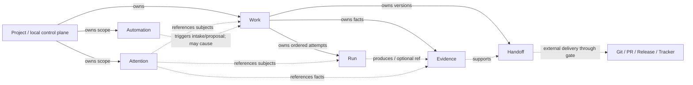

# ADR-XW-0004：Work、Run、Evidence、Handoff、Attention、Automation 核心对象合同

- 状态：Accepted
- 日期：2026-07-15
- 依赖：[ADR-XW-0001](0001-product-positioning.md)、[ADR-XW-0003](0003-golden-journey-contracts.md)
- 可执行合同：`backend-ts/src/xuanwu/coreDomainContracts.ts`
- 决策范围：六个核心对象的职责、ID、关系、生命周期、事件命名和现有表映射
- canonical 级别：本文件与可执行合同共同构成玄武核心领域语义的 source of truth

## 1. 决策边界

本 ADR 冻结完整玄武产品路线的领域合同，但**不**宣称六个新持久化模型已经上线。本期不新增表、公开 API、共享运行时状态机、provider adapter、双写或双读：

- `issues`、`issue_runs`、`agent_sessions`、`issue_events` 和现有 `pi_*` 表仍是运行时事实的 authoritative path。
- TypeScript contract 是供后续 repository、projection、fixture 和迁移使用的内部领域合同，不是第二套运行时 ledger。
- 目标 ID 是稳定 projection ID；它由现有 authoritative record 确定性生成，不写回旧表，也不取代旧主键。
- 当前路径缺少独立实体时，明确使用 derived projection 或兼容 carrier；不得为了满足目标名称临时复制一张新表。

## 2. 六个核心对象

| 对象 | 唯一职责 | 必须持有 | 明确不负责 |
| --- | --- | --- | --- |
| **Work** | 表示一个有目标、范围、验收条件和工程终态的工作单元 | project owner、goal、acceptance、workflow snapshot/ref、状态 | provider session 细节、命令输出、远程交付副作用 |
| **Run** | 表示 Work 的一次有序执行 Attempt；保存 provider/runtime 和恢复连续性 | Work owner、attempt、provider、运行状态、session ref | 决定 Work `done`、拥有 Work、充当聊天 Session 的别名 |
| **Evidence** | 保存可重读、可判定的工程事实；Verification Policy 只消费 Evidence | Work owner、可选 Run ref、producer、结论、artifact refs、revision | 用模型总结替代事实、执行权限判断、反向拥有 Run/Work |
| **Handoff** | 将已验证的 Work 组装成可审查交付版本，并记录外部交付结果 | Work owner、changed files、revision、Evidence refs、review ref、delivery facts | 自行把 Work 设为 `done`、绕过 push/deploy/tracker gate、成为 Git source of truth |
| **Attention** | 表示需要人或确定性后续动作处理的未闭环事项 | scope owner、可选 core subjects/related refs、reason、required actor、next action、Evidence refs | 成为新的 Issue 状态、拥有 Work、把所有通知都升级成 Attention |
| **Automation** | 定义可重复触发的 Standing Order；在权限范围内观察、提议或执行 | scope owner、trigger、mode、permission policy、idempotency namespace | 直接拥有或改写 Work、绕过 Action Proposal/Approval、把一次 heartbeat 当作定义本身 |

关键区别：

1. Work 是工程目标的 ledger；Run 是一次执行。一个 Work 可以有多个按 `attempt` 排序的 Run，一个 Run 只属于一个 Work。
2. provider Session 是 Run 的 drill-down/reference，不与 Run 并列争夺所有权。同一 Session 可以被恢复观察，但不能反向定义 Work 终态。
3. Evidence 是事实；Verification Policy 是判定规则。`passed` Evidence 是 `done` 的必要条件，但必须同时存在可审查 Handoff。
4. Handoff 是版本化 projection。Git tree/revision、外部 provider response 和审计记录仍各自 authoritative。
5. Attention 和 Automation 以 project 或 local control plane 为 scope owner。Attention 可引用 Work/Run 等 core subject 和 proposal/approval 等 related ref，但不拥有它们；scope-level runtime alert 可以没有 core subject。

## 3. 对象关系与所有权



### 3.1 所有权不变量

- 根对象：Work、Attention、Automation。它们由 project scope 或 local control-plane scope 拥有。
- 子对象：Run、Evidence、Handoff 各自有且只有一个 Work owner。
- Evidence 可引用一个 Run，但 `work_id` 才是所有权；其 Run 必须属于同一 Work。
- Attention 的 `subject_refs`/`related_refs` 和 Automation 导致的 Work 是关联/因果，不是所有权。
- Handoff 可以引用 Evidence，Evidence 不引用 Handoff；旧 Handoff 用 `supersedes_id` 单向版本化。
- 核心对象不得通过 owner 字段形成反向边。可执行门禁 `assertAcyclicOwnership()` 必须持续通过。

`CORE_OWNERSHIP_PARENT` 的核心图固定为：

```text
run      -> work
evidence -> work
handoff  -> work
work / attention / automation -> non-core scope root
```

## 4. ID 合同

### 4.1 格式

所有领域 projection ID 使用：

```text
xw:<kind>:<authority>:<RFC3986-encoded-local-id>
```

- `kind` 只能是 `work | run | evidence | handoff | attention | automation`。
- `authority` 标识当前 authoritative carrier，而不是实现模块名称的自由文本。
- `local-id` 必须非空；数值主键按十进制表示，文本主键按 RFC3986 percent encoding。
- projection ID 只由 immutable authority + local key 生成，显示名称、状态、provider session 或时间不得进入 ID。

例：

```text
issues.id=634                         -> xw:work:issues:634
issue_runs.id=issue-634-attempt-1     -> xw:run:issue_runs:issue-634-attempt-1
issue_events.id=9001                  -> xw:evidence:issue_events:9001
pi_guardian_alerts.id=alert:7         -> xw:attention:pi_guardian_alerts:alert%3A7
pi_automations.id=12                  -> xw:automation:pi_automations:12
Work 634 at revision abc123 handoff   -> xw:handoff:derived:634%40abc123
```

### 4.2 authority allowlist

| kind | 当前允许 authority | 说明 |
| --- | --- | --- |
| Work | `issues` | `issues.id` 是当前唯一 Work identity carrier |
| Run | `issue_runs` | `agent_sessions` 仅作 session ref，不生成第二个 Run ID |
| Evidence | `issue_events`、`pi_action_events`、`issue_supervisor_events`、`git` | 事实按原始 authority 保持可追溯；bundle 不吞并原始 ID |
| Handoff | `derived` | 由 Work、Git、Evidence 和 delivery audit 组装；当前无独立表 |
| Attention | `attention_inbox_items`、`pi_guardian_alerts`、`pi_approval_requests`、`pi_actions`、`issues` | P11.03 将 active internal Action 映射为 Attention；各 carrier 保持自己的 authority |
| Automation | target `automation_definitions/runs/events`；legacy `pi_automations`、`cron_tasks`、`pi_delegations` | definition 与 heartbeat/run 分离；见 8.6 |

ID 冲突以 authority 隔离。迁移时不得重新编号历史对象；新表若成为 authority，必须保留 old ID mapping 和 parity audit。

## 5. 状态与生命周期

状态数组和允许转移由 `coreDomainContracts.ts` 固定；运行时接入前仍以当前状态机为准。

### 5.1 Work

```text
triage -> todo -> in_progress -> pending_verification -> done
   |       |           |                  |
   |       +-> triage  +-> todo           +-> triage | in_progress
   +-----------------------------------------------> cancelled
                       +-> failed -> triage | todo | cancelled
```

- `triage`：已捕获但尚未满足执行前提。
- `todo`：已获准进入队列，尚未有活动 Run。
- `in_progress`：必须有活动或可恢复 Run。
- `pending_verification`：产物已存在，但 Evidence/Handoff 完成门禁未通过。
- `done`：终态；至少一条 passed Evidence 和一个 `ready|delivered` Handoff。
- `failed`：当前执行无法继续，保留原因；显式 retry/retriage 才能离开。
- `cancelled`：终态；保留 actor、reason 和取消前事实。

`done`/`cancelled` 不原地 reopen；新需求创建新 Work，并用来源/causation 关联历史 Work。

### 5.2 Run

```text
created -> running -> succeeded
   |          |  \-> failed
   |          |  \-> cancelled
   |          \-> recovering -> running | succeeded | failed | cancelled
   \-> cancelled
```

- `created`：Attempt identity 已分配，尚未产生 provider side effect。
- `running`：provider/runtime 正在执行或有未结束 turn。
- `recovering`：原 Attempt 正在受预算和幂等策略约束地恢复；不得伪造新 Work。
- `succeeded`：本次执行产出候选结果；不等于 Work `done`。
- `failed`、`cancelled`：Run 终态；后续 retry 创建新的 ordered attempt，除非已证明是同一 side effect 的幂等 resume。

### 5.3 Evidence

```text
pending -> passed | failed | blocked
```

终态 Evidence 不覆写。纠错创建新 Evidence 并用 `supersedes_id` 指向旧记录；历史事实继续可读。

### 5.4 Handoff

```text
draft -> ready -> delivered
   \        \        \
    +-------> superseded
```

- `ready` 之前必须引用同一 Work 的 passed Evidence。
- `delivered` 只表示获准 delivery actions 已记录结果，不隐含所有可选外部动作都成功。
- reviewer changes 或 revision 变化创建新 Handoff version；旧版本进入 `superseded`。

### 5.5 Attention

```text
open -> acknowledged -> waiting -> acknowledged
  \          \             \
   +----------+-------------> resolved | dismissed
```

- `open`：需要处理但未确认责任人。
- `acknowledged`：actor 已接手或 Supervisor 已确认下一步。
- `waiting`：等待明确输入、approval、cooldown 或外部条件。
- `resolved`：所需输入/动作已满足，保留 resolution Evidence。
- `dismissed`：经 actor/policy 判定无需处理；必须有 reason。

Attention 不是 Work status。Work 可以保持 `triage`、`in_progress`、`pending_verification` 或 `failed`，同时由 Attention 解释 blocker。

### 5.6 Automation

```text
draft -> active <-> paused
  \         \        \
   +---------+---------> archived
```

- `draft`：定义未激活，不触发副作用。
- `active`：可以按 trigger 运行，但每个动作仍需 permission policy 和 idempotency gate。
- `paused`：保留 cursor/watermark，不生成新动作。
- `archived`：终态，只读保留审计。

一次 Automation tick/heartbeat 是执行事实，不是新的 Automation definition，也不复用 Run 作为其所有者。

## 6. 关系不变量与完成门禁

`validateDomainSnapshot()` 至少执行以下确定性断言：

1. 每个 ID 的 kind、authority 和对象类型一致；同 kind ID 唯一。
2. 每个 Run/Evidence/Handoff 的 Work owner 存在。
3. 同一 Work 的 Run `attempt` 是正整数且不重复。
4. Evidence 引用的 Run 与 Evidence 具有同一 Work owner。
5. Handoff 只引用同一 Work 的 Evidence；`ready|delivered` 至少有一条 passed Evidence。
6. `done` Work 至少有一条 passed Evidence 和一个 `ready|delivered` Handoff。
7. Attention 的每个 core subject 都必须存在且 subject kind 与 ID kind 一致；scope-level Attention 可以仅由 owner scope 定位，并通过 `related_refs` 指向非核心 carrier。
8. 所有权图无环。

这些断言不让 LLM 决定 pass/fail；模型可以生成摘要或 rationale，但 authoritative records、ID mapping 和 policy 结果必须由确定性代码提供。

## 7. 事件命名与审计 envelope

### 7.1 命名规则

新领域事件固定使用：

```text
<object>.<past-tense-action>.v<schema-version>
```

本版 allowlist：

| 对象 | v1 事件 |
| --- | --- |
| Work | `work.created.v1`、`work.status_changed.v1` |
| Run | `run.created.v1`、`run.status_changed.v1`、`run.recovery_requested.v1` |
| Evidence | `evidence.recorded.v1`、`evidence.superseded.v1` |
| Handoff | `handoff.prepared.v1`、`handoff.delivery_requested.v1`、`handoff.delivery_completed.v1`、`handoff.delivery_failed.v1`、`handoff.superseded.v1` |
| Attention | `attention.opened.v1`、`attention.status_changed.v1` |
| Automation | `automation.created.v1`、`automation.status_changed.v1`、`automation.triggered.v1` |

不使用 `updated` 表示决定性状态变化；before/after status 必须在 payload/effect 中明确。增加破坏兼容的 payload 字段语义时升事件版本，不静默复用旧名字。

### 7.2 必需 envelope

每个领域事件必须包含：

- `event_id`、`name`、`subject`、`occurred_at`。
- `actor.kind` + `actor.id`、非空 `reason`。
- `correlation_id`；由另一事件导致时增加 `causation_id`。
- 结构化 `payload`，不得只留模型自然语言。
- 状态变更、外部写和 destructive 操作带 `effect`：`classification`、`operation`、`target`、`gate_decision`、`outcome`，以及可用的 `before_ref`/`after_ref`。

`deny|ask` 也必须留事件，且 `outcome=not_executed`。LLM proposal 不能直接伪造 `gate_decision=allow` 或执行结果。

### 7.3 当前事件映射

| 当前事实 | 目标事件 projection | 当前 authority |
| --- | --- | --- |
| `issue.created` | `work.created.v1` | `issue_events` + `issues` row |
| `issue.status_changed` | `work.status_changed.v1` | `issue_events` + `issues.status` |
| `issue_runs` 创建/关闭 | `run.created.v1` / `run.status_changed.v1` | `issue_runs` row；当前没有独立 domain event 双写 |
| `issue.log`、`issue.verification_report`、`issue.verification_reviewed` | `evidence.recorded.v1` | `issue_events` payload + verifier/command/Git authority |
| `pi_action_events` gate/result | Handoff delivery 或 Automation action 的审计 projection | `pi_action_events` |
| Attention/Automation row 状态变化 | 对应 `*.status_changed.v1` projection | 当前各表 row；本期不补事件表 |

当前记录缺少 actor/reason/effect 字段时，projection 必须标记 `legacy_incomplete`，不能让 LLM 补猜。补齐 append-only audit 是后续迁移工作，不在本 issue 中旁路双写。

## 8. 现有 Issue、Session、Guardian、PI 映射

### 8.1 Work

| 领域字段 | 当前映射 | source of truth |
| --- | --- | --- |
| `id` | `xw:work:issues:<issues.id>` | `issues.id` |
| owner | `issues.project_id` | `projects` + `issues.project_id` |
| goal/acceptance | `title`、`description`、prompt/workflow snapshot | `issues` |
| status | 同名七态 | `issues.status` |
| history | `issue_events`、comments | append-only `issue_events` |

Issue 是兼容名称和当前 authoritative carrier，不创建 `works` 表。

### 8.2 Run 与 Session

| 领域字段 | 当前映射 | source of truth |
| --- | --- | --- |
| `id` | `xw:run:issue_runs:<issue_runs.id>` | `issue_runs.id` |
| Work owner / attempt | `issue_id` / `attempt` | `issue_runs` |
| provider/session | `provider`、`provider_session_id`、turn IDs | `issue_runs` |
| live drill-down | `agent_sessions.session_key`、status、`raw_ref` | `agent_sessions` 仅作 provider observation |
| target status | `in_progress -> running`；`pending_verification|done -> succeeded`；`failed -> failed`；`cancelled -> cancelled` | 原始值仍保留在 `issue_runs.status` |

`agent_sessions` 不能生成另一套 Run owner；同一 provider session 的 status 与 Work 冲突时，先按 live runtime → `issue_runs` → `agent_sessions` → cached UI 顺序诊断，并记录冲突 Evidence。

### 8.3 Evidence

当前没有统一 Evidence table。authoritative facts 分布在：

- `issue_events` 的 log、verification report/review、status change；
- `issue_runs` / `agent_sessions` 的 runtime result；
- `issue_supervisor_events`、`pi_recovery_attempts` 的恢复事实；
- `pi_action_events` 的 gate 与外部动作结果；
- Git working tree/revision 和由命令重新读取的测试结果。

`backend-ts/src/pi/verificationEvidence.ts` 的 V0 envelope 继续作为现有验证载荷。领域 Evidence 是其上层语义合同；本期不复制或回填数据。

### 8.4 Handoff

当前无 Handoff table。Handoff 由以下 authority 确定性组装：

1. Work goal/status 和最新适用 Run；
2. 与当前 revision/tree 匹配的 Evidence；
3. Git baseline/current revision、changed files；
4. `pi_action_events`/provider response 中已执行或未执行的 delivery facts；
5. issue 最终摘要/comment 仅作为 narrative，不作为事实主源。

因此 `derived` Handoff 可以重建和丢弃；在 P05 持久化设计完成前，不允许把派生 JSON 反向写成 Work status authority。

### 8.5 Attention

| 当前 carrier | 目标状态 projection | 边界 |
| --- | --- | --- |
| `attention_inbox_items` | `new -> open`；`triaged -> acknowledged`；`proposal_created -> waiting`；`actioned -> resolved`；`ignored -> dismissed`；`failed -> open` | intake Attention 的主 carrier |
| `pi_guardian_alerts` | `open -> open`；`acked -> acknowledged`；`resolved -> resolved`；`suppressed -> dismissed` | operational failure/needs-user |
| `pi_approval_requests` | `pending -> waiting`；非 pending 的最终 decision -> `resolved` | Permission/Approval Attention，不改变 proposal authority |
| `pi_actions` | `candidate/pending/approved/changes_requested/snoozed -> waiting/open`；终态退出 active Attention | internal Action Gate Approval；Action/event 仍是 execution/audit authority |
| `issues.error/comment` | 兼容 `issues` authority 的 Attention projection | 仅用于尚未进入统一 Inbox 的 blocker，不新建 issue status |
| `pi_action_proposals` | 仅作 Attention `related_ref`/next action | Proposal 本身不是 Attention |

不同 carrier 暂不合并主键，也不互相双写。统一 Inbox 必须在 P08 用 explicit correlation/dedupe 和 source mapping 迁移。

### 8.6 Automation

| 当前 carrier | 领域映射 | 边界 |
| --- | --- | --- |
| `automation_definitions` + `automation_runs/events` | 当前 served API/repository 的 target Automation definition/claim authority | W1 shadow 固定 `draft` 且不 claim；W2/G4 后才可 target-primary/single-writer |
| `pi_automations` | legacy Automation definition/cursor/retry authority；`enabled=1 -> active`、`enabled=0 -> paused` | G4 前 sole writer；`last_status` 是最近 tick outcome，不是 definition lifecycle |
| `cron_tasks` + `cron_task_schedules` | legacy scheduled Automation authority | 在迁移前保留自己的 ID/cursor，不复制到 `pi_automations` |
| `pi_delegations` | standing-order compatibility authority | delegation heartbeat 是触发/监督，不是 Work owner |
| `pi_heartbeat_runs/events` | Automation/standing-order 的触发与调度审计；关联 Work 后才可投影为 core Evidence | 不是 Automation definition，也不是 engineering Run |
| project loop/settings | Runner scheduler policy | 执行基础设施，不建立新的 Automation identity |

`mode` 领域投影为 `observe | propose | execute_allowed`。现有 `dry_run|draft|propose|auto` 在迁移前保持原值；其中 `auto` 也只能执行 deterministic policy 明确 allow 的动作。

## 9. 兼容、迁移、回滚和删除门禁

### 9.1 本期

- **source of truth：** 第 8 节列出的现有 SQLite/API/Git path。
- **新写：无。** TypeScript 类型、validator 和 ADR 不写数据库或外部系统。
- **双写：无。双读：无。** projection ID 和测试 fixture 只在内存中构造。
- **回滚：** 删除本 ADR、TypeScript contract 和定向测试即可；运行数据无需恢复。

### 9.2 后续持久化迁移强制门禁

若引入 `works`、统一 Evidence/Handoff/Attention/Automation storage 或新 domain event store，必须另立 migration ADR，并逐字段满足：

1. old/new 每个状态、ID、revision、cursor 的唯一 authority；禁止双主。
2. 兼容 projection → shadow write → parity audit → 切读 → 切写 → 停旧写的明确里程碑。
3. 双写/双读窗口默认不超过两个正式 release；延期需要 superseding ADR 和退出日期。
4. 回滚开关：停止新写、恢复旧读，并能由 old authoritative events/rows/Git 重建新 projection。
5. parity：ID mapping、状态映射、Run attempt 唯一性、Evidence revision、Attention dedupe、Automation cursor/watermark、重启恢复。
6. clean baseline 下至少跑通 ADR-XW-0003 一条受影响 Golden Journey，并对其失败分支做断言。
7. 删除门禁：无 active consumer、备份/恢复演练通过、观察窗结束、旧 route/table/fixture 引用归零、rollback 不再需要。

迁移验证失败时保持旧路径 authoritative，记录具体 blocker；不得复制第三条临时路径或让 LLM 选择冲突版本。

## 10. 验证合同

最小门禁：

```bash
bun test backend-ts/src/xuanwu/coreDomainContracts.test.ts
(cd backend-ts && bunx --package typescript tsc \
  -p src/xuanwu/tsconfig.contract.json)
```

测试必须证明：

- kind-specific ID 不能互相赋值，authority/local ID 可稳定 round-trip；
- 状态转移和 terminal state 不被意外放宽；
- 所有权无环，并能拒绝注入的循环；
- 跨 Work Evidence、缺失 owner、重复 attempt、无 passed Evidence 的 ready Handoff 被拒绝；
- `done` Work 同时需要 passed Evidence 与 ready/delivered Handoff；
- 状态/外部写/destructive 事件必须有 actor、reason、correlation 和 gate/outcome 审计字段。
