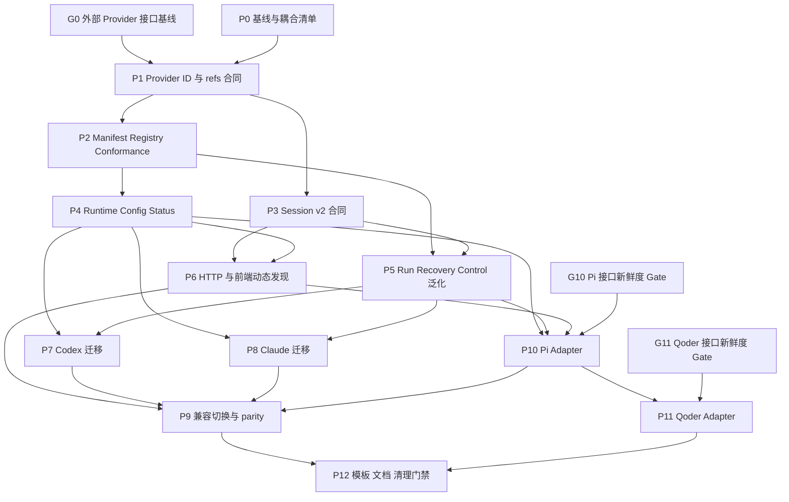

# ADR-XW-0089：Provider Core 多 Coding Agent 重构计划

- 状态：Proposed
- 日期：2026-08-04
- 目标版本：Provider Core v2
- 依赖：[ADR-XW-0004](0004-core-domain-objects.md)、[ADR-XW-0020](0020-run-attempt-lifecycle-contract.md)、[ADR-XW-0022](0022-provider-run-event-contract.md)、[ADR-XW-0023](0023-run-lifecycle-command-service.md)、[ADR-XW-0049](0049-workflow-manifest-registry.md)、[ADR-XW-0059](0059-provider-presets-connections.md)、[ADR-XW-0063](0063-approval-action-gate.md)、[ADR-XW-0069](0069-restart-recovery-invariants.md)、[ADR-XW-0070](0070-db-migration-rehearsal-gate.md)、[ADR-XW-0073](0073-secret-lifecycle-redaction.md)
- 独立评审：[0089 Provider Core 重构方案 Review](0089-provider-core-multi-code-agent-refactor-review.md)；2026-08-04 的意见已纳入本文
- 当前实现入口：`backend-ts/src/providers/types.ts`、`backend-ts/src/runtime/core.ts`、`backend-ts/src/runner/providerRuntime.ts`、`backend-ts/src/http/sessionApi.ts`
- 决策范围：Executor Provider 注册、能力协商、Run/Session 引用、事件归一化、配置与认证、HTTP/UI 投影、兼容迁移、适配器验收
- 本文性质：实施计划与目标合同；在对应工作包完成并通过门禁前，不改变现有运行时 authority

## 1. 决策摘要

玄武先完成 Provider Core v2，再新增 Pi、Qoder 等 Coding Agent。未来新增一个 Provider 时，正常路径应只需要：

1. 实现一个独立 adapter；
2. 注册一个 `ExecutorProviderManifest` 与 factory；
3. 通过统一 conformance suite；
4. 补该 Provider 的真实账号 acceptance；

而不应再修改 Run/Attempt 状态机、Session HTTP handler、系统状态构造器、项目选择器或前端 Provider 白名单。

本重构不建立第二套 Run/Session authority，不把 Provider 原生 Session 变成 Work/Run identity，也不要求所有 Coding Agent 模拟 Codex 的 thread/turn 结构。`issue_runs` 继续是 Run authority；`agent_sessions` 继续只是 observation / drill-down 索引。

## 2. 为什么要先重构

当前代码已经有 `ExecutorProvider`、capabilities、`NormalizedRunEvent` 和 provider-neutral 的 Run refs，说明方向正确；但扩展点仍有以下泄漏：

| 当前耦合 | 影响 |
| --- | --- |
| `ExecutorProviderId` 是 `codex / claude / fake-execution-only` 闭合联合类型 | 每加一个 Provider 都要修改核心类型及所有校验分支 |
| `runtime/core.ts` 手工创建 Codex、Claude | Provider 生命周期、status、stop 无法通过统一 registry 装配 |
| `SessionCreateResult` 同时暴露 `provider_session_id` 与 `thread_id` | 把 Codex thread 术语推给所有 Provider |
| `SessionMessageResult` 强制 `turn_id` | 无稳定 turn/message ID 的 Agent 无法自然接入 |
| Session list/read 返回 `Record<string, unknown>` | 后端与前端只能依赖隐式字段猜测结构 |
| Session API 内嵌 Codex index/fallback 分支 | 新 Provider 会继续向共享 handler 添加特例 |
| 前端静态维护 Provider 列表、标签和 Session 能力集合 | 后端已注册的新 Provider 仍无法在 UI 使用 |
| `model/reasoning/serviceTier/approval/sandbox` 直接共用 Codex 语义 | 其他 Agent 可能被静默降权、放宽权限或收到无效参数 |
| provider status 分别手写 | readiness、support level、认证摘要和能力容易漂移 |

如果现在直接复制 Claude adapter 接入 Pi/Qoder，可以较快得到一次性执行，但会把上述分支扩散到更多文件。第三个 Provider 应作为抽象是否成立的验证者，而不是再增加一轮硬编码。

## 3. 目标与非目标

### 3.1 目标

- Provider ID 可由内置 registry 注册，不再由共享联合类型穷举。
- Provider transport、原生事件、Session 文件格式、认证检查均封装在 adapter 内。
- Run Core 只消费稳定的 execution ref、normalized event 和 capability。
- Session Core 支持完整 Session、仅可恢复 Session、一次性 execution-only 等不同形态。
- Provider 是否支持创建、列表、读取、恢复、运行中 steer、fork、interrupt、approval、model list 可以独立声明。
- 项目、Agent Profile、Issue/Work、Sessions UI 均从 registry/manifest 动态发现 Provider。
- 安全相关策略不能被 adapter 静默忽略或映射到更宽松权限。
- 现有 Codex tested 路径保持行为与验收等级；Claude preview 路径不因重构被误标 tested。
- 完成 Pi、Qoder 后，形成可复制的 adapter 模板、conformance fixture 和接入清单。

### 3.2 非目标

- 不在第一阶段加载第三方任意代码、远端插件或用户提供的 Provider JS。
- 不创建 Provider marketplace、独立 sidecar 协议或跨机器 Provider RPC。
- 不把 PI Supervisor、LLM model provider 与 Coding Agent executor 合并为同一概念。
- 不复用 Workflow Manifest schema 表达 Provider runtime，也不让 Executor Provider Registry 接管 Workflow Registry。
- 不重写 Work/Run/Evidence/Handoff 状态机。
- 不因字段改名立即删除 `codex_thread_id`、`thread_id`、`turn_id` 等兼容字段。
- 不用 fixture/adapter 存在代替真实账号、真实 CLI、重启恢复和成本边界验收。
- 不在自动化测试中默认发起可能收费的真实模型请求。

## 4. 不可破坏的不变量

1. **Run authority 不变：** `issue_runs` 与 Run lifecycle command 继续决定 Run 状态；Provider event、Session status、模型文本不能直接关闭 Run。
2. **Session 不是 Run：** Provider Session 只作为同一 Run 的恢复连续性和下钻事实；terminal retry、换 Provider 或换目标仍创建新 Run。
3. **副作用先记 intent：** resume、recovery、interrupt、approval resolve 继续遵循 intent → provider call → outcome。
4. **未知 fail closed：** 未注册 Provider、未声明 capability、未知终态、无法安全映射的权限策略都不得猜测执行。
5. **安全不降级：** approval/sandbox/network/path policy 只能等价映射或收紧；无法证明时拒绝启动。
6. **原生引用不夺权：** Provider session/message/task UUID 是 opaque facts，不成为 Xuanwu Work/Run/Attempt ID。
7. **未知事件保留：** adapter 无法识别的事件仍按 `unknown/preserve` 持久化，不影响 terminal authority。
8. **认证不外泄：** Core 不读取或返回 token 内容；adapter status 只暴露脱敏来源、是否配置和可执行性。
9. **验收等级独立：** `ready=true` 仅表示当前 runtime 可启动，不等于 `support_level=tested`。
10. **单一 writer：** 重构期间不建立第二套 Run、Session 或 Provider 状态 writer。

## 5. 目标架构

```text
Work / Run / Attempt / Evidence / Handoff
                    |
                    v
             Provider Core v2
        +---------------------------+
        | ProviderRegistry          |
        | ExecutorProviderManifest  |
        | capability conformance    |
        | execution/session refs    |
        | normalized events         |
        | policy resolution         |
        +-------------+-------------+
                      |
        +-------------+-------------+----------------+
        |             |             |                |
        v             v             v                v
  Codex Adapter  Claude Adapter  Pi Adapter     Qoder Adapter
   app-server      SDK / CLI       RPC CLI       Agent SDK
        |             |             |                |
        +-------------+-------------+----------------+
                      |
                      v
       Provider-native process / SDK / session store
```

### 5.1 模块边界

建议目标目录：

```text
backend-ts/src/providers/
  core/
    contracts.ts
    capabilities.ts
    manifest.ts
    registry.ts
    conformance.ts
    errors.ts
    eventNormalization.ts
    policyResolution.ts
    sessionContracts.ts
  codex/
  claude/
  piCodingAgent/
  qoder/
  testing/
    executionOnlyProvider.ts
    resumableProvider.ts
    fullProvider.ts
    conformanceFixtures.ts
```

第一版只做代码内置 registry。所有 factory 仍由仓库代码显式 import，避免任意本地模块加载带来的供应链和权限风险。

## 6. 统一术语与引用合同

### 6.1 Provider ID

- `ProviderId` 从闭合联合类型改成经过校验的 branded string。
- 建议格式：`^[a-z0-9][a-z0-9._-]{0,63}$`。
- 禁止 `:`，因为外部 Session key 使用 `<provider>:<session_ref>`。
- 内置 ID：`codex`、`claude`、`pi-coding-agent`、`qoder`。
- Pi Coding Agent 不使用 `pi` 作为内部 ID，避免与玄武 PI Supervisor、`/api/pi/*` 和 `pi_*` audit 混淆。

### 6.2 Execution 引用

目标合同：

```ts
type ProviderExecutionRef = {
  providerId: ProviderId;
  invocationRef: string;
  sessionRef?: string;
  messageRef?: string;
  cursorRef?: string;
};
```

| 字段 | 必需性 | 语义 |
| --- | --- | --- |
| `providerId` | 必需 | registry 中唯一 Provider ID |
| `invocationRef` | 必需 | 本次真实 provider call/task/turn 的引用；Provider 无原生 ID 时使用持久化 intent 派生的本地 ref |
| `sessionRef` | 可选 | 可跨 invocation 恢复的长生命周期对话/任务引用 |
| `messageRef` | 可选 | 当前 invocation 对应的 provider message/result/turn 引用 |
| `cursorRef` | 可选 | 树形 Session 的 branch/entry/checkpoint 位置；不能假装成 turn |

映射示例：

| Provider | `sessionRef` | `messageRef` | `cursorRef` |
| --- | --- | --- | --- |
| Codex | thread ID | turn ID | 空 |
| Claude Code | session ID | result/message UUID | 空或 SDK cursor |
| Pi Coding Agent | session UUID | 最终 message ID（若有） | active tree entry ID |
| Qoder | session ID | SDK message UUID | `resumeSessionAt` 对应 UUID（使用时） |
| execution-only adapter | 空 | 空 | 空 |

`ProviderAttemptRef.invocation_ref/session_ref/turn_ref` 的持久化兼容保持不变；领域层将 `turn_ref` 解释为 legacy message ref carrier。新代码不得要求每个 invocation 同时具有 session 和 message ref。

### 6.3 Session key

- Xuanwu observation key 继续使用 `<providerId>:<sessionRef>`。
- `sessionRef` 必须是 Provider 返回的稳定 opaque string，Core 不解析其内部格式。
- Provider 无稳定 Session 时不写 `agent_sessions`，只保留 Attempt invocation fact。
- `raw_ref` 保存有界、脱敏、版本化的 Provider-native refs；不能保存 token、完整环境或无限增长 transcript。

## 7. Provider Core 合同

### 7.1 基础 Provider

建议把单个大接口拆成基础执行接口和可选 facet：

```ts
interface ExecutorProvider {
  readonly manifest: ExecutorProviderManifest;
  execute(input: ExecutionRequest): Promise<ExecutionHandle>;
  runtimeStatus(): ProviderRuntimeStatus;
  stop?(): Promise<void>;
}

interface SessionProviderFacet {
  createSession?(input: CreateSessionRequest): Promise<SessionMutationResult>;
  listSessions?(input: SessionListRequest): Promise<SessionPage>;
  readSession?(ref: string): Promise<SessionDetail>;
  sendMessage?(input: SendSessionMessageRequest): Promise<SessionMutationResult>;
  forkSession?(input: ForkSessionRequest): Promise<SessionMutationResult>;
}

interface ControlProviderFacet {
  interrupt?(input: InterruptRequest): Promise<ControlReceipt>;
  steer?(input: SteerRequest): Promise<ControlReceipt>;
  resolveApproval?(input: ApprovalResolutionRequest): Promise<ControlReceipt>;
}

interface ModelProviderFacet {
  listModels?(): Promise<ModelCatalog>;
}
```

registry 保存组合后的 `RegisteredProvider`。capability 必须同时满足 manifest 声明和对应方法存在；启动时 conformance 检查不一致并 fail closed。

### 7.2 ExecutionRequest

```ts
type ExecutionRequest = {
  subject: { issueId: number; projectId: string; runId: string; attemptId: string };
  workspace: { cwd: string };
  prompt: { text: string; images?: ProviderPromptImage[] };
  model?: { id?: string; reasoning?: string; serviceTier?: string };
  policy: ExecutionPolicy;
  resume?: { sessionRef: string; cursorRef?: string };
  providerOptions?: Record<string, unknown>;
  onEvent: (event: ProviderEvent) => void;
};
```

Core 负责 subject、workspace、审计、policy 和 normalized event；adapter 负责将它翻译成原生 SDK/CLI 参数。`providerOptions` 必须经过 manifest schema 校验，不能直接把前端 JSON 拼进 shell 参数。

### 7.3 ExecutionHandle

```ts
type ExecutionHandle = {
  ref: ProviderExecutionRef;
  acceptedAt: string;
};
```

- Provider call 被接受后即返回或最终补齐 `invocationRef`。
- Session/message/cursor 可以通过后续事件补齐同一 Attempt，不得因 ref 迟到创建第二 Attempt。
- Provider 只提供阻塞式 query 时，adapter 仍须在开始事件中建立本地 invocation anchor，并在 result 中补齐原生 refs。

## 8. ExecutorProviderManifest 与 Registry

### 8.1 命名与 authority 边界

- `ExecutorProviderManifest` 只描述 Coding Agent executor 的 runtime、transport、能力和 UI 投影。
- [ADR-XW-0049](0049-workflow-manifest-registry.md) 的 `WorkflowManifest` 继续描述 Work 的受控执行阶段、验证和 Handoff；两者不共享 schema、registry、revision 或 override authority。
- [ADR-XW-0059](0059-provider-presets-connections.md) 的 PI model provider connection 继续拥有 Supervisor 模型连接、凭据引用与模型目录；它不等同于 Coding Agent executor，不能因为都叫 provider 就共用配置 writer。
- Project/Profile 中的 executor 选择只引用 `ExecutorProviderManifest.id`；PI Supervisor 的模型 provider 仍引用其现有 connection ID。

### 8.2 Manifest

```ts
type ExecutorProviderManifest = {
  id: ProviderId;
  displayName: string;
  supportLevel: "experimental" | "preview" | "tested";
  transports: Array<"rpc" | "stdio-json" | "stream-json" | "sdk" | "acp">;
  capabilities: ProviderCapabilities;
  executionSettings: ProviderSettingsDescriptor;
  sessionPresentation?: ProviderSessionPresentation;
};
```

Manifest 是只读产品/能力描述，不保存凭据，也不代替 runtime status。`supportLevel` 只能由真实 acceptance 证据提升；自动探测不得将其从 preview 改成 tested。

### 8.3 Registry 行为

`ProviderRegistry` 必须提供：

- `register(factory)`：校验 ID 唯一、manifest schema、capability/method 一致性；
- `get(id)`：返回注册且已启用的实例；
- `list()`：返回 manifest + 脱敏 runtime status；
- `startConfigured(config)`：只实例化显式启用或有安全默认的 Provider；
- `stopAll()`：有界并发停止所有已创建 Provider；
- `assertCapability(id, capability)`：统一错误分类；
- 测试注入 factory，但生产不允许运行时加载任意文件。

Core、Runner、HTTP、Supervisor 和 System Status 都从同一个 registry 读取，不再分别调用 `isExecutorProviderId()`。

### 8.4 能力模型

保留粗粒度 capability name 以兼容当前消费者，同时增加结构化 detail：

```ts
type ProviderCapabilities = {
  issueExecution: true;
  sessions?: {
    create?: boolean;
    list?: boolean;
    read?: boolean;
    resume?: boolean;
    steerWhileRunning?: boolean;
    fork?: boolean;
    export?: boolean;
  };
  control?: { interrupt?: boolean; approvals?: "none" | "host-callback" | "native" };
  models?: { list?: boolean; switchDuringSession?: boolean };
  usage?: { tokens?: "attempt" | "session-total"; money?: "provider-reported" | "derived" };
};
```

UI 和 API 使用 detail 判断具体控件；旧 `capabilities[]` 由 detail 确定性投影，在一个兼容窗口内保留。

## 9. Session 标准合同

### 9.1 SessionSummary

```ts
type SessionSummary = {
  key: string;
  providerId: ProviderId;
  sessionRef: string;
  title: string;
  preview: string;
  status: "idle" | "running" | "waiting_approval" | "completed" | "failed" | "interrupted" | "unknown";
  cwd?: string;
  projectId?: string;
  issueId?: number;
  createdAt?: string;
  updatedAt?: string;
  latestMessageRef?: string;
  cursorRef?: string;
  native?: BoundedNativeSummary;
};
```

列表接口只能返回有界 summary，不返回完整 transcript、完整 raw event 或无限增长的 tool output。

### 9.2 SessionDetail 与 transcript

```ts
type TranscriptItem =
  | { kind: "message"; id: string; role: "user" | "assistant" | "system"; text: string; createdAt?: string }
  | { kind: "tool_call"; id: string; name: string; inputSummary: string; status: string }
  | { kind: "tool_result"; id: string; callId?: string; outputSummary: string; status: string }
  | { kind: "lifecycle"; id: string; event: string; status: string; createdAt?: string }
  | { kind: "unknown"; id: string; providerType: string; summary: string };

type SessionDetail = SessionSummary & {
  transcript: TranscriptItem[];
  transcriptCursor?: string;
  backwardsCursor?: string;
  nextCursor?: string;
};
```

每个 adapter 只负责把原生 transcript 映射到该合同。前端不读取 Codex item、Claude stream record、Pi JSONL entry 或 Qoder SDK message 的私有字段。

### 9.3 Session 动作

- `create` 可以只创建空 Session，也可以原子提交第一条 prompt；manifest 必须说明是否支持空 Session。
- `sendMessage` 返回 `invocationRef`，`messageRef` 可选。
- `resume` 表示在同一 Session 上新建 invocation，不要求存在上一 turn ID。
- `steer` 只在 Provider 明确支持运行中插入时显示；否则使用 follow-up 或拒绝。
- `fork` 使用 `cursorRef` 或 `messageRef`，不能复用普通 resume API 猜测分支位置。
- `interrupt` 针对 active invocation；只有 Provider 原生协议确实只接受 session ref 时才退化到 session-level control。

## 10. 配置、模型和权限映射

### 10.1 配置分层

| 配置层 | 责任 |
| --- | --- |
| Runner Provider runtime | command/SDK mode、timeout、启用状态、脱敏认证来源 |
| Project | 默认 Provider、workspace 级执行策略 |
| Agent Profile | model/reasoning/Provider 选择与可复用指令 |
| Issue/Work | 单次显式 override |
| Provider native settings | 由官方 CLI/SDK 自己拥有，Core 不复制 |

Provider adapter 读取本地 CLI 配置时必须使用服务进程所属的同一系统用户，并明确声明配置来源。Core 只调用 adapter 的 `runtimeStatus()`，不扫描各 Provider 私有 credential 文件。
新写入的 credential 继续遵循 [ADR-XW-0073](0073-secret-lifecycle-redaction.md) 的 `secret://` 引用、唯一 material resolver 和禁止 HTTP readback 规则；复用官方 CLI 登录时也只返回脱敏 readiness，不复制其 token。

### 10.2 通用策略

```ts
type ExecutionPolicy = {
  filesystem: "read-only" | "workspace-write" | "full-access";
  approvals: "never" | "danger-only" | "always";
  network?: "provider-default" | "deny" | "allow";
};
```

映射规则：

- `filesystem`、`approvals`、`network` 属于安全策略；只能等价映射或映射成更严格结果。
- adapter 无法证明安全映射时返回 `policy_unsupported`，不能忽略参数继续运行。
- `reasoning`、`serviceTier` 属于偏好；Provider 不支持时允许使用 manifest 声明的 fallback，但必须在 Attempt metadata 记录 requested/resolved/source。
- Provider 自定义字段放入版本化 `providerOptions`，由 JSON Schema/TypeBox schema 校验，并限制大小、键名、值类型。
- shell adapter 使用参数数组，不拼接 shell 字符串；command path、cwd、env allowlist 由 runtime config 构造。

### 10.3 模型目录

- `listModels` 是可选 facet，结果带 `generatedAt` 和 Provider runtime version。
- Provider 无 model list 时 UI 显示有明确标签的手填字段，而不是 Codex 默认模型列表。
- model ID 对 Core 是 opaque string；能力元数据可以提供 reasoning levels、service tiers、context window。
- 模型目录读取失败不应让已有显式 model 的 Project/Run 自动切换 Provider。

## 11. 事件、审批、成本和错误

### 11.1 事件归一化

继续使用 `xw.run-event.v1` 的 started/progress/approval/error/completed/unknown 语义。Provider adapter 必须：

- 给每个事件附 `providerId` 和能获得的 execution refs；
- 对 raw payload 先脱敏、裁剪、版本化，再交给持久化层；
- 将未知事件保存为 non-terminal `unknown/preserve`；
- 不从普通文本中的 “done/success” 猜测成功；
- 不把 transport EOF 自动当成功；
- 给 terminal event 提供稳定 source ref，使重复事件可去重。

### 11.2 Approval

Approval 分成三种能力：

- `none`：Provider 不支持 host approval，必须通过安全的非交互 policy 启动，否则拒绝；
- `host-callback`：Provider SDK/协议暂停并等待 Xuanwu 决策；
- `native`：Provider 自己处理审批，Xuanwu只能观察；该模式不能伪装成 Xuanwu 已授权。

所有模式继续受 [ADR-XW-0063](0063-approval-action-gate.md) 的确定性 gate 约束；manifest capability 只描述 transport 能力，不能授予高于 Project policy 的权限。

所有 approval request 都映射到现有 provider approval carrier，保存 provider request ref、scope、工具摘要和脱敏输入。`resolveApproval` 必须验证 request 与当前 invocation/session 绑定，拒绝 stale 或跨 Provider decision。

### 11.3 Usage 与 cost

- adapter 声明 usage scope：`attempt` 或 `session-total`。
- session-total 继续使用受审计 baseline/delta，防止 resume 重复计费。
- 未知 token/cost 为 `null/unavailable`，不能补零。
- Provider 不提供 money 时可只保存 token；pricing derived 必须有版本化 pricing ref。
- support level 提升为 tested 前，至少验证一次真实 usage scope 与 Session resume 后增量。

### 11.4 统一错误分类

建议 `ProviderError` 至少包含：

```text
not_registered
disabled
runtime_missing
configuration_required
authentication_required
policy_unsupported
capability_unsupported
protocol_error
rate_limited
timeout
interrupted
provider_failed
session_not_found
stale_control_ref
```

错误对象包含 retryable、providerId、operation 和脱敏 message；不得携带 token、完整环境、敏感路径或未裁剪 response body。

## 12. HTTP 与前端合同

### 12.1 Provider discovery API

优先扩展现有 `/api/system/status.providers` 并增加面向产品的轻量 `/api/providers` projection：

```json
{
  "data": [
    {
      "id": "pi-coding-agent",
      "display_name": "Pi",
      "support_level": "preview",
      "enabled": true,
      "ready": true,
      "capabilities": {},
      "settings": {}
    }
  ]
}
```

- `/api/system/status` 保留运维诊断；`/api/providers` 只返回 UI 所需的脱敏 manifest/status。
- Provider 选择器只显示 `enabled`，未 ready 的 Provider 可显示但不能启动，并展示 readiness reason。
- planned 但未注册的 Provider 不作为可提交 option；`opencode/kimicode` 等 disabled 静态占位项从选择器删除，只在说明文档或 roadmap 展示。

### 12.2 Sessions API

现有 route 暂不改路径，响应增加 canonical 字段：

- `GET /api/sessions` → `SessionSummary[]`
- `GET /api/sessions/:key` → `SessionDetail`
- `POST /api/sessions` → `SessionMutationResult`
- `POST /api/sessions/:key/messages` → `SessionMutationResult`
- `POST /api/sessions/:key/interrupt` → `ControlReceipt`
- 后续按 capability 增加 `/steer`、`/fork`，不让 `messages` 用 mode 字符串承载所有动作。

兼容窗口内继续输出 `id/provider_session_id/thread_id/turn_id`；新前端只消费 `key/session_ref/invocation_ref/message_ref`。兼容字段由统一 projection 生成，不由每个 adapter 重复拼接。

### 12.3 前端

必须移除：

- 静态 `PROVIDER_OPTIONS` 作为真实 availability authority；
- `SESSION_CAPABLE_PROVIDERS`；
- 多处 provider label switch；
- “非 Codex 就隐藏/禁用”的散落判断；
- 直接解析 Provider-native transcript 字段。

替换为：

- `ProviderCatalogContext` 或同等只读 store；
- capability-aware form；
- 单一 provider label/icon helper；
- normalized Session/Transcript renderer；
- manifest 提供的可选 native action，例如 Codex 的 “Open in Codex App”；
- catalog 为每个 registered + enabled Provider 提供一个不落库的“使用 Provider 默认配置”隐式选择；
- 用户保存 model、reasoning、权限或指令覆盖时才创建/选择持久化 Agent Profile；
- 每个设置字段显示 requested/resolved/unsupported 状态。

## 13. 持久化与兼容迁移

### 13.1 初始阶段不迁 DB

第一阶段复用：

- `projects.provider`、`agent_profiles.provider`：保存动态 Provider ID；
- `issue_runs.provider`、`run_attempts.provider`：保存实际执行 Provider；
- `provider_invocation_ref`：保存 `invocationRef`；
- `provider_session_id`：保存 `sessionRef`；
- `provider_turn_id`：兼容保存 `messageRef`，允许为空；
- `agent_sessions.provider_session_id`：保存稳定 `sessionRef`；
- `agent_sessions.raw_ref`：保存有界 native refs/version。

只有证明现有列无法表达 cursor/fork 或产生查询/索引问题时，才新增 additive migration。不得仅为术语整洁做高风险 rename migration；任何新增、回填或删除 migration 必须通过 [ADR-XW-0070](0070-db-migration-rehearsal-gate.md) 的隔离副本演练和兼容门禁。

### 13.2 Provider 默认选择与 Agent Profile

- `068_builtin_executor_profiles` 已 seed 的 Codex/Claude profile 作为兼容事实保留，不覆盖同 ID 用户配置。
- 新 Provider 不通过“每接一个 adapter 就新增一次 DB seed migration”获得可选性。
- `/api/providers` catalog 为 registered + enabled Provider 生成隐式 provider-default option；该 option 不是 `agent_profiles` row，也不成为第二配置 authority。
- 用户仅选择 Provider 默认配置时，Run 保存 effective provider 与选择理由，不伪造 `agent_profile_id`。
- 用户需要持久化 model、reasoning、权限、指令、Skill 或 Plugin override 时，才显式创建 Agent Profile。
- 若未来确有产品要求预置 durable profile，必须由独立 migration 说明 ID 冲突、用户覆盖、卸载 Provider、回滚和 [ADR-XW-0070](0070-db-migration-rehearsal-gate.md) 演练，不作为 adapter 接入默认步骤。

### 13.3 Legacy Codex 字段

- `codex_thread_id/codex_turn_id` 只由 Codex compatibility projection 写入。
- 非 Codex Provider 不写伪造的 Codex refs。
- 新消费者优先读 provider-neutral refs；legacy fallback 有明确 telemetry。
- consumer-zero、一个正式 release 观察窗、备份/恢复演练和 superseding ADR 前不删除 legacy 列。

### 13.4 兼容窗口

| 窗口 | 行为 |
| --- | --- |
| W0 | 当前实现；建立 baseline、fixture 和 drift inventory |
| W1 | Registry/contract additive；旧 API/字段仍 primary，双表示来自同一 writer |
| W2 | canonical provider/session projection primary；legacy comparison/fallback，最多一个正式 release |
| W3 | 删除代码级白名单和旧 DTO consumer；物理 schema 删除另立 ADR |

W1/W2 任一 parity drift 都回滚到旧 projection；不得删除或重写已产生的 Run/Attempt/provider event authority。

## 14. Adapter 责任清单

每个 adapter 必须独立负责：

- command/SDK 初始化与版本探测；
- 认证 readiness 的脱敏检查；
- 原生执行参数构造；
- policy/model/reasoning 映射；
- process/SDK 生命周期、timeout、abort、stop；
- 原生 event → `ProviderEvent/NormalizedRunEvent`；
- 原生 refs → `ProviderExecutionRef`；
- Session list/read/create/resume/fork（仅声明支持的部分）；
- transcript → normalized transcript；
- usage/cost scope；
- Provider-native error → `ProviderError`；
- bounded raw Evidence 和 redaction。

adapter 不负责：

- claim Issue、创建/关闭 Run；
- 决定 Work `done`；
- 绕过 approval/action gate；
- 写项目/Agent Profile 配置；
- 直接操作前端 store；
- 在未知 Provider 结果时自动 retry/supersede。

## 15. Pi Coding Agent 验证适配器

Pi 作为第一个新 Provider，用于证明抽象能处理“树形 Session + RPC 控制”，而不是只有 Codex thread/turn。

### 15.1 实施前能力 Gate

P10 开始前必须在同一实施周期重新核验实际安装版本和官方接口，并保存：command/package version、官方文档或类型定义、headless transport、terminal signal、Session/ref 语义、interrupt/approval、认证与本地配置来源、model/usage 能力。依赖版本改变后必须重跑 gate，不能沿用旧截图或本文的接口假设。

Gate 先判断四个接入硬门槛：结构化 headless execution、可信 terminal signal、安全 policy 映射、稳定 invocation ref。任一硬门槛缺失则 P10 不进入 adapter 实现。Session list/read、resume、steer、fork、interrupt、model list、usage 和 host approval 按实测声明；缺失时只能作为 capability-limited Provider，不能伪造能力。

### 15.2 推荐 transport

- 首选本机 `pi --mode rpc`，使用严格 LF-delimited JSONL。
- 由 adapter 托管 stdin/stdout、request ID、event stream、timeout 和 abort。
- 默认复用运行服务用户的 Pi 全局/项目配置与持久化 Session；不得默认传 `--no-session`、`--no-context-files`、`--no-skills` 等改变用户配置语义的参数。
- 非交互 trust/approval 必须显式映射 Xuanwu policy；无法安全映射时 fail closed。

### 15.3 能力目标

```text
structured headless execution  hard gate
reliable terminal signal       hard gate
safe policy mapping            hard gate
stable invocation ref          hard gate
session create/list/read        product target; capability-detected by gate
resume + interrupt              required for full Session preview; otherwise capability-limited
steer/follow-up                 capability-detected
fork                            optional first release
model list                      capability-detected
usage/cost                      capability-detected; required when provider reports it
host approval                   capability-detected
```

### 15.4 Session 映射

- Pi session UUID → `sessionRef`；
- 当前 branch entry → `cursorRef`；
- prompt/result message ID → `messageRef`（存在时）；
- JSONL tree 只在 adapter 内解析；
- list/read 使用 Pi 官方 SessionManager/API 或版本兼容的只读索引，不由共享 Session API 扫描 `~/.pi`。

### 15.5 验收重点

- 使用已有本地登录/模型设置启动，不复制 credential；
- 新 Session、指定 Session resume、运行中 steer、abort；
- 服务重启后通过 stable session UUID 恢复；
- tree cursor 不被错误写成 Codex turn；
- Session list/read 不加载无界 transcript；
- provider ID 使用 `pi-coding-agent`，不与 Supervisor PI 混淆。

## 16. Qoder 验证适配器

Qoder 作为第二个新 Provider，用于证明抽象能处理“SDK streaming + 本地 CLI 登录复用 + host permission callback”。

### 16.1 实施前能力 Gate

P11 开始前必须用拟接入的 Qoder SDK/CLI 版本重新核验官方类型与真实 runtime，保存 SDK/CLI version、认证方式、stream terminal、Session/ref、resume/fork、abort、permission callback、settings source、model list 和 usage 证据。依赖版本升级后必须重跑 gate。

结构化 headless execution、可信 terminal signal、安全 policy 映射和稳定 invocation ref 是接入硬门槛。Session list/read、fork、model list、host approval 等只按官方接口与实测 capability 声明；缺少可选能力时允许 capability-limited 接入，但不得解析未承诺的私有格式或把 SDK replay 当本次终态。

### 16.2 推荐 transport

- 首选官方 TypeScript `@qoder-ai/qoder-agent-sdk`。
- 使用 `qodercliAuth()` 复用本地 `qodercli login`；PAT 作为显式可选认证模式。
- 使用 SDK `query()` streaming message，而不是解析人类可读终端输出。
- 使用 `sessionId/resume/resumeSessionAt/forkSession` 映射 Session 与 cursor。
- 使用 `AbortController` 中断；使用 `canUseTool`/permission mode 映射审批和权限。
- ACP 只保留为后续备选；第一版不让 Xuanwu 承担完整 ACP 文件/终端客户端职责。

参考：[Qoder SDK Reference](https://docs.qoder.com/en/cli/sdk/references)、[Qoder Session Control](https://docs.qoder.com/zh/cli/sdk/session-control)、[Qoder ACP](https://docs.qoder.com/en/cli/acp)。

### 16.3 能力目标

```text
structured headless execution  hard gate
reliable terminal signal       hard gate
safe policy mapping            hard gate
stable invocation ref          hard gate
session create + resume         product target; capability-detected by gate
interrupt                       required for full Session preview; otherwise capability-limited
host approval                   product target; capability-detected by gate
model list                      capability-detected
session list/read               capability-detected; unsupported 时只展示 Xuanwu 已索引 Session
fork                            optional first release
local settings/login reuse      product target; capability-detected by gate
```

### 16.4 验收重点

- `qodercliAuth()` 真实复用本地登录，status 不泄露 token；
- `settingSources` 默认保持 user/project/local 语义；
- permission callback 与 Xuanwu approval request 一一绑定；
- resume 后保持同一 `session_id`；
- SDK replay/history 事件不被误判为本次 terminal；
- 如果 Qoder 无公开的全量 Session list API，UI 明确显示“Xuanwu 已观察 Session”，不扫描未承诺的私有格式冒充完整发现。

## 17. 新 Provider 标准接入流程

### 17.1 外部接口调研 Gate

P1 冻结通用合同前先完成 G0 基线调研，至少覆盖一个 execution-only Agent、Pi 的树形 Session/RPC 和 Qoder 的 SDK streaming/permission callback。每份调研记录必须包含：

- 调研日期、产品/CLI/SDK/package 精确版本与官方来源；
- 安装和 runtime 形态、支持平台与许可证边界；
- 结构化 headless transport、framing、并发模型与 terminal signal；
- invocation/session/message/cursor 的稳定性和恢复语义；
- interrupt、steer、fork、approval、model list、usage/cost；
- 本地登录/配置复用方式和 credential authority；
- 非交互权限能否等价或更严格地映射 `ExecutionPolicy`；
- 不支持能力、已知版本风险、fixture 方案与退出条件。

G0 只证明目标合同覆盖真实反例，不授权未来版本。P10/P11 开始前还要分别通过 G10/G11 freshness gate；实际依赖版本或官方协议变化时重跑对应 gate。

### 17.2 硬门槛与可选能力

| 分类 | 要求 | 结果 |
| --- | --- | --- |
| 接入硬门槛 | 结构化 headless execution、可信 terminal signal、安全 policy 映射、稳定 invocation ref | 任一缺失则不实现 adapter |
| Session/control facet | create/list/read/resume/steer/fork/interrupt | 按实测声明；缺失时 capability-limited |
| Catalog/observability facet | model list、token、money、native actions | 按实测声明；未知值不补零或伪造 |
| 完整 Session preview 门槛 | 至少具备 create/resume/interrupt 和可读取的当前执行状态 | 未满足时只能标 experimental 或 execution-only |

调研结果可以收窄可选 capability，但不能把接入硬门槛降级为“暂不支持”后继续执行。

### 17.3 标准流程

Provider Core v2 完成后，新增 Provider 的标准流程应固定为：

1. 调研官方 SDK/CLI：结构化输出、Session、resume、interrupt、approval、model、usage、认证。
2. 选择 transport，优先级通常为稳定官方 SDK > 结构化 RPC/JSONL > ACP > 人类可读 CLI。
3. 定义 `ExecutorProviderManifest`，不实现尚未被官方接口证明的 capability。
4. 实现 runtime/auth readiness，不读取或回显 credential 内容。
5. 实现 execution refs 和 event normalization。
6. 通过 execution-only conformance，再逐个启用 Session/control/model/approval facets。
7. 补 Provider-native fixtures、unknown event、timeout、abort、malformed output、redaction 测试。
8. 接入 registry；后端和前端不得新增 Provider ID switch 才能出现选项。
9. 做本地无费用 smoke：version/status/session discovery，不发模型请求。
10. 经用户明确授权后做真实账号最小请求、resume、interrupt、restart acceptance。
11. 保存版本、运行窗口、refs、状态、usage、错误和 rollback Evidence。
12. 只有完整 acceptance 通过后才提升 `supportLevel`。

## 18. 实施依赖 DAG



G0 与 P0 都是 P1 的前置门禁：P0 冻结仓库内行为，G0 用当前官方接口验证合同没有继续以 Codex 为中心。
共享 contract、registry、runtime config、Session API 和根入口不得并行修改。P7/P8/P10 可在 P1–P6
合同冻结后并行开发各自 adapter，但由同一集成工作包统一切换和回归；Pi 必须先证明第三种 Session
形态无需修改 Core，P9 才允许把 v2 projection 切为 primary。P10/P11 还必须分别通过 G10/G11，不能用
G0 或历史文档替代实施版本的新鲜证据。Qoder 可在 Pi 暴露的 abstraction gap 收口后开发，不必等待完整
正式 release 观察窗结束。

## 19. 详细工作包

### P0：基线、consumer inventory 与 fixture 冻结

**目标：** 在改合同前证明当前 Codex/Claude 行为、硬编码 consumer 和恢复语义。

**交付：**

- Provider ID/label/capability/session field 的生产 consumer 清单；
- Codex tested 路径和 Claude preview 路径的 fixture snapshot；
- execution-only、session-without-message-ref、full-session 三类 fake Provider；
- 前后端 capability drift 基线，至少固定“前端有 `transcript_export`、后端 `ExecutorCapability` 无此项”的当前差异；
- 静态 planned/disabled Provider option（当前 `opencode/kimicode`）和 durable profile seed consumer 清单；
- 当前 Session/API/Run/restart focused test baseline；
- 明确现有全仓 typecheck 历史噪音，不借重构顺手修无关错误。

**验收：**

- 能自动检测新增的 production provider switch/白名单；
- 能自动检测前后端 capability 集合漂移和未注册 Provider 进入可提交 option；
- baseline 覆盖首次执行、resume、recovery、interrupt、unknown event、Session list/read；
- `git diff --check` 和相关测试通过。

**回滚：** 仅测试/清单，无运行行为变化。

### P1：动态 Provider ID 与 canonical refs

**目标：** 去掉核心闭合 Provider 枚举，允许无 message/turn 的真实 invocation。

**主要修改面：** `providers/types.ts`、Run contracts/service、recovery、interrupt、approval bindings。

**交付：**

- `ProviderId` 校验与 branded type；
- `ProviderExecutionRef`；
- legacy `SessionRef`/turn 映射 adapter；
- Run Attempt 支持 invocation-only、session-only、session+message/cursor；
- 所有 provider control 从 registry/capability 校验，不再穷举字符串。

**验收：**

- execution-only Provider 可完成 Attempt 而不写 Session；
- resumable Provider 可在没有上一 message ref 时创建新 resume Attempt；
- provider/session 不匹配、非法 ID、缺 invocation ref fail closed；
- Codex/Claude refs projection 不变。

**回滚：** 保留 legacy contract adapter，切回旧类型 consumer；无 schema 变化。

### P2：Manifest、Registry 与 conformance kit

**目标：** 建立唯一 Provider 注册和能力 authority。

**交付：**

- `ExecutorProviderManifest`、`ProviderRegistry`、factory API；
- capability/method conformance；
- duplicate ID、invalid ID、manifest drift 检查；
- typed provider errors；
- 测试 registry 注入；
- 生产只允许编译期内置 factory。

**验收：**

- 注册一个测试 Provider 后，Runner/API 可发现而无需修改白名单；
- 声明 capability 但缺方法时启动失败并给出脱敏诊断；
- stopAll 对单个 provider stop 失败有界容错，不阻塞其余 provider。

**回滚：** registry 外保留旧 provider map bridge，一个兼容窗口后删除。

### P3：Session v2 与 transcript normalization

**目标：** Session API 不再依赖 Codex thread/turn 或任意 record shape。

**交付：**

- `SessionSummary/SessionDetail/TranscriptItem/SessionMutationResult`；
- list/read cursor 与 payload size 限制；
- native summary 的 redaction/size/version contract；
- create/send/resume/steer/fork/interrupt 独立 capability；
- legacy `thread_id/turn_id` projection。

**验收：**

- fake tree-session、session-without-turn、execution-only Provider 均通过；
- transcript unknown item 可展示且不改变状态；
- 列表不会加载完整 transcript；
- native payload 超限被裁剪并留 provenance。

**回滚：** API 保留 legacy fields；前端切回旧 projection，不删除 `agent_sessions` 数据。

### P4：Runtime config、认证和 System Status 泛化

**目标：** runtime/core 与 system status 不再手写每个 Provider。

**交付：**

- registry-driven `startConfigured/stopAll`；
- manifest + runtime status projection；
- `enabled/ready/supportLevel/authSource/runtimeVersion` 分离；
- Provider 配置解析仍可由各 adapter module 拥有；
- secret/redaction registry 覆盖 Provider config 和错误。

**验收：**

- 未安装、未登录、配置错误、ready 四种状态一致出现在 API/doctor/UI；
- status 不含 token、完整 credential path、URL userinfo/query；
- 新测试 Provider 可通过 factory 出现在 status，不改 status builder switch。

**回滚：** 保留旧 Codex/Claude config reader，由 bridge factory 使用。

### P5：Run、recovery、interrupt、approval 泛化

**目标：** 核心生命周期只依赖 capability 与 canonical refs。

**交付：**

- project loop、Run API、restart recovery、human review、PI acceptance、watchdog 使用 registry；
- resume 不再强制 provider turn/message ref；
- interrupt 以 active invocation ref 为优先，session ref 为 Provider 声明的 fallback；
- approval request 与 provider/invocation/session 的 freshness 绑定；
- provider error category 驱动 defer/needs-user，不写 Provider 特有状态机。

**验收：**

- initial/resume/recovery/retry/supersede identity 规则保持；
- intent/outcome crash window 仍不重复 provider call；
- terminal Run 不 reopen；
- Provider 不支持 resume/interrupt/approval 时 fail closed；
- 不再有手写 Provider ID 穷举决定恢复能力。

**回滚：** 关闭 v2 selector，旧 provider bridge 接回同一 lifecycle service。

### P6：HTTP API 与前端动态 Provider UI

**目标：** 新 Provider 注册后自动出现在允许的选择器和 Session UI。

**交付：**

- `/api/providers`；
- Project/Agent Profile/Issue/Work 选择器读取 catalog；
- Provider-specific setting descriptor renderer；
- Session action 按 capability 显示；
- 单一 label/icon helper；
- Codex native link 通过 manifest action 提供；
- 删除 `opencode/kimicode` 等未注册 disabled option，roadmap 只留在文档；
- catalog-derived provider-default 隐式选择，不为每个新 adapter 新增 built-in profile migration；
- 仅在用户保存覆盖项时创建/选择 durable Agent Profile；
- 删除静态 `SESSION_CAPABLE_PROVIDERS` 等 authority。

**验收：**

- 动态 fake Provider 无前端代码改动即可出现在测试 catalog/selector；
- 未注册/planned Provider 不进入任何可提交 selector；
- 选择 provider-default 不产生伪造 `agent_profile_id`，保存覆盖后才形成 durable profile；
- not-ready Provider 可见但无法提交；
- execution-only Provider 不显示 Session 按钮；
- unsupported model/reasoning/service tier 不显示误导控件；
- frontend tests、build、lint 通过。

**回滚：** 保留 catalog 到旧 option shape 的兼容 projection一个 release。

### P7：Codex adapter 迁移与 tested parity

**目标：** Codex 成为 Provider Core v2 的完整参考 adapter，不改变已验证行为。

**交付：**

- app-server 生命周期迁入 facets；
- thread/turn 映射为 session/message refs；
- approvals/model list/interrupt/session 全能力 manifest；
- Codex index reconciliation 和 rollout recovery 留在 Codex module；
- native “Open in Codex App” action。

**验收：**

- 现有真实 Codex execution/session/resume/interrupt/delivery acceptance 不回退；
- restart recovery、approval、usage baseline、dynamic exec Evidence 通过；
- parity window 内旧新 API projection 一致。

**回滚：** registry factory 切回 legacy Codex provider bridge；不回写或删除 Session。

### P8：Claude adapter 迁移与 preview parity

**目标：** Claude SDK/CLI 使用同一 v2 contract，并继续明确 preview。

**交付：**

- SDK 与 CLI transport 共享 manifest/session projection；
- 本地 CLI 登录、设置和 Session 复用保持；
- session/result UUID 映射；
- capability 只声明实际实现；
- Claude-native history parser 留在 Claude module。

**验收：**

- SDK/CLI fixture 和本地无费用 readiness/session discovery 通过；
- 没有真实账号 acceptance 前 support level 仍为 preview；
- 不出现 Codex link/command/字段假设。

**回滚：** 通过 factory 选择旧 Claude delegate；不触碰凭据或本地 Session。

### P9：Canonical projection 切换与兼容观察窗

**目标：** v2 成为 primary consumer，同时保留可验证 fallback。

**交付：**

- 新旧 provider/session projection parity metrics；
- legacy consumer runtime warning；
- 一个正式 release 的 W2 观察窗；
- rollback flag/runbook；
- consumer-zero inventory。

**验收：**

- Codex/Claude 的 refs、状态、Session 数量、Run control 无 parity drift；
- restart/kill、timeout、provider missing、auth missing 观察符合不变量；
- rollback 不需要 DB 回填或删除事件。

### P10：Pi Coding Agent adapter

**目标：** 不修改 Provider Core/前端白名单即可完成第一个新 Agent 接入。

**前置 Gate：** G10 使用拟接入版本重新核验 §15.1 的硬门槛和 capability；未通过时停止 P10，不用修改 Core 或伪造能力绕过。

**交付：** G10 调研记录、RPC process adapter、manifest、Session tree mapper、event mapper、model/usage、runtime status、fixtures、文档。

**验收：**

- 接入 PR 对共享 Provider Core 的功能性修改应为 0；如必须修改，记录 abstraction gap 并先补通用合同测试；
- 硬门槛全部通过；可选 capability 与 G10 证据一致；
- 对 manifest 声明的本地配置/Session 复用、execute/resume/steer/interrupt/restart 能力逐项验收；
- 经授权的真实最小请求完成后标记 preview，不直接标 tested。

### P11：Qoder adapter

**目标：** 证明 SDK streaming、permission callback 和不同 Session 能力也无需修改核心。

**前置 Gate：** G11 使用拟接入版本重新核验 §16.1 的硬门槛和 capability；SDK/CLI 版本变化后重新执行，未通过时停止 P11。

**交付：** G11 调研记录、SDK adapter、auth modes、permission bridge、event/message mapper、session resume、models、fixtures、文档。

**验收：**

- 接入不增加 Provider ID switch；
- 硬门槛全部通过；本地 CLI login、resume、abort、permission request 等只按 G11/manifest 实际声明验收；
- history replay isolation 对所有声明 Session 能力的版本通过；
- Session list 不可用时只使用 Xuanwu observation index，UI 诚实显示能力边界。

### P12：模板、文档与旧分支删除门禁

**目标：** 把两次新 Provider 接入沉淀成稳定工程路径。

**交付：**

- `providers/testing` conformance harness；
- adapter scaffold/checklist；
- Provider support matrix 自动校验；
- architecture/provider/session/settings 文档更新；
- G0/G10/G11 调研记录模板与依赖升级重验规则；
- legacy switch、DTO consumer 和 bridge 删除清单。

**删除门禁：**

- 至少 Codex、Claude、Pi、Qoder 四种形态通过 conformance；
- W2 一个正式 release 无 parity drift；
- legacy consumer 为 0；
- fresh backup/isolated restore/restart smoke 通过；
- retained rollback artifact 可用；
- 任何 schema migration 已通过 ADR-XW-0070 隔离副本演练；
- 物理 schema 删除仍需单独 superseding ADR 和非 LLM 授权。

## 20. Conformance 测试矩阵

| 场景 | execution-only | resumable/no message ref | full Codex-like | tree-session | SDK streaming |
| --- | ---: | ---: | ---: | ---: | ---: |
| initial execution | 必测 | 必测 | 必测 | 必测 | 必测 |
| stable invocation ref | 必测 | 必测 | 必测 | 必测 | 必测 |
| Session persistence | 不适用 | 必测 | 必测 | 必测 | 必测 |
| resume | 明确拒绝 | 必测 | 必测 | 必测 | 必测 |
| interrupt | capability | capability | 必测 | 必测 | 必测 |
| steer while running | 明确拒绝 | capability | capability | 必测 | capability |
| fork/cursor | 明确拒绝 | 明确拒绝 | capability | 必测 | capability |
| approval | capability | capability | 必测 | capability | 必测 |
| model list | capability | capability | 必测 | 必测 | 必测 |
| unknown event preserve | 必测 | 必测 | 必测 | 必测 | 必测 |
| timeout/abort | 必测 | 必测 | 必测 | 必测 | 必测 |
| malformed output | 必测 | 必测 | 必测 | 必测 | 必测 |
| restart recovery | requeue/fail closed | 必测 | 必测 | 必测 | 必测 |
| redaction | 必测 | 必测 | 必测 | 必测 | 必测 |

每个 adapter 测试分四层，不能混写验收结论：

1. contract/unit：纯映射、refs、capability、error、redaction；
2. offline integration：fake process/SDK、fixture、DB reopen；
3. local no-cost smoke：command/version/auth summary/Session discovery；
4. live acceptance：真实最小请求、resume、interrupt、restart、usage，必须显式授权可能费用。

## 21. 运行与安全门禁

### 21.1 进程治理

- 每个 CLI invocation 有明确 owner、PID/process group、startedAt、timeout 和 stop path；
- core shutdown 有界等待 adapter stop，单 Provider 卡住不阻塞永久退出；
- interrupt 与 timeout 区分，terminal reason 可审计；
- stdout 只解析协议 channel，stderr 有界保存并脱敏；
- 协议 parser 抵抗超长行、无效 JSON、重复 ID、乱序 event 和 EOF；
- 不终止非本任务进程，不按模糊命令名 kill 全局进程。

### 21.2 路径与配置

- cwd 必须来自已注册 Project 并经过 canonical path 检查；
- Provider command 以参数数组启动；
- adapter 只传 allowlisted env 或继承经安全审查的环境；
- 不把 `$HOME`、config dir、session dir、token 文件内容写入 public status；
- Session transcript/export 读取限制在 Provider 声明的 store 与已知 session ref。

### 21.3 可观测性

统一记录：

- provider ID、runtime version、transport、support level；
- invocation/session/message/cursor refs 的脱敏安全值；
- startup latency、first-event latency、duration、terminal outcome；
- retryable/category、timeout/interrupt、approval wait；
- token/cost completeness 与 usage scope；
- active invocation/process 数、bounded memory/process ownership；
- parity drift 和 legacy fallback 使用次数。

不记录 prompt 全文、token、完整环境、未裁剪 tool output 或 Provider credential response。

## 22. Rollout 与回滚策略

### 22.1 Feature gates

建议保留有明确退出期限的内部开关：

```text
provider_registry_v2
provider_session_contract_v2
provider_catalog_ui_v2
provider_legacy_projection_compare
```

开关只选择 reader/projection/adapter bridge，不得建立第二 writer。每个开关在 P12 有 consumer-zero 和删除任务，避免永久双路径。

### 22.2 发布顺序

1. 完成 G0，并只合入测试与 registry dormant code；
2. Codex/Claude 通过 registry 但旧 projection primary；
3. G10 对拟接入版本通过后，Pi adapter 在 feature gate 后完成 conformance 和本地无费用 smoke，默认不对普通用户启用；
4. 新 Session/API projection shadow compare；
5. canonical projection primary，legacy fallback；
6. 一个正式 release 观察；
7. 经真实 acceptance 后启用 Pi preview；Qoder 只有通过 G11 才可同步完成 adapter/conformance，并在真实 acceptance 后启用 preview；
8. 删除代码级 legacy consumer；
9. schema 是否清理由后续 ADR 决定。

### 22.3 回滚

- 停止新 Provider dispatch；
- 切回旧 Codex/Claude factory bridge 和 legacy projection；
- 保留所有 Run/Attempt/event/session facts；
- 不删除 adapter 创建的本地 Provider Session；
- 不重置 terminal 状态或重复 provider call；
- 对 intent 无 outcome 的 invocation 按 ADR-XW-0069 fail closed 处理；
- 用 parity/read-only reconciliation 确认 authority 后恢复服务。

## 23. 风险与预防

| 风险 | 预防 |
| --- | --- |
| 抽象过度，所有 Provider 被迫实现最大接口 | facet + capability，execution-only fixture 作为强制测试 |
| 抽象仍以 Codex 为中心 | tree-session、无 message ref、SDK streaming 三类反例先进入 conformance |
| 权限映射静默变宽 | security policy 必须 exact/stricter，否则 `policy_unsupported` |
| Provider 配置与 PI model provider 混淆 | Executor registry 独立命名空间；`pi-coding-agent` 避免 `pi` 冲突 |
| Session list 依赖私有文件格式 | 优先官方 API；没有能力就只展示 Xuanwu observation index |
| 新旧 projection 长期并存 | 明确 W1/W2 期限、fallback telemetry、P12 consumer-zero 删除任务 |
| fixture 被当成真实支持 | support level 与 runtime ready 分离，live acceptance 独立记录 |
| SDK/CLI 升级破坏协议 | runtime version、fixture corpus、unknown preserve、最低/最高兼容版本 |
| 多 Provider 并发进程失控 | owner/process group/timeout/stopAll 与现有内存观测接线 |
| 新 Provider 修改核心才接得上 | 先记录 abstraction gap，补通用合同和反例测试，不加 Provider ID 分支 |

## 24. 完成定义

Provider Core v2 只有同时满足以下条件才算完成：

- [ ] G0、G10、G11 均保存了拟实施版本、官方来源、硬门槛和 capability 的新鲜证据；依赖或协议变化会触发重验。
- [ ] 新 Provider ID 不需要修改共享联合类型或白名单。
- [ ] runtime、status、stop、capability 由唯一 registry 驱动。
- [ ] `ExecutorProviderManifest`、Workflow Manifest 与 PI model provider connection 的 schema、registry 和 authority 边界明确且没有互相接管。
- [ ] execution-only Provider 不需要伪造 Session/turn。
- [ ] Session、message、cursor refs 均为可选且语义明确。
- [ ] Run/Attempt/Work authority 和 retry/resume/recovery 规则没有变化。
- [ ] Session API 和前端只消费 normalized DTO。
- [ ] Project/Profile/Issue/Work/Session Provider 选择来自动态 catalog。
- [ ] 未注册的 `opencode/kimicode` 等 planned Provider 不再成为可提交选项，前后端 capability drift（含 `transcript_export`）已消除并由契约测试约束。
- [ ] catalog 可提供不落库的 provider-default 选择；只有用户保存覆盖项时才创建 durable Agent Profile，新增 adapter 不要求专属 profile seed migration。
- [ ] security policy 无法安全映射时 fail closed。
- [ ] Codex tested 路径完成真实 parity，Claude 保持诚实的 preview 状态。
- [ ] Pi 接入没有新增核心 Provider ID switch。
- [ ] Qoder 接入没有新增核心 Provider ID switch。
- [ ] conformance 覆盖 execution-only、无 message ref、树形 Session、SDK streaming。
- [ ] focused backend/frontend tests、build、`git diff --check` 通过。
- [ ] restart、timeout、interrupt、approval、redaction、usage scope 有新鲜证据。
- [ ] W2 一个正式 release 无 parity drift，rollback 演练可用。
- [ ] 所有 live-tested 声明都有真实账号、版本、运行窗口和结果 Evidence。

## 25. 实施决策检查点

以下问题在对应工作包开始前必须明确，不允许 adapter 自行扩大范围：

1. G0：目标合同覆盖哪些真实外部接口反例；至少同时覆盖 execution-only、Pi RPC tree session 和 Qoder SDK streaming/permission callback。
2. P1：`turn_ref` 是否只保留为 legacy message carrier，还是 additive 增加 `message_ref/cursor_ref` 列；默认先不迁 DB。
3. P3：Session transcript 分页以 provider cursor 还是 Xuanwu projection cursor 为 authority；默认 Provider cursor opaque passthrough。
4. P4：哪些 Provider 默认启用；默认只有已配置/可探测的内置 Provider，未安装不报全局 unhealthy。
5. P5：无 message ref 的 interrupt 是否允许 session-level fallback；仅 manifest 明确声明时允许。
6. P6：Provider-specific settings schema 的首版组件范围；默认只支持 string/enum/boolean/secret-ref，不支持任意自定义 UI；provider-default 来自 catalog，不为每个 adapter 增加 profile seed migration。
7. G10/P10：Pi 的拟接入版本是否通过四项硬门槛；通过后才在 CLI RPC 与官方 SDK 中选择 transport，当前候选默认是 CLI RPC，以复用本地配置和版本。
8. G11/P11：Qoder 的拟接入版本是否通过四项硬门槛，以及 Session list/read 是否有稳定官方 API；没有公开 list/read 时只展示 Xuanwu observation index，不解析私有存储。
9. P12：何时提升 Provider support level；必须由独立 live acceptance 记录决定。

本计划批准后，应按 G0/G10/G11 与 P0–P12 拆成独立、可审查的工程 Issue；共享合同和迁移门禁按 DAG 串行，adapter 实现只在合同冻结且对应 freshness gate 通过后并行。
