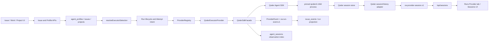

# ADR-XW-0090：Qoder Code Agent 产品化接入设计

- 状态：Proposed
- 日期：2026-08-12
- 目标：让 Qoder 成为玄武可配置、可路由、可观察、可恢复的 Code Agent Provider
- 依赖：[Provider Core 多 Coding Agent 重构计划](0089-provider-core-multi-code-agent-refactor-plan.md)、[Run Event Contract](0022-provider-run-event-contract.md)、[Run HTTP API](0024-run-http-api.md)、[Run Progress Projection](0025-run-progress-projection.md)、[Runs Compatibility View](0026-runs-compatibility-view.md)、[Approval Action Gate](0063-approval-action-gate.md)、[Restart Recovery Invariants](0069-restart-recovery-invariants.md)、[Secret Lifecycle](0073-secret-lifecycle-redaction.md)
- 替代/刷新：[G11 Qoder 接口新鲜度 Gate](0089-g11-qoder-freshness-gate.md) 中依赖具体版本和消息语义的结论；旧文档保留为历史证据，不再作为当前实现依据
- 当前实现入口：`backend-ts/src/providers/qoder/*`、`backend-ts/src/config/*`、`backend-ts/src/runtime/core.ts`、`backend-ts/src/runner/providerRuntime.ts`、`backend-ts/src/http/{codeAgentsApi,sessionApi,runApi}.ts`、`frontend/src/pages/{Issues,CodeAgentsPanel,Sessions}.jsx`、`frontend/src/pages/runs/RunDetail.jsx`
- 本文性质：产品与技术详细设计；本文不授权真实付费调用、生产部署或凭据写入

## 1. 决策摘要

玄武接入 Qoder 时采用 **Qoder Agent SDK（TypeScript）+ 受控 `qodercli` 子进程**，不接入 Qoder Desktop UI，也不把 Desktop 内的 IDE launcher 当作 CLI。

原因：

1. Agent SDK 提供结构化消息、权威 `result` 终态、Session 创建/恢复/读取、interrupt、模型发现、用量和权限回调，能自然映射到 Provider Core。
2. Qoder Desktop 是面向人工操作的 IDE，未提供适合玄武服务端执行、恢复和审计的稳定产品接口。
3. SDK 自身仍通过 `qodercli` 运行，所以发布包必须明确管理 SDK/CLI 版本对、可执行文件、认证和会话目录；“安装了桌面端”不能视为 runtime ready。
4. ACP 可作为未来降级或跨语言接入备选，但首期不应放弃 SDK 已提供的 Session、usage、permission 和 typed message 能力。

最终产品能力包括：

- Settings → Code Agents 中发现、启用、诊断 Qoder；
- Project 和 Agent Profile 中配置 Qoder；
- 创建 Issue/Work 时显式选择内置或自定义 Qoder Agent Profile；
- Issue 自动执行时把 profile 的模型、effort、权限和工作目录传入 Qoder；
- Run/Attempt 保存 Qoder session/message/invocation 引用及归一化事件；
- Runs → Provider 页签显示对应 Qoder Session 详情和 transcript；
- Sessions 页面可列出、读取、续接和中断 Qoder Session；
- 重启后可从已持久化 Session ref 恢复，但 Session 不取代 Run authority；
- 令牌、Credits 和费用按可证明的语义展示，不推测、不重复累计。

## 2. 范围与非目标

### 2.1 本期范围

1. 本机/服务端 Qoder Agent SDK executor。
2. PAT、Service Account 和本机 qodercli 登录三种认证来源。
3. Issue execution、Session list/read/create/resume、interrupt、model list。
4. Qoder 原生事件到 `xw.run-event.v1` 和 `xw.provider-session.v1` 的适配。
5. Code Agent 设置、Project/Agent Profile、Issue/Work 创建、Runs Provider 下钻、Sessions 页面。
6. 二进制发布、launchd 安装/升级/回滚、诊断和真实账号验收。

### 2.2 非目标

- 不自动化 Qoder Desktop 窗口，不依赖其登录 UI、扩展或私有内部接口。
- 不在首期接入 experimental Cloud Agent；Cloud Agent 的身份、环境、SSE 和计费语义单独立项。
- 不把 Qoder 的 Session ID 变成玄武 Run ID、Attempt ID 或 Issue ID。
- 不把 Qoder Credits 强行换算成法币费用；没有 provider 明确金额时，money 保持 unavailable。
- 不以 mock、SDK 可 import、CLI `--version` 或本地历史 Session 代替真实账号执行验收。
- 不默认发起付费 smoke；真实调用需显式开关、预算和隔离测试仓库。

## 3. 现状与差距

### 3.1 已存在的骨架

仓库已有：

- `qoderFactory()` 和 `qoderManifest()`；
- `QoderExecutorProvider`；
- 动态 import SDK 的 `QoderSdkFacade`；
- fake facade 单元测试；
- Provider Core 中的 `qoder` ID 和 runtime 条件注册入口。

这些只证明 adapter 目录和基础类型可以编译，不构成可用产品能力。

### 3.2 当前阻断项

| 链路 | 当前状态 | 影响 |
| --- | --- | --- |
| 配置 | `RunnerConfig.providers` 只构造 Codex、Claude、Pi | Qoder factory 实际不会获得配置 |
| 托管清单 | `/api/code-agents` 白名单不含 `qoder` | 设置页无法发现、启用或禁用 |
| readiness | facade 固定 `available=true`，`auth_configured=true` | 产生假 ready |
| SDK 安装 | 依赖 lifecycle script 被 Bun 阻止，本机也无 `qodercli` PATH 命令 | 真 facade 无可执行 runtime |
| 认证 | query 未传 `auth` | 当前 SDK 会报 `auth_not_configured` |
| 执行参数 | 未传 `cwd`、权限、sandbox、effort、timeout、env | 行为与 Agent Profile 不一致 |
| 恢复 | 使用 `sessionId` 而非 `resume` | 会创建/指定 Session，而不是恢复历史 Session |
| 终态 | 把 `task_notification` 当主任务 terminal | 子 Agent 完成可能导致主 Run 假成功/假失败 |
| 错误 | catch 后吞掉异常，Provider 又忽略 facade terminal | 执行失败可能返回成功形状 |
| 事件 | 未调用 `input.onEvent` | Runs 无进度、日志、成本和 session 关联证据 |
| 并发 | facade 只有一个全局 `interruptFn` | 并发 Run 会互相覆盖/中断错误任务 |
| Session | 无 list/read/send message adapter | Runs Provider 页签只能得到索引 fallback，不能显示原生详情 |
| Manifest | Session list/read=false，却声明 process lease 且无 lease | capability 和实现不一致 |
| 发布 | 构建/安装只处理 Claude SDK executable | 发布后二进制找不到 Qoder CLI |

### 3.3 版本新鲜度结论

2026-08-12 的只读调查得到：

- 仓库固定 `@qoder-ai/qoder-agent-sdk` 1.0.17；npm 当前为 1.0.20；
- 旧 G11 固定 qodercli 1.1.14；npm 当前为 1.1.19；
- 本机 Qoder Desktop 为 1.24.1，但 PATH 中没有 `qodercli`；Desktop 内 `qoder` 是 IDE launcher；
- 当前官方 TypeScript SDK 已明确提供 `listSessions/getSessionInfo/getSessionMessages`、`resume/forkSession`、`getAvailableModels`、`getUsageInfo`、`canUseTool`；
- 主会话权威终态是 `SDKResultMessage`；`SDKTaskNotificationMessage` 仅表示 Sub-Agent task 结束。

因此实现前必须重跑 G11，冻结经验证的 **SDK + CLI 版本对**，不能只升级 SDK lockfile。

## 4. 产品场景与验收故事

### 4.1 管理员启用 Qoder

1. 打开 Settings → Code Agents。
2. 看到 Qoder 卡片，状态分别显示 SDK、CLI、认证、会话目录和协议兼容性。
3. 选择认证方式并配置 secret ref，或明确选择本机 qodercli 登录。
4. 点击重新发现；只有 `enabled && ready && issue_execution` 时 Qoder 才进入可提交清单。
5. 若 CLI 缺失、版本不兼容、认证未配置，卡片给出可操作原因，Issue 选择器不展示可提交项。

### 4.2 创建 Issue 时选择 Qoder

1. 数据迁移提供 `xuanwu-provider-qoder` 内置 Agent Profile，名称为 `Qoder（本机配置）`。
2. Issue 创建弹窗的 Code Agent 选择器展示 `Qoder · Qoder（本机配置）`；只在 Qoder submittable 时出现。
3. 提交仍写 `agent_profile_id=xuanwu-provider-qoder`，不新增含义重叠的 `provider_override` 字段。
4. runner 按既有优先级解析：Issue profile → Project default profile → Project provider fallback。
5. 新 Run 记录 `provider=qoder`、profile ID、selection reason 和 capability snapshot。

### 4.3 在 Runs 中查看 Qoder Session

1. Qoder 发出 `system/init` 后，Attempt 保存 `session_ref` 和 `observation_ref=qoder:<session-id>`。
2. Runs → Provider 自动下钻到 `qoder:<session-id>`。
3. 页头显示 Attempt 状态、模型、tokens/Credits、终态和 Qoder runtime 版本。
4. transcript 使用统一 Sessions renderer 显示 user、assistant、reasoning、tool call/result、file change、permission、subagent 等项目。
5. Session 原生读取失败时，显示 provider error 和 `agent_sessions` 索引摘要；不得把空 transcript 显示成成功。

### 4.4 续接、中断与重启恢复

1. Sessions 发送消息或 Run resume 使用 `resume:<session-id>` 语义。
2. 活跃 query 以 invocation key 管理，中断精确命中当前 Attempt，不能中断其他 Qoder Run。
3. runner 重启后没有旧进程控制句柄；历史 Session 仍可通过 SDK local store + persisted session ref 恢复。
4. 若本地 Session 文件丢失或 config dir 改变，恢复 fail closed，创建新的 recovery Attempt 失败记录，不自动创建无上下文新 Session。

## 5. 目标架构



### 5.1 Authority 不变量

| 事实 | 唯一 authority | Qoder 数据的角色 |
| --- | --- | --- |
| Run 是否运行/结束 | `issue_runs` + Run command service | 提供经过 adapter 归一化的输入证据 |
| Attempt 与重试 | `run_attempts` | 保存 invocation/session/message opaque refs |
| Issue 选哪个 Agent | `agent_profile_id` + Project fallback | profile.provider=`qoder` |
| Provider Session 内容 | Qoder session store | 只读 transcript/drill-down |
| Session 与 Issue/Project 关联 | `agent_sessions` | provider-neutral observation index |
| 进度与日志 | append-only `issue_events` | 保存 raw + normalized events |
| 成本 | Run cost projection + provenance | 只接收语义已验证的 usage/Credits |

Session status 不能直接关闭 Run；历史 Session 存在也不能证明 Attempt 成功；Qoder 的 task UUID 不能代替 Attempt ID。

## 6. Provider Manifest 与 capability

完成首期后建议 manifest：

```ts
{
  id: "qoder",
  displayName: "Qoder",
  supportLevel: "preview",
  transports: ["sdk"],
  capabilities: {
    issueExecution: true,
    sessions: {
      create: true,
      list: true,
      read: true,
      resume: true,
      steerWhileRunning: false,
      fork: false,
      export: false
    },
    control: { interrupt: true, approvals: "host-callback" },
    models: { list: true, switchDuringSession: false },
    usage: { tokens: "attempt" }
  },
  processObservability: "lease",
  sessionPresentation: { viewContract: "xw.provider-session.v1" }
}
```

说明：

- `fork` 虽然 SDK 已提供，但玄武 Session API 暂无通用 fork 路由，首期保持 false。
- `steerWhileRunning` 保持 false；Qoder `interrupt()` 与恢复是清晰合同，运行中消息队列另行设计。
- `money` 首期不声明；只有 Qoder 返回明确货币金额且语义通过验收后才增加。Credits 作为 extension 展示，不伪装成 money。
- `supportLevel` 在真实账号、重启恢复、权限和发布包验收前保持 preview。
- 若 host approval 尚未完成，第一实施切片应把 approvals 标成 `none`，并只允许可确定的 `never/dontAsk` 策略；manifest 不得超前声明。

## 7. 安装、运行时与发布

### 7.1 版本策略

新增 `QODER_VERSION_MATRIX` 或等价测试固定：

```text
sdkVersion
cliVersion
protocolVersion range
verifiedAt
verifiedPlatforms
```

规则：

1. SDK 与 CLI 都使用 exact pin，不用 caret。
2. 升级任一项都重跑 G11、facade contract、真实 smoke 和 release packaging。
3. 从 `system/init.qodercli_version` 记录真实运行版本；与期望版本不兼容时 not_ready。
4. 不依赖 Qoder CLI 自动更新；服务端 runtime 禁用 auto update，升级由玄武 release 管理。

### 7.2 CLI 分发

推荐将 `@qoder-ai/qodercli` 作为明确的构建依赖，并在 release 中把平台对应 executable 放到主二进制旁，例如：

```text
xuanwu
xuanwu.claude-agent-sdk
xuanwu.qodercli
```

SDK query 显式传 `pathToQoderCLIExecutable`。开发态可以覆盖路径，但生产不从不确定的 PATH 或 Qoder Desktop 中猜测。

需要修改：

- `backend-ts/scripts/build-binary.sh`；
- `scripts/package-release.sh`；
- `scripts/install-release.sh`；
- `scripts/install-launchd.sh`；
- `scripts/update-release.sh`；
- release/installer/rollback tests。

安装校验必须包含 executable bit、CPU 架构、`--version`、协议初始化和 rollback snapshot。Bun lifecycle script 被阻止的情况必须在构建时显式失败，不能生成缺 runtime 的 release。

### 7.3 Desktop 边界

- `/Applications/Qoder.app` 只用于用户人工使用。
- Desktop 版本不参与 Provider readiness。
- Desktop 登录态是否与 qodercli 共用属于 Qoder 实现细节；只有 `qodercliAuth()` 实际初始化通过后才认为可复用。
- 不提供“Open in Qoder Desktop” action，除非 Qoder 后续发布稳定 deeplink/session contract。

## 8. 配置与认证设计

### 8.1 配置结构

在 `RunnerLocalSettings.providers.qoder` 增加：

```ts
type QoderLocalSettings = {
  enabled?: boolean;
  command?: string;
  configDir?: string;
  authMode?: "pat-env" | "pat-secret-ref" | "service-account-secret-ref" | "local-cli";
  credentialRef?: string;
  model?: string;
  timeoutMs?: number;
};
```

建议环境变量/CLI 覆盖：

```text
XUANWU_QODER_ENABLED
XUANWU_QODER_CMD
XUANWU_QODER_CONFIG_DIR
XUANWU_QODER_AUTH_MODE
XUANWU_QODER_CREDENTIAL_REF
XUANWU_QODER_MODEL
XUANWU_QODER_TIMEOUT_MS
```

`QODER_PERSONAL_ACCESS_TOKEN` 保留为 Qoder SDK 标准 PAT 环境变量。玄武 local settings 只保存 secret ref，不保存明文 token/key。

### 8.2 认证模式

| 模式 | 用途 | SDK 映射 | readiness |
| --- | --- | --- | --- |
| `pat-env` | 开发/CI | `accessTokenFromEnv()` | env 存在但不回显 |
| `pat-secret-ref` | 本机守护进程 | SecretService 读取后 `accessToken()` | secret 可解析 |
| `service-account-secret-ref` | 组织服务/定时任务 | `serviceAccount({serviceAccountKey})` | key 可解析；SAT 由 SDK 刷新 |
| `local-cli` | 已登录开发机 | `qodercliAuth()` | config dir 存在；有效性由 preflight/run 确认 |

生产推荐 Service Account；单用户本机可用 PAT secret ref；`local-cli` 不应用于无状态 CI 或共享生产服务。

### 8.3 readiness 状态机

不要再用单一 `available` 布尔值。factory discovery 至少返回：

```text
disabled
sdk_missing
cli_missing
cli_incompatible
auth_not_configured
configured_not_verified
ready
runtime_error
```

`runtimeStatus()` 返回脱敏字段：

- `ready`、`reason`；
- `executable_ready`、`version`；
- `auth_configured`、`auth_mode`、`auth_source`；
- `active_sessions`；
- `config_dir_scope`，不返回凭据内容；
- `platform_profile` 中可含 `sdk_version/cli_version/protocol_version`。

`/api/code-agents/discover` 默认只做无费用检查。需要远端认证/模型查询的 live preflight 作为显式操作，并在 UI 标记可能访问 Qoder 服务；不能为了打开设置页自动消耗 Credits。

## 9. Agent Profile、Project、Issue 与 Work 路由

### 9.1 内置 Qoder Profile

沿用 migration 068/069 的模式，以 `insert or ignore` 新增：

```text
id: xuanwu-provider-qoder
name: Qoder（本机配置）
provider: qoder
model: ""
reasoning_effort: ""
approval_policy: ""
sandbox: ""
service_tier: ""
```

不新增 `provider_override` 字段，也不把 runtime ID 写进 `agent_profile_id`。内置 profile 与用户自定义 Qoder profiles 都使用现有 Agent Profile API。

### 9.2 选择优先级

保持现有合同：

```text
Issue.agent_profile_id
  > Project.default_agent_profile_id
  > Project.provider + Project execution settings
```

Run 创建时冻结：

- `agent_profile_id`；
- `selection_reason`；
- provider ID；
- model/effort/approval/sandbox/service tier resolved values；
- provider capability snapshot。

后续修改 profile 不反写历史 Run。

### 9.3 Issue 创建 UI

Issue 弹窗继续提交 profile ID，但展示改为 provider 分组：

```text
沿用项目默认（当前：Codex / 某 Profile）
Codex
  Codex（内置）
Qoder
  Qoder（本机配置）
  Qoder Performance（用户配置）
Claude
  ...
```

过滤条件必须同时满足：

1. profile 存在；
2. profile.provider 在 `/api/code-agents.available_ids`；
3. provider manifest 支持 `issue_execution`；
4. readiness 为 submittable。

若编辑已有 Issue，而其 Qoder runtime 当前不可用，保留并显示现值为“不可用”，但禁止新选；不得静默改成 Codex。

### 9.4 Project 与 Agent Profile UI

- Project Provider selector 从动态 catalog 显示 Qoder。
- Agent Profile provider selector同样来自 catalog。
- model 字段优先使用 Qoder model list；查询失败允许保留手工值，并标记“未验证”。
- Qoder 的模型 tier、reasoning effort 与其他 provider 分开校验，不复用静态 Codex model 列表。
- `service_tier` 首期对 Qoder 不展示；Qoder 的 fast/credits 语义不应塞进 Codex priority tier。

### 9.5 CLI/API

现有命令不新增 Qoder 专属子命令：

```bash
xuanwu issue create ... --agent-profile xuanwu-provider-qoder
xuanwu issue update <id> --agent-profile xuanwu-provider-qoder
xuanwu project create ... --provider qoder --default-agent-profile xuanwu-provider-qoder
xuanwu work create ... --agent-profile xuanwu-provider-qoder
```

API 继续使用：

- `GET/PATCH /api/code-agents[/qoder]`；
- `GET/POST/PATCH /api/agent-profiles`；
- Issue/Project/Work 现有 `agent_profile_id/default_agent_profile_id/provider` 字段。

所有写入口复用同一 profile 存在性和 provider availability 校验。

## 10. Qoder SDK facade 设计

### 10.1 facade 职责

`QoderSdkFacade` 隔离 SDK 版本变化，提供：

```ts
type QoderInvocationKey = string;

interface QoderSdkFacade {
  inspectRuntime(): Promise<QoderRuntimeInspection>;
  run(input: QoderRunOptions, onMessage: (message: unknown) => void): Promise<QoderRunOutcome>;
  interrupt(invocationKey: QoderInvocationKey): Promise<QoderInterruptOutcome>;
  listSessions(input: QoderSessionListInput): Promise<QoderSessionInfo[]>;
  getSessionInfo(sessionId: string): Promise<QoderSessionInfo | undefined>;
  getSessionMessages(sessionId: string, input?: QoderMessagePage): Promise<QoderSessionMessage[]>;
  listModels(input: QoderModelListInput): Promise<QoderModelInfo[]>;
  close(): Promise<void>;
}
```

facade 不返回“默认成功”；没有权威 terminal 或 SDK 抛错必须失败。

### 10.2 并发与生命周期

使用 `Map<invocationKey, ActiveQuery>`，每项包含：

- query/control handle；
- session ID；
- issue/run/attempt correlation；
- child PID/lease；
- startedAt、lastEventAt；
- interruptRequested/acknowledged。

注册必须在 spawn 前后保持异常安全，finally 删除；相同 invocation key 冲突直接拒绝。`interrupt(session)` 先通过当前 Attempt 的 invocation ref 定位，不能用“最后一个 query”全局变量。

Provider 实现 `processLeases()` 或 Core 认可的等价 lease source 后，manifest 才声明 `processObservability: lease`。

### 10.3 query 参数映射

| 玄武输入 | Qoder SDK |
| --- | --- |
| `prompt` | `query.prompt` |
| `cwd` | `options.cwd` |
| new Session | 不传 `resume`；可预生成 `sessionId` 便于 intent 关联 |
| recovery/send message | `options.resume=session.sessionId` |
| model | `options.model`；空值使用 Qoder 默认 |
| reasoning effort | 经模型能力校验后传 Qoder effort/对应 setting；不支持则拒绝或清空并记录原因 |
| auth | `options.auth` |
| CLI | `options.pathToQoderCLIExecutable` |
| config dir | `options.env.QODER_CONFIG_DIR` |
| timeout | AbortController + runner watchdog |
| system instructions | `systemPrompt: {type:'preset', preset:'qodercli', append: ...}` |
| skill/plugin intents | 仅在已解析为允许的 Qoder skill/plugin 后传；未知 intent 不静默丢失 |

恢复时绝不把历史 Session ID放入 `sessionId` 冒充新会话；必须使用 `resume`。若要 fork，显式 `resume + forkSession`，并创建新的 Session ref。

## 11. 权限、审批与 sandbox 映射

Qoder permission policy 不是操作系统级 sandbox。玄武不得因为字段名相似就声称提供了相同隔离。

### 11.1 最低安全映射

| 玄武策略 | Qoder 配置 | 约束 |
| --- | --- | --- |
| `approval=never` | `permissionMode=dontAsk` + 明确 tools/allow/deny | 未预授权操作拒绝，不弹无人可答的交互 |
| `approval=danger-only` | `permissionMode=default` + `canUseTool` | 回调进入 Approval Action Gate |
| `approval=always` | `canUseTool` 对所有副作用工具请求审批 | 只读工具可由产品策略豁免或同样审批 |
| `sandbox=read-only` | 仅 Read/Grep/Glob；deny Edit/Write/Bash/NotebookEdit | 无写和任意 shell |
| `sandbox=workspace-write` | 文件工具 path gate + Bash command gate | 只能在能证明 cwd 边界时开放 |
| `sandbox=danger-full-access` | 默认拒绝 | 只有显式 unsafe 配置才允许 bypassPermissions |

### 11.2 Approval Action Gate

`canUseTool(toolName,input,options)` 转成稳定 request：

```text
provider=qoder
request_id=<session-id>:<tool-use-id>
tool_name
tool_input_summary
blocked_path
agent_id
decision_reason
run_id/attempt_id/issue_id
```

原始输入先经过 redaction，再写 approval/evidence。用户决定映射成 Qoder `PermissionResult allow/deny`。服务重启时失去 callback 的 pending request 必须按既有 recovery policy 失败/重新发起，不能默认 allow。

### 11.3 Bash 边界

仅靠字符串检查不能证明 Bash 被限制在 workspace。第一阶段如无法提供可验证的进程 sandbox：

- `read-only` 禁用 Bash；
- `workspace-write` 的 Bash 需要 action gate 或明确风险标记；
- UI 显示“Qoder permission policy，不等于 OS containment”；
- conformance 不得把它标成与 Codex sandbox 完全等价。

## 12. 事件与权威终态

### 12.1 映射原则

1. 保存可诊断 raw method/type，但默认不保存完整敏感 payload。
2. 每个原生消息最多产生一个主要 normalized event，避免重复关闭 Run。
3. 未识别消息产生 `unknown/preserve/terminal=false`。
4. 只用主 `result` 或无 result 的明确 SDK/process failure 作为 terminal。
5. `task_notification` 只是 subagent progress，绝不能关闭主 Attempt。

### 12.2 事件映射表

| Qoder 消息/动作 | ProviderEvent | Normalized Run Event |
| --- | --- | --- |
| query intent accepted | `provider.session_starting` | `started/running` |
| `system/init` | `provider.session_started` + session ref | `started/running` |
| assistant text/reasoning | `message/progress` | `progress/running` |
| tool use/result | `tool_call/tool_result` | `progress/running` |
| file edit/write result | `file_change` | `progress/running` |
| `api_retry` | `provider.retry` | `progress/running`, retryable metadata |
| `session_state_changed=requires_action` | `approval_requested` | `approval_requested/waiting_approval` |
| permission callback decision | `approval_resolved` | `approval_resolved/running` |
| `permission_denied` | `permission_denied` | `progress` 或 nonterminal `error` |
| task started/progress/notification | `subagent.*` | `progress/running` |
| mirror error | `provider.mirror_error` | nonterminal `error/unknown`，等待 result |
| `result success && !is_error` | `done` | `completed/succeeded/terminal=true` |
| `result error_*` 或 `success && is_error` | `error` | `error/failed/terminal=true` |
| interrupt 后退出/结果 | `interrupted` | `completed/interrupted/terminal=true` |
| SDK exception/process crash且无 result | `error` | `error/failed/terminal=true` |

### 12.3 引用语义

- `session_ref`：`system/init.session_id`；
- `invocation_ref`：Attempt intent 派生的本地稳定 ref，或 SDK 提供的本轮稳定 ref；
- `turn_ref/message_ref`：主 `result.uuid`；
- subagent `task_id/tool_use_id` 放 metadata，不写成主 `turn_ref`；
- `observation_ref`：`qoder:<session_ref>`。

Session ref 一旦从 init 获得，应立即 upsert `agent_sessions` 并写 Attempt ref，不能等整个任务结束，否则进程崩溃后无法恢复。

### 12.4 错误分类

至少区分：

- auth/configuration，不自动重试；
- quota/credits，不自动重试；
- policy/input，不原样重试；
- transient network/service，可 bounded backoff；
- max turns，人工检查后决定；
- CLI missing/protocol mismatch，Provider not_ready；
- interrupt/cancel，不记为普通失败。

保存 `result.subtype/error_code/errors` 与异常 class/code/exitCode/signal 的脱敏摘要。未知 numeric code 原样保留，不解析人类文本猜 code，也不混淆 result error code 与进程 exit code。

## 13. Session 列表与详情适配

### 13.1 数据来源

- list：`listSessions({dir,limit,offset})`；
- metadata：`getSessionInfo(sessionId)`；
- transcript：`getSessionMessages(sessionId,{limit,offset,includeSystemMessages})`；
- resume：`query({options:{resume:sessionId}})`；
- config dir 必须与执行时一致，否则列表与恢复会看见不同 Session 世界。

### 13.2 `xw.provider-session.v1` summary 映射

| View 字段 | Qoder 来源 |
| --- | --- |
| `sessionRef` | `SDKSessionInfo.sessionId` |
| `name` | `customTitle || summary || firstPrompt` |
| `preview` | `summary || firstPrompt`，脱敏并限长 |
| `cwd` | `cwd` |
| `createdAt` | `createdAt || 0` |
| `updatedAt` | `lastModified` |
| `status` | 活跃 query map 优先，否则 `idle`/indexed status |
| `isRunning` | 当前进程持有该 session 的 active invocation |
| `model` | SessionInfo 无字段时留空；可从 init/index extension 补齐 |

extensions 可包含 `gitBranch/tag/fileSize/qodercliVersion/credits`，但不得覆盖公共字段。

### 13.3 transcript 映射

Qoder `SessionMessage.message` 是 unknown，adapter 需要结构守卫，不能直接交给前端。建议映射：

| 原生内容 | 通用 item |
| --- | --- |
| user text/content blocks | `userMessage` |
| assistant text | `agentMessage` |
| thinking/reasoning | `reasoning` |
| Bash tool use/result | `commandExecution` |
| Edit/Write tool use/result | `fileChange` |
| 其他 tool use | `custom_tool_call` |
| 其他 tool result | `custom_tool_call_output` |
| compact boundary/system state | provider extension/diagnostic item |
| permission denied | `custom_tool_call_output` with denied status |
| subagent task | grouped custom items，保留 parent_agent_id |

turn 分组优先按 user message 开始、主 assistant/result 结束；缺失/损坏历史按 message UUID 单独成组，不丢弃整场 Session。所有 item 必须有稳定 ID，使用原生 UUID/tool_use_id，必要时以 session+offset 派生。

### 13.4 分页与性能

- `/api/sessions` 的 cursor 当前不能表达 Qoder offset；首期可 bounded list，后续统一 cursor contract。
- detail 默认只读最近一页，前端增加“加载更早记录”，避免大 JSONL 一次加载。
- `fileSize` 只用于提示，不作为状态。
- list/read 不应触发模型调用或消耗 Credits。
- 对 Session 文件损坏、权限不足、config dir 不可达分别返回 provider error。

### 13.5 `agent_sessions` 索引

每次 init、事件、结果和恢复都 upsert：

```text
session_key=qoder:<session-id>
provider=qoder
provider_session_id=<session-id>
project_id/issue_id/agent_role
status
title/preview
raw_ref={model,qodercli_version,provider_turn_id,invocation_ref,...}
```

`raw_ref` 只保存非敏感摘要。Session API 合并 provider discovery 与 index 时，历史 idle summary 不得覆盖索引中的 running 状态。

## 14. Runs → Provider 详情设计

### 14.1 后端 Run 数据

无需新增第二个 Run API。确保每个 Qoder Attempt 的 `provider_ref` 包含：

```json
{
  "provider": "qoder",
  "invocation_ref": "...",
  "session_ref": "<qoder-session-id>",
  "observation_ref": "qoder:<qoder-session-id>",
  "turn_ref": "<result-uuid>"
}
```

Attempt 运行中允许先有 invocation，init 后补 session，result 后补 turn。更新必须走 Run lifecycle command，不由 Session API直接改 Run。

### 14.2 前端展示

复用现有 `RunDetail → ProviderSessionDrillDown → Sessions`，不新增 Qoder 专属页面。补充：

- Provider header：Qoder、SDK/CLI version、model、Session ID；
- Attempt facts：status、tokens、Credits、duration、terminal reason；
- transcript：统一 renderer；
- active controls：能力允许时 interrupt；Run resume 仍走 Run API，不从 transcript 偷换 authority；
- error states：未获得 Session ref、Session 未索引、Qoder runtime 未注册、历史文件不存在、协议解析失败分别显示；
- raw payload 只在 Advanced 受限视图展示脱敏内容。

### 14.3 Run resume 语义

当前 Run API resume 调用 `sendSessionMessage`，所以 Qoder provider 必须实现该方法，内部使用 `resume` query，并返回：

```text
provider_session_id = 原 Session ID
turn_id = 新 result UUID
```

resume 前 Run service 写 intent，provider call 后写 outcome 和新 Attempt ref。若恢复失败，不退化成新 Session；用户若需要“从旧上下文分叉”，应是独立 fork action。

## 15. Model、effort、usage 与 cost

### 15.1 模型发现

SDK query control 的 `getAvailableModels()` 需要活跃初始化 query。设计两层：

1. 静态 fallback：`auto/ultimate/performance/efficient/lite`，仅作输入建议；
2. 账号实时列表：显式 discover/preflight 后缓存短 TTL，返回当前账号可用模型和 effort 能力。

空 model 表示使用 Qoder 默认。手工 model 必须保留但标记未验证；provider 返回 unsupported 时错误必须可操作。

### 15.2 reasoning effort

Qoder 支持值随模型变化。不要把 manifest 写死为 `low/medium/high/max` 后对所有模型开放。UI 使用 model metadata；无 metadata 时只允许空值，或在高级模式中手工输入并标记风险。

### 15.3 usage 与 Credits

权威来源优先级：

1. 主 `result.usage/modelUsage`；
2. request-level assistant usage；
3. `q.getUsageInfo().session` 的累计 Credits；
4. subagent `task_notification.usage` 仅作为 task extension，不能当整次 Attempt 总量。

恢复 Session 时必须确认结果字段是本轮还是累计值。未通过 live gate 前：

- raw usage 可保存；
- Run cost `completeness=partial/unavailable`；
- 不把累计 Session tokens 在多个 Attempt 中重复相加；
- Credits 以 `credits` extension 展示，不换算 USD/CNY；
- BYOK 的 `total_cost_usd=0` 不表示真实上游成本为零。

真实 gate 应执行两轮同 Session，比较每轮 result、assistant usage 和 `getUsageInfo`，据此决定使用直接值还是 delta。

## 16. HTTP 与前端改动矩阵

| 层 | 改动 |
| --- | --- |
| `RunnerConfig` | 增加 qoder env/flag/local settings 合并 |
| Provider registry | 始终注册 qoder factory；配置决定 enabled/readiness |
| `/api/code-agents` | 托管 ID 加 qoder；可启停、discover、返回诊断 |
| `/api/providers` | 自动投影 Qoder manifest/capabilities/settings/model list |
| Agent Profiles | migration 增加内置 Qoder profile；现有 CRUD 不变 |
| Issue/Work/Project API | 复用 profile validation；availability fail closed |
| `/api/sessions` | Qoder list/read/create/message/interrupt 进入统一路径 |
| `/api/runs` | 不新增 endpoint；Qoder refs、controls 和 normalized events 可用 |
| CodeAgentsPanel | Qoder 描述、安装/认证/版本诊断、启用操作 |
| ProjectSettingsEditor | 动态 Qoder provider/profile/model/effort |
| Issues/Work | 分组展示可用 Qoder profiles |
| Sessions | Qoder list/detail/transcript/controls |
| Runs | 复用 Provider drill-down，显示 Qoder extensions |

## 17. 数据库与迁移

首期不需要新建 Qoder 专属表。复用：

- `agent_profiles`；
- `projects.default_agent_profile_id/provider`；
- `issues.agent_profile_id`；
- `issue_runs/run_attempts`；
- `agent_sessions`；
- `issue_events`；
- approval/action/evidence 既有表。

需要一条只插入内置 Qoder profile 的 idempotent migration，编号以实现时下一个可用 migration 为准。若后续需要 Provider 连接对象或多账号路由，应沿统一 Provider connection 设计扩展，不能新增仅 Qoder 可用的 credential 表。

迁移验收：

- 新库和旧库均有且仅有一个 `xuanwu-provider-qoder`；
- 用户同 ID 自定义记录不被覆盖；
- rollback 不删除用户 profile；
- profile provider 为 `qoder`，model 不被归一化为 `codex-default`。

## 18. 安全、隐私与合规

1. PAT/Service Account key 只在 backend 进程内解析，永不返回 API、日志、event、raw_ref 或测试 snapshot。
2. 注册 Qoder 标准 env 和 credential ref 到 redaction registry。
3. prompt、源文件、tool output 默认不进入 runtime diagnostic；Debug 模式仍执行 secret redaction 和大小限制。
4. `QODER_CONFIG_DIR` 目录权限最小化；Session 文件可能包含源码、命令和对话，备份/日志采集必须排除或显式授权。
5. 外部 Session store 首期不启用；启用前需设计加密、租户隔离、删除和数据驻留。
6. SDK package license 为 `SEE LICENSE IN LICENSE`，且产品受 Qoder 服务条款约束；发布前需完成法务/采购/商用条款与 Credits 预算确认。
7. 网络代理、自定义模型/BYOK、MCP、plugins、skills 都可能扩大数据外发面；首期默认关闭，逐项经过策略映射后开放。
8. Qoder Desktop 和 CLI 账号共用性不能用于绕过组织授权。

## 19. 可靠性与恢复

### 19.1 进程内失败

- query exception：发 terminal error，结束 Attempt，清理 lease；
- result 后 process exception：保留两个诊断信号，但只产生一次用户可见 terminal；
- stream 未出现 result 且正常结束：视为 protocol failure，不成功；
- duplicate result：首个权威 terminal 生效，后续 unknown/diagnostic；
- event callback 失败：不能阻断 SDK drain，但记录 projection error。

### 19.2 服务重启

- active child process 不假设可重新附着；旧 Attempt 按 restart recovery contract 收敛；
- `agent_sessions` 与 Attempt ref 提供恢复锚点；
- Qoder Session store 可读才允许 recovery；
- 恢复创建新的 recovery Attempt，不复活旧 Attempt；
- 恢复后 session ID 相同、result UUID 新增；
- config dir/credential identity 改变时需要明确报错，避免跨账号误读 Session。

### 19.3 超时与中断

- runner timeout 先 `query.interrupt()`，等待 bounded grace；
- 未退出再使用 AbortController/进程终止；
- `interrupt` 与 `abort` 语义分开：前者停止当前响应并保留 Session，后者关闭当前 SDK session；
- 所有中断记录 request/ack/final outcome；
- 不终止无法证明属于当前 invocation 的进程。

## 20. 可观察性

### 20.1 指标

- `qoder_invocations_total{outcome}`；
- `qoder_active_invocations`；
- `qoder_invocation_duration_ms`；
- `qoder_sdk_errors_total{code}`；
- `qoder_result_errors_total{subtype,error_code}`；
- `qoder_interrupt_total{outcome}`；
- `qoder_session_read_total{outcome}`；
- `qoder_protocol_unknown_messages_total{type,subtype}`；
- `qoder_credits_total`（只有语义验证后）；
- CLI child RSS/peak RSS 通过 process lease 汇总。

### 20.2 诊断信息

Code Agent 状态可展示：

- SDK/CLI/protocol 版本；
- executable 路径来源（bundled/override，不显示私人绝对路径的敏感片段）；
- auth mode/source；
- config dir scope；
- 最近 discover 时间与结果；
- active session count；
- 最近脱敏错误码。

不得展示 token、service key、authorization header、完整 prompt、源码或完整 tool output。

## 21. 测试与验收矩阵

### 21.1 单元测试

- config env/flag/local precedence；
- secret ref 与 redaction；
- factory detect 的每个状态；
- SDK message → ProviderEvent/NormalizedRunEvent；
- result、exception、interrupt、缺 result；
- task_notification 不终止主 Run；
- concurrent query 精确 interrupt；
- session summary/detail mapping；
- malformed/unknown history fail-soft；
- permission policy 映射和 fail-closed；
- usage/Credits projection 不重复累计。

### 21.2 Provider conformance

- manifest 与方法一致；
- issue execution；
- create/list/read/resume session；
- interrupt scope；
- model list；
- process lease；
- Session View contract；
- raw unknown event preserve；
- no terminal/no session/error paths。

### 21.3 HTTP/UI 集成

- `/api/code-agents` 包含 Qoder，启停持久化；
- active Run 时禁止 disable；
- 内置 Qoder profile 在新旧 DB 可见；
- Issue modal 仅在 submittable 时显示 Qoder；
- payload 写正确 profile；
- runner 解析到 provider=qoder；
- Runs Provider tab 读取 `qoder:<id>`；
- transcript error/fallback/empty/loading；
- Session create/message/interrupt；
- 项目默认 Qoder 与 Issue override 双向覆盖；
- 不可用的历史选择不被静默替换。

### 21.4 release 验收

- macOS arm64/amd64 和支持的平台包包含正确 CLI；
- clean machine 不依赖 Desktop/PATH；
- install/upgrade/rollback 保留 qodercli executable 与配置目录；
- launchd 环境可解析 secret ref；
- 自动更新禁用；
- 二进制签名/隔离属性不阻止 child spawn；
- package license/NOTICE 完整。

### 21.5 真实账号 acceptance

使用隔离临时仓库、显式预算和测试凭据，至少验证：

1. 新建 Session 执行一个只读任务；
2. workspace-write 修改一个 fixture 文件并运行测试；
3. 权限审批 allow/deny；
4. interrupt 长任务；
5. 同 Session resume 第二轮并保持上下文；
6. runner 重启后 resume；
7. 两个并发 Qoder Run，分别中断其中一个；
8. Session list/read 与 Runs Provider transcript 一致；
9. invalid/expired auth、quota、unsupported model、network failure；
10. usage/Credits 两轮增量与 UI 显示；
11. release 安装包而非源码开发环境执行；
12. 运行完成后核对 Run/Attempt/Event/agent_sessions 数据与无孤儿进程。

没有上述真实证据时只能保持 preview，不能标 tested。

## 22. 分阶段实施计划

### Q0：重新执行 freshness gate

- 冻结 SDK/CLI 版本对；
- 验证 license、安装方式、协议、auth、result、session、usage、permission；
- 修订/标记旧 G11 过时结论；
- 输出最小真实 smoke 记录，但不接产品流量。

### Q1：配置、发布与真实 readiness

- 配置 schema/env/local settings/secret ref；
- direct qodercli build dependency；
- release/install/update/rollback；
- registry、managed code agent、diagnostic；
- 不开放 Issue submission，直到 release runtime 可启动。

### Q2：执行与事件闭环

- 重写 facade、query map、auth、cwd、terminal/error；
- normalized events、refs、agent_sessions、process leases；
- timeout/interrupt；
- provider conformance；
- 完成后可开放 preview issue_execution。

### Q3：Agent Profile 与 Issue/Work 选择

- 内置 Qoder profile migration；
- Settings/Project/Profile/Issue/Work/CLI/API；
- selection snapshot 和 unavailable UX；
- 端到端验证创建 Issue → Qoder Run。

### Q4：Session 与 Runs Provider 下钻

- list/read/session history adapter；
- `xw.provider-session.v1`；
- sendSessionMessage/resume；
- Runs Provider transcript、error/fallback；
- 分页和大型 Session 性能。

### Q5：权限、模型、usage

- host approval action gate；
- model discovery/effort；
- usage/Credits 语义 gate；
- UI extensions 和 observability。

### Q6：真实验收与 support level

- 完成真实账号、并发、重启、release 包验收；
- 记录版本/平台/账号类型/预算；
- 仅全部通过后评估 `preview → tested`。

每个阶段都应独立可回滚。capability 只在对应阶段实现和验证后开启。

## 23. 风险与决策

| 风险 | 处理 |
| --- | --- |
| SDK/CLI 快速漂移 | exact pin + version matrix + freshness gate |
| lifecycle script 被 Bun 阻止 | CLI 直接构建依赖，release 缺 asset 即失败 |
| Desktop 被误当 runtime | readiness 只认受控 qodercli |
| 主/子 Agent terminal 混淆 | 只认主 result，task_notification 仅 progress |
| 并发中断串线 | invocation-scoped query map |
| Session 与 Run authority 混淆 | Run service 唯一写状态；Session 只观察/恢复 |
| sandbox 语义不等价 | fail closed + 明确 UI 风险 + host action gate |
| usage 重复累计 | live 验证本轮/累计语义，未知时 unavailable |
| local-cli 登录在 launchd 不可用 | PAT/Service Account 为守护进程主路径 |
| transcript 泄露源码/secret | 后端归一化、redaction、分页、Debug 限制 |
| 配额/成本不可控 | 默认无付费 smoke，预算、quota error 与 Credits 指标 |
| 条款不允许再分发 CLI | 发布前法务确认；必要时改为外部安装但保持版本检查 |

## 24. 待确认问题

以下问题不阻塞设计落盘，但阻塞对应能力上线：

1. Qoder 服务账号是否已开通，生产使用 PAT 还是 Service Account？
2. Qoder CLI 再分发和自动化商用是否满足当前服务条款？
3. `result.usage/modelUsage/total_credits` 在 resume 时是本轮还是 Session 累计？
4. 当前 SDK 中 model effort 的稳定 typed 入口是 query option、settings 还是 model policy？需以冻结版本实际类型为准。
5. Qoder permission callback 对 Bash/path 的信息是否足以满足玄武 workspace policy？
6. launchd 场景下 local qodercli auth 是否稳定；若否是否只支持 secret-backed auth？
7. 大 Session 的 offset 分页是否稳定，是否需要 Core cursor schema 升级？
8. 是否要在后续开放 fork、rename、tag、delete Session；这些都是外部状态修改，需要单独授权与 UI。

## 25. 完成定义

只有同时满足以下条件，才能称为“Qoder 已接入”：

- [ ] clean install 无 Desktop/PATH 依赖，Qoder runtime ready；
- [ ] Code Agents 状态真实反映 SDK/CLI/auth/协议；
- [ ] Qoder 可被启用/禁用，active Run 禁止禁用；
- [ ] 新旧 DB 有内置 Qoder Agent Profile；
- [ ] Issue/Work/Project 可选择并实际路由到 Qoder；
- [ ] 新建、执行、事件、权威 terminal、失败均正确；
- [ ] Run/Attempt 保存 invocation/session/message refs；
- [ ] Runs Provider 页签显示同一 Qoder Session 详情；
- [ ] Sessions list/read/create/resume/interrupt 可用；
- [ ] 并发中断无串线，重启恢复不创建假连续 Session；
- [ ] 权限不能静默放宽，secret/raw data 不泄露；
- [ ] usage/Credits 不重复累计，不伪造法币成本；
- [ ] release install/upgrade/rollback 和真实账号 acceptance 通过；
- [ ] support level 与证据一致，未通过真验收时保持 preview。

## 26. 预计影响文件

```text
backend-ts/package.json
backend-ts/bun.lock
backend-ts/src/config/env.ts
backend-ts/src/config/localSettings.ts
backend-ts/src/runtime/core.ts
backend-ts/src/http/codeAgentsApi.ts
backend-ts/src/http/sessionApi.ts                 # 原则上只补通用合同，不加 Qoder shape 特例
backend-ts/src/providers/qoder/factory.ts
backend-ts/src/providers/qoder/provider.ts
backend-ts/src/providers/qoder/sdkFacade.ts
backend-ts/src/providers/qoder/sessionHistory.ts  # 新增
backend-ts/src/providers/qoder/events.ts           # 建议新增
backend-ts/src/providers/qoder/policy.ts           # 建议新增
backend-ts/src/providers/qoder/*.test.ts
backend-ts/src/db/schema/<next>_builtin_qoder_executor_profile.ts
backend-ts/src/db/migrations.ts
backend-ts/scripts/build-binary.sh
scripts/package-release.sh
scripts/install-release.sh
scripts/install-launchd.sh
scripts/update-release.sh
scripts/*release*.test.*
frontend/src/pages/CodeAgentsPanel.jsx
frontend/src/pages/ProjectSettingsEditor.jsx
frontend/src/pages/Issues.jsx
frontend/src/pages/Sessions.jsx
frontend/src/pages/runs/RunDetail.jsx
frontend/src/utils/codeAgents.js
frontend/src/pages/sessions/sessionOptions.js
frontend/src/**/*.test.*
docs/architecture/xuanwu/0089-g11-qoder-freshness-gate.md
```

共享 Provider Core、Run contract、Session View contract 原则上不因 Qoder 增加专属字段；如果实现时发现必须修改共享 contract，应暂停 Qoder adapter，先单独评审 contract 变更。

## 27. 官方参考

- [Qoder Agent SDK TypeScript Reference](https://docs.qoder.com/cli/sdk/references-typescript)
- [Qoder SDK Authentication](https://docs.qoder.com/cli/sdk/authentication)
- [Qoder Session Control](https://docs.qoder.com/cli/sdk/session-control)
- [Qoder Permission Control](https://docs.qoder.com/cli/sdk/permissions)
- [Qoder Errors and Error Codes](https://docs.qoder.com/cli/sdk/errors)
- [Qoder Cost and Usage](https://docs.qoder.com/cli/sdk/cost-usage)
- [Qoder CLI Model Selection](https://docs.qoder.com/cli/model)
- [Qoder CLI Quick Start](https://docs.qoder.com/cli/quick-start)
- [Qoder ACP](https://docs.qoder.com/cli/acp)
- [Qoder Product Service Terms](https://qoder.com/product-service)
