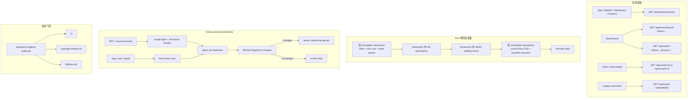

# ADR-XW-0093：Work 热路径、Run 两阶段准备、Codex 进程观察与发布门禁

- 状态：Implemented locally（待 live 性能/发布验收后转 Accepted）
- 日期：2026-08-19
- 目标：消除常驻全量 Issue 读取、SQLite writer transaction 内 Git I/O、Codex lifecycle 同步全进程扫描，以及 Release 未执行 repository hygiene 的风险
- 相关 canonical 合同：[Issues/Sessions 用户路由退役与 compat v1](0081-issues-sessions-route-retirement.md)、[Issue event 写预算与有界 artifact](0084-issue-event-write-budgets.md)、[事件保留、摘要、归档与删除策略](0007-event-retention-policy.md)、[Restart Recovery Invariants](0069-restart-recovery-invariants.md)
- 当前实现入口：`frontend/src/{App.jsx,store/dataStore.js,components/AppSidebar.jsx,pages/Issues.jsx,pages/WorkBoard.jsx}`、`frontend/src/api/work.js`、`backend-ts/src/http/{workApi.ts,readApiRoutes.ts,readApiDomain.ts}`、`backend-ts/src/db/repositories/{issues.ts,issueQueue.ts,issueRuns.ts}`、`backend-ts/src/domain/evidence/runGitWorkspaceBaseline.ts`、`backend-ts/src/providers/codex/{jsonRpc.ts,processLifecycle.ts}`、`scripts/repository-hygiene-audit.mjs`、`.github/workflows/{ci.yml,release.yml}`
- 独立 review：[`0093-hot-path-claim-lifecycle-hygiene-design-review.md`](0093-hot-path-claim-lifecycle-hygiene-design-review.md)
- 本文性质：可 review 的详细技术设计；不授权删除 live 数据、修改 schema、部署、发布或将状态改为 Accepted

## 0. 文档版本记录

- v1（2026-08-19）：基于 848 个 live Issues、3.80 MB legacy list 响应和当前代码调用链，提出 Work 有界读取、Run 两阶段准备、Codex process observation 节流、Release hygiene gate 以及独立 retention 边界；状态保持 Proposed，等待 review。
- v2（2026-08-19）：吸收独立 review。拆分 global/per-project summary 预算；补齐 Phase A 状态矩阵、Phase B 并发/timeout、Phase C immediate transaction 原子 once、存量 open Run 过渡、SSE 刷新节流、入口全集锁定和 `getAllWorks()` 删除；明确 cursor wire、counts 守恒、health warning、显式 hygiene roots 与分阶段 rollout。状态仍为 Proposed。
- v3（2026-08-19）：按第二轮减重 review 收敛首期合同。Project counts 改为硬上限 128 的一次性聚合，删除 Project cursor/page；Work cursor 首期只支持 `updated_at DESC`；Run preparation 删除 unavailable/prepared marker authority、`already_finalized` 状态机和 legacy transition，以 current-Run guarded validation + 单 baseline event 收敛；实施顺序改为 hygiene → lifecycle → summary → run split。状态仍为 Proposed。
- v4（2026-08-19）：完成本地实现与回归。Release hygiene、Codex lifecycle、Work summary/cursor/前端有界热路径、Run Phase A/B/C 及全部生产 materializer 已接线；状态改为 Implemented locally。尚未执行 live DB 性能采样、受控 tag Release 或部署，因此不宣称 Accepted。

## 1. 决策摘要

本设计作出五项相互独立但按同一性能与安全目标收敛的决定：

1. **常驻 UI 只读取有界 Work summary，不再读取全量 `/api/issues`。** Work 继续是主读取面；`/api/issues` 继续按 ADR-XW-0081 作为兼容面保留，现有 body/status 语义不被静默改变。
2. **Operational Work 有界分页，历史 Work 按需读取。** `triage/todo/in_progress/needs_user/failed` 属于 operational lanes；`done/cancelled` 属于 history lanes。页面初始加载 operational first page，历史 lane 进入可见区、用户切换历史过滤器或搜索时才读取。
3. **Run 创建改为“两阶段准备”。** 第一阶段只在短 immediate transaction 内认领 Issue、创建 Run 和写必要状态事件；Git HEAD/worktree observation 全部在 transaction 外完成；第二阶段用 canonical current Run CAS 复核并持久化 baseline。Provider 只能在第二阶段完成后启动。
4. **Codex 进程树观察改为异步、节流、按变化持久化。** 普通 refresh 共享 single-flight 并受 monotonic interval 限制；只有 register/stop/exit/signal safety path 强制 fresh scan；进程 identity tree 未变化时不落盘。
5. **Repository hygiene 成为打包和 Release 的 fail-closed 前置门禁。** CI、`package-release.sh` 和 Release workflow 都执行同一脚本；动态入口只能通过有理由、可测试的显式 root 分类，不能使用宽泛 orphan allowlist。

历史数据治理与以上热路径修复分离：**不通过批量删除旧 Issue 来修复列表性能**。Raw operational/durable log 的归档与删除继续遵守 ADR-XW-0007；Issue/Run/state/audit/delivery records 不因“页面太慢”获得删除授权。

## 2. 当前事实与问题边界

### 2.1 2026-08-18 live 只读样本

对 `$HOME/Library/Application Support/xuanwu-bun-live/state/runner.db` 的只读检查得到。2026-08-19T14:09:34Z 第二轮复核仍为 848 Issues、913 Runs、0 个瞬态 open Run：

| 指标 | 样本值 |
| --- | ---: |
| Issues | 848 |
| `done` | 750 |
| `cancelled` | 88 |
| `triage` | 10 |
| Issue Runs | 913 |
| terminal Issue 关联 events | 110,208 |
| terminal Issue event payload | 176.28 MiB |
| 其中 terminal `issue.log` | 102,414 rows / 169.29 MiB |
| SQLite 主文件 | 630.9 MiB |
| 超过 30 天的 terminal Issues | 713 |

同一 live 服务的 `GET /api/issues` 返回约 3,798,325 bytes；用户重复样本为 1.89–4.43 秒，冷样本达到 15.98 秒。一次后续热读取约 0.85 秒，证明 cache 能缓解但不能改变响应规模和 projection 工作量。

`110,208` 的口径是 **terminal Issue 关联 events**，不是全表 `issue_events`。同一时点全表为 110,218，另外 10 条属于当前 10 个 triage Issue。复核命令必须使用 SQLite read-only URI 或 `sqlite3 -readonly`，并在证据中保存查询口径与 UTC 时间，不能用持续增长的全表数字覆盖历史样本：

```bash
sqlite3 -readonly "$HOME/Library/Application Support/xuanwu-bun-live/state/runner.db" \
  "select count(*) from issue_events e join issues i on i.id=e.issue_id where i.status in ('done','cancelled');"
```

这些数据说明存在两个不同问题：

- **HTTP/UI 热路径问题：** 848 个 Issue 被重复读取、映射、投影、序列化和传输；它与 DB 文件是否 VACUUM 不是同一件事。
- **长期存储问题：** raw `issue.log` 占据大量空间；它应由 retention/archive contract 治理，不能通过删除整个 Issue 绕过。

### 2.2 全量 Issue 读取的实际放大链

当前链路是：

```text
App reconcile / Sidebar / Dashboard / Projects
  -> dataStore.issues.fetch()
  -> workApi.getIssues()
  -> GET /api/issues
  -> listIssues()
       - wide Issue columns
       - correlated comment_count
       - batched latest Run
  -> publicIssues()
       - per-project dependency graph
       - per-Issue decision projection
       - per-Issue MCP requirement projection
  -> JSON serialize ~3.8 MB
  -> frontend repeatedly filter/count/render
```

`listIssues()` 本身已经批量读取 latest Run，但 list DTO 仍携带 description、workflow snapshot、skill/MCP requirements、error 和 Run metadata。随后 `publicIssue()` 对每个 Issue 调用 `readIssueDecisionProjection()`；后者读取 Issue、human review events 和 PI acceptance activity。问题不是单个 SQL，而是**宽 DTO + O(Issue) projection + 常驻重复调用**。

### 2.3 Run 认领的 writer 风险

`claimNextIssue()` 使用 immediate transaction。其内部调用 `createIssueRun()`，而当前 `createIssueRun()` 会：

1. 读取 Project cwd；
2. 同步执行 `git rev-parse`；
3. 同步执行 `git status --porcelain -z`；
4. 对每个 dirty/untracked path 同步执行 `git hash-object`；
5. 写 Run 和 baseline event。

Git 仓库大、文件多、磁盘冷或 hook/filesystem 异常时，SQLite writer lock 会覆盖不可预测的外部 I/O 时长。所有共用 DB 的状态写入都可能被阻塞。

风险不只存在于 queue claim。生产代码还有 human-review continuation、PI acceptance retry/recover、Automation executor 和 `providerRuntime.ensureOpenIssueRun()` 等 Run materialization 入口。只改 `issueQueue.ts` 会留下相同问题。

### 2.4 Codex lifecycle 的扫描与落盘放大

当前 transport 在每个 RPC request 完成后 refresh，在多个 provider notification 上也 refresh。`CodexProcessGroupLifecycle` 只对同时到达的 refresh 做 single-flight；连续完成的 request 仍会重复执行同步：

```text
ps -axo pid=,ppid=,pgid=,rss=,command=
```

每次 refresh 都更新 `observed_at` 并原子重写 ownership 文件，即使 pid/ppid/pgid/command 完全没有变化。结果是主事件循环阻塞和无意义文件 I/O 同时存在。

### 2.5 Hygiene 当前状态

在当前 HEAD 上运行 `node scripts/repository-hygiene-audit.mjs --json` 返回 `ok=true`。旧的 `backend-ts/src/integrations/telegram.ts` 已不存在，Telegram 已拆成由 `runtime/core.ts` 可达的模块。

仍存在的缺口是：

- `.github/workflows/ci.yml` 已执行 hygiene；
- `.github/workflows/release.yml` 未显式执行 hygiene；
- `scripts/package-release.sh` 的 `run_preflight_checks()` 未执行 hygiene；
- 现有 release tests 只断言 CI 包含 hygiene，没有断言打包和 Release workflow。

因此 orphan 报告的文件事实已经过期，但“发布路径可绕过门禁”仍成立。

## 3. 目标、非目标与硬约束

### 3.1 目标

- App 启动、Sidebar、Command Center、Projects 和 Settings reconcile 不再调用全量 `/api/issues`。
- summary 响应大小随 Project/status 数增长，不随历史 Issue 数线性增长。
- operational lanes 有界读取；history lanes 只在用户明确需要时读取。
- 单项 detail 继续提供 decision、dependency、MCP requirements、latest Run 等完整信息。
- SQLite immediate transaction 内不执行 Git、`ps`、文件读取或其他外部进程。
- Run baseline 始终绑定 canonical current Run；CAS 失败时不得启动 Provider。
- shared dirty/untracked workspace 继续以 content-addressed snapshot 支持 attribution uncertainty，不降低 Handoff gate。
- Codex stop/cleanup 在发送 signal 前仍使用 fresh process table，不能因节流误杀 PID reuse 的无关进程。
- 本地打包、tag Release 和 CI 使用同一个 hygiene authority。
- 性能变化具备真实 live DB、并发和故障注入证据。

### 3.2 非目标

- 不在本设计中删除 `/api/issues*`、`Issues.jsx`、Issue 表或历史 API contract。
- 不把 Work authority 从 `issues + issue_events` 迁移到第二套 storage。
- 不把 summary 变成新的状态 authority；它只是 request-time projection。
- 不用 Redis、外部 cache 或 materialized counter table 作为 v1 前提。
- 不在本设计中启用 retention `delete_enabled`、批量删除 live Issue、GC artifacts 或 VACUUM live DB。
- 不改变 Provider completion、Evidence、Handoff、Approval 或 human-review 语义。
- 不因为性能目标放松进程 ownership identity 校验或 Git attribution fail-closed 规则。

### 3.3 硬约束

1. **Authority 不变：** Issue/Work、Run、Evidence 和 process ownership 的 authority 仍由现有表/文件承担。
2. **有界读取：** 所有新 list/board 请求必须有 server-enforced limit；删除前端 `allPages()/getAllWorks()`，不得保留可被生产页面重新调用的全量 helper。
3. **详情按需：** wide fields 和昂贵 projection 只能出现在单项 detail 或明确请求的 bounded page。
4. **Writer transaction 纯 DB：** transaction callback 内禁止 spawn、Git、filesystem scan 和网络。
5. **Provider start fence：** baseline finalize CAS 成功或显式 unavailable outcome 持久化前，不得调用 Provider。
6. **当前 Run fence：** baseline、runtime refs 和后续 Evidence 必须引用同一个 canonical current Run ID。
7. **停止路径 fresh：** throttle/cache 只能用于观察；signal safety path 必须强制 fresh scan。
8. **兼容 fail-closed：** `/api/issues` 的既有无参响应不因内部迁移静默变成分页或截断。
9. **删除独立授权：** 性能验收不能充当 retention/delete approval。

## 4. 总体目标架构



## 5. Work summary 与分页读取设计

### 5.1 Canonical 状态分组

API 使用 `WORK_STATUSES` 作为输出 vocabulary：

```text
operational = triage, todo, in_progress, needs_user, failed
history     = done, cancelled
```

兼容 Issue 状态 `pending_verification` 继续按既有 adapter 映射到 `needs_user`。未知 raw status 不得静默丢弃：summary 返回 `unknown_status_count`，同时触发 health warning；未知项不进入可操作 lane。

`failed` 虽是 terminal Work status，但仍有 retry/诊断操作，因此归入 operational read set。这个分组只决定读取热度，不改变 lifecycle 终态语义。

### 5.2 新增 `GET /api/works/summary`

contract 固定为 `xuanwu.work-summary.v1`，与 `xuanwu.work-timeline.v1` 等现有 Work 域合同一致。

请求参数：

| 参数 | 类型 | 语义 |
| --- | --- | --- |
| `project_id` | optional string | 只返回指定 Project 的 summary；不存在返回 404 |
| `include_projects` | optional boolean | global scope 默认 true；`project_id` 非空时 effective value 固定为 false，显式 true 返回 400 |

默认全局响应示例：

```json
{
  "contract": "xuanwu.work-summary.v1",
  "generated_at": "2026-08-19T00:00:00.000Z",
  "read_authority": "issues-via-work-adapter",
  "scope": { "project_id": "" },
  "counts": {
    "total": 848,
    "operational": 10,
    "history": 838,
    "triage": 10,
    "todo": 0,
    "in_progress": 0,
    "needs_user": 0,
    "failed": 0,
    "done": 750,
    "cancelled": 88,
    "unknown_status_count": 0
  },
  "activity": {
    "guarding": 0
  },
  "project_count": 1,
  "project_counts": [
      {
        "project_id": "xuanwu",
        "counts": {
          "total": 848,
          "operational": 10,
          "history": 838,
          "triage": 10,
          "todo": 0,
          "in_progress": 0,
          "needs_user": 0,
          "failed": 0,
          "done": 750,
          "cancelled": 88,
          "unknown_status_count": 0
        }
      }
  ]
}
```

`include_projects=false` 时仍返回 `project_count`，但省略 `project_counts`，不返回 `null` 或空数组。`project_id` 请求只返回该 Project 的 counts/activity，省略全局 Project 列表。

约束：

- summary 不返回 Issue title/description、latest Run、dependency、decision、readiness、MCP/skill requirements 或 event payload。
- `activity.guarding` 将当前前端 `GUARDING_PATTERN` 的含义迁移为后端确定性 aggregate，并用共享 fixture 保证语义不漂移；`counts.in_progress` 已提供进行中数量，不再在 `activity` 重复返回。
- `total = operational + history + unknown_status_count`；`operational/history` 不含 unknown。全局 counts 必须等于全部 per-project counts 的逐字段和。
- `project_id` 请求中的 counts/activity 都限定到该 Project；Sidebar 选择单个 Project 时可直接精确读取。
- `include_projects=true` 在同一 read snapshot 内先执行 `select count(*) from projects` 再聚合 counts，Project 数硬上限为 128。超过上限返回 409 `project_summary_capacity_exceeded`，不截断、不静默遗漏，也不回退读取 Issue 明细；global caller 可显式 `include_projects=false`，Projects 页在达到阈值前必须另立分页合同。
- global-only payload 随 status vocabulary 保持常量；包含 Project counts 的 payload 随 Project 数增长但受 128 硬上限约束，首期预算仍小于 64 KiB。Issue 数增长不得增加 response shape。
- v1 直接从 `issues` request-time `GROUP BY project_id, normalized_status` 读取，不新增 counter 表、trigger 或双写。
- 任意 unknown status 同时增加 `unknown_status_count`、metric `work_status_unknown_total{raw_status}`，并让 system health 返回 warning `work_status_unknown`；不记录 Issue title/description。

建议 repository 入口：

```ts
type WorkStatusCounts = Record<WorkStatus, number> & {
  history: number;
  operational: number;
  total: number;
  unknown_status_count: number;
};

type WorkSummary = {
  activity: { guarding: number };
  counts: WorkStatusCounts;
  project_count: number;
  project_counts?: Array<{ counts: WorkStatusCounts; project_id: string }>;
  scope: { project_id: string };
};

function readWorkSummary(db: RunnerDatabase, input: WorkSummaryInput): WorkSummary;
```

初版在 Project cap guard 通过后执行一次 `GROUP BY project_id, normalized_status`，当前 live 仅 5 个 Project。是否增加 index 必须由 `EXPLAIN QUERY PLAN` 和 live copy benchmark 决定，不能只因看到 `GROUP BY` 就修改根 schema。Project 数接近 128 的 health warning 只提示容量规划，不自动启用另一套读取路径。

### 5.3 `/api/works/board` 只读取请求 lanes

现有 `/api/works/board` 为所有 `WORK_STATUSES` 各读取 first page。修改为支持 repeated `status` 参数：

```http
GET /api/works/board?status=triage&status=todo&status=in_progress&status=needs_user&status=failed&page_size=20
```

规则：

- 未传 `status` 时保留当前“所有 lanes”兼容行为。
- 新前端必须显式传 operational statuses。
- 每个 lane 返回 `total/items/next_cursor/has_more`。
- 未请求的 lane 不查询、不返回 items；其计数来自 `/api/works/summary`。
- Board refresh 只替换已经加载的 operational first page；不得把 history 自动补齐。

### 5.4 `/api/works` 增加 keyset cursor

保留既有 `page/page_size` + 多 sort contract 供兼容调用。cursor v1 只支持首期真实需要的 `sort=updated_at&order=desc`：

```http
GET /api/works?status=done&sort=updated_at&order=desc&page_size=20&cursor=<opaque>
```

cursor v1 编码并校验；`filter_fingerprint` 是 normalized project/status/type/query 的稳定 SHA-256：

```ts
type WorkCursorV1 = {
  filter_fingerprint: string;
  issue_id: number;
  updated_at: string;
  version: 1;
};
```

Wire format 固定为 UTF-8 JSON 的 unpadded base64url，encoded length 最大 2,048 bytes。Decoder 必须：

1. 拒绝非法 base64url、未知/缺失 key、非 v1、非安全整数 ID 和非法/超长 timestamp；
2. 用当前 request 的 normalized `project_id/status/type/q` 和固定 `updated_at/desc` 重新计算 `filter_fingerprint`，不能信任 cursor 自带 fingerprint；
3. 无论 cursor 内容是什么，都在 SQL 重新应用当前认证后的 Project/status/type/query filters；cursor 只提供 seek tuple，不提供权限或 scope；
4. 错误返回 400 和 bounded code，不回显 decoded cursor。

默认排序使用 `(updated_at DESC, id DESC)`；下一页条件为：

```sql
updated_at < :cursor_updated_at
or (updated_at = :cursor_updated_at and id < :cursor_id)
```

cursor 必须与当前 filters 和固定 sort/order 匹配；不匹配返回 400，不猜测或重置到第一页。`page_size` 默认 20、最大 100。`title/status/created_at` 或 ascending 请求继续使用既有 page contract；与 `cursor` 同时出现时返回 400 `cursor_sort_unsupported`。只有真实 UI 需求和独立 query-plan 证据出现后，才扩展 cursor sort vocabulary。

### 5.5 History 按需触发

`done/cancelled` 只在以下任一事实发生时读取：

1. 用户选择 History/Archive filter；
2. 对应 lane 首次进入 viewport；
3. 用户执行明确包含 terminal statuses 的搜索；
4. deep link 指向某个 terminal Work，先读 detail，不预取整个 lane。

History lane header 的数字来自 summary；初始 items 为空不等于 total=0。UI 必须区分 `not_loaded / loading / loaded / error`，避免把“尚未读取”渲染成“没有历史”。

### 5.6 单项 detail 与 list DTO 分离

List/board item 只保留渲染卡片所需字段。建议 `WorkListItem` 不携带完整 goal/provenance audit payload；现有 `WorkLedgerEntry` 若暂时复用，也必须保证 page size 有界。

以下 projection 仅由 detail 请求计算：

- `readIssueDecisionProjection()`；
- 完整 dependency/readiness graph；
- MCP/skill requirements；
- full latest Run runtime metadata；
- Issue description、workflow snapshot 和 source excerpt；
- timeline/events/Evidence/Handoff。

Todo card 需要 dependency warning 时，board repository 只批量返回 bounded dependency summary：`ready/reason/waiting_reason`。禁止在 list mapper 中再次逐 Issue 调用 detail repository。

### 5.7 前端 store 与消费者迁移

`dataStore` 调整为：

```ts
{
  projects: [],
  workSummary: emptyWorkSummary(),
  workSummaryByProject: {},
  automations: [],
  // 删除全局常驻 issues: []
}
```

消费者迁移：

| 消费者 | 当前依赖 | 目标依赖 |
| --- | --- | --- |
| `AppSidebar` | 全量 Issue filter/count | global `workSummary.counts`；选择 Project 时读取/cache 单 Project summary |
| `Dashboard` | todo/in-progress/done arrays | summary counts；Active Work 继续用 command-center bounded API |
| `Projects` | 每 Project 全量 filter | `workSummary.project_counts`（Project cap≤128） |
| `useRunnerBrandState` | 全量 in-progress Issue + title pattern | `workSummary.activity` |
| `Settings` | reconcile 全量 issues | 只在具体设置需要时读 summary 或 detail |
| `Issues.jsx` rollback artifact | 全局 issues store | 页面本地 loader；仅在 legacy route 真正挂载时读取 |
| Issue detail | 依赖全局列表 | 保持现有单项 `GET /api/issues/:id` |

`PAGE_DATA_SLICES` 中的 `issues` slice 改为 `workSummary`。所有 Issue/Work mutation 成功后只 invalidates：

- `workSummary`；
- 当前受影响的 loaded lane first page；
- 当前打开的 detail。

SSE reconcile 同样只刷新这些有界资源，并与 Codex process throttle 分开实现前端 request coordinator：

- summary 只响应 `issue.created`、`issue.status_changed`、Issue title/project 变更和 delete 等真正影响 aggregate 的事件；`issue.runtime_updated`、tool item、Run transcript event 不刷新 summary；
- mutation success 立即 invalidate，但 500ms debounce 合并同一 burst；
- monotonic minimum interval 为 1 秒；interval 内只保留一个 trailing refresh；
- 同一 resource single-flight，filter/cursor 改变时 AbortController 取消旧请求；
- 1 秒突发窗口最多一个 leading + 一个 trailing summary request；30 秒 reconcile 只在没有更新鲜 in-flight/trailing 请求时执行；
- 旧响应不得覆盖新 filter、Project scope 或 cursor state。

`frontend/src/api/work.js` 中当前只有测试使用、生产零调用的 `allPages()/getAllWorks()` 在 Phase 3 直接删除，不保留 deprecated wrapper。Source budget test 断言 production source 中不存在 `getAllWorks(` 和无参 `/api/issues` list 调用。

### 5.8 Legacy `/api/issues` 边界

ADR-XW-0081 明确 `/api/issues` 在 compat v1 观察窗内 body/status/error 语义不变。因此：

- 不把无参 `/api/issues` 静默改成默认 20 条；
- 不从现有 response 删除字段；
- 不让新 Web 热路径继续调用它；
- 保留单项和 CLI write compatibility；
- 为显式 `limit/offset` 参数补齐 route parser，使受控 legacy caller 可以使用 repository 已有分页能力；
- 在 compatibility telemetry 与 access metrics 中区分 `xuanwu-web`、CLI 和 external caller。

当正式 release observation 证明 Web/CLI list consumer 为零后，才能按 ADR-XW-0081 的 G7 删除门禁决定是否收紧或移除 legacy list。

## 6. Run 两阶段准备设计

### 6.1 一句话协议

**DB 先建立唯一 Run anchor，Git 在 writer lock 外观察，DB 再用 current-Run CAS 接受该 observation；只有已接受或显式 unavailable 的 baseline outcome 才允许 Provider 启动。**

### 6.2 组件职责拆分

将当前 `createIssueRun()` 拆成三个边界：

```ts
// 仅 DB；只允许在调用者拥有的短 transaction 内执行。
function insertIssueRunRecord(
  db: RunnerDatabase,
  issueID: number,
  input: { provider?: string; startedAt: string }
): ReservedIssueRun;

// 仅 Git/filesystem；不得持有 RunnerDatabase，也不得写 event。
async function observeGitWorkspaceBaseline(
  input: GitWorkspaceObservationInput
): Promise<CapturedGitWorkspaceBaseline | null>;

// 仅 DB；短 immediate transaction + current Run CAS。
function finalizeIssueRunPreparation(
  db: RunnerDatabase,
  reservation: ReservedIssueRun,
  baseline: CapturedGitWorkspaceBaseline | null
): RunPreparationResult;
```

建议类型：

```ts
type ReservedIssueRun = {
  attempt: number;
  issue_id: number;
  project_cwd: string;
  project_id: string;
  run_id: string;
  started_at: string;
};

type CapturedGitWorkspaceBaseline = {
  base_revision: string;
  captured_at: string;
  entries: WorkspaceEntry[];
  snapshot_sha256: string;
};

type RunPreparationResult =
  | { baseline_recorded: boolean; status: "ready"; run: IssueRun }
  | { status: "claim_invalidated"; run: IssueRun | null };
```

Git unavailable/timeout/head-changed 作为本次 observation 的瞬态结果返回 `null`，只进入 bounded metric/diagnostic，不创建新的 durable event contract。完整错误正文经过 redaction 后最多保留简短 diagnostic，不写绝对私人路径、命令输出或文件内容。缺 baseline 继续由现有 completion/Handoff attribution 解释为 uncertainty/fail-closed。

### 6.3 Phase A：短 immediate transaction

Queue claim 的 Phase A 保持以下操作原子：

1. 复核 Project execution lock 无 active Work；
2. 选择 dependency/readiness/filter 均允许的 candidate；
3. `UPDATE issues ... WHERE id=? AND status='todo'` 并要求 `changes=1`；
4. 计算 attempt，插入 `issue_runs`，`git_base_revision=''`；
5. 写 `issue.status_changed`、run request/materialized 等现有必要事件；
6. 返回 `ReservedIssueRun`；
7. 提交。

所有入口的 Phase A 状态契约如下，不能只依赖调用者在 transaction 外读取到的旧状态：

| 入口 | Phase A 前状态 | 同一 immediate transaction 内的要求 |
| --- | --- | --- |
| queue claim（包括 retry/forceRetry 后续） | `todo` | guarded `todo -> in_progress`，`changes=1` 后才插入 Run |
| human-review request-changes | 当前 open human-review contract 允许的状态，通常为 `needs_user` | 先 guarded 更新为 `in_progress`，再插入 Run 和 revision event；任一步失败整体回滚 |
| PI acceptance recover/retry | 必须为 `in_progress` | 在 transaction 内重新验证 current card、current terminal Run 和 Issue revision，再插入新 Run；不能只依赖 transaction 外 `assertCurrentCard()` |
| Automation 新建 Issue-backed Work | 无旧 Issue | Issue/Work 以 `in_progress` 创建后，在同一受控流程插入 Run |
| Automation 使用已有 target Issue | 必须为允许执行的 `in_progress` 且无冲突 open Run | guarded 复核后插入；否则 fail closed，不隐式改状态 |
| Provider runtime | 不适用 | 不创建 Run、不改变状态，只接受显式且仍为 canonical current open Run 的 `issueRunId` |

`retryIssue/forceRetryIssue` 是上游触发链，不是 Run materialization 入口：它们经 `requestNewRun -> queueIssueForRun` 把 Issue 排回 `todo`，最终仍由 queue claim 执行本表第一行。

transaction callback 内禁止：

- `Bun.spawn/KeptProcess/Bun.spawnSync`；
- `git`；
- `fs.readFile/stat/readdir`；
- network；
- sleep/retry/backoff；
- 任何可能等待 Provider 或外部锁的操作。

Human review、PI continuation/retry 和 Automation 的 Phase A 仍可在同一短 transaction 内写各自的关联 event，但它们只能调用 `insertIssueRunRecord()`，不能调用 Git observer。

### 6.4 Phase B：transaction 外 Git observation

Phase A commit 后执行：

1. `git rev-parse --verify HEAD^{commit}`；
2. `git status --porcelain=v1 -z --no-renames --untracked-files=all --ignored=no --`；
3. 对 dirty/untracked path 计算 `--no-filters` content OID；
4. canonical sort entries；
5. 计算 snapshot SHA-256；
6. 记录 `captured_at`。

Git commands 改用异步 process API，避免阻塞 Core event loop。v1 可以保留逐 path `hash-object` 语义，但必须：

- 从 reservation commit 开始计算 15 秒总 deadline，包含 semaphore 等待、status/hash、HEAD stability check 和最多一次重试；
- 全局 observation semaphore=2，同一 normalized real `project_cwd` concurrency=1；不同逻辑 Project 指向同一 cwd 时必须进入同一队列；
- 单个 child process timeout 不超过 10 秒且不得超过剩余总 deadline；
- dirty path hashing 使用 bounded worker concurrency=2；path 数/仓库规模导致 deadline 耗尽时返回 `null`，不截断后冒充完整 snapshot；
- stdout/stderr 有上限；
- 不在日志打印 path/content；
- 任一步失败都返回 `null`，不抛出到 writer transaction。

等待时间、执行时间和 timeout reason 分别进入 metric。相同 cwd 的多个 reservation 不能共享同一 snapshot，因为它们的 `captured_at/run_id` 不同；per-cwd single-flight 只串行化 I/O，不复用 observation 结果。

为缩小外部 HEAD 变化窗口，在完整 observation 后再于 transaction 外执行一次快速 `rev-parse`：

- HEAD 相同：进入 Phase C；
- HEAD 改变：完整 observation 最多重试一次；
- 连续变化：返回 `null` 并增加 bounded `head_changed` metric，后续 attribution fail closed/uncertain。

这不是 workspace exclusive lock。Xuanwu 的 project execution lock 只阻止自身并行执行；人工或其他进程仍可能修改 workspace。Baseline 的职责是记录事实并在 Handoff attribution 中排除不确定路径，不是假装获得仓库独占权。

### 6.5 Phase C：current Run CAS finalize

第二个短 `.immediate()` transaction 只解决真实竞争：Phase B 期间 Issue/Run 可能被 cancel、supersede、替换或改变 Project cwd。它不建立新的 prepared-marker 状态机。

transaction 执行以下 current-Run validation：

```sql
select 1
from issue_runs ir
join issues i on i.id = ir.issue_id
join projects p on p.id = i.project_id
where ir.id = :run_id
  and ir.issue_id = :issue_id
  and ir.attempt = :attempt
  and ir.ended_at = ''
  and i.status = 'in_progress'
  and p.id = :project_id
  and trim(p.cwd) = :project_cwd
  and ir.id = (
    select id from issue_runs
    where issue_id = :issue_id and ended_at = ''
    order by attempt desc limit 1
  );
```

validation 通过后：

- `baseline !== null`：执行 `UPDATE issue_runs SET git_base_revision=:revision WHERE id=:run_id AND issue_id=:issue_id AND attempt=:attempt AND ended_at='' AND git_base_revision=''`，并在 UPDATE 中重复 current-open/status/cwd 条件；只有 `changes=1` 才写现有 `issue.run_git_workspace_baseline.v1`，event 与 UPDATE 同 transaction commit；
- `baseline === null`：不写 `git_base_revision`、不写 unavailable event，只返回 `{status:"ready", baseline_recorded:false}`；现有 missing-baseline 语义负责后续 uncertainty；
- validation 或 guarded UPDATE 不通过：返回 `claim_invalidated`，不得写 baseline、不得回滚他人的状态、不得启动 Provider；
- guarded UPDATE `changes=0` 包含 cancel、supersede、新 current Run、cwd 变化或重复 finalize，统一 fail closed，不引入 `already_finalized` 分支。

当前 DB 没有“每 Issue 单 open Run”的 partial unique constraint，因此 current-Run validation 不能删除；但当前调用图也没有两个并发 finalizer 的真实入口，所以首期不增加 outcome marker、unique index 或冲突-marker状态机。若未来引入 multi-writer/recovery finalize，必须先设计 DB-level uniqueness 与幂等重放，不能复用本首期假设。

### 6.6 Provider start fence

所有 Provider 执行入口新增 required `issueRunId`：

```ts
type ProviderRunInput = {
  issueId: number;
  issueRunId: string;
  // existing fields
};
```

`providerRuntime.ensureOpenIssueRun()` 改为只读 `mustGetCurrentOpenIssueRun(issueRunId)`：

- 不隐式创建 Run；
- 校验 input Run 的 Issue ID/attempt 与 canonical current open Run 一致且 Issue 仍允许执行；
- 不满足时 fail closed，返回 preparation error，不调用 Provider。

新 Run 是否已经执行 Phase B/C 由唯一 orchestration control flow 和 materializer source test 保证，不把 event marker提升为 execution authority。既有/旧 Run re-enter 继续依赖 Run/session/invocation truth。

### 6.7 Crash 与恢复

可能的 crash window：

| 窗口 | 持久化事实 | 恢复行为 |
| --- | --- | --- |
| Phase A commit 前 | 无新 claim | 正常重新竞争 |
| Phase A 后、observation 前 | open Run，无 session/turn | 复用现有 unstarted Run recovery，关闭/重排，不自动启动 Provider |
| observation 后、Phase C 前 | DB 仍只有 reservation | observation 是内存临时值；重启后重新观察或回收 claim |
| Phase C 后、Provider start 前 | open Run，可能有 captured baseline，但无 session/turn | 仍按 unstarted Run recovery 关闭/重排，不因 baseline event 自动启动 Provider |
| Provider accepted 后 | Run + session/turn/invocation facts | 按 ADR-XW-0069 恢复，不重新创建 Run |

Baseline event 只用于 Git attribution，不是 prepared/execution authority。部署时既有 open Run 无需 marker migration：有 session/turn/invocation facts 的 Run 继续按现有 recovery truth re-enter；无这些事实的 Run 继续走 `canRequeueUnstartedClaim`。缺 baseline 只影响 completion/Handoff attribution certainty，不创建 legacy 状态或兼容观察窗。

Phase C 后到 Provider accepted 的 exactly-once 仍由现有 execution intent/outcome 和 current Run fence 负责。

### 6.8 生产调用点迁移

入口按“直接 materializer、执行 orchestrator、上游触发链”分开，避免把间接 caller 误报为另一条 Run 创建路径：

| 类别 | 当前入口 | 目标 |
| --- | --- | --- |
| 直接 materializer | `issueQueue` 内 `createIssueRun` | Phase A guarded claim 调用 `insertIssueRunRecord`；事务外 await observation/finalize |
| 直接 materializer | human review request-changes 内 `createIssueRun` | Phase A comment/status/Run/revision event；Phase B/C 后再 resume session |
| 直接 materializer | PI acceptance recover/retry 两处 `createIssueRun` | Phase A 重验 card/status 后创建；Phase B/C 后再 recover/run |
| 直接 materializer | Automation executor 内 `createIssueRun` | Phase A Run anchor；Phase B/C 后执行 workflow；无仓库时 baseline 为 null |
| 隐式 materializer | `providerRuntime.ensureOpenIssueRun()` | 删除 create fallback，改为 `mustGetCurrentOpenIssueRun(issueRunId)` |
| 执行 orchestrator | `projectLoop.runProjectLoopOnce()` | 它是 `claimNextIssue` 的 caller，不是第二条 materialization；await Phase C `ready` 后才 publish/start Provider |
| 上游触发链 | `retryIssue/forceRetryIssue -> requestNewRun -> queueIssueForRun` | 保持只写 lifecycle intent/`todo`；最终汇入 queue claim，不直接 prepare Run |
| tests/fixtures | 直接构造 Run | 可调用 DB-only fixture helper，但必须显式说明不执行 Provider，不导出到 production |

静态 source test 锁定以下不变量：

- production 中旧 `createIssueRun(` 和会隐式 create 的 `ensureOpenIssueRun(` 调用数为 0；
- `insertIssueRunRecord` 只允许被列出的 Phase A service/importer 使用；新增 importer 必须更新本节、状态矩阵和测试；
- `providerRuntime` 必须要求 `issueRunId` 并验证 canonical current open Run，不得 import Run insert helper；
- `issueRuns.ts` 不 import Git observer，Git/filesystem 模块不拥有 transaction；
- retry/forceRetry source test 证明只汇入 queue，不被重复计为 materializer。

## 7. Codex process lifecycle 设计

### 7.1 异步 inspector

当前 `jsonRpc.ts` 两处 refresh 都是 fire-and-forget `.catch(() => {})`，inspection/persist failure 会被静默吞掉。目标实现仍可让普通 observation 不阻塞 RPC 交付，但 catch 必须转成 bounded diagnostic + `codex_process_scan_failed_total`，不能无痕失败。

目标接口：

```ts
type ProcessInspectionResult =
  | { ok: true; rows: ProcessTreeEntry[] }
  | { ok: false; reason_code: "exit_nonzero" | "output_too_large" | "parse_failed" | "spawn_failed" };

type ProcessInspector = () => Promise<ProcessInspectionResult>;

async function inspectProcessTable(): Promise<ProcessInspectionResult>;
```

实现使用 `Bun.spawn()`，异步读取 bounded stdout，等待 exit code 后解析。失败返回显式失败结果，不能把 inspection failure 冒充“当前没有进程”。调用场景分别处理：

- 普通 observation：保留旧 ownership，记录 scan failure metric；
- register：无法确认 root tree 时允许记录 root identity 的最小 ownership，随后 trailing scan；
- stop/exit/signal safety：scan failure 时不得根据陈旧 descendant identity 批量 signal；只使用受控 root handle 的 `process.kill()` fallback，并记录 diagnostic；
- stale ownership reconciliation：inspection failure 不删除 ownership file、不宣称 mismatch，返回可重试 diagnostic。

### 7.2 Refresh modes

```ts
type ProcessRefreshMode = "coalesced" | "force";

refresh(process, { mode: "coalesced", reason: "structural_event" });
refresh(process, { mode: "force", reason: "before_signal" });
```

默认参数：

- `minScanIntervalMs = 1_000`；
- single-flight 仍保留；
- interval 内新的 coalesced request 只设置一个 trailing timer；
- timer deadline 使用 `performance.now()`/monotonic clock，不使用 wall clock；
- force 不受 throttle 限制，但仍按相同 root generation single-flight，不能让旧 root scan 覆盖新 root。

### 7.3 调用策略

| 调用点 | 模式 | 原因 |
| --- | --- | --- |
| register | force | 建立初始 ownership anchor |
| RPC request finally | 删除 unconditional refresh；只更新 activity signal | request 完成不等于 process topology 改变 |
| `CODEX_PROCESS_STRUCTURE_EVENTS` | coalesced | tool/MCP 生命周期可能改变 descendant tree |
| 低频 active fallback | coalesced，5 秒 activity tick | 覆盖未发结构事件的 descendant 变化 |
| stop 前 | force | signal safety |
| TERM grace 后、KILL 前 | force | 只杀仍匹配的 groups |
| process exit cleanup | force | 收敛 detached descendants |
| stale ownership reconcile | force | restart/PID reuse safety |

5 秒 fallback 只在 transport 存在 active process/lease 时调度；idle/stopped 状态没有常驻 `ps` timer。

### 7.4 Identity fingerprint 与持久化

稳定 fingerprint 输入：

```ts
type ProcessIdentity = Pick<ProcessTreeEntry, "command" | "pgid" | "pid" | "ppid">;
```

规则：

- 按 pid 排序；
- 包含 root identity 和所有可达 descendant identity；
- 排除 `rss_bytes`、`observed_at`；
- 比较 canonical JSON 字符串即可，不需要加密 hash。

扫描结果处理：

1. identity fingerprint 未变化：更新内存 telemetry 中的 RSS/last-scan metric，但不修改 persisted `observed_at`，不写 ownership 文件；
2. fingerprint 变化：更新 `processes/observed_at` 并原子 persist；
3. root 不匹配或 PID reuse：普通 refresh 不覆盖 ownership；stop/reconcile 按现有 mismatch 规则 fail closed；
4. register 总是 persist，remove 总是串行删除。

`observed_at` 的语义由“最后扫描时间”收紧为“最后一次已持久化 topology observation 时间”。最后扫描时间只进入内存 metric，避免每次 scan 为更新时间戳制造文件写放大。

### 7.5 并发与 generation fence

现有 `refreshOperation.rootPID` 扩展为 `{rootPID,generation,promise}`：

- register 新进程时 generation +1；
- scan 完成时只有 generation/rootPID 均匹配才可更新内存或文件；
- trailing timer 捕获 generation，不允许旧 timer 扫描新进程；
- stop/remove file operation 继续与 persist 使用同一串行 file queue；
- force request 在已有同 generation scan 中等待；完成后若 safety caller 要求 fresh-after-wait，则再执行一次 force scan，避免把等待前的结果当作 signal 前 fresh result。

### 7.6 可观察性

增加 bounded counters/histogram：

- `codex_process_scan_requested_total{reason,mode}`；
- `codex_process_scan_executed_total`；
- `codex_process_scan_throttled_total`；
- `codex_process_scan_unchanged_total`；
- `codex_process_ownership_persisted_total`；
- `codex_process_scan_failed_total{reason_code}`；
- `codex_process_scan_duration_ms`；
- `codex_process_last_scan_age_ms`。

不记录完整 command、私人路径或进程表正文；diagnostic 只保留 PID/PGID 数量和 bounded reason。

## 8. Repository hygiene 与 Release gate

### 8.1 单一 authority

`scripts/repository-hygiene-audit.mjs` 继续是唯一检查实现。CI、package 和 Release 只调用，不复制 orphan graph 逻辑。

### 8.2 接线

`scripts/package-release.sh`：

```bash
run_step "repository hygiene" node "$ROOT_DIR/scripts/repository-hygiene-audit.mjs"
```

放在 dependency install/clean-worktree 检查之后、backend/frontend build 之前，尽早 fail。

`.github/workflows/release.yml`：在 checkout + Node setup 后、依赖安装和测试前增加显式步骤：

```yaml
- name: Audit repository hygiene
  run: node scripts/repository-hygiene-audit.mjs
```

虽然 `package-release.sh` 会再次执行，同一 workflow 中保留显式步骤是有意的 defense in depth：

- workflow 日志能立即显示 gate；
- 即使未来 packaging step 被条件化或替换，Release 仍 fail closed；
- 本地手工 package 同样不能绕过。

Release workflow 与 `package-release.sh` 当前还会重复运行完整 backend tests；这是既有发布成本，不由新增 hygiene step 引入。Phase 1 记录两段耗时，但不得用未经校验的环境变量跳过 package preflight；如后续优化，必须使用可验证的 source SHA/lockfile/gate attestation 独立设计。

### 8.3 Orphan 分类规则

后端 production source 只有三种合法状态：

1. 从 `backend-ts/src/main.ts` 的 runtime graph 可达；
2. 是测试、script 或已列出的独立 executable root；
3. 被删除。

现有 audit 使用隐式 roots：`main.ts`、`spikes/piSmoke.ts`、`usage/benchmark.ts`、全部 tests 和 scripts。v2 将非测试 production roots 改为显式 metadata，不允许“某个 test 恰好 import 了 production 文件”代替 runtime/package classification：

```js
const backendProductionRoots = [
  {
    path: "backend-ts/src/main.ts",
    owner: "runtime",
    purpose: "service entrypoint",
    invocation: "xuanwu serve",
    test: "backend-ts/src/mainWiring.test.ts"
  },
  {
    path: "backend-ts/src/providers/pi/xuanwuPolicyExtension.ts",
    owner: "release-package",
    purpose: "Pi policy extension staged beside packaged binary",
    invocation: "scripts/package-release.sh:stage_pi_policy_extension",
    test: "backend-ts/src/providers/pi/provider.test.ts"
  }
];
```

`spikes/piSmoke.ts`、`usage/benchmark.ts` 若继续作为 executable root，也必须补相同 metadata。Scripts/tests 可按各自文件集合成为 tooling/test roots，但不能借其 import 自动把无 runtime/package owner 的 production source 判为有效。

动态 import、packaging-only source 或独立 entrypoint 若无法由 runtime 静态 graph 发现，必须进入显式 roots 并附 owner、用途、启动/打包命令和对应 test。禁止：

- 按整个目录 allowlist；
- `telegram*`、`legacy*` 等 glob 例外；
- 只为让 gate 变绿而保留无 runtime caller 文件。

### 8.4 Gate contract tests

扩展 `scripts/release-workflow.test.mjs`，断言以下三个文件都包含精确 hygiene command：

- `.github/workflows/ci.yml`；
- `.github/workflows/release.yml`；
- `scripts/package-release.sh`。

另增加 hygiene fixture test：复制最小 source graph，加入一个未引用 production `.ts` 后必须 exit 1；把该文件接到 runtime root 后必须 exit 0。测试不得修改真实仓库文件。

## 9. 历史数据治理：与性能修复解耦

### 9.1 为什么不直接删除 838 个 terminal Issue

批量删除 terminal Issue 会级联或影响：

- `issue_runs`；
- `issue_events` 和 compact projections；
- Run Attempt/Session observation relations；
- Work relations/events；
- completion/verification/Handoff refs；
- PI watch/run-group/audit records；
- external tracker/automation links。

live 样本至少有一个 terminal Issue 被 `automation_execution_links ... ON DELETE RESTRICT` 引用。即使 SQL 删除成功：

- `/api/issues` 会暂时变小，但常驻全量读取模式仍会随新历史复发；
- SQLite 文件不会因 DELETE 立即从 630.9 MiB 缩小；需要 checkpoint/VACUUM 或重建；
- Evidence/Handoff/审计可能失去可回查 carrier；
- 当前 retention policy 的 delete gate 仍未满足。

因此“删除老 Issue”不是本 ADR 的实施阶段，也不是热路径验收条件。

### 9.2 正确的独立 retention 路线

后续独立 issue 只能按 ADR-XW-0007 推进：

1. **report-only：** 在一致性 live copy 上列候选、hold、refs 和 blockers；
2. **shadow archive：** raw R1/R2 payload append-only archive，保存 manifest、row count、ID/order/provenance/hash；
3. **restore rehearsal：** 隔离恢复并验证 consumer；
4. **dual-read parity：** Issue timeline、Session、Guardian、PI activity、Evidence/Handoff 全部无漂移；
5. **scoped source delete：** 只删除明确获准的 raw operational/durable source rows，不删除 state/audit/delivery records；
6. **space reclaim：** writer quiesce、WAL checkpoint、备份验证后，在维护窗口评估 VACUUM/重建。

713 个“超过 30 天的 terminal Issue”只能作为候选规模参考，不能直接视为 713 个可删除实体。

### 9.3 UI Archive 不等于 storage delete

产品上的 Archive filter 只是 `done/cancelled` 的按需查询。它不需要新增 `archived_at`，也不改变 retention。若未来要支持用户显式隐藏某个 terminal Work，可单独设计 reversible visibility preference；不得用物理删除实现普通筛选。

## 10. 数据、schema 与兼容性

### 10.1 主修复不要求 schema migration

v1 设计可以复用：

- `issues.status/project_id/updated_at/id`；
- `issue_runs.id/issue_id/attempt/ended_at/git_base_revision`；
- 现有 captured baseline event 继续只作为 Git attribution evidence；
- 现有 ownership JSON contract。

新增 API contract，但不新增 unavailable/prepared event、DB 列或 marker authority。Run 是否可执行继续由 canonical current Run + session/invocation truth 决定；Git baseline 缺失沿现有 attribution uncertainty 处理。

### 10.2 Index 决策门禁

只有满足以下证据才新增 index：

1. live consistent copy 的 `EXPLAIN QUERY PLAN` 未命中合适 index；
2. 10k/100k Issue fixture benchmark 显示 grouped summary 或 keyset page 超预算；
3. 写放大和 DB size 成本已量化；
4. migration/rollback/quick_check 已覆盖。

首期 cursor 只使用 `updated_at DESC,id DESC`，候选 index 仅评估 `(status,updated_at,id)` 和 `(project_id,status,updated_at,id)`。其他 sort 继续 page contract，不为尚无 UI 需求的 title/created-at keyset 预建 index。

### 10.3 Compatibility

- `xuanwu.work-summary.v1`、board status filter 和 cursor 都是 additive。
- 既有 page-based `/api/works` 保留。
- 既有 `/api/issues` body/status/error 保留。
- ownership file contract 仍是 `codex-process-group-ownership.v1`；`observed_at` 语义收紧但字段不变。
- baseline captured event contract 不变；不新增 unavailable/prepared event。
- Release gate 只增加失败条件，不改变产物格式。

## 11. 失败语义

| 场景 | 行为 |
| --- | --- |
| summary query 失败 | 页面保留最后成功 snapshot，标记 stale/offline；不回退全量 `/api/issues` |
| Project count=129 且请求 `include_projects=true` | 409 `project_summary_capacity_exceeded`；可重试 global-only，不截断、不回退 Issue 明细；必须先扩展设计再支持更多 Project |
| SSE summary burst | 500ms debounce + 1s minimum interval；最多一个 leading + 一个 trailing request |
| operational page 失败 | 只影响对应 lane，可重试；summary counts 保留 |
| history page 未加载 | 明确 `not_loaded`，不显示为空 |
| cursor/filter 不匹配 | 400；客户端丢弃旧 cursor 后明确重新加载第一页 |
| Phase A CAS 失败 | 未认领，不做 Git observation |
| Git observation timeout/failure | Phase C 仍复核 current Run，但不写 baseline/event；Provider 可继续，completion attribution fail closed/uncertain，metric 记录原因 |
| Phase C CAS 失败 | `claim_invalidated`；不启动 Provider，不覆盖新 Run |
| Core crash during preparation | recovery 收敛 unstarted Run，不并行启动 |
| async `ps` 失败（普通 refresh） | 保留旧 ownership，不写文件，记录 metric |
| async `ps` 失败（stop） | 不按 stale descendant table 批量 signal；受控 root handle fallback |
| identity unchanged | no-op，不改 `observed_at` |
| hygiene failure | CI/package/Release 立即失败，无 bypass input |
| retention gate 不全 | 保持 `report_only`，不删除任何 live row |

## 12. 可观察性与性能预算

### 12.1 HTTP/DB

记录但不暴露敏感数据：

- route、status、response bytes、duration；
- summary grouped-query duration；
- board/list SQL duration、returned rows、total；
- detail projection duration；
- legacy `/api/issues` caller family 与 duration bucket。

建议 live 验收预算（当前机器、同一 DB、一致服务配置）：

| 路径 | 预算 |
| --- | --- |
| `include_projects=false` 或 single-project summary payload | < 16 KiB；随 Issue 历史和 Project 数增长保持不变 |
| 默认 `include_projects=true` summary payload | Project≤128，整体 < 64 KiB；随 Issue 数增长保持不变 |
| `/api/works/summary` 20 次 warm p95 | < 150 ms |
| `/api/works/summary` cold first request | < 1 s |
| operational board first page | 每 lane ≤20，合计响应 < 256 KiB，warm p95 < 300 ms |
| history page | ≤100 items，响应与 page size 有界 |
| SSE 1 秒 burst | summary request ≤2，lane refresh 只命中受影响且已加载的 lane |
| App boot | 0 次无参 `/api/issues`；代码库不存在 production `getAllWorks()` helper/call |

100k terminal + 20 operational fixture 中，summary response bytes 与 848 样本相比不得因 Issue 数增长超过 5%；query time需另报绝对值，不能只报百分比。

### 12.2 Run preparation

记录：

- `run_reservation_transaction_ms`；
- `run_git_observation_ms`、dirty path count、outcome code；
- `run_git_observation_queue_wait_ms`、active global/per-cwd observers；
- `run_baseline_finalize_transaction_ms`；
- `run_baseline_cas_conflict_total{reason}`；
- reservation-to-provider-accepted duration。

不记录 path、Git content、stdout 或 repository private name。Phase B 总时长不得超过 15 秒；验收要求 Phase A/Phase C transaction 的 p99 不受 artificial 5 秒 Git delay 影响。

### 12.3 Process lifecycle

使用 §7.6 counters。验收重点是 executed scan/persist 数，而不是只证明 single-flight promise 数。

## 13. 实施分期与改动地图

### Phase 0：基线与 contract tests

- 固化 live/fixture 请求次数、payload bytes、duration、SQL plan；
- 增加 App request-budget source tests；
- 增加“transaction 内不得调用 Git observer”的依赖边界测试；
- 增加 Run direct materializer allowlist/source test 和 SSE burst request-count test；
- 增加 process scan/persist counter tests；
- 不改运行行为。

### Phase 1：Release hygiene（可独立先合入）

- 修改 `scripts/package-release.sh`；
- 修改 `.github/workflows/release.yml`；
- 扩展 `scripts/release-workflow.test.mjs`；
- 将 runtime/packaging/executable production roots 改为带 owner/purpose/invocation/test 的显式 metadata；
- 加 orphan fixture test。

### Phase 2：Codex lifecycle

- process inspector async 化；
- refresh mode、throttle、trailing timer、generation fence；
- 删除 request-finally unconditional scan；
- topology fingerprint 与 unchanged no-write；
- stop/exit/reconcile 强制 fresh tests；
- live scan/persist rate smoke。

### Phase 3：Work summary 与前端热路径

后端：

- `backend-ts/src/db/repositories/issues.ts` 或新 `workSummary.ts`：grouped summary repository；
- `backend-ts/src/http/workApi.ts`：global/single-project summary、Project cap=128 的全量 counts、board status filter、updated-at cursor；
- contract/focused/performance tests。

前端：

- `frontend/src/api/work.js`：summary/cursor client；
- 删除 `allPages()/getAllWorks()` 及只验证该 helper 的旧测试；
- `frontend/src/store/dataStore.js`：`issues` → `workSummary`；
- `AppSidebar/Dashboard/Projects/useRunnerBrandState`：summary consumer；
- `WorkBoard.jsx`：operational initial load、history on demand、cursor load more；
- `Issues.jsx`：仅 legacy route 本地加载，不进入 global reconcile；
- `Sessions.jsx`、`FirstDeliveryGuide.jsx` 及其他 `refreshData(['issues'])` call site：改为有界 summary/lane invalidation；
- request budget、state guard、interaction tests。

Phase 3 rollout 顺序固定为：additive backend + contract/performance evidence → 前端临时 `WORK_SUMMARY_READ_ENABLED` page-level flag（关闭时使用现有 rollback artifact，开启时只走新路径，不做 shadow 全量双读）→ canary/live Network 验收 → 默认开启 → 一个正式 release 零回退后删除 flag 与旧全局 issues slice。Flag 必须有 owner、默认值、移除版本和 telemetry，不得无限保留。

### Phase 4：Run 两阶段准备

- `issueRuns.ts` 只保留 DB record/CAS functions；
- 新建纯 Git/filesystem 的 `gitWorkspaceObservation.ts`；`runGitWorkspaceBaseline.ts` 保留 baseline payload validation、stored baseline 与 delivery-scope attribution，移除主动 Git process 调用；
- 新建 domain/service orchestration，例如 `domain/run/runPreparation.ts`；
- 迁移 queue、project loop、human review、PI acceptance、Automation、provider runtime；
- 增加 crash/CAS/Git failure/concurrency tests。

### Phase 5：独立 retention 项目（不由本文自动进入）

- 仅在用户/确定性 gate 单独授权后启动；
- 遵守 ADR-XW-0007 report → archive → restore → parity → scoped delete。

各 Phase 可独立 commit/review，实施顺序固定为 hygiene → lifecycle → summary → run split。Phase 2、3、4 不应在同一大提交中混合，避免性能回归和 lifecycle 竞态难以归因。

## 14. 测试与验收矩阵

### 14.1 Summary/分页

- 0 Issue、仅 operational、仅 history、混合状态；
- `pending_verification -> needs_user`；
- unknown status 显式计数；
- `total = operational + history + unknown_status_count`，全部 per-project counts 与 global 逐字段守恒；
- Project filter/不存在 Project；
- `include_projects=false` 省略 `project_counts`；Project=128 正常，Project=129 返回 capacity error 且不查询 Issue 明细；
- 100k history fixture payload 有界；
- cursor base64url/strict keys/2,048-byte cap、稳定排序、重复值 tie-break、非法/篡改/跨 filter cursor；
- cursor 只接受 `updated_at DESC`；其他 sort + cursor 返回 `cursor_sort_unsupported` 并继续保留 page contract；
- status 在翻页期间变化时无 offset 型整页漂移；
- detail 仍含完整 projection；list 不调用 per-Issue decision projection；
- App/Sidebar/Dashboard/Projects 初始与 reconcile 均不请求 `/api/issues`；
- 100 个 aggregate-affecting SSE event 的 1 秒 burst 最多触发两个 summary request；runtime/tool-only event 触发 0 个 summary request；
- production source 中不存在 `getAllWorks(` 和 `allPages(`；
- history `not_loaded/loading/error/loaded` UI；
- deep link terminal detail 不预取 history lane；
- light/dark/responsive 不属于本 ADR 的视觉改版，但若实现触碰 UI，按设计系统完成相应回归。

### 14.2 Run preparation

- 两个 claim contender 只有一个 Phase A 成功；
- queue、human review、PI acceptance、Automation 的 Phase A 状态矩阵逐项覆盖；retry/forceRetry 只汇入 queue；
- Git observer 人工延迟 5 秒时，其他 DB writer 仍能完成；
- transaction instrumentation 证明 spawn count=0；
- cancel/supersede/cwd change/new Run 导致 Phase C CAS 失败；
- CAS 失败后 Provider invocation count=0；
- captured baseline 只写一次且绑定 current Run；
- 第二次 finalize 的 guarded UPDATE `changes=0` 并停止，不产生第二条 baseline event；
- observation 返回 null 时不写 durable event，current-Run validation 通过后继续，后续 attribution 显式 uncertain；
- HEAD observation 中途变化最多重试一次；
- dirty/untracked/deleted path、特殊字符 path、missing file；
- crash after Phase A / after Phase C 的 recovery；
- 旧 open Run 有 session/invocation 时沿既有 recovery re-enter；无 session/turn 时沿 `canRequeueUnstartedClaim`，不依赖 baseline marker；
- human review、PI retry/recover、Automation 路径同样经过 preparation；
- `providerRuntime` 缺 `issueRunId` 或 input Run 不是 canonical current open Run 时 fail closed；
- Handoff attribution 继续排除 shared dirty paths并输出 uncertainty。

### 14.3 Process lifecycle

- 1,000 concurrent refresh 只有一个 scan；
- 1,000 sequential refresh 在同一 interval 内只有一个 immediate + 最多一个 trailing scan；
- unchanged tree 扫描多次只在 register 写一次文件；
- topology 新增/删除 descendant 各写一次；
- 只有 RSS 改变不写 ownership 文件；
- old generation scan 不覆盖新 root；
- stop 前 force scan 不复用超时 cache；
- TERM 后 KILL 前再次 force scan；
- PID reuse/command mismatch 不 signal；
- async `ps` failure 的 observation/stop/reconcile 分支；
- active fallback timer 仅在 process/lease active 时存在；
- event-loop heartbeat 在慢 `ps` fixture 下不被同步阻塞。

### 14.4 Hygiene/Release

- 当前 repository hygiene pass；
- unreferenced production source fixture fail；
- referenced/dedicated-root fixture pass；
- packaging-only `xuanwuPolicyExtension.ts` 通过显式 root，而不是 test import 偶然可达；root metadata 缺 owner/invocation/test 时 fail；
- CI、package、Release workflow contract test；
- package 在 hygiene fail 时不开始 build/archive；
- release job 在 hygiene fail 时不获得 publish step。

### 14.5 Live 验收

必须保留：

- source revision、build stamp、DB snapshot identity；
- 20 次 warm + 1 次 cold 请求的 raw timing/bytes；
- Browser Network 证明 App boot/reconcile 无 `/api/issues`；
- 并发 writer + artificial slow Git 证据；
- Codex activity window 内 scan/persist counters；
- Release workflow dry evidence 或受控 tag run；
- `pragma quick_check=ok`。

单元测试、mock timing 或删除数据后的快结果不能替代上述 live evidence。

## 15. Rollback

### 15.1 Read path

- summary route additive，回滚前端时 legacy `/api/issues` 仍可用；
- 临时 `WORK_SUMMARY_READ_ENABLED` 只做 page-level 单选，不允许新旧双读；回滚时关闭 flag，零回退 release 后删除 flag；
- 若 summary 错误，前端显示 stale/error，不自动 fallback 到全量读取；
- 修复后重新部署即可恢复，不需要 DB rollback；
- cursor 实现回滚时保留 page contract。

### 15.2 Run preparation

- captured baseline event contract不变；本设计不新增 unavailable/prepared event；
- rollback binary 能读取已创建 Run，但不得重新在 transaction 内启用 Git；若必须紧急回滚，应回到“transaction 外 observation + 无 CAS”的临时安全版本，而不是原始锁内 I/O；
- crash/restart 仍按 unstarted open Run recovery；
- 既有 open Run 继续按 Run/session/invocation truth 恢复，不做 marker migration；
- 不删除或手修 partially reserved Run。

### 15.3 Process lifecycle

- ownership JSON contract不变；旧 binary 可读取；
- async inspector/throttle 可独立回滚，但 stop force-scan safety tests 必须保持；
- 不删除 ownership file 来掩盖失败；先停 Provider、检查 PID identity，再按 runbook 处理。

### 15.4 Release gate

- hygiene gate 属 fail-closed 安全门禁，不提供 workflow input 绕过；
- 若脚本误报，修正 graph/root 分类和测试后重新发版，不注释 gate。

## 16. 风险与权衡

| 风险 | 缓解 |
| --- | --- |
| summary 与 detail status 映射漂移 | 复用 Work status adapter fixture，守恒测试，unknown bucket |
| Project 数使 summary payload 膨胀 | Project≤128 一次聚合；129 时显式 capacity error，global-only/单 Project 仍可读，达到阈值前另立分页合同 |
| 多个页面/SSE 各自请求导致请求数增加 | summary 单次共享；500ms debounce + 1s minimum interval；board first-page 合并；detail/history 按交互触发 |
| keyset cursor 在状态变化时漏看刚更新项 | SSE + first-page reconcile；cursor 避免 offset 大范围重复/跳项 |
| Phase A 后 crash 留下 open Run | 复用 unstarted Run recovery + current Run fence |
| baseline observation 后人工修改 workspace | baseline 只是时点事实；Handoff attribution 继续排除不确定路径 |
| Git unavailable 让 Run attribution降级 | metric/diagnostic + 既有 missing-baseline uncertainty；不新增 event authority、不伪造干净 baseline |
| throttle 错过短命 descendant | structural event + trailing scan + active fallback；stop/exit force fresh |
| 不按 RSS 落盘导致 persisted RSS 陈旧 | RSS 作为内存 telemetry；ownership file 只承担 identity/recovery |
| package 与 workflow 重复执行 hygiene | 有意 defense in depth；脚本快速、单一 authority |
| 不删老 Issue，DB 文件仍大 | 独立 retention/archive 项目；热路径不依赖 DB 物理缩小 |

## 17. Review 决策点

v3 已按两轮 review 收敛以下默认值；批准前本文保持 Proposed：

1. 聚合路由为 `/api/works/summary`，contract=`xuanwu.work-summary.v1`；默认一次返回全部 per-project counts，Project 硬上限 128，超限显式 capacity error；可用 `include_projects=false` 读取 global-only。
2. Operational lanes=`triage/todo/in_progress/needs_user/failed`；history=`done/cancelled`；counts 守恒包含 unknown bucket。
3. Work cursor 是 strict base64url JSON，首期只支持 `(updated_at DESC,id DESC)`，page 默认 20、最大 100；其他 sort 继续旧 page contract。
4. 前端 summary coordinator 使用 500ms debounce、1s minimum interval、single-flight + one trailing；临时 rollout flag 不做 shadow 全量双读并在一个零回退 release 后删除。
5. Git observation global concurrency=2、同 cwd=1、总 deadline=15 秒、单 child≤10 秒、HEAD-change 最多重试一次。
6. Codex `minScanIntervalMs=1_000`，active fallback=5 秒；stop/exit/reconcile 始终 force。
7. Git observation 返回 null 时允许 Provider 继续启动，但 completion/Handoff attribution 必须显式 uncertain/fail closed；不新增 unavailable/prepared marker。
8. Phase C 保留 current-Run/status/cwd validation；captured baseline 用 guarded UPDATE + 单 event，`changes=0` 即停止。未来引入 multi-writer finalize 前另立 DB uniqueness/idempotency 合同。
9. 历史 Issue 不因本 ADR 批量删除；retention Phase 5 需要独立授权和设计验收。

## 18. 完成定义

只有同时满足以下条件，本文对应实现才能从 Proposed 进入 Accepted/implemented 记录：

- App boot、reconcile 和列出的全局消费者对无参 `/api/issues` 的调用为零；
- `allPages()/getAllWorks()` production helper 已删除，SSE burst request budget 通过；
- summary/board/history 达到 §12 性能与大小预算，并在 100k history fixture 下保持有界；
- list path 不执行 per-Issue decision/detail projection；
- 所有生产 Run materialization 入口均通过 Phase A/B/C，transaction 内 external process count=0；
- CAS/cancel/crash/restart/共享 dirty workspace 回归全部通过；
- Phase A 状态矩阵、Phase C current-Run guarded validation、既有 open-Run recovery 回归全部通过；
- Codex scan 真正受 interval 限制，unchanged tree 不落盘，stop force-scan safety 不退化；
- CI、package 和 Release 均运行 hygiene，orphan fixture 能阻断发布；
- live DB `quick_check=ok`，无数据删除、无 authority 漂移；
- 文档记录最终 review 决策、实现 revision、验证证据和未完成风险；
- 未经独立授权，不 commit/push/deploy/release，也不执行 retention delete/VACUUM。

### 18.1 2026-08-19 本地实现记录

实现事实：

- 新增 `GET /api/works/summary`、Project cap=128、unknown bucket/health warning、board status filter 和 strict `updated_at DESC` cursor；legacy `/api/issues` 无参语义保持不变，并新增显式 `limit/offset` parser。
- 前端删除全局 `issues` slice 与 `allPages()/getAllWorks()`；Dashboard、Sidebar、Projects、品牌状态和 Work Board 改读 summary；首屏只取 operational lanes，History 具备 `not_loaded/loading/error/loaded` 并在 viewport/search 后读取。
- Run materialization 改为 `insertIssueRunRecord → observeGitWorkspaceBaseline → finalizeIssueRunPreparation`；Git observer 使用异步子进程、global=2/per-cwd=1、15 秒 deadline、child≤10 秒、hash worker=2 和一次 HEAD retry；Provider runtime 只接受 canonical current open Run。
- Codex process inspection 改为异步 bounded result；普通 refresh 使用 single-flight、1 秒 monotonic throttle、one trailing 和 topology fingerprint no-write；stop/exit/reconcile 强制 fresh，失败时只回退受控 root handle。
- CI、`package-release.sh`、Release workflow 共用 `repository-hygiene-audit.mjs`；production roots 有显式 metadata，orphan fixture 能 fail closed。

本地证据：

- backend：`bun test --timeout 60000`，2183 pass / 0 fail；
- frontend：`bun test --timeout 30000`，560 pass / 0 fail；`npm run lint`、`npm run build` 通过；
- scripts/release：`node --test scripts/*.test.mjs`，29 pass / 0 fail；repository hygiene `ok=true`；`git diff --check` 通过；
- 隔离 fixture + Playwright：Dashboard/Work 启动无 `/api/issues`，只出现 summary、bounded Work list 与 operational board；History 进入横向 viewport 后才发起 `status=done/cancelled` 请求；浅色、深色、桌面及 720px viewport 已目检。

尚待独立 live acceptance：

- 对真实 live DB 记录 20 次 warm + 1 次 cold timing/bytes、100k fixture 绝对查询时间、`EXPLAIN QUERY PLAN` 与 `pragma quick_check`；
- 记录 slow-Git + concurrent writer、Codex scan/persist counters 和受控 Release dry/tag evidence；
- 完成上述证据后再由 reviewer 将本文状态改为 Accepted。本文没有授权或执行 live 数据删除、VACUUM、commit、push、deploy 或 release。
