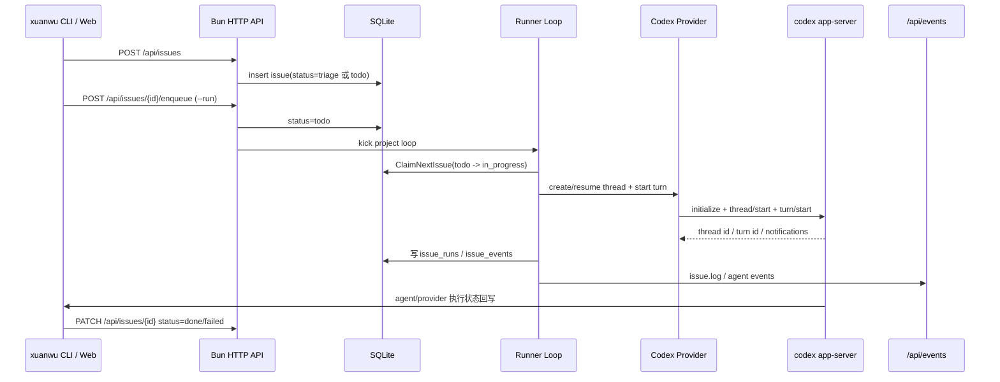

# Codex 后端 Server 对接说明

本文说明玄武的 Bun/TypeScript 后端如何通过 `xuanwu` 兼容运行时对接 Codex 后端 server（`codex app-server`），以及 issue 自动执行、Sessions 页面、审批和事件流在两边之间如何流转。

## 术语边界

- **Issue Runner Bun 后端**：本仓库的 HTTP API、SQLite、runner loop 和 SSE 服务，入口在 `backend-ts/src/main.ts`。
- **Codex 后端 server**：由 Bun 后端拉起的子进程，默认命令是 `codex app-server --listen stdio://`。
- **Codex provider adapter**：`backend-ts/src/providers/codex`，负责把内部 provider 调用转换为 Codex app-server 的 JSON-RPC 请求，并把 Codex notification 规范化为内部事件。
- **CLI 客户端模式**：同一个 `xuanwu` Bun 二进制在非 `serve` 子命令下会作为短命令 CLI，调用 Issue Runner HTTP API 创建、查询、更新 issue。

## 启动与配置

Bun 后端启动时会创建 provider adapter，但不会立刻拉起 Codex app-server；第一次需要 Codex 能力时才 lazy start。

默认配置来自 `backend-ts/src/config/env.ts`：

```txt
XUANWU_ADDR             默认 127.0.0.1:3008（源码 launchd 使用 0.0.0.0:3008）
XUANWU_ROLE             默认 all；正式部署分别使用 web / core
XUANWU_CORE_ADDR        Web 代理的 Core 地址，正式部署默认 127.0.0.1:3009
XUANWU_STATE_DIR        默认 data-bun
XUANWU_DB               默认 <state-dir>/runner.db
XUANWU_AUTH_TOKEN_FILE  默认 <state-dir>/auth_token
XUANWU_CODEX_CMD        默认 codex app-server --listen stdio://
XUANWU_WEB_DIR          默认空；源码/Release 部署会传入已构建 web 目录
```

等价启动示例：

```bash
./dist/xuanwu serve \
  --addr 0.0.0.0:3008 \
  --state-dir data-bun \
  --db data-bun/runner.db \
  --web-dir frontend/dist \
  --codex-cmd codex
```

服务装配顺序：

1. 解析配置并打开 SQLite。
2. 创建 provider runtime（Codex / Claude）。
3. 注册 HTTP API、SSE、system status/logs、静态前端。
4. 恢复 in-progress issue 状态。
5. 启动 auto-run project loop 和 Supervisor auto-manage scheduler。

上述顺序只在 `core`/`all` 执行。`web` role 使用独立的轻量入口，不打开 DB、不执行 migration，也不加载 PI SDK、provider、scheduler 或 connector；它直接服务 SPA/hashed assets，并以流式反代保留 API/SSE/upload/download 的请求与响应语义。Core 不可用时 Web 页面壳仍可访问，动态 API 返回 bounded `503`。正式 launchd/systemd 默认双进程，`--role all` 与未指定 role 的行为保留一个 release window 作为开发/回滚兼容入口。

## Codex app-server 协议

当前对接方式是 **stdio JSON-RPC line protocol**：

- Bun 后端通过子进程启动 `codex app-server --listen stdio://`。
- 每个请求是一行 JSON，写入 Codex 进程 stdin。
- Codex 的 stdout 每行是一条 JSON message，stderr 会作为 provider/runtime 事件暴露。
- adapter 用递增 `id` 维护 pending request；收到同 id response 后唤醒对应调用。

主要 RPC 能力包括：

- `initialize`
- `model/list`
- `thread/start`
- `thread/list`
- `thread/read`
- `thread/resume`
- `thread/name/set`
- `turn/start`
- `turn/interrupt`
- approval / server request response

## Issue 自动执行链路



关键行为：

1. `issue create --run` 实际是先 `POST /api/issues`，再 `POST /api/issues/{id}/enqueue`。
2. runner loop 只 claim `todo` issue；`triage` 默认不自动执行。
3. 每个 issue 会创建或绑定独立 provider session，避免不同任务上下文互相污染。
4. agent/provider 输出不会直接改 issue 状态；它必须在验证完成后按执行契约显式回写最终状态。
5. 如果 provider run completed 但 issue 仍不是 `done` / `failed` / `cancelled`，runner 会把 issue 标为 failed，避免“模型说做完了但没有真实验收/回写状态”的假完成。

更多 provider-neutral 契约见 `docs/agent-execution-contract.md`。

## Sessions API 与 Codex threads

Sessions 页面直接消费 provider session/thread 能力。Codex provider 支持：

| HTTP API | Codex RPC |
| --- | --- |
| `GET /api/sessions?limit=&cursor=` | `thread/list` |
| `GET /api/sessions/{threadId}` | `thread/read` / `thread/resume` |
| `POST /api/sessions` | `thread/start`，有 prompt 时再 `turn/start` |
| `POST /api/sessions/{threadId}/messages` | `thread/resume` + `turn/start` |
| `POST /api/sessions/{threadId}/interrupt` | `turn/interrupt` |

### 会话自动命名

Codex 会话未指定标题时，玄武在第一条任务消息启动后，使用 Xuanwu Supervisor 已配置的模型和鉴权直接调用一次 LLM 生成标题，不创建 Agent 会话、不挂载工具。Issue 会话使用原始 Issue 标题和正文；手动创建的会话使用用户消息。

- 标题格式为 `MMDD｜类型｜主题` / `MMDD｜Type｜Topic`，例如 `0903｜修复｜消息重复` 或 `0903｜Fix｜Duplicate messages`。日期只取 Codex thread 的 `createdAt`（Unix 秒），按后端每次生成时检测到的系统时区转换（遵循进程 `TZ` / 操作系统配置），包含创建时刻的夏令时规则；不能用 `updatedAt` 替代。不依赖浏览器上报，也不根据语言推断时区。
- Prompt、类型和主题跟随 `/api/i18n` 保存的应用语言，优先于输入内容的语言。中文类型为功能、设计、修复、优化、发布、探索、文档、研究；英文对应 Feature、Design、Fix、Optimize、Release、Explore、Docs、Research。
- 中文主题最多 32 字符；英文优先 2–7 个单词、最多 64 字符，保留正常空格和技术名称。主题不重复项目名，无法判断时保留原名。
- 每次生成开始时读取语言和后端时区，本轮 Prompt 和结果校验共用同一快照；切换语言或时区配置影响之后的生成，不批量翻译或改名已有会话。无法检测有效时区时保留原名。
- `POST /api/sessions` 的 Codex 请求可传可选 `title`；非空时直接使用该名称，不调用标题模型。已有非空名称的会话不会在后续消息或恢复时重新生成。
- 自动命名在后台运行，最多等待 20 秒，不重试 LLM；模型配置缺失、输出无效、返回 `null`、超时或失败均保留原名。Issue 的默认名称仍为 `Issue #<id>`。
- 写入前重新读取会话名称，并监听改名通知；生成期间发生用户改名则放弃自动写入。仅调用 `thread/name/set`，不更改项目名称、内容、项目归属、排序、置顶或归档状态。
- 命名结果由 Codex 持久化，不批量改写已有会话。Prompt 和格式校验见 `backend-ts/src/pi/sessionTitlePrompt.ts`。

## Agent/provider 通过 CLI 或 API 反向更新 Runner

agent/provider 在执行 issue 时不直接访问 SQLite，而是通过短命令 CLI 调 Runner API。CLI 默认读取 `XUANWU_ADDR`，未设置时连接 `127.0.0.1:3008`。

示例（只传 token file 路径，不输出实际 token）：

```bash
./dist/xuanwu issue status --addr 127.0.0.1:3008 --id <issue-id> --token-file <state-dir>/auth_token --json
./dist/xuanwu issue update --addr 127.0.0.1:3008 --id <issue-id> --status done --token-file <state-dir>/auth_token --json
./dist/xuanwu system status --addr 127.0.0.1:3008 --token-file <state-dir>/auth_token --json
```

如果 CLI 不可用，provider 必须使用 API 等价更新：

```bash
curl -fsS -X PATCH "http://${XUANWU_ADDR:-127.0.0.1:3008}/api/issues/<issue-id>" \
  -H "Authorization: Bearer ${XUANWU_AUTH_TOKEN}" \
  -H "Content-Type: application/json" \
  -d '{"status":"done"}'
```

确认 project id 时，当前 CLI 没有 `project list`，直接查 API：

```bash
curl -fsS -H "Authorization: Bearer ${XUANWU_AUTH_TOKEN}" \
  "http://${XUANWU_ADDR:-127.0.0.1:3008}/api/projects"
```

Runtime 状态：

```bash
curl -fsS http://127.0.0.1:3008/health
./dist/xuanwu system status --addr 127.0.0.1:3008 --token-file <state-dir>/auth_token --json
```

`/api/system/status` 只返回只读健康摘要：API/DB、脱敏后的配置、provider command 是否存在、runner loop/hold/in_progress 计数；不会返回 token 值，也不会为 status 主动拉起新的 Codex 深度探针。

## 本地 / 远程 transport 安全

- `/health` 免鉴权，供 launchd / systemd / 反代健康检查使用。
- `/api/*`（包括 `/api/system/status`、`/api/system/doctor`、SSE `/api/events`）属于敏感 API；启用 token 时必须携带 `Authorization: Bearer ...` 或 UI cookie。
- 默认浏览器 Origin 策略只允许本机 origin（`localhost` / `127.0.0.1` / `::1`）。
- 远程访问必须启用 token。首次启动会在 state dir 自动生成 `auth_token`（权限 `0600`）；交互式安装终端只显示新 token 一次，非交互安装只显示文件路径。也可用 `XUANWU_AUTH_TOKEN_FILE` 指向权限受限文件；不要提交 token 文件。
- 首次浏览器访问把服务器 token 保存到当前浏览器。登录后可在 Settings 的 Advanced / Runtime 中原子轮换文件托管的 token；旧值立即失效，新值只返回一次。`XUANWU_AUTH_TOKEN` 环境变量托管时必须在部署环境中轮换，UI 不允许覆盖。
- 对公网暴露时优先绑定 `127.0.0.1` 并通过 SSH tunnel、Caddy 或 nginx 反代终止 HTTPS。
