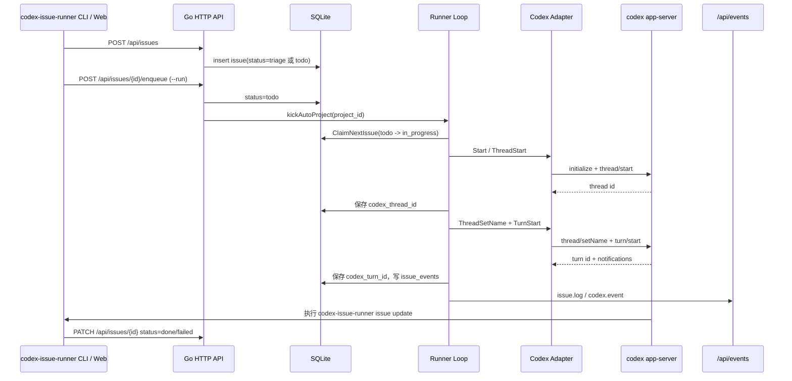

# Codex 后端 Server 对接说明

本文说明 Codex Issue Runner 的 Go 后端如何对接 Codex 后端 server（`codex app-server`），以及 issue 自动执行、Sessions 页面、审批和事件流在两边之间如何流转。

## 术语边界

- **Issue Runner Go 后端**：本仓库的 HTTP API、SQLite、runner loop 和 SSE 服务，入口在 `backend/cmd/codex-issue-runner/main.go`。
- **Codex 后端 server**：由 Go 后端拉起的子进程，默认命令是 `codex app-server --listen stdio://`。
- **Codex adapter**：`backend/internal/codex` 包，负责把 Go 方法转换为 Codex app-server 的 JSON-RPC 请求，并把 Codex notification 规范化为内部事件。
- **Codex CLI 客户端模式**：同一个 `codex-issue-runner` 二进制在非 `serve` 子命令下会作为短命令 CLI，调用 Issue Runner HTTP API 创建、查询、更新 issue。

## 启动与配置

Go 后端启动时会创建 Codex adapter，但不会立刻拉起 Codex app-server；第一次需要 Codex 能力时才 lazy start。

默认配置来自 `backend/internal/config/config.go`：

```txt
CODEX_RUNNER_ADDR       默认 127.0.0.1:3008
CODEX_RUNNER_DB         默认 data/app.db
CODEX_RUNNER_CODEX_CMD  默认 codex
CODEX_RUNNER_WEB_DIR    默认空，使用二进制内嵌前端；设置后改为托管外部目录
--codex-args            默认 app-server --listen stdio://
```

等价启动示例：

```bash
codex-issue-runner serve \
  --addr 127.0.0.1:3008 \
  --db data/app.db \
  --codex-cmd codex \
  --codex-args 'app-server --listen stdio://'
```

`main.go` 的服务装配顺序是：

1. 解析配置并打开 SQLite。
2. 创建全局 `events.Bus`。
3. `codex.NewAdapter(cfg.CodexCmd, cfg.CodexArgs)` 创建 Codex client。
4. `runner.New(store, bus, client)` 创建 runner。
5. 启动 auto-run project loop 和 cron scheduler。
6. 挂载 HTTP API、SSE、可选静态前端。

## Go 与 Codex app-server 的协议

当前对接方式是 **stdio JSON-RPC line protocol**：

- Go 通过 `os/exec` 启动 `codex app-server --listen stdio://`。
- 每个请求是一行 JSON，写入 Codex 进程 stdin。
- Codex 的 stdout 每行是一条 JSON message，stderr 会作为 `process/stderr` 事件暴露。
- Go 用递增 `id` 维护 pending request；收到同 id response 后唤醒对应 goroutine。

请求形态：

```json
{"id":1,"method":"thread/start","params":{"cwd":"/path/to/repo","ephemeral":false}}
```

Go 侧按 message 形态分流：

| Codex message | Go 处理方式 |
| --- | --- |
| 有 `id`、无 `method` | request response，交给 `pending[id]` |
| 有 `id`、有 `method` | server request，例如审批请求，走 `handleServerRequest` |
| 无 `id`、有 `method` | notification，走 `normalizeEvent` 后进入事件流 |

第一次调用 Codex 时，adapter 会先发 `initialize`：

```json
{
  "clientInfo": {"name": "codex-issue-runner", "version": "0.1.0"},
  "capabilities": {"experimentalApi": true}
}
```

## Codex RPC 方法映射

`backend/internal/codex.Client` 是 Go 后端依赖的接口面，主要方法与 Codex RPC 对应关系如下：

| Go 方法 | Codex RPC | 用途 |
| --- | --- | --- |
| `Start` | `initialize` | lazy start 子进程并初始化协议 |
| `ModelList` | `model/list` | 给前端项目配置和 session 表单取模型列表 |
| `ThreadStart` | `thread/start` | 为 issue 或手动 session 创建 Codex thread |
| `ThreadList` | `thread/list` | Sessions 列表页分页读取 Codex threads |
| `ThreadRead` | `thread/read` | adapter 支持读取 thread；当前 API 详情主要用 resume |
| `ThreadResume` | `thread/resume` | Sessions 详情页读取并恢复 thread |
| `ThreadSetName` | `thread/setName` | issue 执行时把 thread 名设置为 issue 标题 |
| `TurnStart` | `turn/start` | 向指定 thread 发送用户输入并开始 turn |
| `InterruptTurn` | `turn/interrupt` | 取消 issue 或中断 session turn |
| `ResolveApproval` | server request response | 用户批准/拒绝 Codex 请求的操作 |

`thread/start` 的参数由 `threadStartParams` 生成：

- `cwd`：项目工作目录，来自 project 或手动 session 输入。
- `model`：空值或 `codex-default` 会传 `null`，让 Codex 使用自身默认模型。
- `approvalPolicy`：项目配置；`always` 会映射为 `untrusted`，`danger-only` 会映射为 `on-request`。
- `sandbox`：默认 `workspace-write`。
- `developerInstructions`：runner 注入的执行约束。
- `ephemeral=false`：确保 thread 持久化，Sessions 页可以复用。
- `threadSource=user`：标记为用户来源 thread。
- `config.model_reasoning_effort`：仅在传入 reasoning effort 时设置。

`turn/start` 的 input 是 `[]codex.UserInput`：

- 普通 Markdown 会变成 `{type:"text", text:"..."}`。
- Markdown 中的 `` 会查 SQLite uploads，把附件拆成 `localImage` 输入，路径为本地上传文件路径。

## Issue 自动执行链路

Issue 自动执行是 Go 后端对 Codex server 的主要使用场景。



关键行为：

1. `issue create --run` 实际是先 `POST /api/issues`，再 `POST /api/issues/{id}/enqueue`。
2. runner loop 只 claim `todo` issue；`triage` 默认不自动执行。
3. 每个 issue 会创建一个独立 Codex thread，避免不同任务上下文互相污染。
4. runner 会把 `codex_thread_id`、`codex_turn_id` 写回 issues 表，便于 UI 展示和取消。
5. Codex 输出不会直接改 issue 状态；它必须在验证完成后执行 CLI：

```bash
codex-issue-runner issue update --id <issue-id> --status done --json
# 或
codex-issue-runner issue update --id <issue-id> --status failed --error "<失败原因>" --json
```

如果 Codex turn 正常 `completed`，但 issue 仍不是 `done` / `failed` / `cancelled`，runner 会把 issue 标为 failed，并写入错误：

```txt
Codex turn completed without explicit issue status update; expected Codex to run codex-issue-runner issue update after verification
```

这样可以避免“模型说做完了但没有真实验收/回写状态”的假完成。

## Sessions API 与 Codex threads

Sessions 页面直接把 Codex threads 作为 source of truth，不另造一套 session 存储。

HTTP API 与 Codex RPC 对应关系：

| HTTP API | Runner 方法 | Codex RPC |
| --- | --- | --- |
| `GET /api/sessions?limit=&cursor=` | `ListSessions` | `thread/list` |
| `GET /api/sessions/{threadId}` | `ReadSession` | `thread/resume` |
| `POST /api/sessions` | `CreateSession` | `thread/start`，有 prompt 时再 `turn/start` |
| `POST /api/sessions/{threadId}/messages` | `StartSessionTurn` | `thread/resume` + `turn/start` |
| `POST /api/sessions/{threadId}/interrupt` | `InterruptSession` | `turn/interrupt` |

Session 创建时可以指定 `project_id`，后端会读取 project 的 `cwd/model/approval_policy/sandbox` 作为默认 Codex 配置；也可以直接传 `cwd/model/reasoning_effort/approval_policy/sandbox` 覆盖。

## 事件流与日志

Codex adapter 会把 Codex notification 转成统一 `codex.Event`，再由 runner 分两路发布：

1. 全局 SSE：`codex.event`，给 UI 展示当前 Codex runtime 状态。
2. Issue 日志：匹配当前 `threadId/turnId` 的可读文本会写入 `issue_events`，并作为 `issue.log` 推到 SSE。

当前会提取文本的 Codex notification 包括：

- `item/agentMessage/delta`：模型输出增量。
- `item/commandExecution/outputDelta`：命令输出增量。
- `item/fileChange/outputDelta` / `item/fileChange/patchUpdated`：文件变更 diff。
- `item/started` / `item/completed`：命令启动、命令异常、文件变更完成。
- `turn/started` / `turn/completed`：turn 生命周期。
- `error`：Codex runtime 错误。

事件匹配规则在 runner 内部非常窄：只有 `threadId` 相同，且 `turnId` 为空或等于当前 turn 的事件，才会被当前 issue/session 消费。

## 审批与 Codex server request

当 Codex server 向 Go 发带 `id + method` 的 server request 时，adapter 会同步返回结果或进入待审批状态。

支持的审批请求：

- `item/commandExecution/requestApproval`
- `item/fileChange/requestApproval`
- `item/permissions/requestApproval`
- 兼容旧协议：`applyPatchApproval`、`execCommandApproval`

处理流程：

1. adapter 为请求生成内部 `approval-{n}` id。
2. 发布 `approval/requested` 事件，payload 包含原始 method 和 params。
3. UI 调用 `POST /api/codex/approvals/{approval-id}/resolve`。
4. Go 将 `approve`、`approve_session`、`deny`、`abort` 映射为 Codex 当前协议需要的 decision。
5. adapter 向 Codex server 写回原始 request id 对应的 response。

对暂不支持的交互型 server request，当前采用安全降级：

- `item/tool/requestUserInput`：返回空 answers。
- `mcpServer/elicitation/request`：返回 cancel。
- `item/tool/call`：返回 `success=false`。
- 未知 method：返回 JSON-RPC `-32601 unsupported server request`。

## Codex 通过 CLI 反向更新 Runner

Codex 在执行 issue 时不直接访问 SQLite，而是通过短命令 CLI 调 Runner API。CLI 默认读取 `CODEX_RUNNER_ADDR`，未设置时连接 `127.0.0.1:3008`。如果服务启用了 API bearer token，CLI 支持 `--token` 或 `CODEX_RUNNER_AUTH_TOKEN`；遇到 `401 Unauthorized: unauthorized` 时，优先读取运行中服务配置的 token 文件：先看 `CODEX_RUNNER_AUTH_TOKEN_FILE`，源码部署默认是当前服务数据目录里的 `data/auth_token`，release/其他项目则来自对应 state/data 目录，不要假设都在当前仓库。

示例：

```bash
codex-issue-runner issue status --id <issue-id> --token "$(cat data/auth_token)" --json
CODEX_RUNNER_AUTH_TOKEN="$(cat data/auth_token)" codex-issue-runner issue update --id <issue-id> --status done --json
```

如果 `PATH` 里的 `codex-issue-runner` 版本过旧，可在本仓库优先用 `./dist/codex-issue-runner`，或重新安装 release/skill 后再试。

推荐创建 issue：

```bash
codex-issue-runner issue create \
  --project <project-id> \
  --title "<一句话标题>" \
  --body-file /tmp/codex-issue.md \
  --run \
  --json
```

常用状态命令：

```bash
codex-issue-runner issue status --id <issue-id> --json
codex-issue-runner issue logs --id <issue-id>
codex-issue-runner issue retry --id <issue-id> --json
codex-issue-runner issue cancel --id <issue-id> --json
```

Runtime 状态：

```bash
codex-issue-runner system status --token "$(cat data/auth_token)" --json
curl -H "Authorization: Bearer $(cat data/auth_token)" http://127.0.0.1:3008/api/system/status
```

`/api/system/status` 只返回只读健康摘要：API/DB、脱敏后的配置、Codex command 是否存在、runner loop/hold/in_progress 计数；不会返回 token 值，也不会为 status 主动拉起新的 Codex 深度探针。

## 排查建议

- `GET /api/codex/models` 失败：优先确认 `CODEX_RUNNER_CODEX_CMD` 指向可执行的 `codex`，并且 `codex app-server --listen stdio://` 可启动。
- Sessions 页 404：先确认当前运行的 Go 进程是最新代码，旧 `dev.sh` 或 launchd 进程常导致路由不存在。
- Issue 不自动执行：先查 issue 是否是 `todo`；runner 不会自动 claim `triage`。
- Issue 没有日志：查 `codex_thread_id` / `codex_turn_id` 是否写入，以及 Codex notification 的 `threadId/turnId` 是否匹配。
- turn 已完成但 issue failed：通常是 Codex 没有执行 `codex-issue-runner issue update --status done/failed`，需要看默认 prompt 或 issue 模板是否被改掉。
- 需要看实时事件：打开 `GET /api/events`，同时查看 `GET /api/issues/{id}/events`。
