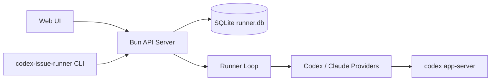

# Design Notes

当前实现已经迁移到 Bun/TypeScript 后端，入口在 `backend-ts/src/main.ts`，默认 live 端口为 `3008`。

## 高层结构



## 运行目标

- Live API：`127.0.0.1:3008`
- 源码后端：`backend-ts/`
- 构建产物：`dist/codex-issue-runner`
- SQLite：部署 state dir 下的 `runner.db`
- 前端静态资源：部署 state dir 下的 `web/`

## 构建

```bash
npm --prefix frontend run build
cd backend-ts && bun run build:binary
```

## 验证

```bash
cd backend-ts && bun test
npm --prefix frontend run build
```
