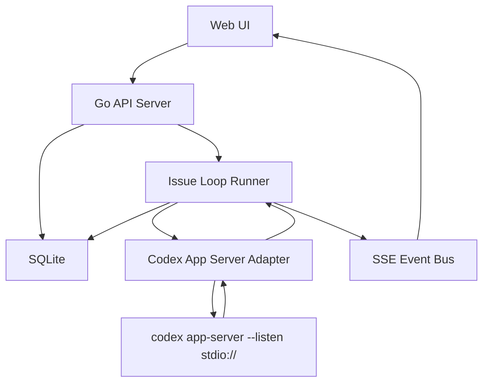

# Codex Issue Runner 设计方案

## 目标

构建一个本地 Codex App Server 驱动的 Issue Loop Runner，用于管理多个本地项目的 issue 队列，并自动调用 Codex 执行任务。

核心目标：

- 多项目管理
- 每个项目可以创建 issue
- issue 进入 `todo` 后自动执行
- 支持状态流转：`triage -> todo -> in_progress -> done / failed / cancelled`
- 能查看运行日志
- 失败可重试
- 后续支持人工 approval
- 底层使用 `codex app-server`

第一版不做完整 Helm 克隆，不实现 Telegram / WeChat / cron / workspace meta-chat / 插件市场等复杂能力。

---

## 设计原则

1. **只做 Codex Issue Loop，不复刻 Helm 全功能**
2. **先跑通自动执行，再补 UI 和 approval**
3. **一个项目串行执行 issue，避免工作区冲突**
4. **每个 issue 默认一个独立 Codex thread，避免上下文污染**
5. **失败状态必须可见、可重试**
6. **所有状态必须持久化，服务重启后能恢复到明确状态**
7. **Codex app-server 作为 agent runtime，不走 PTY 抓屏**

---

## 总体架构



系统拆成四层：

1. **Web UI**
   - 管项目
   - 建 issue
   - 看状态
   - 看日志
   - retry / cancel / pause / resume

2. **API Server**
   - 提供 REST API
   - 提供 SSE 事件流
   - 负责持久化和状态查询

3. **Issue Loop Runner**
   - 扫描 `todo` issue
   - 标记 `in_progress`
   - 调 Codex 执行
   - 等待 Codex 通过 CLI/API 显式标记 `done` 或 `failed`
   - turn 结束但未显式标记时，标 `failed`

4. **Codex App Server Adapter**
   - 拉起或连接 `codex app-server`
   - 实现 JSON-RPC request / response / notification
   - 负责协议映射

---

## 推荐技术栈

后端：

```txt
Go 1.22+
net/http + chi
SQLite
modernc.org/sqlite
os/exec
context / signal
embed
```

前端：

```txt
React
Vite
SSE
Tailwind 或普通 CSS
```

选型说明：

- Go 作为第一版后端与 CLI/daemon 入口，优先保证低常驻内存、单二进制分发、子进程生命周期控制和 `launchd/systemd` 适配。
- SQLite 优先使用 pure-Go 驱动，降低跨平台 release 的 cgo 成本；如果后续性能或兼容性不够，再评估切换驱动。
- 前后端通过 REST/SSE 和稳定 JSON DTO 解耦，不把 Go 实现细节暴露给 UI。这样如果后续 Go 维护成本过高，可以在不改 UI 的前提下把后端替换为 Bun/TypeScript。
- 后期接口很多时，用 route group + DTO + service 层组织，不把业务逻辑写进 handler。

建议目录：

```txt
codex-issue-runner/
  backend/
    cmd/
      codex-issue-runner/
        main.go
    internal/
      api/
      db/
      projects/
      issues/
      runner/
      codex/
      events/
      config/
      daemon/
  frontend/
    src/
      pages/
      components/
      api/
  docs/
    design.md
  data/
    app.db
    logs/
```

---

## 数据模型

### projects

```sql
create table projects (
  id text primary key,
  name text not null,
  cwd text not null unique,
  auto_run integer not null default 0,
  model text,
  approval_policy text not null default 'never',
  sandbox text not null default 'workspace-write',
  created_at text not null,
  updated_at text not null
);
```

字段说明：

- `id`：项目唯一 id
- `name`：项目展示名
- `cwd`：项目绝对路径
- `auto_run`：是否自动执行 `todo` issue
- `model`：Codex 模型，可为空，空则使用 Codex 默认配置
- `approval_policy`：Codex approval 策略
- `sandbox`：Codex sandbox 策略

### issues

```sql
create table issues (
  id integer primary key autoincrement,
  project_id text not null,
  title text not null,
  description text,
  status text not null,
  priority integer not null default 0,
  template_id text not null default '',
  prompt_template text not null default '',
  codex_thread_id text,
  codex_turn_id text,
  attempt_count integer not null default 0,
  error text,
  created_at text not null,
  updated_at text not null
);
```

- `template_id`：创建 issue 时选择的模板 id
- `prompt_template`：创建 issue 时的模板内容快照；后续模板修改不影响已创建 issue

状态说明：

```txt
triage       新建但不自动跑
todo         等待执行
in_progress 运行中
done         完成
failed       失败，可重试
cancelled    用户取消
```

### issue_events

```sql
create table issue_events (
  id integer primary key autoincrement,
  issue_id integer not null,
  type text not null,
  payload text,
  created_at text not null
);
```

用于记录：

- 状态变化
- Codex 输出 delta
- tool 调用
- 命令输出
- 错误
- approval 请求
- turn completed

### issue_templates

```sql
create table issue_templates (
  id text primary key,
  name text not null,
  content text not null,
  is_default integer not null default 0,
  created_at text not null,
  updated_at text not null
);
```

模板支持的占位符：

```txt
{{project.id}}
{{project.name}}
{{project.cwd}}
{{issue.id}}
{{issue.content}}
{{issue.title}}
{{issue.description}}
{{issue.priority}}
```

---

## Issue Loop 设计

每个项目一个串行 loop。

执行流程：

```txt
1. 找到项目下最早的 todo issue
2. 原子化 claim：todo -> in_progress
3. 创建 Codex thread
4. 启动 Codex turn
5. 监听 Codex 事件并写入 issue_events
6. Codex 完成验证后显式执行 CLI：issue -> done / failed
7. turn 结束但未显式更新 issue：issue -> failed
8. 继续下一个 todo issue
9. 队列为空后 loop idle
```

claim 逻辑必须原子化，避免重复执行：

```sql
update issues
set status = 'in_progress',
    updated_at = datetime('now')
where id = (
  select id from issues
  where project_id = ?
    and status = 'todo'
  order by priority desc, created_at asc
  limit 1
)
returning *;
```

并发策略：

```txt
同一项目：串行执行
不同项目：后续可以支持有限并行
```

第一版建议：

```txt
maxConcurrentProjects = 1 或 2
perProjectConcurrency = 1
```

---

## Codex App Server Adapter 设计

第一版使用 stdio：

```bash
codex app-server --listen stdio://
```

后续可升级为 websocket：

```bash
codex app-server --listen ws://127.0.0.1:PORT
```

Adapter 职责：

- 启动 Codex app-server 子进程
- 维护 JSON-RPC request id
- 处理 response
- 分发 notification
- 响应 server request，例如 approval
- 进程异常退出后可重启

接口设计：

```go
type Adapter interface {
	Start(ctx context.Context) error
	Stop(ctx context.Context) error
	ThreadStart(ctx context.Context, input ThreadStartInput) (ThreadStartResult, error)
	TurnStart(ctx context.Context, input TurnStartInput) (TurnStartResult, error)
	InterruptTurn(ctx context.Context, threadID string, turnID string) error
	Events() <-chan RuntimeEvent
}
```

---

## Codex 执行流程

### thread/start

每个 issue 默认创建一个独立 thread。

参数：

```json
{
  "cwd": "/absolute/project/path",
  "model": null,
  "approvalPolicy": "never",
  "sandbox": "workspace-write",
  "threadSource": "external",
  "baseInstructions": null,
  "developerInstructions": "...",
  "ephemeral": false
}
```

### turn/start

```json
{
  "threadId": "codex-thread-id",
  "input": [
    {
      "type": "text",
      "text": "rendered issue prompt"
    }
  ]
}
```

### 需要监听的 Codex notification

```txt
thread/started
thread/status/changed
turn/started
turn/completed
item/started
item/completed
item/agentMessage/delta
item/commandExecution/outputDelta
item/commandExecution/terminalInteraction
item/fileChange/patchUpdated
```

内部事件映射：

```txt
item/agentMessage/delta             -> issue.log
item/commandExecution/outputDelta   -> issue.command_output
turn/completed success              -> keep explicit issue status, otherwise issue.failed
turn/completed error                -> issue.failed
thread/status/changed active        -> runner.active
thread/status/changed idle          -> runner.idle
```

---

## Prompt 模板

每个 issue 通过可配置模板转成 prompt。系统会内置一个默认模板，创建 issue 时可选择模板，并把模板内容快照到 issue 上：

```md
{{issue.content}}

执行上下文：
- 项目路径：{{project.cwd}}
- Issue ID：{{issue.id}}
- Issue 标题：{{issue.title}}

要求：
1. 先阅读相关代码确认根因。
2. 只做和这个 issue 直接相关的最小修改。
3. 不要扩大改动范围。
4. 如果需要运行测试，请运行最小必要验证。
5. 完成后总结修改内容、验证结果、未验证风险。
6. 不要提交 git commit，除非用户明确要求。
7. 只有在你确认修改完成且验证通过后，最后执行：
   `codex-issue-runner issue update --id {{issue.id}} --status done --json`
8. 如果验证失败、需求无法完成或存在阻塞，不要标记 done；请说明失败原因，并执行：
   `codex-issue-runner issue update --id {{issue.id}} --status failed --error "<失败原因>" --json`
```

`title` 是面板展示和 Codex session name，可选；为空时从 `description` 第一条有效内容自动派生。Codex 执行以 `{{issue.content}}` 为核心内容，避免 session preview 被固定模板前缀污染。

新增模板或设置默认模板后，只影响后续创建的 issue。

---

## Approval 设计

### 第一版策略

先不实现 approval UI。

默认配置：

```txt
approvalPolicy = never
sandbox = workspace-write
```

对可信项目可以手动配置：

```txt
approvalPolicy = never
sandbox = danger-full-access
```

### 第二阶段支持人工确认

需要处理 Codex server request：

```txt
item/commandExecution/requestApproval
item/fileChange/requestApproval
item/permissions/requestApproval
item/tool/requestUserInput
mcpServer/elicitation/request
```

内部结构：

```ts
interface PendingApproval {
  id: string
  issueId: number
  projectId: string
  threadId: string
  kind: 'command' | 'file_change' | 'permission' | 'user_input' | 'mcp_elicitation'
  payload: unknown
  createdAt: string
}
```

UI 操作：

```txt
Approve once
Approve for session
Deny
Deny and stop turn
```

---

## REST API 设计

### Project API

```http
GET    /api/projects
POST   /api/projects
GET    /api/projects/:id
PATCH  /api/projects/:id
DELETE /api/projects/:id
POST   /api/projects/:id/loop/start
POST   /api/projects/:id/loop/stop
GET    /api/projects/:id/loop/status
```

### Issue API

```http
GET    /api/issues?projectId=&status=
POST   /api/issues
GET    /api/issues/:id
PATCH  /api/issues/:id
POST   /api/issues/:id/enqueue
POST   /api/issues/:id/retry
POST   /api/issues/:id/cancel
GET    /api/issues/:id/events
```

### Issue Template API

```http
GET    /api/issue-templates
POST   /api/issue-templates
GET    /api/issue-templates/:id
PATCH  /api/issue-templates/:id
DELETE /api/issue-templates/:id
```

### Cron Task API

```http
GET    /api/cron-tasks
POST   /api/cron-tasks
GET    /api/cron-tasks/:id
PATCH  /api/cron-tasks/:id
DELETE /api/cron-tasks/:id
```

第一版 cron task 聚焦 `triage_to_todo`：到点后把匹配范围内的 `triage`
issue 批量切到 `todo`，写入 `issue.status_changed` 事件，并启动受影响项目
runner loop。支持 `once` 与 `daily` 两种模式。

### SSE API

```http
GET /api/events
```

事件类型：

```ts
type AppEvent =
  | { type: 'issue.created'; issueId: number }
  | { type: 'issue.status_changed'; issueId: number; status: string }
  | { type: 'issue.log'; issueId: number; text: string }
  | { type: 'issue.error'; issueId: number; error: string }
  | { type: 'runner.started'; projectId: string }
  | { type: 'runner.stopped'; projectId: string }
  | { type: 'approval.required'; issueId: number; approvalId: string }
```

---

## Web UI 设计

### 页面 1：Projects

展示：

- 项目名称
- cwd
- auto_run 开关
- 当前 loop 状态
- 待处理 issue 数量
- 新建 issue 按钮

操作：

- 新增项目
- 开关 auto_run
- 启动/停止 loop

### 页面 2：Issues

展示：

- issue title
- project
- status
- attempt_count
- updated_at
- 看板列：`Triage / Todo / In Progress / Failed / Done / Cancelled`

操作：

- 新建 issue
- 改状态到 todo
- retry
- cancel

### 页面 3：Issue Detail

展示：

- title
- description
- status
- codex_thread_id
- codex_turn_id
- error
- 实时日志

操作：

- retry
- cancel
- mark done
- mark failed

---

## 崩溃恢复

服务启动时扫描 `in_progress` issue。

第一版策略：

```txt
所有 in_progress -> failed
error = "Service restarted while issue was in progress"
```

后续增强：

1. 如果有 `codex_thread_id`，尝试读取 thread 状态
2. 如果 turn 已完成但 issue 未显式标记终态，补写 failed
3. 如果无法判断，标记 `failed_stale`

---

## 日志策略

所有 Codex 输出写入 `issue_events`。

事件 payload 使用 JSON 字符串，保留原始信息：

```json
{
  "text": "...",
  "codexMethod": "item/agentMessage/delta",
  "threadId": "...",
  "turnId": "..."
}
```

对于长日志，后续可以做压缩或文件落盘。

第一版 SQLite 足够。

---

## 错误处理策略

### Codex app-server 启动失败

- 后端启动失败
- UI 显示 Codex backend offline

### turn/start 失败

- issue -> failed
- error 写入 issue

### Codex 运行中断

- issue -> failed
- 保留 thread id
- 可 retry

### 用户取消

- 调 Codex interrupt
- issue -> cancelled

### retry 策略

默认 retry 创建新的 Codex thread。

原因：

- 更干净
- 避免旧上下文污染
- 实现简单

后续可以支持：

```txt
retry_mode = new_thread | same_thread
```

---

## 配置文件

建议配置：

```json
{
  "server": {
    "host": "127.0.0.1",
    "port": 3008
  },
  "runner": {
    "maxConcurrentProjects": 1,
    "perProjectConcurrency": 1
  },
  "codex": {
    "mode": "stdio",
    "command": "codex",
    "args": ["app-server", "--listen", "stdio://"]
  }
}
```

---

## 进程守护与分发

第一版后端同时作为 CLI 入口：

```txt
codex-issue-runner start
codex-issue-runner start --daemon
codex-issue-runner stop
codex-issue-runner status
codex-issue-runner autostart enable
codex-issue-runner autostart disable
codex-issue-runner version
```

守护策略：

- macOS：生成并加载 `launchd` plist
- Linux：生成并启用 user-level `systemd` service
- Windows：第一版可以先只支持 foreground，后续再补 Windows Service

分发策略：

```txt
go build -o dist/codex-issue-runner ./backend/cmd/codex-issue-runner
```

前端构建产物后续可通过 Go `embed` 打进同一个二进制：

```txt
frontend/dist -> backend/internal/webdist
```

MVP 可以先前后端分开跑，等 API/runner 稳定后再做 embedded web UI。

---

## 里程碑

### Milestone 1：后端和数据库骨架

目标：不用 Codex，能管理项目和 issue。

内容：

- Go HTTP server
- SQLite 初始化
- projects CRUD
- issues CRUD
- issue 状态更新

验收：

- 可以创建项目
- 可以创建 issue
- 可以将 issue 改为 todo

### Milestone 2：Codex App Server Adapter

目标：后端能启动并调用 Codex app-server。

内容：

- 启动 `codex app-server --listen stdio://`
- 实现 JSON-RPC request/response
- 实现 notification 分发
- 调通 `thread/start`

验收：

- 后端启动后 Codex app-server online
- 可以成功创建 Codex thread

### Milestone 3：单 issue 执行

目标：手动触发一个 issue，用 Codex 跑完。

内容：

- `runIssue(issue)`
- `turn/start`
- 日志写入 issue_events
- Codex 显式 `issue update` 后更新 issue 状态

验收：

- 一个 issue 可以从 todo -> in_progress -> done/failed
- UI 或 API 能看到日志

### Milestone 4：自动 loop

目标：项目开启 auto_run 后，todo issue 自动执行。

内容：

- project auto_run
- per-project loop 状态
- enqueue issue 自动触发
- failed issue retry

验收：

- 新 issue 进入 todo 后自动运行
- 同项目 issue 串行执行
- 失败后可 retry

### Milestone 5：Web UI

目标：可以日常使用。

内容：

- Projects 页面
- Issues 页面
- Issue Detail 页面
- SSE 实时日志
- retry / cancel 操作

验收：

- 不用 CLI 也能完成 issue 创建、查看、重试

### Milestone 6：Approval UI

目标：支持需要人工确认的 Codex 操作。

内容：

- 接 server request
- pending approvals 表
- UI approve / deny
- response 回 Codex app-server

验收：

- Codex 请求执行命令时，UI 可以批准或拒绝

---

## 第一版明确不做

- 不做 Telegram / WeChat
- 不做复杂 crontab 表达式解析
- 不做 workspace meta-chat
- 不做多 agent 调度
- 不做自动 git commit
- 不做插件市场
- 不做复杂 session fork / rewind
- 不做 Helm 兼容协议

---

## 最小可用版本定义

MVP 完成标准：

1. 添加一个本地项目
2. 创建一个 issue
3. 将 issue 放入 todo
4. 服务自动调用 Codex app-server 执行
5. issue 页面看到实时输出
6. Codex 验证后通过 CLI 显式标记 done 或 failed
7. failed issue 可以 retry

---

## 后续增强方向

1. Approval UI
2. 每项目 pre/post script
3. 自动测试结果解析
4. issue 生成变更摘要
5. 多项目并发
6. Codex thread 历史查看
7. Git diff 预览
8. 手动 approve 后自动 commit
9. 与 GitHub Issues 同步
10. 移动端或 IM 通知
